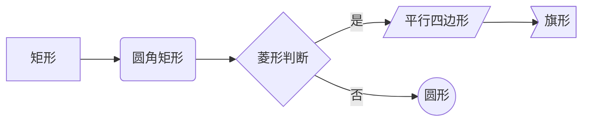
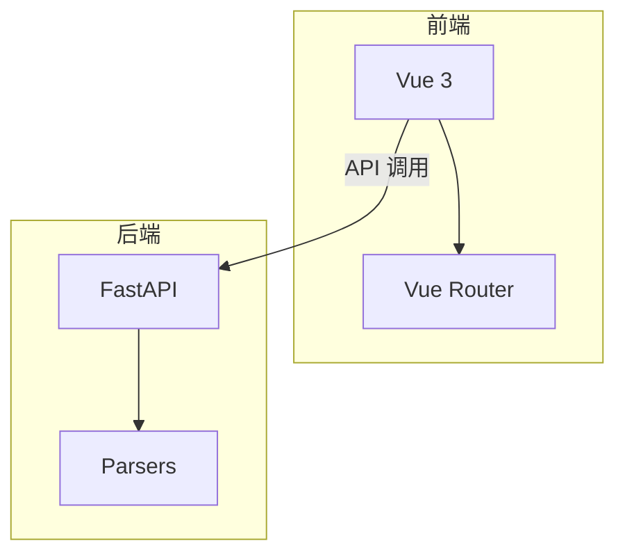
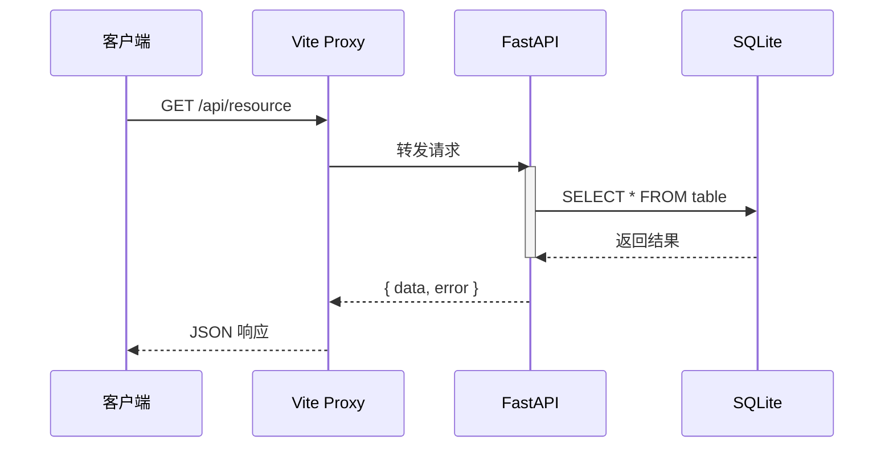
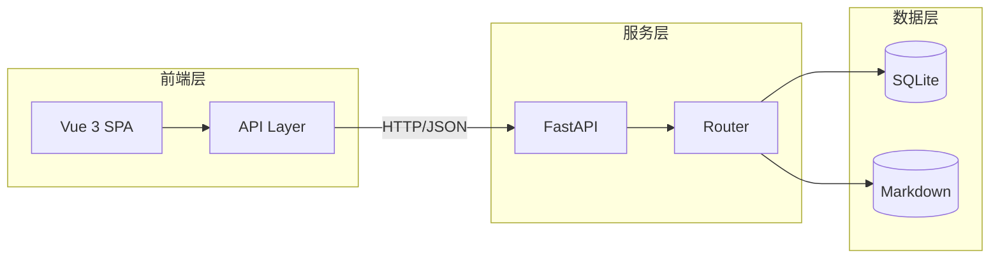
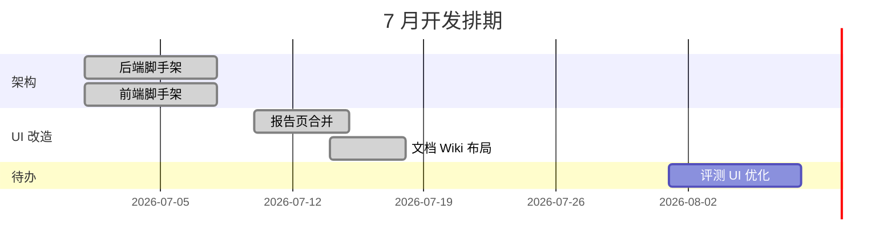
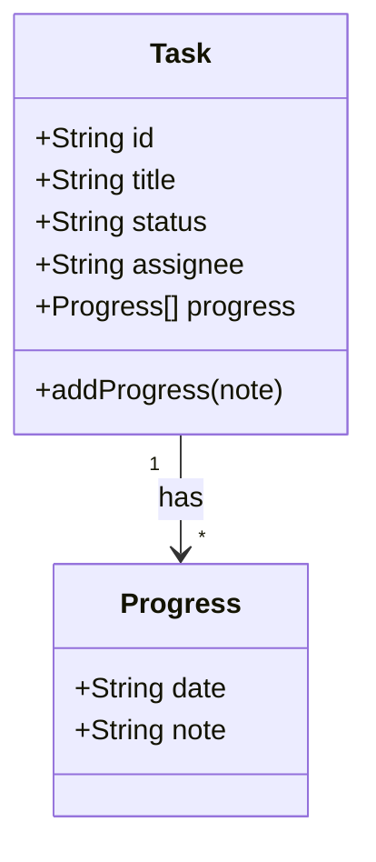
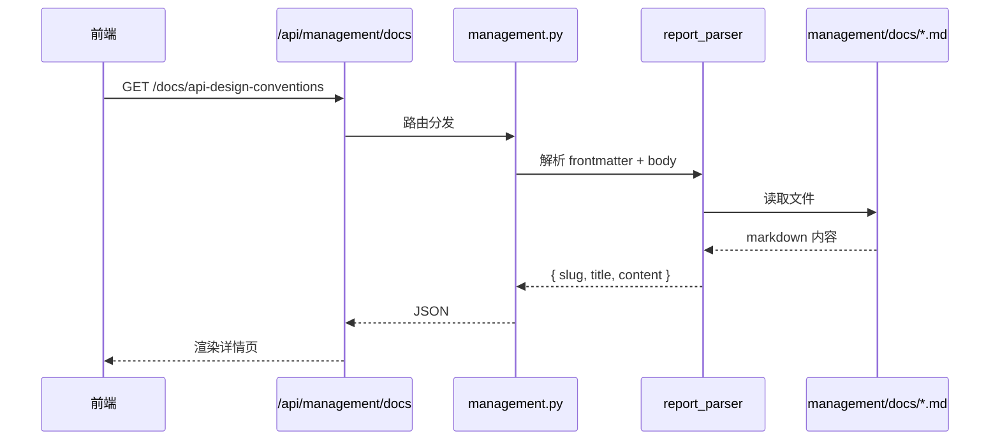
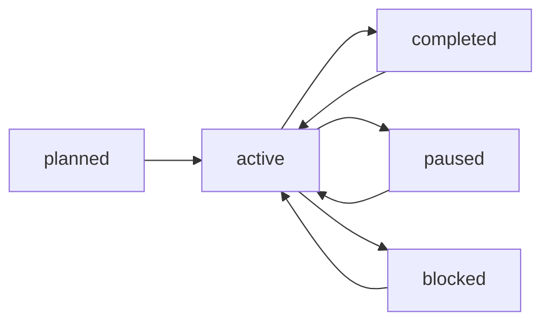

# Mermaid 语法速查

本文档是 `docs` skill 的参考文件，供在 ProjFlow 的 Wiki/会议/报告文档中绘制 Mermaid 图表时查阅。

## 1. 通用规则

- 每个 Mermaid 块以 ` ```mermaid ` 开始，以 ` ``` ` 结束。
- Mermaid 不支持中文节点名中混有特殊符号时可能渲染失败，尽量用英文标识或简短中文。
- 节点文本过长时，用 `A["长文本"]` 包裹双引号。
- 复杂图表建议拆成多个小图，不要一个图塞 20+ 节点。

## 2. 流程图（flowchart）

### 2.1 方向

- `flowchart TD` — 自上而下（Top Down）
- `flowchart LR` — 从左到右（Left Right）
- `flowchart BT` — 自下而上
- `flowchart RL` — 从右到左

### 2.2 节点形状



语法对照：

| 形状 | 语法 | 用途 |
|------|------|------|
| 矩形 | `A[文本]` | 普通步骤 |
| 圆角矩形 | `A(文本)` | 开始/结束 |
| 菱形 | `A{文本}` | 判断/分支 |
| 圆形 | `A((文本))` | 关键节点 |
| 平行四边形 | `A[/文本/]` | 输入/输出 |
| 旗形 | `A>文本]` | 结果/终点 |

### 2.3 连线与标签

```mermaid
flowchart TD
    A --> B        %% 无标签实线
    A -->|标签| C  %% 带标签实线
    B -.-> D       %% 虚线
    C ==> E        %% 粗线
    D -- 说明 --> E
```

### 2.4 子图



## 3. 时序图（sequenceDiagram）



常用语法：

| 语法 | 含义 |
|------|------|
| `participant A as 显示名` | 定义参与者别名 |
| `A->>B: 消息` | 实心箭头（同步调用） |
| `A-->>B: 消息` | 虚线箭头（返回） |
| `A->>B+` / `A-->>B-` | 激活/取消激活生命线 |
| `Note over A,B: 备注` | 跨参与者备注 |
| `loop 条件` ... `end` | 循环 |
| `alt 条件` ... `else` ... `end` | 条件分支 |

## 4. 架构图（graph）

`graph` 与 `flowchart` 基本等价，旧文档中常见。



## 5. 甘特图（gantt）



常用语法：

| 语法 | 含义 |
|------|------|
| `section 名称` | 分组 |
| `:done, id, 日期, 时长` | 已完成任务 |
| `:active, id, 日期, 时长` | 进行中任务 |
| `:id, 日期, 时长` | 未开始任务 |
| `:crit, id, 日期, 时长` | 关键任务（红色高亮） |
| `:after id` | 依赖前置任务 |

## 6. 类图（classDiagram）

适用于数据模型/组件关系说明。



## 7. 项目常用图例

### 7.1 请求链路



### 7.2 任务状态流转



### 7.3 项目树数据流

```mermaid
flowchart TD
    A[management/projects/{slug}/tasks.json] -->|递归展平| B[tasks_parser]
    B -->|按 status 分桶| C[看板]
    B -->|层级渲染| D[项目树]
    C --> E[completed]
    C --> F[in_progress]
    C --> G[pending]
```

## 8. 调试技巧

- Mermaid 渲染失败时，常见原因：
  1. 节点文本含未转义的特殊字符（如 `(`、`)`、`[`、`]`、`{`、`}`）。
  2. 同一图表中节点 ID 重复。
  3. 连线语法错误（如 `A --> B` 写成 `A -> B` 在部分语法中不合法）。
- 在线验证：https://mermaid.live/
