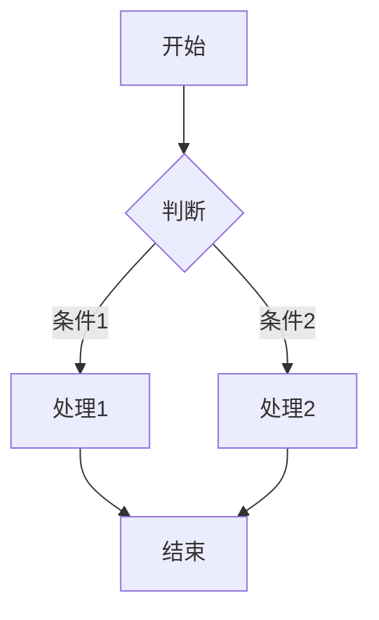
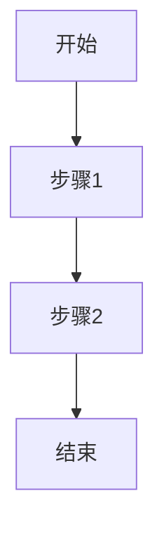

# 文档写作指南

本 skill 提供 ProjFlow 项目内 Markdown 文档的写作规范与工具速查，覆盖 Wiki 文档、会议纪要、项目 README、技术方案等。

> **与 management skill 的分工**：management skill 负责文档的**CRUD 操作**（`create_doc.py` / `update_doc.py` 等）；本 skill 负责文档**内容怎么写**（结构、Mermaid、链接、风格）。

## 1. Wiki 文档（`management/docs/*.md`）

### 1.1 文件规范

- **文件名**：`{slug}.md`，slug 只允许字母、数字、连字符 `-`、下划线 `_`。
- **存放位置**：`management/docs/`（纯 wiki 目录，不混会议纪要/项目/里程碑）。
- **frontmatter 必填**：`title`、`author`、`date`、`tags`、`summary`。

```yaml
---
title: JWT 认证指南
author: 张三
date: 2026-07-10
tags: [auth, jwt, 安全]
summary: JWT token 的生成、验证与刷新流程
---
```

### 1.2 标准结构

```markdown
## 概述

1-2 段说明本文档要解决什么问题、面向谁、核心结论是什么。summary 的扩展版。

## 背景 / 动机

为什么需要这个方案/规范？当前痛点是什么？

## 正文

按主题分节。每节先给结论，再给细节。

## 示例 / 流程

用代码块或 Mermaid 图表说明。

## 相关文档

- [[another-doc]]
- [[git-workflow|Git 工作流规范]]
```

### 1.3 内部链接

前端 MarkdownRenderer 在渲染前自动将 `[[…]]` 语法转为路由链接，支持两种目标：

#### 链接到其他文档

`[[slug]]` 或 `[[slug|显示文本]]`，指向 `/management/docs/{slug}`。

```markdown
- [[api-design-conventions]]
- [[api-design-conventions|API 设计规范]]
- 详见 [[git-workflow|Git 工作流规范]]。
```

#### 链接到任务

`[[项目slug/任务ID]]` 或 `[[项目slug/任务ID|显示文本]]`，指向项目树页面并自动选中对应任务。

```markdown
- [[projflow/t2-3]]                          → 显示为 projflow/t2-3
- [[projflow/t2-3|重构认证模块]]              → 显示为"重构认证模块"
- 当前进度见 [[projflow/t1|项目第一阶段]]。
```

任务 ID 格式：顶层 `t1`、`t2`，子任务 `t1-1`、`t2-3`（对应 `management/projects/{slug}/tasks.json` 中的 `id` 字段）。

> 链接语法对 `/` 有无来区分目标和文档：含 `/` 的是任务链接，不含的是文档链接。

## 2. Mermaid 图表

Mermaid 是文档中表达流程、时序、架构的首选方式。完整速查见 `.claude/skills/documentation/references/mermaid-cheatsheet.md`。

常用场景：

| 类型 | 关键字 | 用途 |
|------|--------|------|
| 流程图 | `flowchart TD` / `flowchart LR` | 决策流程、工作流 |
| 时序图 | `sequenceDiagram` | 接口调用、请求链路 |
| 架构图 | `graph LR` / `graph TB` | 系统组件关系 |
| 甘特图 | `gantt` | 项目排期、里程碑 |

基本语法：

````markdown

````

**使用原则**：
1. 图表节点用**名词或动宾短语**（如"校验 token"），避免长句。
2. 同一图表节点风格统一：矩形 `[]` 表步骤，菱形 `{}` 表判断，圆角 `()` 表起止。
3. 复杂图表按"先主后支"组织，主路径放左侧/上方。
4. 图表上下必须有文字说明，不要只贴图。

## 3. 写作风格

### 3.1 简洁优先

- 每段只讲一个意思。
- 能用表格就不用长列表。
- 删除无意义的过渡词（"众所周知"、"不难发现"）。

### 3.2 中文语境

- 中英文混排时，英文/数字与中文之间留**一个半角空格**（专有名词除外：Vue3、FastAPI）。
- 术语首字母大写：REST API、FastAPI、Vue 3、PyTorch。
- 日期统一 `YYYY-MM-DD`，时间统一 `YYYY-MM-DD HH:MM`。

### 3.3 标题层级

- 文档内最高层级用 `##`（`#` 留给标题/frontmatter）。
- 层级不要跳（`##` 下面是 `###`，不要直接 `####`）。
- 同级标题应保持语法一致：都是名词短语，或都是动宾短语。

### 3.4 代码与命令

- 代码块标明语言：` ```python `、` ```bash `、` ```json `。
- 命令行示例用 `$ ` 前缀区分输入输出，或只写命令。
- 配置示例优先用 JSON/YAML 块。

## 4. 会议纪要特殊约定

会议纪要虽然也是 Markdown，但结构固定，优先用 management skill 的 `create_meeting.py`/`update_meeting.py` 维护，不要手写破坏表格结构。

如需在会议纪要中引用 wiki 文档，同样使用 `[[slug]]` 链接。

## 5. 示例模板

创建新 wiki 文档时，可参考：

```markdown
---
title: 文档标题
author: 作者
date: 2026-07-22
tags: [tag1, tag2]
summary: 一句话概括本文档内容
---

## 概述

本文档描述……

## 背景

……

## 方案

### 3.1 子标题

……

### 3.2 子标题

……

## 流程



## 相关文档

- [[slug-a]]
- [[slug-b|显示文本]]
```

## 参考文件

- `.claude/skills/documentation/references/mermaid-cheatsheet.md` — Mermaid 语法速查与项目常用图例
