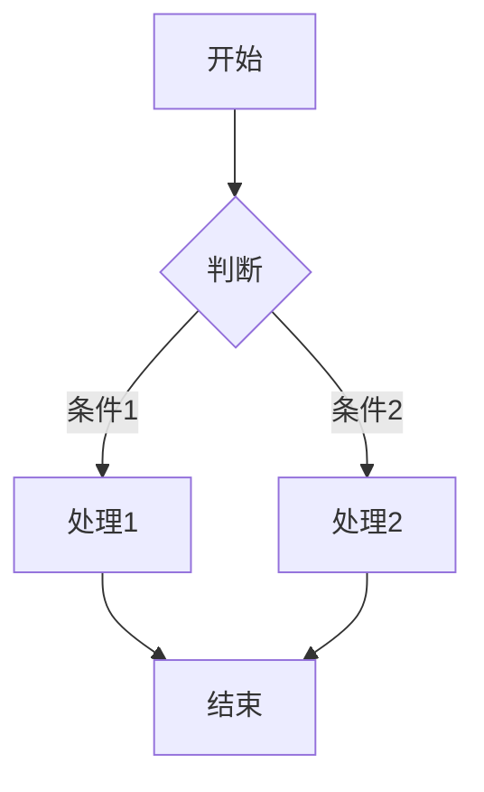
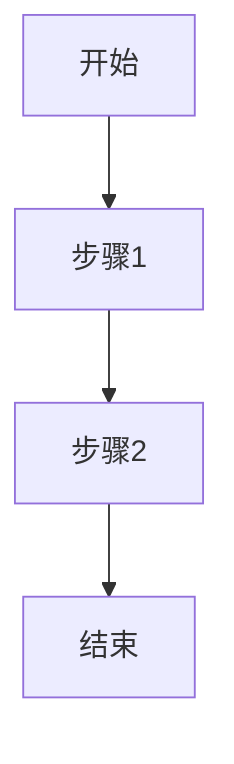

# 文档写作指南

本 skill 提供 ProjFlow 项目内 Markdown 文档的写作规范与工具速查，覆盖 Wiki 文档、会议纪要、项目 README、技术方案等。

> **与 management skill 的分工**：management skill 负责文档的**CRUD 操作**（`create_doc.py` / `update_doc.py` 等）；本 skill 负责文档**内容怎么写**（结构、Mermaid、链接、风格）与**变更流程**（§0）。

## 1. 文档变更的 OpenSpec 双层流程（结构级变更必读）

> 2026-09-17 立规。背景：架构文档经多轮局部盲改后严重混乱（内容错位、编号错乱、引用悬空），根源是文档改动没走流程。

### 1.1 双层 Change 结构

| 层 | Change | 管什么 | 何时开 |
|---|---|---|---|
| **总 Change** | `docs-system` | 所有 wiki 的**整体**：文档登记表（编号 / 标题 / slug / 职责边界 / 相互关系）、新增或废弃一篇、编号体系、跨文档引用规范 | 文档体系级动作 |
| **单篇 Change** | `docs-<slug>`（如 `docs-architecture`） | **一篇**文档的结构与内容：章节结构、内容重构、大段增删 | 结构级变更 |

**豁免**：内容级小修（错字、更新一个数字、补一小段论证、修一处链接）**不需要 Change**——直接改，但 commit message 必须写明改了什么、为什么。判断标准：**读者需要重新理解文档结构吗？** 需要 → 走 Change；不需要 → 直接改。

### 1.2 写正文前的硬性顺序（用户裁定 2026-09-17）

1. 在单篇 Change 的 **design.md** 写明**目标结构**：有哪些章、每章说什么、章内有多少细章与细分节、整体逻辑（读者动线——为什么是这个顺序）
2. 用户审核通过该 design
3. **之后**才能写 / 改正文；实施中按 tasks 勾进度

**禁止**：不写 design 直接改正文；凭记忆改局部（动手前必须通读目标文档全文）。

### 1.3 结构变更纪律（踩坑教训）

- **改编号 = 全仓事件**：所有跨文档引用必须级联重映射，改完跑「引用 → 标题闭合」核对（悬空引用必须为 0）
- 章节锚点**先从文件读出来再复制**，不凭记忆；python 批量编辑用三引号字符串，新文本一律「」引号
- 图优先 Mermaid，不用 ASCII 字符画
- 大改完成后：通读一遍 + 顶层树 grep + stale 引用 grep，全绿才提交
- 文档正文**不放**「术语修正」式警示语（历史归演进记录）

### 1.4 正文零历史信息（用户裁定）

**文档正文只写「现在是什么」**——历史一律只进演进记录（sidecar `changelog` / progress），正文不留任何历史痕迹。

禁止出现在正文的：

| 类型 | 例子 |
|---|---|
| 日期与版本标注 | 「机制已定，2026-09-17」「（2026-09-17 修订）」——写了就说明定了，日期归 changelog |
| 旧编号与编号对照 | 历史编号映射表、编号归档（**不追溯历史讨论**）|
| 旧版正文快照 | 归档的旧登记表、旧章节全文（json 附录也不留）|
| 迁移 / 来源标注 | 「（自 X 号并入）」「原 Y 号」|
| 废弃与变更叙述 | 「原设计 X 已作废」「曾用 X 现改 Y」「历史上用过…」「已移除的旧设计」|
| 演进动机叙述 | 「本节新增于…」「本次修订因…」|

**判断法**：这句话是在描述**系统当前的状态**，还是在描述**我们如何走到这里**？后者 → 删，或写成 changelog 的一条 summary。

**唯一例外**：指向记录位置的指引（如「已决项见 sidecar `changelog`」）与 frontmatter 的 `date` 字段。

### 1.5 章节归属：开放问题 / 已定范围 / 附属说明（用户裁定）

切章时先判断每节的性质：

| 性质 | 放哪 | 例 |
|---|---|---|
| **开放问题**（还没定，不定就开不了工或带风险）| 「当前待决策」表 | 参考聚合方式 / 动作风格归属 / 基座选型 |
| **已定范围**（做什么、不做什么）| 框架总图章里的小节 | 可分解 / 可重建 / 不追求像素级完美重建 |
| **附属说明**（图怎么读、符号、术语对照）| **并入它服务的章**，不单独成节 | 模块地图并入框架总图；符号速查作附录 |

**判断法**：这一节是在问「**还没定什么**」，还是在陈述「**已经定成什么**」？

推论：

- **「模块地图」不单独成节**——它只是结构图的读法索引
- **「设计目标与非目标」不进待决策**——它是已定的范围界定；其中若有未定目标（如能力级别），一律指向**唯一登记处**（如《系统架构》§2），不在本文档重述
- **符号速查**作附录，不占正文章号

## 2. Wiki 文档（`management/docs/`）

### 2.1 文件规范

- **文件名**：`{slug}.md`，slug 只允许字母、数字、连字符 `-`、下划线 `_`、斜杠 `/`（子目录）。
- **存放位置**：`management/docs/`（纯 wiki 目录，不混会议纪要/项目/里程碑）。支持子目录，如 `management/docs/architecture/api-design.md`，slug 为 `architecture/api-design`。
- **frontmatter 必填**：`title`、`author`、`date`、`tags`、`summary`。
- **frontmatter 可选**：`id`（数字），用于控制文档列表排序。有 `id` 的文档按 `id` 升序排列在前，无 `id` 的按 `date` 降序排列在后。

```yaml
---
title: JWT 认证指南
author: 张三
date: 2026-07-10
tags: [auth, jwt, 安全]
summary: JWT token 的生成、验证与刷新流程
id: 1
---
```

### 2.2 标准结构

```markdown
## 概述

1-2 段说明本文档要解决什么问题、面向谁、核心结论是什么。summary 的扩展版。

## 背景 / 动机

为什么需要这个方案/规范？当前痛点是什么？

## 正文

按主题分节。每节先给结论，再给细节。

## 示例 / 流程

用代码块或 Mermaid 图表说明。

## 相关文档

- [[another-doc]]
- [[git-workflow|Git 工作流规范]]
```

### 2.3 内部链接

前端 MarkdownRenderer 在渲染前自动将 `[[…]]` 语法转为路由链接，支持两种目标：

#### 链接到其他文档

`[[slug]]` 或 `[[slug|显示文本]]`，指向 `/management/docs/{slug}`。slug 可含 `/`（子目录文档）。

```markdown
- [[api-design-conventions]]
- [[api-design-conventions|API 设计规范]]
- [[architecture/api-design|API 设计规范]]     ← 子目录文档
```

#### 链接到任务

`[[项目slug#任务ID]]` 或 `[[项目slug#任务ID|显示文本]]`，指向项目树页面并自动选中对应任务。

```markdown
- [[projflow#t2-3]]                          → 显示为 projflow/t2-3
- [[projflow#t2-3|重构认证模块]]              → 显示为"重构认证模块"
- 当前进度见 [[projflow#t1|项目第一阶段]]。
```

任务 ID 格式：顶层 `t1`、`t2`，子任务 `t1-1`、`t2-3`（对应 `management/projects/{slug}/tasks.json` 中的 `id` 字段）。

> 用 `#` 区分：含 `#` 的是任务链接，不含的是文档链接（文档 slug 可含 `/`）。

## 3. Mermaid 图表

Mermaid 是文档中表达流程、时序、架构的首选方式。完整速查见 `.claude/skills/documentation/references/mermaid-cheatsheet.md`。

常用场景：

| 类型 | 关键字 | 用途 |
|------|--------|------|
| 流程图 | `flowchart TD` / `flowchart LR` | 决策流程、工作流 |
| 时序图 | `sequenceDiagram` | 接口调用、请求链路 |
| 架构图 | `graph LR` / `graph TB` | 系统组件关系 |
| 甘特图 | `gantt` | 项目排期、里程碑 |

基本语法：

````markdown

```mermaid
flowchart TD
    A[开始] --> B{判断}
    B -->|条件1| C[处理1]
    B -->|条件2| D[处理2]
    C --> E[结束]
    D --> E
```
````

**使用原则**：
1. 图表节点用**名词或动宾短语**（如"校验 token"），避免长句。
2. 同一图表节点风格统一：矩形 `[]` 表步骤，菱形 `{}` 表判断，圆角 `()` 表起止。
3. 复杂图表按"先主后支"组织，主路径放左侧/上方。
4. 图表上下必须有文字说明，不要只贴图。

## 4. 写作风格

### 4.1 简洁优先

- 每段只讲一个意思。
- 能用表格就不用长列表。
- 删除无意义的过渡词（"众所周知"、"不难发现"）。

### 4.2 中文语境

- 中英文混排时，英文/数字与中文之间留**一个半角空格**（专有名词除外：Vue3、FastAPI）。
- 术语首字母大写：REST API、FastAPI、Vue 3、PyTorch。
- 日期统一 `YYYY-MM-DD`，时间统一 `YYYY-MM-DD HH:MM`。

### 4.3 标题层级

- 文档内最高层级用 `##`（`#` 留给标题/frontmatter）。
- 层级不要跳（`##` 下面是 `###`，不要直接 `####`）。
- 同级标题应保持语法一致：都是名词短语，或都是动宾短语。

### 4.4 代码与命令

- 代码块标明语言：` ```python `、` ```bash `、` ```json `。
- 命令行示例用 `$ ` 前缀区分输入输出，或只写命令。
- 配置示例优先用 JSON/YAML 块。

## 5. 会议纪要特殊约定

会议纪要虽然也是 Markdown，但结构固定，优先用 management skill 的 `create_meeting.py`/`update_meeting.py` 维护，不要手写破坏表格结构。

如需在会议纪要中引用 wiki 文档，同样使用 `[[slug]]` 链接。

## 6. 对外报告（双周报）

双周报属于**对外汇报**——与 Wiki 文档（对内参考）、技术方案（对内评审）面向的读者完全不一样。项目对合作方（度小满）的汇报周期是**双周**，文件在 `management/weekly/{year}/W{NN}-W{NN2}-{author}.md`（两周合并一份，不写单周报）。本节专门讲给上级/合作方看的报告怎么写。

### 6.1 受众与汇报链路

双周报有两层受众：

| 受众 | 关心什么 | 看不看得到 |
|---|---|---|
| **项目负责人**（直属） | 本期决策依据、待协调项、后续承诺 | 直接看 |
| **合作方（度小满等）** | 整体节奏承诺、风险点、阻塞项 | 由项目负责人筛选后转交（双周汇报） |

**核心原则**：报告是给读者**做决策**的，不是给你**展示工作过程**的。每句话都问一句"读者需要这一句吗"。

### 6.2 双周报五节标准结构

```markdown
# 双周报 — {姓名} — {YYYY} 第 W{NN}-W{NN2} 周

## 一、双周总览
主线表格：每条主线一行（进展 + 关键数字）。

## 二、对决策有影响的关键发现
分小节，每节"先结论后数字"。关键数字用表格组织。

## 三、双周产出（团队资产）
清单形式，不展开描述。

## 四、待负责人协调的决策项
| 决策项 | 选项 | 影响 | 建议时限 |

## 五、校方后续规划（向合作方同步）
| 事项 | 具体内容 | 计划完成时间 |
承诺性时间表（事项/内容/时间三列连续大表）。
```

**写双周报前第一步（必做）**：

```bash
git log --since="两周前的周一" --until="本周日" --pretty=format:"%h %ad %an | %s" --date=short
```

跑完按主线分类（live/speedrun/训练/评测/management/docs/...），从中**挑出有决策价值或硬产出**的 commit。**不要只凭对话记忆**——对话记忆只覆盖你参与的部分，会漏掉团队其他成员完成的工作（典型漏报：其他主线完成的产品能力、训练/评测产出、Web 性能、基础设施改进等）。

**跨周主线纵向合并**：同一主线两周的进展合并成一条叙事（如"两周从 0 到 8/9 子功能"），不要按周堆砌两段；第一周承诺、第二周兑现的要写成闭环。

**抄源数据必须翻译**：git log 与任务系统里的 commit message / 任务描述全是内部语言（任务 ID、工具名、数据集代号、模型全名、实现细节），**搬运进报告前必须逐条过 §6.3 的翻译表**——抄原文不翻译 = 内部代称泄漏。

过滤标准：

- ✅ 进报告：有数字 / 决策价值 / 用户可见的产物 / 主线状态变化
- ❌ 不进报告：nightly auto sync / 报告本身的改稿 commit / 单点琐碎 fix / 纯内部维护（skill 治理、文档排版）/ 第三方参考调研

### 6.3 必须避免的内部语气

双周报是**结论**文档，不是**推理过程**文档。下面这些表达**绝对不能出现**：

| ❌ 禁止 | ✅ 替换 |
|---|---|
| `> 汇报对象：项目负责人；汇报重点：...` （写作元信息） | 直接删除 |
| `通用预训练数据集中可直接用的类目与任务书要求的类目对得上吗？` （反问引导） | 直接进入表格 |
| `**直接结论**：` / `以下是` / `下面是` （标签词） | 直接陈述 |
| `t13-1` / `t10` / `M4` （内部任务/里程碑代号） | 用业务语言"9 月检测微调"、"中期验收" |
| `commit 8aa4130` / `git xxx` （git 引用） | 删除 |
| `pet 服务器` （内部设施代号） | "GPU 服务器（4090）" |

**判断标准**：把句子从报告里删掉，是否损失"上级做决策"必需的信息？损失 → 留；没损失 → 删。

### 6.4 术语口语化

学术/工程术语**首次出现时必须展开**，后续可保留缩写：

| 术语 | 首次出现应写成 |
|---|---|
| 红外夜视 | 夜间红外帧（家用摄像头夜间自动切换的成像模式） |
| zero-shot | 预训练模型直接测试（未做任何训练直接用） |
| imgsz=1280 | （这是技术参数，上级不看，直接删） |
| COCO | 通用目标检测公开训练集 |
| clip（视频切段） | 段 |
| 口径 A/B | 用画面亮度判断 / 用拍摄小时判断 |

例外：项目共识的术语（产品名 YOLO11、模型名 BoT-SORT、芯片名 RV1126B、硬指标 75%/10%）可直接保留——上级长期跟进项目会认得。

### 6.5 表格数据要给来源

任何**具体清单**（类目、API、能力）出现时，上级会**逐项核对**是否如我所述。模糊清单（"9 类标注"）会让上级产生"是不是都在公开数据集里"的疑问；展开成"哪些是公开的、哪些是自定义的"才经得起追问。

示例（报告中的 9 类标注类目表）：

| 类目 | 来源 | 是否需要人工标 |
|---|---|---|
| `cat`（猫） | COCO 原生 | 不需要 |
| `person`（人） | COCO 原生 | 不需要 |
| `food_bowl`/`water_bowl` | 项目自定义 | **需要**——且需人工区分食/水 |
| `litter_box` | 项目自定义 | **需要** |
| ... | ... | ... |

### 6.6 "校方后续规划"承诺表（向合作方同步）

合作方要求"对后续整体节奏"的承诺表，格式按合作方原表样式（度小满原表：事项 / 具体内容 / 计划完成时间 三列）。

**重要边界**：只承诺校方能做的事——硬件开发、装配、驱动等由硬件方负责的事项，明确标注"待硬件方"，**不替对方承诺时间**。

表格组织：

- **"事项"列**用粗体分组头（端侧模型 / 硬件层面），子项按时间顺序展开
- **"具体内容"列**精确到动作（"数据审计" / "RKNN 转换"），不要写"开发"等空话
- **"计划完成时间"列**用具体日期（08-31 / 09-30），不用"下个月"等模糊词
- 表格末尾加"风险与依赖"段落，把跨方依赖点串起来（如"模型移植 RKNN 转换依赖硬件方工具链 11 月初到位"）

### 6.7 生成 docx（与合作方共享）

双周报需要给合作方 docx 格式时，用项目内置的 pandoc 脚本：

```bash
# 批量生成（每期写完后跑一次）
bash scripts/md_to_docx.sh management/weekly/{year}/

# 单文件
bash scripts/md_to_docx.sh management/weekly/{year}/W{NN}-{author}.md

# 自定义模板
bash scripts/md_to_docx.sh --ref-doc /path/to/custom.docx file.md
```

特性：
- 同目录输出 `*.docx`（同名覆盖）
- 使用 `templates/docx-reference.docx` 作为 pandoc reference（已内置 H1 居中、20pt 字号、表格边框）
- 单文件失败不中断整批，最终退出码反映失败数
- `management/weekly/**/*.docx` 已 gitignore（源 md 入库，docx 是按需生成的中间产物）

模板替换（如合作方有具体样式要求）：在 Word/Pages 里修改 `templates/docx-reference.docx` 样式并另存覆盖，**无需改脚本**。

## 7. 示例模板

创建新 wiki 文档时，可参考：

```markdown
---
title: 文档标题
author: 作者
date: 2026-07-22
tags: [tag1, tag2]
summary: 一句话概括本文档内容
---

## 概述

本文档描述……

## 背景

……

## 方案

### 3.1 子标题

……

### 3.2 子标题

……

## 流程


```mermaid
flowchart TD
    A[开始] --> B[步骤1]
    B --> C[步骤2]
    C --> D[结束]
```

## 相关文档

- [[slug-a]]
- [[slug-b|显示文本]]
```

## 参考文件

- `.claude/skills/documentation/references/mermaid-cheatsheet.md` — Mermaid 语法速查与项目常用图例
