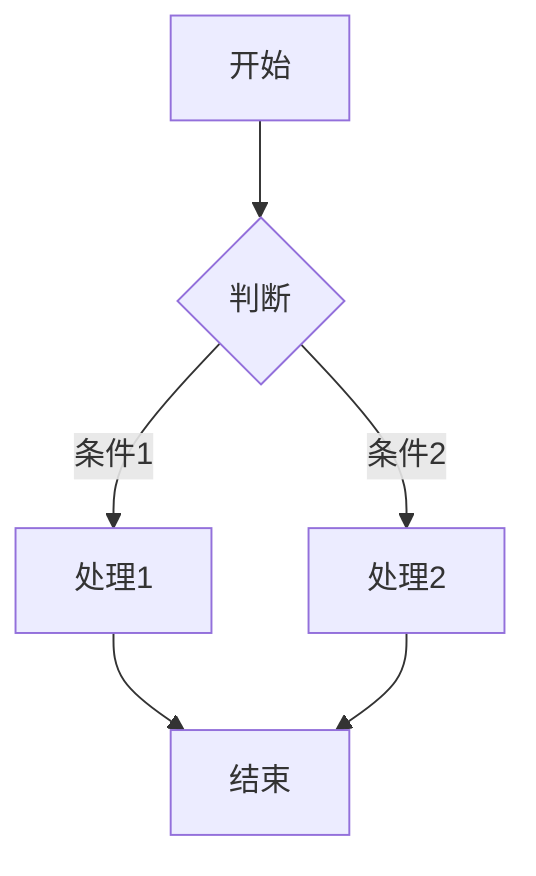
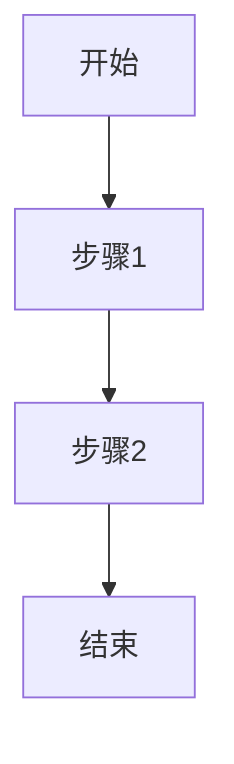

# 文档写作指南

本 skill 提供 ProjFlow 项目内 Markdown 文档的写作规范与工具速查，覆盖 Wiki 文档、会议纪要、项目 README、技术方案等。

> **与 management skill 的分工**：management skill 负责文档的**CRUD 操作**（`create_doc.py` / `update_doc.py` 等）；本 skill 负责文档**内容怎么写**（结构、Mermaid、链接、风格）。

## 1. Wiki 文档（`management/docs/`）

### 1.1 文件规范

- **文件名**：`{slug}.md`，slug 只允许字母、数字、连字符 `-`、下划线 `_`、斜杠 `/`（子目录）。
- **存放位置**：`management/docs/`（纯 wiki 目录，不混会议纪要/项目/里程碑）。支持子目录，如 `management/docs/architecture/api-design.md`，slug 为 `architecture/api-design`。
- **frontmatter 必填**：`title`、`author`、`date`、`tags`、`summary`。
- **frontmatter 可选**：`id`（数字），用于控制文档列表排序。有 `id` 的文档按 `id` 升序排列在前，无 `id` 的按 `date` 降序排列在后。

```yaml
---
title: JWT 认证指南
author: 张三
date: 2026-07-10
tags: [auth, jwt, 安全]
summary: JWT token 的生成、验证与刷新流程
id: 1
---
```

### 1.2 标准结构

```markdown
## 概述

1-2 段说明本文档要解决什么问题、面向谁、核心结论是什么。summary 的扩展版。

## 背景 / 动机

为什么需要这个方案/规范？当前痛点是什么？

## 正文

按主题分节。每节先给结论，再给细节。

## 示例 / 流程

用代码块或 Mermaid 图表说明。

## 相关文档

- [[another-doc]]
- [[git-workflow|Git 工作流规范]]
```

### 1.3 内部链接

前端 MarkdownRenderer 在渲染前自动将 `[[…]]` 语法转为路由链接，支持两种目标：

#### 链接到其他文档

`[[slug]]` 或 `[[slug|显示文本]]`，指向 `/management/docs/{slug}`。slug 可含 `/`（子目录文档）。

```markdown
- [[api-design-conventions]]
- [[api-design-conventions|API 设计规范]]
- [[architecture/api-design|API 设计规范]]     ← 子目录文档
```

#### 链接到任务

`[[项目slug#任务ID]]` 或 `[[项目slug#任务ID|显示文本]]`，指向项目树页面并自动选中对应任务。

```markdown
- [[projflow#t2-3]]                          → 显示为 projflow/t2-3
- [[projflow#t2-3|重构认证模块]]              → 显示为"重构认证模块"
- 当前进度见 [[projflow#t1|项目第一阶段]]。
```

任务 ID 格式：顶层 `t1`、`t2`，子任务 `t1-1`、`t2-3`（对应 `management/projects/{slug}/tasks.json` 中的 `id` 字段）。

> 用 `#` 区分：含 `#` 的是任务链接，不含的是文档链接（文档 slug 可含 `/`）。

## 2. Mermaid 图表

Mermaid 是文档中表达流程、时序、架构的首选方式。完整速查见 `.claude/skills/documentation/references/mermaid-cheatsheet.md`。

常用场景：

| 类型 | 关键字 | 用途 |
|------|--------|------|
| 流程图 | `flowchart TD` / `flowchart LR` | 决策流程、工作流 |
| 时序图 | `sequenceDiagram` | 接口调用、请求链路 |
| 架构图 | `graph LR` / `graph TB` | 系统组件关系 |
| 甘特图 | `gantt` | 项目排期、里程碑 |

基本语法：

````markdown

```mermaid
flowchart TD
    A[开始] --> B{判断}
    B -->|条件1| C[处理1]
    B -->|条件2| D[处理2]
    C --> E[结束]
    D --> E
```
````

**使用原则**：
1. 图表节点用**名词或动宾短语**（如"校验 token"），避免长句。
2. 同一图表节点风格统一：矩形 `[]` 表步骤，菱形 `{}` 表判断，圆角 `()` 表起止。
3. 复杂图表按"先主后支"组织，主路径放左侧/上方。
4. 图表上下必须有文字说明，不要只贴图。

## 3. 写作风格

### 3.1 简洁优先

- 每段只讲一个意思。
- 能用表格就不用长列表。
- 删除无意义的过渡词（"众所周知"、"不难发现"）。

### 3.2 中文语境

- 中英文混排时，英文/数字与中文之间留**一个半角空格**（专有名词除外：Vue3、FastAPI）。
- 术语首字母大写：REST API、FastAPI、Vue 3、PyTorch。
- 日期统一 `YYYY-MM-DD`，时间统一 `YYYY-MM-DD HH:MM`。

### 3.3 标题层级

- 文档内最高层级用 `##`（`#` 留给标题/frontmatter）。
- 层级不要跳（`##` 下面是 `###`，不要直接 `####`）。
- 同级标题应保持语法一致：都是名词短语，或都是动宾短语。

### 3.4 代码与命令

- 代码块标明语言：` ```python `、` ```bash `、` ```json `。
- 命令行示例用 `$ ` 前缀区分输入输出，或只写命令。
- 配置示例优先用 JSON/YAML 块。

## 4. 会议纪要特殊约定

会议纪要虽然也是 Markdown，但结构固定，优先用 management skill 的 `create_meeting.py`/`update_meeting.py` 维护，不要手写破坏表格结构。

如需在会议纪要中引用 wiki 文档，同样使用 `[[slug]]` 链接。

## 5. 对外报告（周报/月报）

周报/月报属于**对外汇报**——与 Wiki 文档（对内参考）、技术方案（对内评审）面向的读者完全不一样。本节专门讲给上级/合作方看的报告怎么写。

### 5.1 受众与汇报链路

周报有两层受众：

| 受众 | 关心什么 | 看不看得到 |
|---|---|---|
| **项目负责人**（直属） | 本周决策依据、待协调项、后续承诺 | 直接看 |
| **合作方（度小满等）** | 整体节奏承诺、风险点、阻塞项 | 由项目负责人筛选后转交（双周汇报） |

**核心原则**：报告是给读者**做决策**的，不是给你**展示工作过程**的。每句话都问一句"读者需要这一句吗"。

### 5.2 周报五节标准结构

```markdown
# 周报 — {姓名} — {YYYY} 第 W{NN} 周

## 一、本周一句话
为本周产出做一句话总结，含核心数字/结论/下一步。

## 二、对决策有影响的关键发现
分小节，每节"先结论后数字"。关键数字用表格组织。

## 三、本周产出（团队资产）
清单形式，不展开描述——上级看标题就知道团队有什么。

## 四、待负责人协调的决策项
| 决策项 | 选项 | 影响 | 建议时限 |
按"上级不行动会怎样"的因果链排序。

## 五、校方后续规划（向合作方同步）
| 事项 | 具体内容 | 计划完成时间 |
承诺性时间表，度小满格式。
```

### 5.3 必须避免的内部语气

周报是**结论**文档，不是**推理过程**文档。下面这些表达**绝对不能出现**：

| ❌ 禁止 | ✅ 替换 |
|---|---|
| `> 汇报对象：项目负责人；汇报重点：...` （写作元信息） | 直接删除 |
| `通用预训练数据集中可直接用的类目与任务书要求的类目对得上吗？` （反问引导） | 直接进入表格 |
| `**直接结论**：` / `以下是` / `下面是` （标签词） | 直接陈述 |
| `t13-1` / `t10` / `M4` （内部任务/里程碑代号） | 用业务语言"9 月检测微调"、"中期验收" |
| `commit 8aa4130` / `git xxx` （git 引用） | 删除 |
| `pet 服务器` （内部设施代号） | "GPU 服务器（4090）" |

**判断标准**：把句子从周报里删掉，是否损失"上级做决策"必需的信息？损失 → 留；没损失 → 删。

### 5.4 术语口语化

学术/工程术语**首次出现时必须展开**，后续可保留缩写：

| 术语 | 首次出现应写成 |
|---|---|
| 红外夜视 | 夜间红外帧（家用摄像头夜间自动切换的成像模式） |
| zero-shot | 预训练模型直接测试（未做任何训练直接用） |
| imgsz=1280 | （这是技术参数，上级不看，直接删） |
| COCO | 通用目标检测公开训练集 |
| clip（视频切段） | 段 |
| 口径 A/B | 用画面亮度判断 / 用拍摄小时判断 |

例外：项目共识的术语（产品名 YOLO11、模型名 BoT-SORT、芯片名 RV1126B、硬指标 75%/10%）可直接保留——上级长期跟进项目会认得。

### 5.5 表格数据要给来源

任何**具体清单**（类目、API、能力）出现时，上级会**逐项核对**是否如我所述。模糊清单（"9 类标注"）会让上级产生"是不是都在公开数据集里"的疑问；展开成"哪些是公开的、哪些是自定义的"才经得起追问。

示例（周报中的 9 类标注类目表）：

| 类目 | 来源 | 是否需要人工标 |
|---|---|---|
| `cat`（猫） | COCO 原生 | 不需要 |
| `person`（人） | COCO 原生 | 不需要 |
| `food_bowl`/`water_bowl` | 项目自定义 | **需要**——且需人工区分食/水 |
| `litter_box` | 项目自定义 | **需要** |
| ... | ... | ... |

### 5.6 "校方后续规划"承诺表（向合作方同步）

合作方要求"对后续整体节奏"的承诺表，格式按合作方原表样式（度小满原表：事项 / 具体内容 / 计划完成时间 三列）。

**重要边界**：只承诺校方能做的事——硬件开发、装配、驱动等由硬件方负责的事项，明确标注"待硬件方"，**不替对方承诺时间**。

表格组织：

- **"事项"列**用粗体分组头（端侧模型 / 硬件层面），子项按时间顺序展开
- **"具体内容"列**精确到动作（"数据审计" / "RKNN 转换"），不要写"开发"等空话
- **"计划完成时间"列**用具体日期（08-31 / 09-30），不用"下个月"等模糊词
- 表格末尾加"风险与依赖"段落，把跨方依赖点串起来（如"模型移植 RKNN 转换依赖硬件方工具链 11 月初到位"）

### 5.7 生成 docx（与合作方共享）

周报需要给合作方 docx 格式时，用项目内置的 pandoc 脚本：

```bash
# 批量生成（每周写完周报后跑一次）
bash scripts/md_to_docx.sh management/weekly/{year}/

# 单文件
bash scripts/md_to_docx.sh management/weekly/{year}/W{NN}-{author}.md

# 自定义模板
bash scripts/md_to_docx.sh --ref-doc /path/to/custom.docx file.md
```

特性：
- 同目录输出 `*.docx`（同名覆盖）
- 使用 `templates/docx-reference.docx` 作为 pandoc reference（已内置 H1 居中、20pt 字号、表格边框）
- 单文件失败不中断整批，最终退出码反映失败数
- `management/weekly/**/*.docx` 已 gitignore（源 md 入库，docx 是按需生成的中间产物）

模板替换（如合作方有具体样式要求）：在 Word/Pages 里修改 `templates/docx-reference.docx` 样式并另存覆盖，**无需改脚本**。

## 6. 示例模板

创建新 wiki 文档时，可参考：

```markdown
---
title: 文档标题
author: 作者
date: 2026-07-22
tags: [tag1, tag2]
summary: 一句话概括本文档内容
---

## 概述

本文档描述……

## 背景

……

## 方案

### 3.1 子标题

……

### 3.2 子标题

……

## 流程


```mermaid
flowchart TD
    A[开始] --> B[步骤1]
    B --> C[步骤2]
    C --> D[结束]
```

## 相关文档

- [[slug-a]]
- [[slug-b|显示文本]]
```

## 参考文件

- `.claude/skills/documentation/references/mermaid-cheatsheet.md` — Mermaid 语法速查与项目常用图例
