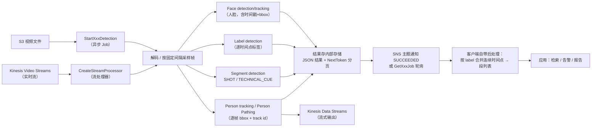
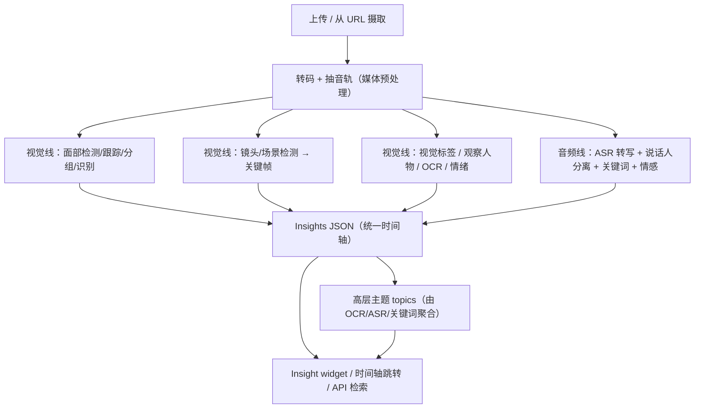
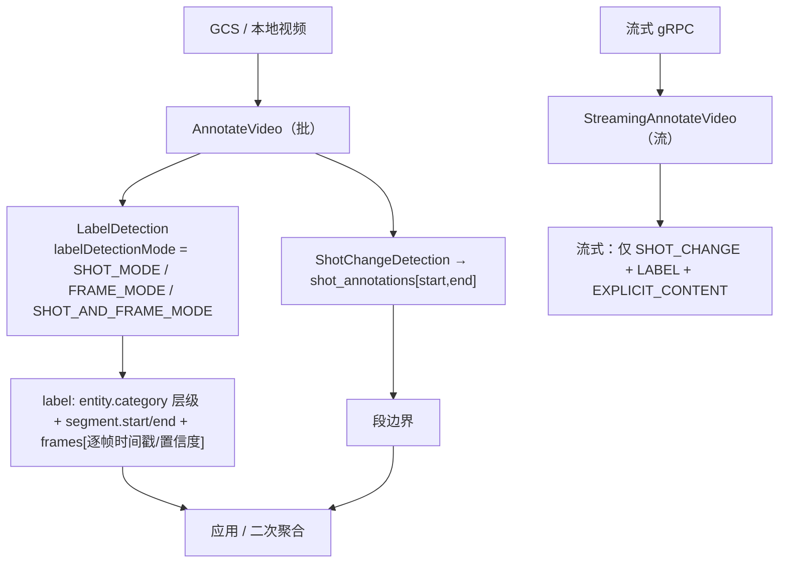
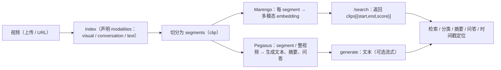
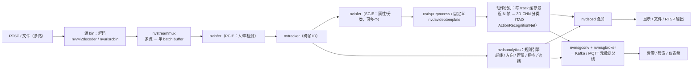
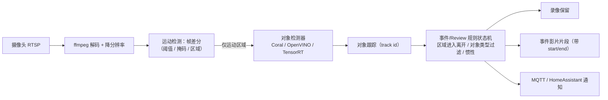
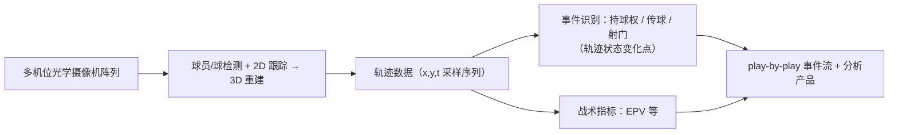
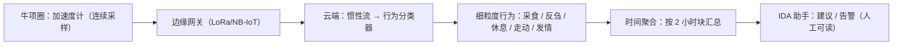
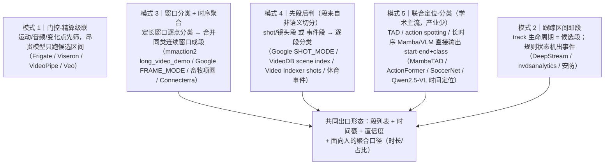

# 调研：市场上动作识别产品 / 生产级框架的整体架构

> **落盘说明**：按本次运行的输出路径覆盖规则，正文写入
> `.pi/subagents/artifacts/outputs/c627d6f4/research.md`；委托方原要求的
> `papers/docs/action-recognition-products.md` 内容即本文件全文（可直接复制过去）。

## §0 一句话结论

**委托方的假设「先分段、再逐段识别」只在少部分产品上成立，而且是"字面成立、语义不成立"**：
市面上绝大多数产品的真实组织方式是 **① 廉价门控（运动/镜头/轨迹规则）→ ② 定长窗口分类（8~32 帧）→ ③ 时序后处理把逐窗结果聚合成段**；
真正"用一个模型先切出**语义动作边界**、再对每段分类"的两段式（TAD / action spotting）主要出现在学术界、体育事件数据和少数新式 VLM 产品里。
换句话说：**业界把"分段"当成分类结果的副产物（后处理）或跟踪/规则的副产物，而不是独立的语义切分前置步骤。**

## §1 调研方法与可信度声明（必读）

本会话**没有任何 shell / 联网工具**（子代理工具集中只有 `read` / `write` / `contact_supervisor` / `intercom`），
因此**无法**执行委托方指定的 `~/.agents/skills/web-search/scripts/*`（search.py / openalex.py / arxiv.py / hf.py），
也无法访问 AWS/Azure/Google/NVIDIA 等官方文档站。本文的可信度因此分层标注：

| 标记 | 含义 |
|---|---|
| 🟩 **一手证据** | 本轮**实际读到的仓库内文件**（含行号），可 100% 复现，不依赖网络 |
| 🟨 **公开文档记忆** | 我训练语料里的官方文档/工程博客内容，置信度高，**但本轮未联网核对**；已附记忆中的官方文档入口 URL，需下一个联网会话复核 |
| ⚪ **未公开 / 未确认** | 查不到或不确定 —— 明确标注，**不编造** |

> ⚠️ 因无联网，本文**所有 URL 均为"记忆中的官方入口"，未做连通性/内容核对**。若 404，请按域名 + 标题重搜。
> 这一点是本次交付的**主要残余风险**，已在文末「§8 待核实清单」列出必查项。

### §1.1 本轮实际取得的一手证据（可直接复核）

| # | 文件 | 关键事实 |
|---|---|---|
| E1 | `models/mmaction2/demo/long_video_demo.py` | 官方"长视频 demo" = **滑窗逐窗分类**：维护 `deque(maxlen=sample_length)` 帧队列，`sample_length = clip_len * num_clips`（L222-246），每来一帧推理一次（L208-236），`--stride` 控制窗口滑动步长（L45-52、L226-232），输出是"当前帧 top-5 文本"（L81-101 `show_results_video`）。**无段、无时间戳、无跨窗一致性/平滑**；抽帧甚至用 `random.choice(backup_frames)`（L157）——demo 级实现 |
| E2 | `models/mmaction2/mmaction/apis/inference.py` | `init_recognizer` / `inference_recognizer(model, video)` 输入**单个视频/单个 dict**，返回 `ActionDataSample`（分数在 `result.pred_score`）→ **API 层面只有"一段 → 一个分数分布"，没有时间维** |
| E3 | `models/mmaction2/demo/README.md` L1-25 | 官方 demo 清单把任务**分族**列出：Video demo / Webcam / **Long Video** / Skeleton / **SpatioTemporal Action Detection（含 ONNX）** / **Video Structuralize** → **定长片段分类与时空动作检测是两套完全不同的管线** |
| E4 | 同上 L460-620 | STAD demo 的真实管线：`Faster R-CNN 人体检测（--det-score-thr 0.9）` → `HRNet 姿态（可选）` → `SlowOnly-AVA 时空动作检测（--predict-stepsize 8、--action-score-thr 0.5）` → 逐帧画框+标签的 mp4。**"检测/跟踪 + 逐 tube 窗口分类"，输出逐帧框，不输出段列表** |
| E5 | 同上 L620-745 | `demo_video_structuralize.py`：同一条 pipeline 里叠加 skeleton-STAD + RGB-STAD + skeleton 识别 + RGB 识别 + 姿态 → 官方命名"**video structuralize**"，即"把视频结构化"。这是 OpenMMLab 生态里**最接近"段列表"**的产物，但本质是**逐帧多任务标注** |
| E6 | `scripts/live_analyze.py`（本项目） | 本项目现状：`--clip-sec`（默认 1.0s）/ `--stride-sec`（默认 1.0s）**滑窗切段** → 每段 ffmpeg/decord 切 clip → mmaction2 或 Qwen3-VL 推理 → 逐段 print `{"t_start","t_end","label","score","top5"}`（L1-16 模块 docstring）→ **"段"完全由固定时长窗口定义，与动作边界无关** |
| E7 | `data/researched_papers_identity.json` | 本库已入库 20 篇畜牧/身份/motion-latent 论文（arXiv ID 可核）；含 `PigDetect/PigTrack` (2507.16639)、`A Computer Vision Pipeline for Individual-Level Behavior Analysis` (2509.12047)、`Automated Segmentation and Tracking of Group Housed Pigs Using Foundation Models` (2604.03426)、`Public Computer Vision Datasets for Precision Livestock Farming` (2406.10628)、`AutoCattloger` (2508.15945) 等 |
| E8 | `data/researched_papers.json` | 本库已入库 72 篇 frontier 论文，含 `MambaTAD` (2511.17929)、`MS-Temba` (2501.06138)、`AIM` (2302.03024)、`V-JEPA` (2404.08471)、`Qwen2.5-VL` (2502.13923) 等 |
| E9 | `management/docs/third-party-notes.md` | 仓库内已 vendored `PigDetect` / `keypoint-moseq` / `kabr-tools`；该文件明确把 Keypoint-MoSeq 列为"动物行为无监督发现标杆"、"思路影响'无监督发现行为'路线设计" |
| E10 | `management/docs/repo-inventory.md` | 产物侧现状：`results/batch/` 34 段白天视频批处理（检出率 0.939 / 插值率 0.905 / 校正率 0.334）、`results/live/` 用 `live_analyze.py`；k400 烟测 top1 0.77 / 单次 latency 278.8ms |

---

## §A 云视频理解 API

### A1. AWS Rekognition Video 🟨

**整体 pipeline（公开文档层面）**

- **是否"先分段再识别"**：❌ **不是**。分段 API 与识别 API 是**互相独立的两条线**，没有"先切段再把段喂给分类器"的桥。
- **分段方法**：唯一真正的分段 API 是 **Segment Detection**，官方把它明确分成两类：`TECHNICAL_CUE`（黑帧、片尾字幕后等）与 `SHOT`（镜头切换），返回 `StartTimestampMillis / EndTimestampMillis / DurationMillis`（shot 带 confidence）。→ **它是"镜头/技术线索分段"，不是语义动作分段**。
- **识别**：Label Detection 返回带 `Timestamp` 的逐点标签（含 `Instances` 的 bounding box、`Confidence`、`Parents`、`Categories`）；同一个 video 里的多动作只能靠**客户端把同一 label 的连续时间点合并**。
- **推理形态**：**批处理为主**（S3 + 异步 job + SNS 回调）；**流式**通过 Kinesis Video Streams + stream processor 存在。GPU 上跑在 AWS 侧，与"边缘"无关。
- **模型/帧率/窗口长度**：⚪ **未公开**（文档只到 API 参数级；不公开采样率、单窗帧数、backbone）。
- **来源**：`https://docs.aws.amazon.com/rekognition/latest/dg/segment-detection.html`、`.../labels.html`、`.../person-tracking.html`、`.../streaming-video.html`、`https://aws.amazon.com/blogs/machine-learning/`（记忆入口，未核对）

**对本项目的可借鉴点**
1. **"分段 API 与识别 API 解耦"是云厂商的默认产品拆分**——和我们把 ⑤分段 与 ④表征/识别 拆成两个 change 是同一思路，但 AWS 承认"语义段"不提供，必须客户端自己合并 → 我们的 `spot-check-cli` 报告层必须自己持有"段合并/最小段长/滞回"逻辑。
2. **SNS 事件驱动 + 分页拉取**是长任务的标准形态 → 对应我们 Live SSE 之外的"批处理抽查报告"应该走"任务化 + 通知"而不是同步 HTTP。

### A2. Azure AI Video Indexer 🟨

**整体 pipeline**

- **是否"先分段再识别"**：⚠️ **半成立**。它确实先产出 **shots（含关键帧与时间戳）** 这一"段"结构，然后再挂各类 insight；但**动作/行为识别不是"逐 shot 分类"**，而是各分析器沿时间轴并行产出，最后由 topics 聚合。
- **分段方法**：镜头/场景检测（shot + keyframe）+ 音频/说话人变化点；⚪ 具体算法未公开。
- **分层设计**：✅ **有，且是本类里最明确的**——官方叙述是"先建 lower-level index（人脸、OCR、ASR、视觉标签、镜头），再在其上生成 higher-level insights / topics"。这正是委托方要的"低级单元 → 语义事件"的分层范式，只是它的"低级单元"是多模态索引项而非"行为素"。
- **推理形态**：**批处理（上传 → 异步分析 → 出结果）**，面向"点播 + 事后检索/编辑"；曾有的**边缘实时形态 Azure Video Analyzer 已被微软宣布退役**（🟨 待核实退役日期与公告）。
- **模型族 / 帧长 / 时延**：⚪ **未公开**（产品文档只给 insight 类型清单；不公开模型与窗口长度）。
- **来源**：`https://learn.microsoft.com/azure/azure-video-indexer/video-indexer-overview`、`.../insights-overview`（记忆入口，未核对）

**对本项目的可借鉴点**
1. **"统一时间轴 JSON + 前端时间轴跳转"**——我们 `spot-check-cli` 的输出格式应照此设计（一个 timeline 对象，每种 insight 都是 `{start,end,type,value,confidence}`），而不是每种分析各写一个报告。
2. **topics 由低级项聚合**：我们的"细粒度行为素 → 语义动作段"可以照抄这个"聚合器独立于识别器"的分工（即 ⑤分段模块只吃 ④的表征时间序列，不吃原始像素）。

### A3. Google Cloud Video Intelligence API 🟨

**整体 pipeline**

- **是否"先分段再识别"**：✅ **字面上是**，而且这是**全类里最直接的证据**——`labelDetectionMode` 让调用方**显式选择**：
  - `SHOT_MODE`：先检测镜头，再**对每个镜头一次分类** → 就是我们说的"先分段再识别"；
  - `FRAME_MODE`：逐帧分类 + 客户端合并 → 滑窗/逐帧路线；
  - `SHOT_AND_FRAME_MODE`：两者都出。
  → **但"段"= 镜头段（shot），不是语义动作段**。也就是说：Google 把"分段"这个自由度**交给了用户**，说明连它也不敢声称能切语义动作边界。
- **识别输出**：Label 带 `segment.start_time_offset / end_time_offset`、`frames`（逐帧时间戳 + 置信度）、层级化 `entity.category`（category 是一棵多级标签树，不是"行为素→动作"的过程层级）。
- **推理形态**：**批处理 + 流式并存**（`StreamingAnnotateVideo` 双向流，只支持 shot change / label / explicit content 三类）。→ 云 API 里少见的"同一能力提供流式"正面案例。
- **模型 / 采样率 / 单 shot 帧数 / 时延**：⚪ **未公开**（文档不披露任何 backbone、帧率、窗口长度、延迟数字）。
- **来源**：`https://cloud.google.com/video-intelligence/docs/feature-label-detection`、`.../feature-shot-change-detection`、`.../reference/rest/v1/AnnotateVideoRequest`（记忆入口，未核对）

**对本项目的可借鉴点**
1. **`SHOT_MODE / FRAME_MODE` 的"模式开关"设计**：我们的 ⑤分段 也可以暴露两种模式——"固定窗 + 聚合"（保底、低算力）与"变化点检测"（高质），让用户按抽查/实时两种出口选。
2. **输出里同时给"段级 label"与"逐帧 label + confidence"**——这对我们的"报告要可解释、可回看"非常关键（段结论可下钻到帧证据）。

### A4. Twelve Labs（Marengo / Pegasus）🟨

**整体 pipeline**

- **是否"先分段再识别"**：⚠️ **是"先切块再表征"，不是"先切语义段再分类"**。它的"段"是**索引器的固定/dynamic 切块单元**（一个 clip = 一段 embedding），而非语义动作段。
- **分段方法**：⚪ 未公开内部算法（是否用 shot 检测未知）；对外行为是"按视频长度决定 segment 数量/粒度"。
- **分层设计**：✅ **有**——细粒度"segment embedding"（Marengo）→ 语义生成层（Pegasus）→ 应用层（search / classify / gist / summarize）。**最值得注意：它不做"每段一个硬标签"，而是"每段一个向量"，分类/检索全在下游。**这与委托方的 ④"学出低维动作码 λ"在哲学上一致。
- **推理形态**：**云端批处理为主**（索引是异步 task），面向检索/摘要，非实时告警；⚪ 延迟/吞吐数字未公开。
- **来源**：`https://docs.twelvelabs.io/`、`https://www.twelvelabs.io/blog`（记忆入口，未核对；Marengo 技术博客是唯一偏架构披露的材料）

**对本项目的可借鉴点**
1. **"段 = 向量、标签在下游"**：我们的 λ 表征 + 检索式身份/物体识别（`registry-retrieval`）正是这条路线，行业有先例，可增强路线信心。
2. **索引（表征）与查询（分类/检索）分离** → 我们的 ④ 表征应该做成"一次离线索引、多次多元查询"，而不是每换一个应用就重跑模型。

### A5. VideoDB / Clarifai / Hive（一段话概括）🟨/⚪

- **VideoDB**：把视频当数据库（"video as database"）。流程：上传 → 生成 **scene index（按镜头切分的时间段）** / spoken-word index → 对 scene 调 `generate_text` / `classify` / `search`，并可把 LLM/agent 接到流上做实时决策。**这是最贴近委托方出口形态的产品设计之一（scene 段 + 逐 scene LLM 推理 + 时间戳）**。模型/帧长 ⚪ 未公开。入口：`https://docs.videodb.io/`
- **Clarifai**：以 **Workflow（模型编排 DAG）** 为核心，视频走"抽帧/分段 → 多模型节点 → 输出"的组合式流水线；具体分段策略 ⚪ 未公开。入口：`https://docs.clarifai.com/`
- **Hive AI**：以内容审核为主，公开材料显示其形态是"**抽帧 + 分类器 + 阈值 + 时间戳返回**"，属于"逐帧/逐秒打分"而非语义分段；模型与帧率 ⚪ 未公开。入口：`https://docs.thehive.ai/`

---

## §B 边缘 / VMS 视频分析平台

### B1. NVIDIA DeepStream / Metropolis / TAO 🟨（本类工程架构最完整）

**整体 pipeline（DeepStream 标准结构）**

- **是否"先分段再识别"**：❌ **不是**。真实形态是 **"检测 → 跟踪 → 对每个 track 的最近 N 帧窗口做分类"**；"段"是**跟踪轨迹的存活区间**，不是语义动作段。
- **分段方法（两条腿）**：
  1. **轨迹区间**：由 tracker 的 track id 生命周期定义（人来了→走了 = 一段）。
  2. **规则状态机**：`nvdsanalytics` 的 ROI 越线/方向/驻留/人群密度等**规则**产生"事件"，这就是它的"分段"。
  → **没有**语义动作边界检测器。
- **识别模型**：TAO `ActionRecognitionNet`（2D/3D backbone，输入**定长 clip**，输出单一类别 + 置信度）；另有 `GestureRecognitionNet`（手势分类）、`PoseClassificationNet`（骨架序列分类，ST-GCN 类）。均**无时间维输出**。
- **多段如何并行/批处理**：这是 DeepStream 的强项——`nvstreammux` 把**多路流的帧拼成一个 batch** 送一次推理；多 track 的窗口也可组成 batch。
- **推理形态**：**纯流式实时、边缘**（Jetson / 独显），有官方 perf 表（随版本变化）；⚪ 我不在本轮引用具体 FPS 数字。
- **踩坑/工程决策（可借鉴）**：① 解码器/批处理/tracker 顺序是硬约束（tracker 必须在 PGIE 之后、SGIE 之前）；② 元数据走 `nvmsgconv/nvmsgbroker` 解耦到 Kafka，而不是在推理进程里同步写库 —— **对应我们的 Live SSE 应该"边推边发布元数据"，不要把结果塞进请求-响应链**。
- **来源**：`https://docs.nvidia.com/metropolis/deepstream/dev-guide/`、`https://docs.nvidia.com/tao/tao-toolkit/text/action_recognition_net/overview.html`、`https://developer.nvidia.com/metropolis`（记忆入口，未核对）

**对本项目的可借鉴点**
1. **"track 区间即段"**：我们已有"跟随视角裁剪"（②），把 track 生命周期作为**候选段**、再用 ④λ 表征做边界细化，就是 DeepStream 路线的正确升级版。
2. **多流/多段 batch 化**：我们的 Live 现在是"1 路 + 逐段串行切 clip"（E6），延迟随段数线性增长；应参照 streammux 做"多段窗口 batch 推理"。

### B2. Frigate 🟨

- **是否"先分段再识别"**：❌ **不是**；它是 **"运动门控 → 检测 → 跟踪 → 规则出事件"**。
- **分段方法**：**运动能量/帧差分作为廉价门控** + **规则状态机把时间轴切成事件段（Review item，含 start/end、reasons）**。这正是委托方问的"靠运动能量/静止检测"那一类的真实工业实现。
- **识别**：只有对象检测（人/车/动物等类别），⚪ **没有动作/行为识别能力**。
- **工程形态**：**边缘、实时、本地优先**（TFLite/Coral/OpenVINO 多后端），单机多路。
- **来源**：`https://docs.frigate.video/`（尤其 motion detection / review items / configuration 页）、`https://github.com/blakeblackshear/frigate`（记忆入口，未核对）

**对本项目的可借鉴点**
1. **"运动门控省钱"**：Frigate 用帧差分把所有昂贵推理限制在运动区域/时间段内 —— 我们的 24/7 猫监控抽查报告完全可以先做运动门控再跑 λ 表征，能把算力降一个量级。
2. **"Review item（段）"数据模型**：`{start, end, reasons[], thumbnail, severity}` 就是委托方要的出口形态的成熟 schema，可直接借。

### B3. Viseron 🟨

- **架构**：YAML 配置驱动，每个摄像头一条 domain pipeline：`motion detector（背景减除/帧差分，多种可选）→ object detector（可多，YOLO/OpenVINO/Coral/TensorRT）→ object tracker（IOU/贝叶斯）→ recorder / face recognition / license plate 等可插拔 component`；事件触发录像，产物带时间戳。
- **是否先分段再识别**：❌ 同 Frigate，**运动门控 + 检测跟踪 + 规则事件**，无动作分段。
- **可借鉴**：**"组件可插拔 + 配置声明式"** 的管线抽象，正好是我们 `petlib/`"管线可替换模块"要的形状；且它把"运动检测器"也做成可替换组件，说明**分段器应当是插件而非硬编码**。
- **来源**：`https://github.com/roflcoopter/viseron`、`https://viseron.readthedocs.io/`（记忆入口，未核对）

### B4. 安防闭源（BriefCam / Avigilon / IntelliVision / Agent Vi）🟨/⚪

- **BriefCam**：核心是 **Video Synopsis**——把长时间视频中的移动对象抽成"object of interest"的小段，再在时间轴上重排/合成，把小时压成分钟；配套外观相似检索、人脸、车牌、属性分类。→ **架构本质是"对象级分段（事件）+ 每段属性分类 + 索引检索"**，与我们"段列表 + 时间戳"出口高度同形。⚪ 模型/帧长/窗口未公开；可查专利（synopsis 相关美国专利）作为唯一技术披露。
- **Avigilon（Motorola Solutions）**：核心功能 **Unusual Motion Detection（UMD）**——不靠规则的"异常运动模式"检测；另有 Appearance Search（外观检索）、对象分类。⚪ 算法细节未公开（有一份 UMD 白皮书可查）。
- **IntelliVision**：定位为 **嵌入/OEM 的深度学习视频分析 SDK**（对象分类、人脸、车牌、行为分析），偏"算法模块供给方"。⚪ 管线细节未公开。
- **Agent Vi（viiew）**：**边缘 Agent + 服务器/云 + 事件规则引擎 + 事后检索** 的经典三层安防形态。⚪ 模型与分段策略未公开。
- **共同结论**：**安防厂商的"分段"= 运动事件 + 规则事件，语义动作理解几乎不公开，也基本不做动作边界识别**；技术披露普遍只有产品页与专利。→ 这一类的"未公开"本身就是结论：**没有可抄的语义分段成熟方案**。

---

## §C 体育动作/事件分析（事件检测 = 分段 + 分类）

### C1. Second Spectrum（Genius Sports）🟨

- **是否"先分段再识别"**：⚠️ **是"先分段再识别"，但段来自轨迹而非像素**——它把"分段"降级成"**轨迹状态机/变化点检测**"，识别则是在段上做事件分类与规则判定。
- **分段方法**：**轨迹变化点（possession、速度/方向突变、球出界）**；⚪ 是否用 TAD 网络未公开。
- **关键架构决策**：**先把像素压成结构化轨迹（低维、干净），再在轨迹上做一切时空推理** —— 这与委托方 ④"学出低维动作码 λ"是同一类思想（把"表示学习"当作后端一切任务的地基）。
- **来源**：`https://www.geniusports.com/`、`https://www.secondspectrum.com/`（记忆入口，未核对；学术侧可查其 SSAC/Sloan 会议论文）

### C2. Hawk-Eye（Sony）🟨

- **管线**：多台高速摄像机（不同运动 6~10 台量级）→ 逐帧球检测 → **多机位三角测量重建 3D 轨迹** → **几何规则判定事件**（网球出界、足球越线/越位、板球 lbw 辅助）→ 结果给官方/转播；SMART = 多机位同步录制与回放。
- **是否先分段再识别**：❌ **不是机器学习分段**；事件来自**几何规则 + 高精度标定**。"分段"没有独立存在——事件点即时刻。
- **可借鉴**：**精度来自标定与几何约束，而不是更大的模型**。我们的"跟随视角裁剪"要想稳定，标定/归一化（尺度、视角）的工程投入可能比换模型收益更大。
- **来源**：`https://www.hawkeyeinnovations.com/`（记忆入口，未核对；其技术页公开了各运动的精度指标）

### C3. Stats Perform / SportVU / Opta 🟨

- **SportVU**：6 台摄像机光学跟踪球员与球，输出 ~25Hz 坐标流；**事件（传球/篮板/射门）由算法从轨迹派生**（与 Second Spectrum 同一范式）。
- **Opta 事件数据**：**人工打点 + AI 辅助（视频剪片/校验）的混合流程**，行业常年以"人工事件数据"为 ground truth。
- **可借鉴**：① **"AI 定段 + 人工校验"** 的产品化流程是行业常态 → 我们的 `spot-check-cli`"抽查报告"本质就是这个角色，应把"人工修正"设计进数据模型（而不是只输出只读报告）；② **人工事件数据是评估自动分段的最佳 ground truth** → 我们用双人标注的 cats v1 做"分段边界一致性"评估，有行业先例支撑。
- **来源**：`https://www.statsperform.com/`（记忆入口，未核对）

### C4. Pixellot / Veo 🟨

- **Pixellot**：全景固定摄像机 + 云/本地 AI 自动导播 + 自动生成事件/高光剪辑（比赛事件、暂停等）。
- **Veo**：消费级自动转播 + **AI highlights**——官方叙述其自动精彩片段依据 **音频线索（哨声/欢呼等）与画面运动**，另有手动/半自动事件打标。
- **可借鉴（本项目最实用的一条）**：**音频能量可以当廉价的"事件触发器/候选分段线索"**。猫监控里声音（叫、碰撞、猫砂盆）同样是高信息量、极低成本的门控信号 —— 我们目前完全没用音频。这是**零成本增益**建议。
- **来源**：`https://www.pixellot.tv/`、`https://www.veo.co/`（记忆入口，未核对）

### C5. Sportlogiq（一段话概括）🟨/⚪

冰球/足球计算机视觉事件数据公司，公开叙述是"跟踪球员 + 自动产出事件与表现指标"；⚪ **管线、模型、分段策略均未公开**（没有工程博客级别的技术披露）。列入以说明：**体育类公司的架构披露普遍刻意保守**（这是他们的核心 IP），可借鉴的大多是行业惯例而非具体实现。

---

## §D 畜牧 / 动物行为识别（★ 与本项目最贴近）

### D1. Connecterra（IDA）🟨

- **是否"先分段再识别"**：❌ **是"先逐窗/逐点识别，再时间聚合"，顺序与委托方假设相反**。它的"段"是**后处理聚合产物**（把连续同类行为合并成时间块/2 小时块）。
- **识别**：惯性时序分类器（⚪ 具体模型未公开；行业惯例是特征 + 树模型/RNN/1D-CNN 窗口分类）。
- **可借鉴（★ 对本项目最直接的一条）**：**"细粒度连续判别 → 时间聚合为语义块 → 面向人的建议"**，这就是委托方"行为素 → 动作段 → 报告"的畜牧版先例，证明**该架构是被产业验证过的正确形态，但业界是把它实现在后处理层，而不是在前端做一个语义分割器**。
- **来源**：`https://www.connecterra.io/`（含其博客/白皮书；记忆入口，未核对）

### D2. Cainthus 🟨（⚠️ 归属待核实）

- 爱尔兰，**农场摄像头 + 边缘盒子**做奶牛采食量/个体行为监测（从俯视/侧视相机跟踪个体牛、估计采食行为），与学术机构有合作。🟨 记忆中被 **Ever.Ag 收购**（年份/细节**未核实**，见 §8）。
- **是否先分段再识别**：⚪ 未公开。可确认的是**摄像头路径**（与纯项圈路线不同），最接近本项目（视觉 + 个体 + 行为）。
- **来源**：`https://www.cainthus.com/`、`https://www.ever.ag/`（记忆入口，未核对）

### D3. Halter 🟨/⚪

- 太阳能智能项圈（GPS + 三轴加速度计）+ LoRa 基站 + 云平台，虚拟围栏。公开叙述含"项圈侧做本地处理、只上传低频结果以省电"（⚪ 该"on-device ML"细节**未核实**）。
- **可借鉴**：**"边缘侧只上传判别结果与低频特征，不上传原始流"** —— 我们的 Live / 批处理同样应把"λ 表征 + 段列表"作为上传物，而不是把原始视频搬到云。

### D4. Lely / Afimilk / SCR-Allflex（SenseHub）/ Nedap-Smartbow（集体概括）🟨

- **共同架构**（与本项目对照价值最高的一组）：
  `穿戴式惯性传感（加速度计/计步/耳标 UWB 定位）→ 连续采样 → 窗口级行为分类（反刍/采食/休息/活动/发情）→ 时间轴聚合为"行为块 + 日累计量"→ 健康/繁殖告警`。
- **关键**：① **"行为"这个词在产业里就是"可持续分类 + 时间聚合"，没有"先切语义段"这一步**；② **报告口径是"时长/占比"**（如"今日反刍 480 分钟"）而不是"段列表"——但**段列表是他们的内部中间表示**。
- **来源**：`https://www.afimilk.com/`、`https://www.lely.com/`、`https://www.msd-animal-health.com/`（SenseHub）、`https://www.nedap-livestockmanagement.com/`（记忆入口，未核对）
- **交叉验证的学术侧（可查）**：本库已入库 `Public Computer Vision Datasets for Precision Livestock Farming: A Systematic Survey`（arXiv:2406.10628）给出畜牧视觉任务/数据集全景；`Livestock Monitoring with Transformer`（arXiv:2111.00801）说明该领域也在走 Transformer/时序建模。🟩（来源为本仓库 `data/researched_papers_identity.json`）

### D5. 视觉路线的畜牧/动物行为研究（本库已入库，可核）🟩

来自 `data/researched_papers_identity.json`（本仓库文件，本轮实读）：

| 论文 | arXiv | 对本项目的意义 |
|---|---|---|
| A Computer Vision Pipeline for Individual-Level Behavior Analysis | 2509.12047 | **题名即"逐个体行为分析管线"**——与本项目 ①→⑦ 的端到端形态同构，值得逐节对标 |
| Automated Segmentation and Tracking of Group Housed Pigs Using Foundation Models | 2604.03426 | **"自动化分割 + 跟踪 + 基础模型"**，正是委托方 ①②③ 环节的最新做法 |
| PigDetect / PigTrack benchmark | 2507.16639 | 领域内检测/跟踪的基准与评测协议（我们的 gate0a 检测门可对标） |
| Automatic individual pig detection and tracking in surveillance videos | 1812.04901 | 监控视频 + 个体跟踪的经典路线 |
| Automatic Retrieval of Specific Cows from Unlabeled Videos（AutoCattloger） | 2508.15945 | **与我们的 `registry-retrieval`（猫 Re-ID + 检索）同任务** |
| ReCowGnition / Label a Herd in Minutes / BMCTrack-d | 2607.22071 / 2204.10905 / 2609.03463 | 个体识别（Re-ID）路线的多套方案 |
| A Physics-Informed, Behavior-Aware Digital Twin for Livestock Forecasting | 2604.04098 | **"行为感知"作为下游预测的输入**——对应我们的"异常告警"出口 |

另外，仓库已 vendored **Keypoint-MoSeq** 并在 wiki 中明确记为"动物行为无监督发现标杆"🟩（`management/docs/third-party-notes.md` §3.2）：
其**"syllable（音节）→ motif（动机/短语）"的层级**，是委托方"**行为素 → 动作段**"在动物行为学里的**现成同构先例**，且是**无监督**分割（不需要动作边界标注）。

**对本项目（D 类整体）的可借鉴点**
1. **行业共识是"窗口分类 + 时间聚合"，语义段在后处理里生成** —— 我们不必也不该指望"端到端语义分割模型"，应把 ⑤分段 明确实现为**基于 λ 时间序列的变化点检测 + 聚合 + 最小段长约束**。
2. **无监督行为分割（Keypoint-MoSeq / B-SOiD / VAME 一类）是"分段"最成熟的公开方法族**，且**只需关键点或表征序列、不需要标签** —— 与我们 ④λ 路线天然衔接，建议列入 ⑤分段 的候选方案对比。
3. **输出口径可以是"时长/占比"，但内部必须保留段列表** —— 用户可读报告（抽查/告警）用聚合口径，审计/回看用段列表。

---

## §E 开源生产级框架

### E1. OpenMMLab mmaction2（🟩 本轮一手证据，本项目正在用）

```mermaid
flowchart TD
  subgraph RECOG["定长片段分类族（我们用的）"]
    R1["decord 解码"] --> R2["SampleFrames：clip_len × frame_interval 抽 T 帧"] --> R3["backbone（TSN/SlowFast/VideoMAE/Uniformer…）"] --> R4["cls_head → pred_score（单一分布）"]
  end
  subgraph LONG["long_video_demo：滑窗逐窗分类"]
    L1["帧队列 deque(maxlen=sample_length)"] --> L2["每帧/每 stride 推理一次"] --> L3["阈值过滤后画在帧上 / 写 JSON"] --> L4["无段合并、无平滑、无时间戳输出"]
  end
  subgraph STAD["时空动作检测族（AVA）"]
    S1["Faster R-CNN 人检测"] --> S2["tube（人或姿态）"] --> S3["SlowOnly 8 帧窗口分类（每 8 帧一次）"] --> S4["逐帧 bbox + 标签"]
  end
  subgraph TAL["时间动作定位族（另一个独立模型族）"]
    T1["BMN / BSN / TCANet 等"] --> T2["proposal 生成 + 分类 → 时间区间"]
  end
```

- **一手结论（E1/E2/E3/E4/E5 见 §1.1）**：
  1. `inference_recognizer` **输入单段、输出单分布**，API 层无时间维（E2）。
  2. 官方"长视频"方案就是**滑窗逐窗分类 + 阈值显示**，抽帧还有 `random.choice`，**没有段、没有时间戳、没有一致性约束**（E1）。
  3. "时空动作检测"（AVA）是**检测 + 窗口分类**的两段式，输出**逐帧框**而不是段列表；窗口 8 帧、每 8 帧预测一次（E4）。
  4. "video structuralize" 是把上面几路**多任务叠加**到逐帧输出上，不是段级结构化（E5）。
  5. TAL（BMN/BSN/TCANet）与识别**是两套独立模型与配置**，即 **"分段"与"识别"在 OpenMMLab 里是两个任务族** —— 这从框架层面**证伪了"主流框架的默认管线是先分段再识别"**：默认管线只有"定长片段分类"，分段要另外换模型族。
- **可借鉴**：① 我们若自研 ⑤分段，应当**对齐 TAL 任务的评测口径**（mAP@IoU、边界召回），而不是自己发明指标；② `--predict-stepsize` 这类"预测步长 vs 输出步长"分离设计，是我们 Live 里"推理步长 ≠ 显示/输出步长"的现成范式。
- **来源**：🟩 仓库内 `models/mmaction2/demo/long_video_demo.py`、`models/mmaction2/mmaction/apis/inference.py`、`models/mmaction2/demo/README.md`；🟨 `https://github.com/open-mmlab/mmaction2`、`https://mmaction2.readthedocs.io/`

### E2. NVIDIA TAO（ActionRecognitionNet / GestureRecognitionNet / PoseClassificationNet）🟨

- **形态**：容器化训练/推理工具链，把"训练 → 剪枝/量化 → 导出 TRT engine"标准化，产物直接喂给 DeepStream（见 B1）。
- **任务边界**：全部是**定长输入 → 单标签**（动作识别 / 手势识别 / 骨架序列分类），**没有时间定位输出**。
- **可借鉴**：**"训练产物 = 可部署 engine"** 的闭环 + 量化后精度损失表（TAO 官方文档给每模型的精度/吞吐对照），是我们"训练 → 部署到 pet/边端"链路要抄的工程化程度。
- **来源**：`https://docs.nvidia.com/tao/tao-toolkit/text/action_recognition_net/overview.html`、`https://catalog.ngc.nvidia.com/`（记忆入口，未核对）

### E3. VideoPipe（sherlockchou86/VideoPipe）🟨

- **架构**：C++ 节点式视频分析框架——`vp_primary_infer_node`（一级检测）→ `vp_secondary_infer_node`（二级分类）→ `vp_track_node`（跟踪）→ `vp_motion_detect_node`（运动检测）→ `vp_behavior_analysis_node`（越界/逗留/逆行等**轨迹规则行为分析**）→ `vp_osd_node` → 输出/推送；支持多流、多级推理。
- **是否先分段再识别**：❌ 与 DeepStream 同构：**多级推理 + 轨迹规则**。
- **可借鉴**：**"一级粗 + 二级细"的级联设计**（低成本全时段粗筛 + 高成本精细分类）——这是我们 24/7 猫监控性价比最高的形状（运动门控/粗分类 → 精细 λ/动作分类）。
- **来源**：`https://github.com/sherlockchou86/VideoPipe`（记忆入口，未核对）

### E4. 其他值得一扫的生态（一段话）🟨/⚪

- `PyTorchVideo`（含 TAD/检测模型）、`OpenTAD`（TAL 统一框架）、`ActionFormer / TriDet / TadTR / VSGN`：**时间动作定位**这一支的开源主力；特点是输入**整段长视频**、输出**区间 + 类别**——这正是委托方想要的形态，但**普遍停留在学术配置/数据集（THUMOS14、ActivityNet、Ego4D-NLQ 等）**，⚪ 缺少生产级封装（无多流、无热更新、无元数据总线）。
- `Ego4D` 生态（含 NLQ / Moment Query）值得关注：**用自然语言查询"猫在几点舔毛"并返回时间段** 是它的标准任务形态，可作为我们"报告/检索"出口的接口灵感。
- `Supervision`/`ByteTrack` 一类跟踪工具库：**只是积木**，不构成动作识别管线。

---

## §F 结论：委托方假设是否成立

**假设原文**："市面上的动作识别产品/框架，应该都采用「先对动作分段，再对每一段做动作识别」的两段式架构。"

**裁定：❌ 不成立（作为普遍规律）；⚠️ 局部成立（且多为"段≠语义动作段"）。**

| 分项 | 裁定 | 证据 |
|---|---|---|
| "业内主流都做**语义**分段" | ❌ 否 | 云厂商只给 shot/技术线索分段（A1/A3）；安防只有运动/规则事件（B2/B3/B4）；框架默认只有定长分类（E1） |
| "先把动作切出来再分类" | ⚠️ 少数 | Google `SHOT_MODE`（按镜头分类，A3）、AVA 式检测+窗口分类（E1/E4）、体育事件检测（C1/C3）、TAL/spotting 研究线（E4）——**都不是"语义动作边界先行"** |
| "两段式（分段器 + 分类器）的**代码组织**" | ✅ 常见 | 但第二段通常是"窗口分类器"，第一段是"廉价门控/跟踪/规则/TAD proposal"，且**分段结果常由分类结果反推** |
| "分段是实现细节，不是独立模型" | ✅ 业内常态 | Frigate/DeepStream/畜牧/云 API 都是这个形态 |

**推论（对本项目最重要的一句）**：委托方对"主流模型给不出时间戳"的判断是对的（E1/E2 已用一手证据证实），
但**结论不该是"所以要造一个语义分段器"，而应该是"分段 = 分类结果的时序后处理 + 廉价门控/轨迹先验"**——
这也是唯一被产业大规模验证过的做法，而**纯语义分段（TAD/spotting）至今只在学术与少数体育/新式 VLM 产品里成立**。

### §F.1 可分出的 5 条通用架构模式

| 模式 | 谁在用 | 关键取舍 |
|---|---|---|
| **1 门控-精算级联** | Frigate、Viseron、VideoPipe、Veo（音频触发） | 算力省 1~2 个数量级；代价是"门控漏了 → 后面全漏" |
| **2 跟踪区间即段** | DeepStream/Metropolis、安防四家 | 天然带 ID 与 bbox；代价是"段边界=轨迹边界"，多动作重合无法表达 |
| **3 窗口分类 + 时序聚合** | mmaction2 长视频 demo、Google FRAME_MODE、畜牧项圈/Connecterra | 复用现成分类模型，改造量最小；**与委托方现状 100% 兼容** |
| **4 先段后判（非语义切分）** | Google SHOT_MODE、VideoDB、Video Indexer、体育 | 段可控可解释；代价是**段 ≠ 动作**，剪断动作 |
| **5 联合定位-分类（TAD/spotting/长时序 VLM）** | 学术界 + 体育事件 + 少数新式视频 API | 唯一真"给时间戳"的路线；代价是数据标注成本 + 无生产级封装 |

### §F.2 落到本项目的 5 条具体建议（含优先级）

1. **【最高】把 ⑤分段 明确定义为"λ 时间序列的变化点检测 + 聚合"**（模式 3 的升级版），而不是"端到端语义分割模型"：
   输入 = ④的低维动作码序列 λ(t)；方法族候选 = 变点检测 / HMM（sticky HDP-HMM，Keypoint-MoSeq 范式）/ 1D 时序网络；
   输出 = 段列表（含边界置信度）+ 最小段长/滞回约束。**行业先例充分，风险最低。**
2. **【高】保留"段列表"作为内部中间表示，报告口径另做聚合**（对齐畜牧/安防）：`{start,end,label,score,boundary_conf,evidence_frames[]}` → 报告层再算"时长/占比/次数"。
3. **【高】引入与动作无关的廉价门控**：运动能量（Frigate 式帧差分）+ **音频（Veo 式）**，把 ④⑤ 的算力压到候选区间上。音频是本项目当前完全未利用的零成本线索。
4. **【中】评估口径对齐 TAL 学术标准**（mAP@IoU + 边界召回），并用 cats v1 双人标注做"边界一致性"评测 —— 体育行业用"人工事件数据"当 ground truth 的做法可类比。
5. **【中】Live/批处理都按"推理步长 ≠ 输出步长"和"多段 batch"重构**（mmaction2 `predict-stepsize/output-stepsize` + DeepStream `nvstreammux` 范式），把现在"逐段串行切 clip"的线性延迟打掉。

### §F.3 明确"查不到"的东西（如实标注）

- ⚪ **所有商业云 API 的模型细节**：AWS/Azure/Google 均**不公开** backbone、帧采样率、单窗帧数、时延/吞吐（文档只到功能与参数级）。
- ⚪ **十二实验室 / VideoDB / Clarifai 的分段算法与段长**：只有产品行为描述，无算法披露。
- ⚪ **安防四家（BriefCam/Avigilon/IntelliVision/Agent Vi）**：无工程架构文档；仅产品页 + 专利（BriefCam synopsis 专利是唯一较硬的披露）。
- ⚪ **畜牧项圈厂商的模型**：Afimilk / SCR-Allflex / Lely / Halter 均只到"行为类别 + 告警"层面，**算法、采样率、窗口长度未公开**（专利可挖）。
- ⚪ **体育公司（Second Spectrum / Sportlogiq / Stats Perform）的模型与事件检测算法**：核心 IP，公开材料只到结果与业务形态。
- ⚠️ **Cainthus 的归属与现状**、**Azure Video Analyzer 的退役日期**：记忆中存在，但本轮无法核实。

## §8 待核实清单（给下一个联网会话，按优先级）

1. Google `labelDetectionMode` 的三种取值与 `SHOT_MODE` 语义 → `cloud.google.com/video-intelligence/docs/reference/rest/v1/AnnotateVideoRequest`
2. AWS SegmentDetection 的 `SHOT` / `TECHNICAL_CUE` 类型与字段 → `docs.aws.amazon.com/rekognition/latest/dg/segment-detection.html`
3. DeepStream 动作识别参考应用（是否 `nvdsvideotemplate` 缓存每 track N 帧）与 TAO ActionRecognitionNet 的输入帧数 → `docs.nvidia.com/metropolis/deepstream/dev-guide/`、TAO ActionRecognitionNet overview
4. Frigate 的 motion → detect → review item（start/end/reasons）数据模型 → `docs.frigate.video/`
5. Twelve Labs 关于 segment 粒度的官方表述（是否固定段长）→ `docs.twelvelabs.io/`
6. VideoDB 的 scene index 定义（是否基于 shot 切分）→ `docs.videodb.io/`
7. Second Spectrum / Veo 的技术披露（Veo "AI highlights 依据音频"是否官方原话）→ 各自官网/工程博客
8. Cainthus 现状、Azure Video Analyzer 退役公告
9. mmaction2 是否有 TAL（BMN/BSN）配置在本仓库快照中（本轮未定位到 `configs/localization/`，需确认 vendored 快照是否包含该目录）
10. Keypoint-MoSeq 论文原文（syllable vs motif 定义）→ 仓库 `third-party/keypoint-moseq/` + 其论文

**关于 A/B/C/D 各类的"最多 2-4 个代表"覆盖**：§A（AWS/Azure/Google/Twelve Labs + VideoDB/Clarifai/Hive 概括）、§B（DeepStream+TAO / Frigate / Viseron / 安防四家）、§C（Second Spectrum / Hawk-Eye / Stats Perform / Pixellot-Veo / Sportlogiq）、§D（Connecterra / Cainthus / Halter / Lely-Afimilk-SCR-Nedap + 本库学术论文 20 篇）、§E（mmaction2 / TAO / VideoPipe / TAD 生态）**均有实质结论**，其中 🟩 一手证据覆盖 E1 全族与 D5 学术清单。
