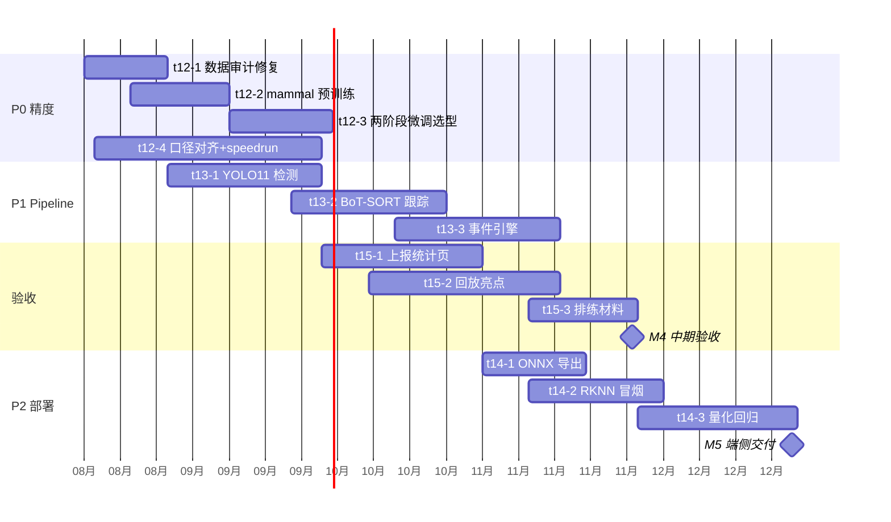

# 二期研究计划 — 从平台基建到验收交付

> 2026-08-15 制定。依据《宠物动作识别研究计划.docx》（docs/宠物动作识别研究计划.docx）的阶段安排，对齐当前代码库现状，规划 2026-08 至 2027-02 的执行路线。任务已同步落进项目树（t12–t15），里程碑见 `management/milestones.md`。
>
> 分工前提：**硬件本体（RV1126B 板卡、装配、驱动）由硬件方负责**。本团队交付模型、算法、技术文档与程序源码。

## 现状基线（2026-08-15）

已建成的能力：

- **训练体系**：mmaction2 vendor + 21 模型族注册，pet 服务器（RTX 4090）全链路训练可用
- **评测体系**：正式测试（top1/top5 + 速度指标）、speedrun 标注管线（含 `--custom`/`--ann-file`）、VLM 对比
- **Live 模块**：摄像头源 CRUD、SSE 实时推理（帧级同步）、演示模式（t11，8/9 完成）
- **数据集**：`quadruped_cats_v1`（79 源视频 → 717 clips，5 类）；`pet_action_mammal_v0`（5522 视频，8 类，已在 pet，未注册）

cats_v1 首轮微调结果（val top1）：

| 模型 | val top1 | 备注 |
|------|----------|------|
| SlowOnly-r50 | 67.05% | 当前最优 |
| TSM-r50 | 62.5% | |
| TimeSformer | 59.09% | best epoch 1，欠拟合 |

## 差距分析

### KPI 差距（中期验收 11 月硬指标）

| 指标 | 验收要求 | 现状 | 差距 |
|------|----------|------|------|
| 闭集行为识别准确率 | ≥75% | 67.05%（val，非 test） | -8pp，且 test 未正式评测 |
| 漏检率 | ≤10% | 未定义、未测 | 口径待与验收方对齐 |

### 根因判断：数据问题优先于模型问题

1. **类别失衡**：eating 198 / activity 228 / prolonged_stationary 210 / grooming 72 / **drinking 9**——drinking 占 1.2%，基本不可学习
2. **split 泄漏风险**：4s clip、stride 2s → 相邻 clip 50% 帧重叠。若按 clip 随机切分，train/val 高度相关，val 指标虚高
3. **域差距**：K400 预训练是人类活动域，直接迁移到猫科动作跨度太大；`pet_action_mammal_v0`（哺乳动物动作）是现成的中间域，尚未利用

### 能力缺口

| 计划功能 | 选型 | 现状 | 归属任务 |
|----------|------|------|----------|
| 目标检测 | YOLO11 | 无（仅 RTMDet 供姿态用） | t13-1 |
| 多目标跟踪 | BoT-SORT + ReID | 无 | t13-2 |
| 事件引擎 | 规则 + 状态机 | 无 | t13-3 |
| 音频事件 | YAMNet | 无 | 暂缓（见开放问题） |
| 姿态异常 | RTMPose | AP-10K 推理脚本已有，判定逻辑无 | 暂缓 |
| 端侧部署 | RKNN/RV1126B | 无任何转换代码 | t14 |
| 云端集成演示 | 上报/统计/回放/亮点 | Live 直播已有，其余无 | t15 |

## 执行路线（P0 → P1 → P2）

### P0 — 精度攻坚（8 月中 – 9 月底，t12）

目标：test split top1 ≥75%，漏检率口径落地。

1. **t12-1 数据审计与修复**：按源视频分组重切 split 消泄漏；drinking 补采或并入 eating（出决策记录）；清洗后产出 `cats_v2`
2. **t12-2 中间域预训练**：注册 `pet_action_mammal_v0`，SlowOnly/TSM 训练 mammal checkpoint
3. **t12-3 两阶段微调**：mammal ckpt → cats_v2 微调，test 正式评测，产出选型报告
4. **t12-4 口径与评测闭环**：漏检率定义对齐验收方；收尾 speedrun-custom-config（T5–T8）

### P1 — 端侧 pipeline（9 月 – 11 月中，t13）

YOLO11 检测 → BoT-SORT+ReID 跟踪 → 区域/时序事件引擎。先在 GPU 服务器验证正确性，端侧移植放 P2。与 P0 并行，负责人吴赟阳。

### P2 — 部署链路与验收（11 月 – 12 月，t14；10 月起 t15 并行）

- t14：ONNX 导出 → RKNN 转换冒烟（**依赖硬件方提供工具链，11 月初必须到位**）→ INT8 量化（精度损失 ≤3pp）
- t15：事件上报/统计页、回放/亮点抓取、11 月中预演

## 时间轴

## 风险与对策

| 风险 | 影响 | 对策 |
|------|------|------|
| 漏检率口径未定义 | M4 无法验收 | t12-4，8 月内完成对齐 |
| drinking 仅 9 条 | 精度上限受限 | t12-1 补采或合并，出决策记录 |
| 硬件方工具链延迟 | RKNN 冒烟（t14-2）阻塞 | 10 月初正式发函索取；先做 ONNX（不依赖） |
| split 泄漏 | 指标虚高误导选型 | t12-1 最先做，重切后再训练 |
| GPU 资源冲突（pet 共享） | 训练排队 | 中间域训练错峰；A100 备用 |

## 开放问题（需与任务方确认）

1. **漏检率定义**：clip 分类无天然"漏检"概念。候选口径：事件级漏报（时序上漏掉的行为段）/ 低置信度比例 / 检测召回。以验收方确认为准
2. **模型选型**：计划书写 MoViNet（端侧触发式分析），但当前训练体系无此族。倾向：精度主线用实测最优（SlowOnly/TSM），MoViNet 在 P2 端侧实测阶段再评估是否引入
3. **音频链路（YAMNet）与姿态异常**：计划书列出但依赖端侧常驻算力评估。建议 P1 结束后（11 月）再决定是否纳入中期演示范围
4. **多猫 ReID 数据**：现数据单猫为主，多猫场景需补采。t13-2 前确认可行性

## 相关文档

- 研究计划原文：`docs/宠物动作识别研究计划.docx`
- 里程碑与风险：`management/milestones.md`
- 任务树：项目树页 t12–t15（slug `pet-action-recognition`）
- 数据集管线：OpenSpec change `cats-dataset-v1`（已完成）、`speedrun-custom-config`（T5–T8 在途）
