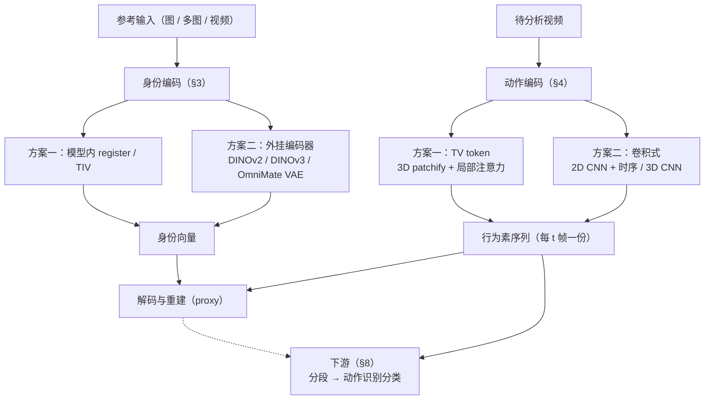
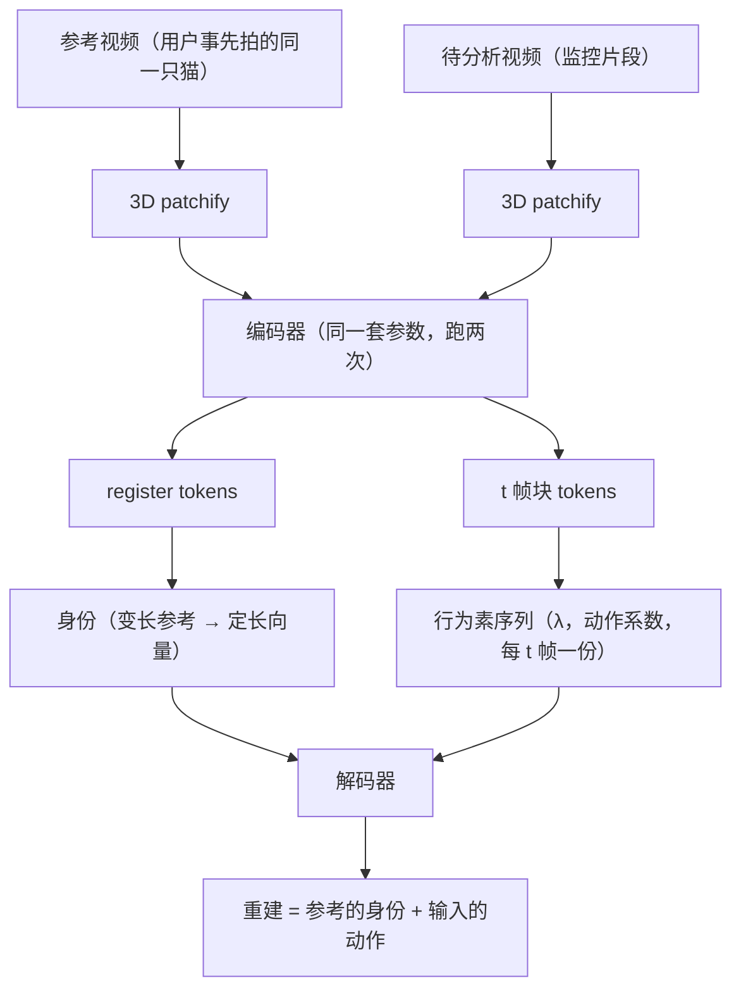
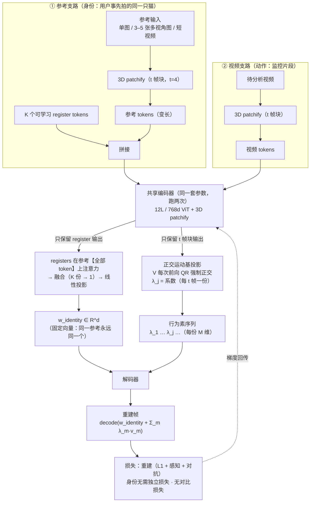
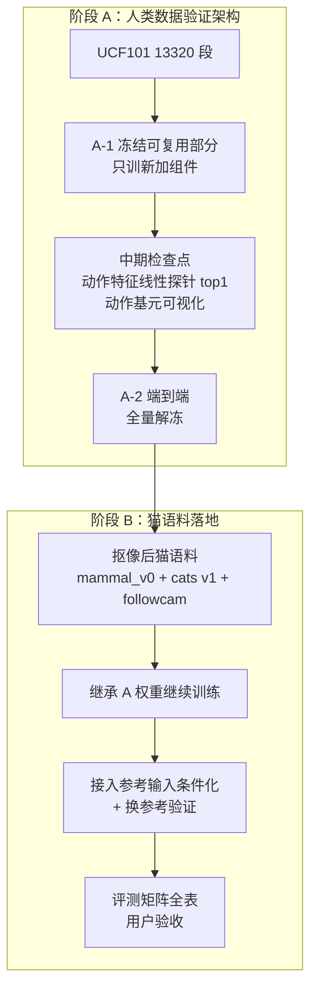

# 动作识别模型设计

> **方案**：主线为**身份-动作解耦**——身份由**参考输入**经 register 融合得到（`w_identity`，固定向量，「这是哪只猫」）；动作由**正交运动基投影**得到（**行为素序列**，每 t 帧一份，「这段时间在动什么」）；解码器把两者相加还原帧，就说明分解成立。本文介绍该思路（下文简称「身份-动作 Tokenizer」）及其完整设计。
>
> **架构主源 = FLOAT**（重心转向，详见 changelog）。
>
> **定位**：本项目 L4「动作表征」环节的模型设计底稿。上层架构见 [《系统架构》](./architecture.md)，工程实施见 `openspec/changes/identity-action-tokenizer/`。

> **一句话**：**参考输入**（用户拍的猫图/短视频）→ 身份向量（「这是哪只猫」）；**待分析视频** → 正交基系数（**行为素序列**，「这段时间在动什么」）；解码器把两者相加还原帧，说明分解成立。重建只是 proxy——真正的交付在 §8：行为素序列 → 动作段 → 类别。
>
> **架构主源 = FLOAT**（重心转向，详见 changelog）。**身份侧两个方案并行**（§3），**动作侧两个方案并行**（§4），两处都要对比测试。
>
> **定位**：本项目动作表征与识别环节的模型设计底稿。上层架构见 [《系统架构》](./architecture.md)，工程实施见 `openspec/changes/identity-action-tokenizer/`。

## §1 框架总图

### §1.1 完整结构图



| 图里的块 | 看哪章 |
|---|---|
| 身份两方案（TIV / 外挂编码器）| §3 身份编码 |
| 动作两方案（TV token / 卷积式）| §4 动作编码 |
| 正交约束 → 行为素序列 | §4.3e |
| 解码与重建（proxy）| §5 解码与重建 |
| 训练 / 评测 | §6 / §7 |
| 分段 → 动作识别分类 | §8 下游 |

**数据流说明**：身份来自**参考输入**（固定向量），运动来自**待分析视频**（行为素序列，每 t 帧一份）；**无量化层**——连续潜变量直入解码器。第 t 帧由 `身份 + Σλ_m(t)·v_m` 重建（FLOAT 的加法广播）。**重建只是 proxy**，交付物是下游的动作段 + 类别。

> 符号对照见本文件附录「符号速查」（`w_identity` = 身份向量、`λ_j` = 动作系数、`V` = 正交运动基）。

### §1.2 设计目标与非目标


**目标**

1. **可分解**：身份与动作在表征层面分开——身份可单独用于 Re-ID，动作可单独用于行为识别
2. **可重建**：`decode(w_identity + Σλ_m·v_m) → 原视频`，重建可行即分解自洽（这是分解正确性的判据）
3. **动作可解释**：动作 latent 展开为正交基元系数 `λ_m(t)`，每条曲线对应一种基础运动
4. **数据效率**：先在规模大两个数量级的人类数据集验证，再迁移到小规模猫语料

**非目标**

- 不做视频生成产品（解码器只在训练期存在，用于提供监督信号）
- 不做实时推理（那是 L8 应用出口的职责）
- 不追求像素级完美重建（判据是"分解成立"，不是画质）

## §2 当前待决策


> **模型层的待决策项已并入全局唯一登记表** → [《系统架构》§2 当前待决策](./architecture.md)。
>
| C-ID | 状态 | 决策项 | 模型层补注 |
|---|---|---|---|
### 模型级待决策（本表为唯一权威）

> 《系统架构》 §2 不再列模型内部条目（用户裁定）；跨环节条目（夜间红外 / 一个视频多个动作等）见 《系统架构》 §2；本章内容权威。

> **身份侧两个方案并行实现与对比**（消融，非二选一）——**方案一 共享对称编码器**（register 融合）/ **方案二 外挂编码器**（DINOv2 / DINOv3 或 OmniMate 式 VAE）。下表「参考聚合方式」「是否共享权重」「register token 数量」是**方案一内部**的开口项。

**🔴 待审定（2 项，不定就开不了工）**

| 待决策项 | 说明 |
|---|---|
| 多张参考图或参考视频如何聚合成一个身份向量 | 平均池化 / 注意力加权 / 逐图残差再聚合（**方案一内部**；方案二由外挂模型直接出向量）|
| 个体特有的动作风格归谁 | 「这只猫喝水总是慢」放身份码、`λ`、还是明确忽略（Slot-ID 引出）|

**🟡 待定（9 项，不阻塞开工）**

| 待决策项 | 说明 |
|---|---|
| 视频编码器代码骨架 | AdapTok / VidTok / LARP（⚠️ 只借实现、不借结构）|
| 编码器初始化 | 预训练权重起步还是从零训练（决定分阶段冻结训练是否可行）|
| patch 尺寸 `t×p×p` | 时间跨度 t 与空间大小 p（当前 4×8×8；`λ` 粒度由此决定，消融 t∈{2,4,8}）|
| 输入规格 | 分辨率与窗口帧数 |
| 正交基元数 M / 维度 d / 符号 | 方向数 / 每维宽度 / 非负约束 |
| 训练粒度 | 分阶段训练时冻结哪些模块（依赖「编码器初始化」）|
| 参考编码器与视频编码器是否共享权重 | **方案一内部**：共享（当前主线）或分开（方案二不涉及）|
| register token 数量 K | **方案一内部**：身份 register 用几个 token（方案二不涉及）|
| 参考身份通路 | 三方案消融（A0 对照组 / A1 主线 / A2 VAE latent）|

> **已决 / 不适用**：**proxy = 外观重建**（重建质量不是目标，只需足以把外观逼出 λ）· **解码器参考特征路径（warp / `feats`）不采用**（输入是视频/多图，无单一源图可 warp；λ 不含身份的保证降为「容量闸门 + 审计」）· 自适应 token 预算（v1 暂不适用）· `λ` 的时间粒度与时序上下文（并入「patch 尺寸」推论）· 对齐教师 DeRA（v1 不做）· **参考输入形态（已决：参考视频）** · **推理形态（已裁定：分段流式 + 判别非流式，见 《系统架构》实时形态一节）**。（「身份 embedding 模型」「向量库」为检索相关，见 《系统架构》 §2）

> **v1 窗口假设与段形态（已裁定）**：**动作段不定长**；v1 的定长 16 帧窗口只是**模型内部输入机制**（便于与 UCF101 阶段 A 对齐，滑窗铺满后由分段/合并给出不定长段）。但真实监控里「一个窗口 = 一个标签」不成立——一个视频常含多个动作，时长跨度达 3 个数量级（打哈欠 ~1 s ↔ 睡觉 ~30 min）。
>
> **有利条件**：`λ_m(t)` 本身就是**逐帧**的 → 天然支持「逐帧标签 → 后处理成段」，不受「窗口 = 一个动作」限制；缺的是**时序后处理层**（中值滤波 / Viterbi / 最小段长约束）与**多时间尺度**（短窗+长窗分层）。
>
> **动作识别模型的能力分层（A0–A5）** 见 [《系统架构》 §8⑤ 能力分层](./architecture.md)——主流模型停在 A1（定长片段 → 1 个标签，无时间戳）；要给时间戳/多段需 A3/A4，而我们需要 A4 级输出但只有弱标注。

## §3 身份编码

> 身份向量从哪来——**两个方案**，本章并列叙述并对照。

### §3.1 方案一：模型内 register / TIV


**身份不从待分析视频里推断**，而由**用户事先拍摄的参考输入**提供：

```
参考输入（单图 / 3–5 张多视角图 / 短视频）→ 身份编码器 → w_identity（固定向量）
待分析视频 → 动作通道 → 行为素序列（λ，每 t 帧一份）
重建 = decode(w_identity, λ 序列) → 该视频的帧
```

| 项 | 设计 |
|---|---|
| 参考形态 | 单张全身图 / **3–5 张多视角图（推荐）** / 一段短视频 |
| 身份 latent | **固定常量**——同一参考永远出同一向量，跨片段不变 |
| 完整性保障 | **容量闸门**（§4.3e）+ 重建；不需要对比损失 |
| 监督 | **无需独立损失**；训练只需“片段→参考”的**配属（分区）** |
| 单猫语料 | 只需**一份参考**，**零额外标注** |
| 交换验证 | **免费**：`decode(参考B, A 的 λ)` → “B 做 A 的动作” |

**读出机制：对称架构 + register tokens（跨全部参考 token 联合融合）**

> **修订（用户提议）**：参考与输入视频**共用同一套结构与参数**（FLOAT 即如此），差别只在**取哪部分输出**——参考侧取 register（身份），输入侧取 t 帧块系数（动作）。完整版见下文「对称架构与隔离约束」。
>
> ⚠️ **隔离约束（关键）**：`register` 可 attend patch，但 **patch/t 帧块 【不能】attend register**——否则身份信息会顺着注意力流进 λ（TivTok SIF 的 TV 会 attend TIV，我们的审计不允许）。两组输出**互不看**。

```
参考输入（单图/多图/视频）→ patchify
   ↓ 拼接可学习 register tokens
[register tokens ⊕ 全部输入 tokens] → 编码器 → 只保留 register tokens
   ↓ 融合后投影
w_identity ∈ R^d（单向量）→ 加法分解照旧
```

| 参考形态 | 处理 |
|---|---|
| 单张图 | registers 在该图全部 patch 上注意力 → 聚焦身份区域、忽略背景/姿态 |
| 3–5 张多视角图 | registers 在**所有图全部 token** 上注意力 → **联合融合** |
| 一段参考视频 | 同上（跨全部帧）|

**为什么不用"逐图编码后平均"**（用户裁定）：

```
平均：     w = (1/N) Σ E(x_i)         ← 各图独立编码，图与图【无交互】
register： reg attend 所有图的全部 token ← 跨视角关系推理
```

平均是"背包式"聚合，**无法**：判断两视角里的斑块是同一块花纹 / 用另一视角补全遮挡 / **忽略**背景只挑身份区域（池化把空间信息平均掉）。
→ 要满足"**身份变量完整得出所有身份相关信息**"，register 是正确工具，**平均弱一档**。

**形状两全**：register 负责融合，融合完**投影成单个 d 维**，加法分解保持 FLOAT 式简单（d=512 对猫外观充足——瓶颈在"能看多少视角"）。

> ⚠️ **必须独立前向**：身份编码器只吃参考、运动编码器只吃视频；否则"身份不接触视频"的硬保证失效。
> ⚠️ **参考为视频时的运动污染**：registers 可能吸收参考里的运动 → 训练时**参考与驱动必须来自同一只猫的不同片段**（同一片段会掩盖泄漏）。

**为什么比“从视频推断”更好**：

| 维度 | 参考输入 | 从视频推断 |
|---|---|---|
| 身份是给定还是推断 | **给定** | 推断 |
| 完整性 | 容量不对称**强制成立** | ❌ 无保障（外观可藏进 TV）|
| 身份 latent 确定性 | **固定** | 随片段浮动 |
| 监督需求 | 配属（分区） | 个体级正负样本对（**我们没有**）|

**监督从何而来（为什么不需要额外的身份损失）**：

身份监督的**唯一来源是重建**，不需要任何额外的判别式目标：

```
同片段内 S→D 重建（参考 S 与驱动 D 来自同一视频）
  → 解码器要能重建出"这只猫"，身份 latent 就必须装下全部身份信息
  → 装不下 → 重建失败 → 损失直接惩罚
```

**为什么判别式目标（对比损失）不适合这里**：
- 它只保证**分得开**，不保证**装得下**——极端反例：2 维嵌入即可完美区分 2 只猫，但那 2 维几乎不含身份信息
- 而我们要的是**完整**身份信息 → 只有重建能保证
- 参考事例：FLOAT 的身份监督完全由重建承担，身份保真度用外部嵌入的余弦相似度（CSIM）**评测**而非训练

> 对比损失为何不适用见 `papers/docs/tokenizer-architecture-refs.md`。

**降级路径**（用户不愿提供参考时）：从该猫任一清晰片段取一帧当参考——**同一机制，仅参考来源不同**。


一句话：**参考视频和待分析视频走同一个模型，差别只在取哪个输出口**——参考取 register（身份），输入取 t 帧块系数（动作）。



**完整结构图**（含 patchify、register 拼接、正交基投影、解码与损失）：



**隔离约束**（两组输出互不看，防身份泄进动作）：


**本图暴露的开口项**（均在 《动作识别模型设计》末表登记）：

| 开口项 | 说明 |
|---|---|
| 参考聚合方式 | registers 融合后再投影；平均 / 注意力 / 逐图残差聚合待选（🔴，**方案一内部**）|
| register 数量 K | K 大→信息全但冗余，K 小→瓶颈（🟡）|
| 是否共享权重 | **方案一内部**：共享（当前主线，两组 register：身份组 / 运动组）或分开；方案二不涉及（🟡）|
| **单图参考怎么走 3D patchify** | t 帧块需 4 帧——单图是**重复帧凑 t** 还是**单独 t=1 分支**（实现细节，待定）|

**为什么两路共用一套参数**：FLOAT 本来就是对称的——`net_app`（外观编码）与 `fc`（运动头）**同一套参数**分别作用于 source 与 target（`float/models/float/encoder.py`），两个输入都算出「身份 + 运动系数」。我们把它推广为：**参考也输入一段视频**（而非单张图）。

```
参考视频 → patchify ─┐
                     ├→ [编码器（同一套参数）] → registers     → 身份_ref
输入视频 → patchify ─┘                        → t 帧特征 → λ（逐位置）
重建：decode(身份_ref + Σ_m λ_m·v_m)
```

**两个输入都走同一套分解**，**差别只在我们取哪部分输出**。

#### 隔离约束：两组输出**互不看**（关键）

TivTok 的 SIF 里 `TV tokens` 的 scope **包含 TIV tokens**——即**身份 tokens 参与动作 tokens 的注意力**。**在我们这里这是一个泄漏通道**：身份信息会顺着注意力流进 λ，而我们的审计要求「λ 上训个体分类器应接近随机」。

**因此本设计必须与 SIF 不同**：

```
register tokens       → 可以 attend patch tokens（这是它聚合信息的方式）
patch / t 帧块 tokens → 【不能】attend register tokens     ← 关键约束
两者互不看
```

→ 隔离后，**动作侧 = 纯视频编码（t 帧块）→ 正交基投影 → λ**，与 FLOAT 的动作侧在**分解结构**上一致。

**与 FLOAT 的差异（必须说清）**：

| | FLOAT 动作侧 | 我们 |
|---|---|---|
| 编码器 | **conv encoder（图像，逐帧）** → 全局特征 | **视频编码器（3D t 帧块）** |
| 运动系数 | `α = MLP(全局特征)`，**只看一帧** | `λ` 从**逐 t 帧块** 特征投影 |
| 时序上下文 | **无**（靠 flow-matching transformer 在序列上补）| **t 帧块自带时序上下文** |

→ ✅ 一致的是**分解结构**（`w = 身份 + Σλ_m·v_m`、正交基、残差式）与**输入流分离**；❌ **不能一样的是动作编码器**（FLOAT 逐帧无时序，我们已定 t 帧块）。

#### 它顺手解决的三件事

| # | 解决什么 |
|---|---|
| 1 | **参考输入形态已决（= 参考视频），「参考运动污染」顾虑消失**——参考视频**也走同一套分解**，其自身运动被分到 `λ_ref`，**不进 `身份_ref`**；无新增泄漏面 |
| 2 | **变长参考 → 定长身份**——`身份_ref` 由 **register tokens** 联合融合得到（这是 register 的职责；与「逐图编码后平均」不同，register 能做跨视角关系推理）|
| 3 | **补上身份监督缺口**——参考与输入**是同一只猫** ⇒ `身份_ref ≈ 身份_in` 是**无标注、无负样本**的一致性信号（不同于对比学习：不需要「哪只猫」标签，也不需要负样本对）|

### §3.2 方案二：外挂预训练编码器

身份不由本模型提取，而由**外部预训练编码器**产出：

```
参考输入（图 / 多图 / 视频） → 外挂编码器 → w_identity
  候选：DINOv2 / DINOv3（语义强、成熟）· OmniMate 式 VAE（多图编码）
```

| 项 | 内容 |
|---|---|
| 身份给定 / 推断 | **给定**（来自参考输入，不从待分析视频推断）|
| 与「参考输入」裁定关系 | **天然契合** |
| 参数量 | 动作侧一套 + 身份侧一套（身份侧可冻结不训）|
| 解耦保证 | 正交约束 + 容量闸门 + 审计（**失去**「参考也走同一分解」的天然免疫）|
| 开口项 | ① 外挂编码器**冻结**还是可微调 ② 身份向量**如何进入解码器**（concat / AdaIN / cross-attention）|
| 专属风险 | DINOv2 / VAE 是**语义**特征，可能不带像素级细节（花纹 / 毛色边缘）；身份条件太弱时解码器会反过来依赖动作系数提供外观 → **泄漏压力上升** |

### §3.3 两方案对照

| | 方案一：模型内 register / TIV | 方案二：外挂预训练编码器 |
|---|---|---|
| 身份来源 | 模型内聚合（同一套编码器）| 外部模型 |
| 身份给定 / 推断 | 取决于参考是否走同一编码器 | **给定** |
| 参数量与成本 | 一套参数（训练耦合）| 两套（身份侧可不训）|
| 解耦保证 | 同一分解循环 + 容量闸门 + 正交约束 + 审计 | 正交约束 + 容量闸门 + 审计 |
| 专属风险 | 换基座要重训整条链路 | 语义特征缺细节 → 泄漏压力上升 |

**共有问题**（两方案都要面对）

- **参考输入形态**：单图 / 3–5 张多视角图 / 短视频
- **多图与视频如何聚合**：平均池化 / 注意力加权 / 逐图残差再聚合
- **是否需要独立的身份损失**：当前设计不需要（身份监督由重建承担）

**组合约束**：**TIV token 与卷积式动作编码不能共存**——TIV/register 是 attention 载体上的概念，卷积式没有 token 可供它注意；反之卷积式动作编码必须搭配**外挂身份**（方案二）。可行组合只有三组（§6.4）。

> 完整论证与开口项清单见 `openspec/changes/identity-action-tokenizer/` design T-A5d。

## §4 动作编码

> 行为素序列怎么算出来——**两个方案**，本章并列叙述并对照。

**前置：背景移除（上游环节）**


**为什么必须做**：followcam 的相机随猫移动 → 背景持续变化。重建式架构隐含假设"背景稳定"，我们的场景不成立——若不剥离背景，**动作通道会把相机运动与场景变化当作动作学进去**。

**设计**：上游 change `pet-background-removal` 负责，输出"猫本体 + 白背景"视频。空间上下文（在床上/地上）由 L1 空间关系状态层承担，因此抠像不丢信息。

### §4.1 方案一：TV token


> ⚠️ **AdapTok 只能借代码、不能借结构**：可复用 **3D patchify 实现 / transformer block / 训练循环 / 数据管线 / 12L·768d 规模 / 训练配方**；**不能复用** **block-causal 掩码**（为自回归设计，我们离线能看整段 → 白白限制）、**SVQ 量化器**（已弃）、**1D 全局 latent 读出**（我们要逐 t 帧块）、**block-mask 预算**（已弃）、**解码器量化输入接口**（我们喂连续 latent）。详见 《系统架构》 §2 已决项（λ 粒度与时序上下文，已并入「patch 尺寸」推论）。

**决策**：视频编码器采用 **3D patchify**——把 **t 帧拼成三维张量 `t×H×W`，再在整个时空体上切块**（patch = `t×p×p`），而不是逐帧单独切二维块。

```
逐帧 2D patch（❌）              3D patchify / t 帧块（✅）
帧1 → 块… 帧2 → 块… 帧3 → 块…     t 帧合成 3D 体 → 在时空体上滑窗
每个块只看一帧                    每个块跨 t 帧同一空间位置
```

**为什么明显更好**：

| # | 理由 |
|---|---|
| 1 | **运动直接进 patch**——一个 t 帧块覆盖 t 帧的同一空间位置，时间维上的变化被编码进 patch 本身；2D 逐帧切块则帧间关系只能靠 attention 层事后建立 |
| 2 | **降低 token 数**——时间维下采样 t 倍（t=4 时 token 数降至 1/4）→ attention 成本大幅下降 |
| 3 | **顺带回答 Q2**（`λ_j` 的时序上下文从哪来）——**patch 层面就有时序**，不必依赖"逐帧 local scope"之类的特殊设计 |
| 4 | **与视频 transformer 主流一致**——ViViT / TimeSformer / VideoMAE 均用 t 帧块切分 |
| 5 | **补上了 FLOAT/LIA 的缺口**——它们是**图像**自编码器（逐帧、无时序建模）；迁到视频域必须补这一环 |

**参数**（照 AdapTok 口径）：patch `t=4 × p=8 × p=8`

| 项 | 取值 | 来源 |
|---|---|---|
| 规模 | 12 层 / 768 维 / 12 头 | AdapTok `cfgs/adaptok.yaml` |
| 许可 | MIT | 可自由改造 |
| 资产 | 代码 + 预训练权重 + 训练脚本 | 可直接跑 |
| 训练配方 | L1 + LPIPS + GAN（transformer 判别器 w=0.3）+ LeCAM 0.001 | 同上 |

**AdapTok 与本设计的粒度差异（两层，都已定）**：

```
AdapTok 的 latent   = 1D 全局 token（整段给一组 L 个）
我们的 λ            = 逐 t 帧块（每 t 帧一份）
                       t=4 时，16 帧片段 → 4 个 λ
```


| # | 可借鉴 | 用途 |
|---|---|---|
| 1 | **3D patchify（t 帧块）** | 见上（本节）|
| 2 | 12L/768d/12heads 规模与超参 | 与主源口径对齐 |
| 3 | 训练配方（L1 + LPIPS + GAN + LeCAM） | 重建质量基线 |
| 4 | **block-causal attention** | ❌ 不再需要：推理形态已定——判别非流式、无需因果内核；分段模型的流式需求在 `video-action-segmentation` 另议 |
| 5 | 可跑基座（代码+权重+脚本） | 降低工程风险 |
| ❌ 不借鉴 | attention mask 框架（`tiv_tv` 等）| SIF 已移除（但 mask 通路本身若走流式仍可能复用，见第 4 条）|

### §4.2 方案二：卷积式

不用 token / 注意力，直接用卷积提动作特征：

| 形态 | 时序怎么来 | 可借的预训练 |
|---|---|---|
| **2D CNN 逐帧 + 时序模块**（LIA / FLOAT 式）| 时序模块（temporal conv / factorized attention）| 2D 骨干：DINOv2 / ConvNeXt |
| **3D CNN**（t 帧聚合成块）| 卷积核在时间维滑动 | I3D / SlowFast / X3D |

```
视频 → [2D 卷积逐帧 + 时序模块] 或 [3D 卷积在 t 帧块上滑动] → 动作特征 → 正交约束 → 行为素
```

- **不需要 patchify**——没有 token，正交约束只能作用在**投影后的系数**上（§4.3e）
- **LIA / FLOAT 的编码器就是 2D 卷积网络**（逐帧），动作系数由卷积特征经头算出
- 开口项：2D + 时序模块的时序模块选型待定；3D CNN 的时序粒度粗于注意力
- 与方案二身份（外挂 DINOv2）**契合度高**：身份与动作骨干同属 2D 家族

### §4.3 两方案对照与共用问题

| | 方案一：TV token（3D patchify + 局部注意力）| 方案二：卷积式（2D CNN+时序 / 3D CNN）|
|---|---|---|
| 时序信息来源 | patch 本身跨 t 帧 + 局部注意力 | 时序模块（2D）或 3D 卷积核 |
| 需要 patchify | **需要** | **不需要** |
| 骨干来源 | AdapTok / VidTok / LARP | 2D 骨干 或 3D CNN |
| 正交约束作用对象 | 可作用在 **token** 上 | 只能作用在**投影系数**上 |
| 与身份方案二契合度 | 一般 | **高**（2D 家族统一）|
| 组合约束 | 可与两个身份方案组合 | **只能配外挂身份**（TIV 不共存）|

**共用问题**（两方案都要定）

### §4.3a 聚合粒度：为什么每 t 帧一份


**`λ` 是什么**：视频编码器对每个时间位置输出一个**动作特征** `z`；把 `z` 投影到 **M 个互相垂直的运动方向** `V = {v_m}` 上，得到的**坐标**就是**动作系数** `λ = (λ_1…λ_M)`——它描述「这一小段时间里，各个基础运动方向各占多强」。方向正交 ⇒ 坐标可读、可单独解释。

**时间粒度**：`λ` 不是一帧一份，而是**每 t 帧聚合一份**（t = t 帧块 时间跨度，默认 4 → 16 帧窗口得 4 份）。

**为什么聚合 t 帧、而不是每帧提取一个**——两个理由：

1. **省计算**：时间维 token 从 `T` 降到 `T/t`（16 → 4）。注意力对 token 数是**平方**复杂度，这一刀省的是大头。
2. **动作要体现「动」的过程**：单帧只是一张静止快照，谈不上「动作」——猫悬空的一帧，可能来自跳跃也可能来自坠落；只有把 t 帧连起来看，才表达得出「正在怎么动」（速度 / 方向 / 轨迹）。
   - 对照：FLOAT 的「运动系数」（**论文写 `λ`、代码变量叫 `alpha`**，同一东西）能单帧算，是因为它定义的「动作」是**相对参考的姿态偏离**——姿态是**状态量**，单帧可算；我们要的是**运动**（过程量），必须多帧。

**聚合粒度与 3D patchify 是同一个决定**：选 3D patchify，就是为了让模型以 t 帧（t = t 帧块 时间跨度）为单位处理时间——t 帧块覆盖 t 帧 → 编码器每个时间位置输出一份，`T/t` 份动作系数（T = 窗口总帧数）。不是「架构碰巧对齐」，而是先有聚合需求，才选这个架构。

**为什么 t 帧块 粒度够用**：动作基元曲线够密（0.27 s/点 @15fps）· 段边界 ±1.5 s 要求远宽于该粒度 · 行为聚类本就不需帧级 · 时间维 token 降至 1/t

### §4.3c 变长输入与输出


#### 变长视频：输入侧怎么被处理
> ④ 的输入是**变长视频**；本节讲输入侧怎么处理。输出能力分类（A0–A5）见 [《系统架构》§8⑤ 能力分层](./architecture.md)。

##### 三层拆解 + 采样器实证（+ 可配置 ≠ 可变）

**拆三层**（混着问就说不清）：

| 层 | 问题 | 答案 |
|---|---|---|
| (a) **能不能吃进去** | 接受任意长度输入？| ✅ **都能**——靠采样压成定长张量 |
| (b) **输出是否随长度变** | 更长视频 → 更多结果？| ❌ **都不能**——恒为 1 个标签 |
| (c) **是否理解「时长」差异** | 打哈欠 1 s vs 睡觉 30 min？| 🟡 **取决于采样器** |

**关键：本仓用的两种采样器语义完全不同**（源码实证）：

| 采样器 | 语义 | 本仓谁在用 | 遇 30 s 视频 | 遇 1 s 视频 |
|---|---|---|---|---|
| **`SampleFrames(clip_len, frame_interval)`** | **固定跨度** `ori_clip_len = clip_len × frame_interval`；长视频**随机（训练）/居中（测试）取一段** | VideoMAE / VideoMAEv2 / AIM / VideoMAE-base（`16, 4`，**8 处**）| ⚠️ **只看到其中 2.1 s**，其余完全没进模型 | `np.mod` **循环重复采样**补足 |
| **`UniformSampleFrames(clip_len)`** | 源码描述：*"divide the video into n segments of equal length and randomly sample one frame from each segment"* → **铺满整段** | PoseC3D（`48`）| 铺满 30 s，但每点间隔 **0.6 s** → **快动作丢失** | 铺满 1 s（大量重复）|
| `SampleFrames(1, 1, num_clips=3)` | 取 3 帧 | TSN | 只看到 3 帧 | 取 3 帧 |

代码级证据（`mmaction2/.../loading.py`）：
```python
ori_clip_len = clip_len * frame_interval      # 时间跨度
frame_inds = np.mod(frame_inds, total_frames) # 越界即循环重复
```

**由此得到那个根本矛盾（段已裁定为不定长，此矛盾仅存在于**模型输入窗口的尺度选择**）**：
```
窗口覆盖长 → 时间分辨率低（快动作丢失）
窗口覆盖短 → 长动作看不全
→ 单一时间尺度无法两头兼顾
```

**「输入长度可配置」≠「处理变长」**

「模型输入长度是超参、想设多少设多少，那不就是能吃变长视频吗？」——**对一半**。对**任何**输入为定长张量的视频模型都成立：

```
输入长度【可配置】（窗口大小是超参，改配置即可）  ✅
    ≠ 输入长度【可变】（一次前向吃任意长）         ❌
    ≠ 输出长度随输入变化（多段 + 时间戳）          ❌
```

**为什么「可配置」对换输入长度友好（通用原因）**：只要位置编码是**按网格算出来的**（sin-cos 等）而非**学出来的**，换窗口大小就不必重训位置编码；主干权重本身也不含时间维。
**举例（VideoMAE）**：

```python
# models/mmaction2/mmaction/models/backbones/vit_mae.py
use_learnable_pos_emb: bool = False     # 本仓 config 未设 → 默认 False
num_patches = (img_size // patch_size) ** 2 * (num_frames // t 帧块_size)
pos_embed = get_sinusoid_encoding(num_patches, embed_dims)   # 按 grid【算】出来
self.register_buffer('pos_embed', pos_embed)                 # 不是学出来的
```

→ **sin-cos 位置编码是算出来的、不是学出来的** ⇒ 换 T 时**位置编码不必重训**（按新 grid 重算即可）。
论文佐证（VideoMAE 原文）：「Our VideoMAE can easily scale up with more powerful backbones (e.g. ViT-Large and ViT-Huge) and more frames (e.g. 32).」

**但换窗口大小仍不是免费的**（同样通用）：

| 步骤 | 代价 |
|---|---|
| ① 重建模型（改窗口帧数）| ✅ 免费（位置编码按新网格重算）|
| ② 迁移主干权重 | ✅ 免费（权重不含时间维）|
| ③ **重新微调** | ⚠️ **不免费**——分类头与所有层均在原窗口大小下训得；实践中换窗口通常需重新微调 |

（若位置编码是学出来的，还须**插值**，更麻烦。）

**⭐ 对本项目的推论**：**多时间尺度变便宜了**——同一套权重换窗口大小只差一次微调 ⇒ **「动作长度」的多时间尺度可用「同一骨干的不同窗口变体」实现，不必两套架构**。

**本仓 checkpoint 仍固定看 `num_frames=16` 个采样帧（跨度 64 帧）**，长视频其余部分**从未进入模型**，要出多个结果仍须**在外面滑窗**。

##### 我们的 `λ` 能处理变长吗 —— 能，且输出天然变长

```
长视频 → 滑窗（16 帧/窗）→ 每窗出行为素 → 行为素序列（λ，长度 ∝ 输入长度）
```

| | 主流识别模型 | 我们的 `λ` |
|---|---|---|
| 输入变长 | ✅ 采样压平 | ✅ 滑窗 |
| **输出** | ❌ 定长（1 标签）| ✅ **变长**（行为素序列）|
| 时间分辨率 | 被采样固定死 | 由滑窗 stride 决定（**可调**）|
| 长动作（30 min）| 压成 N 点 → 丢细节 | 切成多窗 → **每窗都有 λ** |
| 短动作（1 s）| 可能被采样漏掉 | 落在某窗内即可捕获 |
| **多时间尺度** | 要改架构 / 多模型 | **天然**（换窗口大小即得另一组 λ）|

**3 个限制（必须承认）**：
1. **单窗口内仍是定长（16 帧）** → 超过 16 帧的动作只看局部 → 段边界的「完整时序理解」受限
2. **跨窗口独立**：相邻窗口 λ 独立算（除非重叠）→ 需后处理平滑（=「一个视频多个动作」的滑窗合并选项）
3. 若要「**模型内部**处理任意长序列」→ 需因果/流式或长窗注意力 → 分段组件需流式（见《系统架构》§3 系统级形态）；窗口跨度属输入尺度选择（段形态已裁定不定长）

> **一句话**：我们**不比主流强在「窗口内理解更长的动作」**（那要靠多时间尺度），但**强在「输出天然是变长的」**——而这恰是多动作 / 时间戳的前提。

### §4.3d 编码器选型与初始化

| 待定项 | 候选 |
|---|---|
| 代码骨架 | AdapTok（MIT，12L/768d，patch 4×8×8）/ VidTok（MIT）/ LARP（MIT）——⚠️ 只借实现、不借结构 |
| 初始化 | 预训练权重起步 还是 从零训练（决定分阶段冻结训练是否可行）|
| patch 尺寸 `t×p×p` | 当前 4×8×8；`t` 决定行为素粒度，消融 t∈{2,4,8} |
| 输入规格 | 分辨率与窗口帧数 |

> ⚠️ **AdapTok 只能借代码、不能借结构**：可复用 3D patchify 实现 / transformer block / 训练循环 / 数据管线 / 规模超参 / 训练配方；不能复用其 block-causal 掩码（为自回归设计）、SVQ 量化器、1D 全局 latent 读出、自适应预算。

### §4.3e 正交约束与行为素


**数学形式**

```
z_t = w_identity + Σ_{m=1}^{M} λ_m(t) · v_m
                     └──────────┬──────────┘
                          正交运动基分量
V = {v_1 … v_M}：可学习基矩阵的 QR 分解结果 → 列向量两两正交
λ_m(t)：第 t 帧在第 m 个运动方向上的强度
```

**实现**（与 LIA/FLOAT 代码一致）

```python
self.weight = nn.Parameter(torch.randn(d, M))      # 可学习基矩阵
Q, _ = torch.linalg.qr(self.weight)                # 每次前向正交化
z = Q @ lambda_                                    # 正交基线性组合
```

**关于“论文说 Gram-Schmidt、代码用 QR”**：Gram-Schmidt 正是计算 QR 分解的算法，二者是同一数学对象；代码用 LAPACK 的 Householder QR（数值更稳）。因为 λ 由网络学习，Q 的列符号差异会被训练吸收。**唯一注意点**：若要冻结基作固定组件，须显式固定符号，否则 λ 语义漂移。

**正交的层级（常见混淆，必须分清）**：

```
基 V = {v_1 … v_M}   ← 正交性属于【坐标系】（M 个方向两两正交，QR 保证）
token z_t           ← 是正交空间里的一个【点】，本身无所谓正交不正交
坐标 λ_t             ← 用这把尺子量出的【读数】；正交归一基下 λ_m = <z_t, v_m>
```

| 关系 | 是否正交约束 | 说明 |
|---|---|---|
| 运动基元之间 | ✅ QR 硬约束 | M 个方向互相独立 → 单独编辑 λ_m 不串扰其他基元 |
| 不同帧的 token 之间 | ❌ 不需要 | 帧间本就应该变化 |
| 身份 vs 动作 | ❌ 不靠正交 | 靠**输入流分离**（身份来自参考、运动来自视频）+ 换参考验证 |
| SoftVQ 码字之间 | ❌ **数学上不可能** | R^d 中最多 d 个互相正交的非零向量；码本 8192 个 32 维向量远超维度 |

**维度限制的推论**：正交只能约束“少数方向”（M ≤ d，实际 M=20~32），**不能约束海量码字**。这就是为什么正交应该放在基上、而不应该放在码本上——也是我们不需要码本的又一个理由。

**⚠️ 首要作用是「容量闸门」，不是可解释性**：

FLOAT 的身份**完整性**靠的是容量不对称：运动被限制在 M=20 维正交子空间 → 其余 ~492 维**只能装外观** → 解码器要能重建这只人，身份 latent 就必须完整。

```
我们的 TV 若不受限（每帧 2×768 维）
  → 外观可以藏进 TV
  → 重建「不再要求」身份完整
  → 「身份变量装下所有身份信息」这个目标就不会自动成立
```

所以 `z_t = Σ λ_m·v_m` 是**机制必需**（不是可选项）；λ 曲线可读只是**副产品**。

**为什么值得做**（不只是为了解耦）：`λ_m(t)` 是**可读的动作基元强度时间序列**——行为发现可以直接对 λ 向量聚类、把每条基元曲线可视化，行为可解释性显著优于纯黑盒 latent。

**移植风险**（必须自备监督）：LIA/FLOAT 的分解之所以成立，是因为其解码器用**光流 warp** 重建驱动帧。我们禁用 warp，因此**没有任何现成监督在驱赶基指向"运动"** → 必须自备解耦目标（见 §5.1 解码器与损失）。

## §5 解码与重建

> 身份与动作在此汇合——重建是 proxy，用来逼出解耦。

### §5.1 解码器与损失


```
身份：参考输入（单图 / 3–5 张多视角图 / 短视频）→ E_id → w_identity ∈ R^d
                                                      ※ 固定向量，跨片段不变
运动：待分析视频（16 帧）→ E_mot（**整段提特征**，3D t 帧块 t=4）
                         → 逐 t 帧特征 → 正交基投影 → λ_j ∈ R^M（每 t 帧一份）
重建：decode(w_identity + Σ_m λ_m(t)·v_m) → 第 t 帧
```

**与 FLOAT 的逐项对应**（Eq. 8-9 + A.3）：

| FLOAT | 我们 |
|---|---|
| `w_S = w_{S→r} + w_{r→S}` | `w_identity + Σ λ_m·v_m` |
| `w_{S→r}` 来自源图像 S | `w_identity` 来自参考输入 |
| `w_{r→S} = Σ λ_m(S)·v_m` | 逐 t 帧块 `λ_j`（每 t 帧一份）|
| 生成时 "add the source identity latent" | 解码器输入 `w_identity + Σλ_m·v_m` |
| 训练：同片段内 S→D 重建 | 同左（**UCF101 上可自动构造参考，无需人工标注**）|

**三个关键性质**：
1. 运动被压在 **M 维**正交子空间（容量闸门）→ 外观无处可藏 → **身份必须完整**（§4.3e）
2. 身份是**固定常量** → 同一只猫所有片段共享同一身份条件
3. 视频编码器**看整段** → `λ_j` 自带时序上下文（**不需要** SIF 那种「本帧局部 scope」）；粒度 = t 帧块

> 备档见 `papers/docs/tivtok-reference.md`（wiki 外，见仓库）。


**解码器**：轻量 Transformer，输入 `w_identity + Σλ_m(t)·v_m` 重建第 t 帧（帧作 batch 维，天然并行）。

| 损失项 | 作用 | 权重/配置 |
|---|---|---|
| 重建 L1 | 基础重建 | 1.0 |
| 感知损失 | 画质 | 1.0（VGG 或 LPIPS） |
| 对抗损失 | 锐度 | 0.2；判别器 DINOv2-S；LeCAM 0.001 |
| 动作伪行为素 CE | 动作判别性 | CatHuBERT 离线聚类（K=256）伪标签 |
| 速度匹配 + 平滑 | 时序合理性 | 待定 |
| **换参考验证** | **解耦验证** | 参考 B × 猫 A 的 λ → 应重建出"B 做 A 的动作"（免费）|

**可选稳定器**：DeRA 式显式对齐（外观 latent ↔ DINOv3，动作 latent ↔ 视频基础模型）+ 梯度冲突投影。**仅当训练不稳定时启用**，v1 不加。

### §5.2 不用 warp / `feats`

LIA / FLOAT 的重建路径是「预测光流 → warp 源图及其 `feats`」，服务的是**生成质量**（外观搬而非合成）。我们**不用**它：

- 输入是**视频 / 多张图**，没有单一源图可 warp → 光流生成在结构上不适用
- 重建只是 proxy；外观靠**合成**，不追求生成质量

> **代价（已登记）**：warp 同时是**结构性屏障**（流场在结构上无法携带外观）。去掉后，「行为素不含身份」只剩「**容量闸门 + 审计**」两层保证。

### §5.3 连续潜空间（为什么不做离散化）


**决策**：移除全部 VQ / SoftVQ 量化层，编码器输出**连续潜变量**（TiTok 官方 VAE 模式同思路）。

| 项 | 取值 |
|---|---|
| 瓶颈 | 无量化——编码器输出 `z` 直接给解码器/下游 |
| 正则 | KL 项（沿用 TiTok VAE 模式）+ 损失端 per-dim 尺度归一 |
| 备选正则 | SoftVQ 软码本（**仅当阶段 B 潜空间散乱时启用**，非 v1 组成）|

**为什么删掉 VQ**（三个层面）：

1. **用途不匹配**：量化的存在意义是给 AR 生成提供离散词表；我们下游是聚类 / 线性探针 / 异常检测 / λ 曲线，**全部只需连续表征**（连续还信息更多）
2. **功能重叠**：管线里已经有离散化步骤——**行为聚类（HDBSCAN + 人工命名）就是序列级离散化**。帧级 VQ 会与之形成两套竞争词表，且更不可解释（8192 个无语义码字 vs 人工命名的行为簇）
3. **先例充分且质量不降**（联网核查）：
   - **TiTok 官方就支持** `quantize_mode: "vae"`（对角高斯 + KL），**已发布预训练权重**；
   - 且**重建更好**：ImageNet rFID BL-128 **VAE 0.84** vs VQ 1.49，BL-64 VAE 1.25 vs VQ 2.06
   - **SoftVQ-VAE 论文标题就是 "1-Dimensional Continuous Tokenizer"**，`z_q = Σ p_k·c_k` 是连续加权和（前向无 straight-through、无 argmax）→ **TivTok 的“量化”本来就是软的**，我们去 VQ 是**延续而非背离**
   - 跨领域：MAR（2406.11838）"discrete-valued space … is not a necessity"；**视频域**：AR Video w/o VQ（2412.14169）

> ⚠️ **术语提醒**：文献普遍把 SoftVQ 类输出称作 "quantized / discrete code space"（TivTok 原文亦如此），但**实现是连续的**。读论文别被这个词吓住。

**去 VQ 的已知问题与对策**：

| 问题 | 对策 |
|---|---|
| 潜空间可能各向异性 / 尺度失衡，影响聚类 | KL 正则 + 聚类前 whitening（**必须做**）|
| 失去码本利用率这类可观测指标 | 改用「λ 各维方差谱 + 重激活统计」监控 |
| 重建目标可能被低方差维主导 | 损失端 per-dim 标准化 |
| 无离散词表（未来 AR 生成用不了） | 未来生成走 **flow matching**（FLOAT 路线）而非 AR |


**「为什么要离散化」——好处确实有 6 条**：

| # | 好处 | 说明 |
|---|---|---|
| 1 | **自回归生成的接口** | 离散 token 才能喂给 LLM 式 next-token prediction。**这是 TiTok / TivTok / VidTok / AdapTok 这条线存在的根本原因**——它们是为「用语言模型的方式生成图像/视频」而生的。连续 latent 生成要走 diffusion / flow matching（另一套范式）|
| 2 | **明确的比特预算** | `log2(K)` bits/码字是硬信息预算，天然支持变长码（AdapTok 的自适应 token 预算就依赖它）|
| 3 | **防「后验塌缩」** | 强制信息穿过瓶颈，防止解码器忽略 latent 直接抄输入（VQ-VAE 的原始动机之一）|
| 4 | **可枚举的「词表」** | 码字可枚举、可统计频次、可做 n-gram / Markov、可说「这一段对应哪个码」 |
| 5 | **训练更稳** | latent 被钉在有限集合上，无尺度漂移 |
| 6 | **可精确比较 / 传输** | 离散码无浮点误差累积 |

**代价 5 条**：量化误差（重建下降，**但非必然**——TiTok 官方 VAE 模式反而更好 0.84 vs 1.49）· **码本塌缩**（VidTok 实测 VQ-262144 利用率仅 **0.2%**）· 不可微（需 straight-through 等 trick）· 梯度信息损失 · 表达能力受限（K 个码字 vs 连续 `R^d`）。

**逐条对照我们——6 条好处一条都没命中**：

| 好处 | 命中我们？ |
|---|---|
| 1 自回归生成接口 | ❌ **我们不做 AR 生成**；将来若做可控生成，走 **flow matching**（FLOAT 路线，本来就是连续的）|
| 2 比特预算 | ❌ 不做极端压缩；token 数由算力决定即可 |
| 3 防后验塌缩 | 🟡 用 **KL 正则**替代（TiTok VAE 模式同款）|
| 4 可枚举词表 | ❌ **我们已经有词表了**（见下）|
| 5 训练更稳 | 🟡 用 KL + 监控（λ 方差谱）替代 |
| 6 可精确比较 | ❌ 不依赖 |

**关键：我们已经有「离散化」了，而且是更好的那一层**

```
帧级 VQ（被否）      每帧 / 每 t 帧块 → 一个离散码
                    8192 个无语义码字，要人工一个个解释     ← 又冗余又难懂

序列级聚类（已有）    一整段行为 → 一个簇 ID + 人工命名
                    （video-feature-latent 的 HDBSCAN + 命名）
                    ← 这才是我们真正要的「动作词表」，且有语义
```

→ **帧级 VQ 冗余**，且比序列级聚类更不可解释。

**判断标准（什么时候真的需要离散化）**：

| 条件 | 需要？ |
|---|---|
| 要用 AR / LLM 式生成 | ✅ |
| 需要硬比特预算 / 极端压缩 | ✅ 可能 |
| 下游是聚类 / 探针 / 异常检测 | ❌ **连续更好**（SoftVQ 论文自己的证据也是连续优于 VQ）|

→ 我们落在第 3 行。

**结论**：v1 **不量化**；**保留为条件触发**——若将来走 AR 生成路线，或需要一个「动作词表」而聚类效果不佳时再启用。

> 易混点：**后处理里的离散化是另一回事**——例如在 `λ_m(t)` 曲线上做阈值化，得到「第 《模型》基元被激活」这种**事件流**。那是**推理期**的离散化，与**训练期 VQ** 无关，也属于「离散化交给后处理」的做法。

## §6 训练流程与对比实验

### §6.1 两阶段（A 人类数据 → B 猫语料）




**为什么先人类数据**：猫语料仅 34 段白天视频（14.7 分钟）+ 约 3k 短片段，训不动一个重建型 tokenizer；UCF101 有 13320 段（NAS 现成），量级大两个数量级，用于验证架构可行性。UCF101 上的"身份"= 同一段视频里的同一个人，与猫 Re-ID 同构。

**阶段 A 消融**：A-1（冻结可复用部分、只训新加组件）vs A-2（端到端）的重建质量对比；token 数缩放实验。

**⚠️ A-1 的前提（依赖「编码器初始化」）**：**只有**选「用 AdapTok 权重初始化」时才有可冻结的东西——

| 能冻结？ | 组件 | 来源 |
|---|---|---|
| ⭕ | 编码器 / 解码器块（12L/768d/12heads）| AdapTok 预训练权重（UCF101+K600，MIT，同形）|
| ❌ | 正交基 `V` + λ 投影 | 我们新加，无预训练 |
| ❌ | 身份分支（register + 投影 + `w_identity`）| 同上 |
| ⚠️ | 解码器可迁移性**待实测** | AdapTok 解码器从**量化瓶颈**训出，我们喂**连续 latent**，输入分布不同 |

→ 若「编码器初始化」选「从零训」，**A-1 不成立**，直接端到端。

### §6.2 训练与使用：完整流程细节


> 这一节回答「**怎么参考 LIA 解耦、拆出动作特征、再用它做识别**」。前面各节讲了零件，这里讲装配与用法。

**两个阶段**：

```
阶段一（自监督，无需动作标签）：猫视频 → 学一个「能拆开身份 / 动作」的编码器
阶段二（拿行为素去识别）        ：新视频 → 编码器 → 行为素序列 → 动作识别
```

##### 阶段一：学解耦（LIA 式自重建，零动作标签）

**数据构造**（零标注，同一段视频取两份）：
```
同一只猫的两段：一段当【参考】（提供身份）、一段当【驱动】（提供动作）
⚠️ MUST 来自【不同片段】——否则参考里已含动作，λ 可以偷懒（这是最容易踩的坑）
```

**前向 + 损失**：

```
参考 → 编码 → w_identity（减掉运动子空间分量）
驱动 → 编码 → λ（逐 t 帧块，投影到 M 个正交方向）
decode(w_identity + Σ_m λ_m·v_m) → 重建【驱动的第 j 个 t 帧块】
损失 = 重建(L1) + 感知 + 对抗      ← 全是重建类：没有动作标签、没有对比损失
```

**产出**：**一个训练好的编码器**，它的两个输出正是我们要的两样东西。

> **LIA 贡献的是什么**：论文原话 *"disentangle motion and appearance **within a single encoder-generator architecture**"*——**不用额外模块、不用结构表示**，靠「参考帧桥接 + 正交基分解 + 自重建」把运动从外观里拆出来。我们借的正是这三样。

##### 阶段二：拿 `λ` 做动作识别

```
新视频 → 编码器 → 行为素序列（16 帧 → 4 份，每份 M 维）   ← 这就是「动作特征」
                    ↓
① 无监督发现（主路线）  行为素序列 → UMAP + HDBSCAN → 行为簇 → 人工命名
② 线性探针（验收闸门）  λ → 线性分类器 → 动作类别 top1
③ 段列表输出（产品）    行为素序列 + 时序后处理（中值滤波 / Viterbi / 最小段长）
                        → 「3:00–3:15 舔毛，3:15–3:40 走动」
```

**为什么用 `λ` 而不是普通窗口特征**：

| | 普通窗口特征 | `λ` |
|---|---|---|
| 身份污染 | ✅ 有（外观混在里面）| ❌ **审计过，接近随机** |
| 维度 | 高（768+）| 低（M 维 / 时间位置），曲线可画 |
| 可解释 | ❌ | ✅ 每个 `λ_m(t)` 是一条可命名的曲线 |
| 跨猫可比 | 需归一化 | ✅ 同构（同一组正交基的坐标）|

→ **解耦的目的是让识别器看到一个「干净、低维、可比」的信号。**

##### `w_identity` **必须在，但不必好用**

```
训练期：w_identity 必须存在 —— 它是吸收外观的「垃圾桶」
        若没有它，外观只能挤进 λ，解耦就崩了
使用期：完全可以不用它 —— 不拿它做 Re-ID / 检索，只当训练期的配角
```

**即：`w_identity` 是解耦机制的**必要零件**，但不是产品目标。**

**身份特征「有了更好」体现在三处**：

| 用途 | 说明 |
|---|---|
| 报告可读性 | 「哪只猫在做什么」——多猫时必须说清是谁 |
| **训练期的免费监督** | `w_id(参考A) ≈ w_id(参考B)`（同猫不同参考）→ 帮身份码收敛，**间接让 λ 更干净** |
| **解耦验证的手段** | 换参考 → 外观变、动作不变（审计 λ 的关键测试）|

##### 分工（避免混淆）

| 谁提供 | 什么 |
|---|---|
| **LIA / FLOAT** | 分解公式 + 正交基 + 自重建训练范式（= 阶段一的做法）|
| **本项目额外要做的** | ① 参考 = 视频（多参考聚合）② 3D t 帧块（运动需多帧）③ 参考身份通路（见 🔴「参考聚合」（方案一内部）与「身份提取两个方案的对比」（方案一共享对称 / 方案二外挂））|

### §6.3 理论对比：解耦路线 vs 直接监督


> 问题：**「先解耦出 λ 再识别」和「直接端到端监督做动作分类」，哪种理论上更优？**

##### 1 理论骨架：约束只会损失信息

```
直接监督 = 无约束优化    模型可自由使用任何信息（外观/背景/光照/动作…）降损
解耦路线 = 有约束优化    信息必须先穿过 λ 这个瓶颈才能用于分类
```

**data processing 不等式**：约束只会**损失**信息，不会凭空增加。
→ **给定充足且高质量标签、且测试分布＝训练分布时，直接监督的能力上限 ≥ 解耦路线。**

##### 2 但前提不成立时，结论反转

| 条件 | 谁更优 | 为什么 |
|---|---|---|
| 标签充足高质量 + 分布一致 | **直接监督** | 无约束最优 |
| **标签稀缺 / 质量差** | **解耦路线** | 自监督不需标签；此时另一个**根本不可行**（不是更优，是唯一可选）|
| **跨个体 / 跨域泛化** | **解耦路线** | λ 强制与身份无关 → **抑制「按外观走捷径」** |
| **动作与身份有交互**（个体特有动作）| **直接监督** | 解耦把该信息清掉了 ← 即 《动作识别模型设计》 🔴「个体特有的动作风格归谁」 |
| 可解释 / 可复用 / 可聚类 | 解耦路线 | λ 可画曲线、可聚类、可迁移 |

##### 3 精确类比：这就是「自监督预训练 vs 端到端监督」

```
解耦路线 = 自监督预训练（LIA 式重建目标）+ 下游分类
直接监督 = 端到端监督训练
```
CV/NLP 的经验结论：**标签充足 → 两者接近（监督可能更好）；标签稀缺 + 无标注充足 → 自监督明显更优**；且**自监督目标与下游任务的对齐度**决定提升幅度。

**我们的对齐度比一般重建目标高**——目标做过两次「手术」：
```
① 抠像     → 移除背景与相机运动
② 身份剥离 → 移除外观（进 w_identity）
剩下的 λ 主要是动作   ← 与下游对齐度较高
```

##### 4 对照我们的实际情况

| 条件 | 我们 | 结论 |
|---|---|---|
| 标签充足？ | ❌ cats v1 **伞类占一半** | 直接监督不可行 |
| 无标注数据充足？ | ✅ followcam 34 + mammal 2234 + cats 717 + **UCF101 13320** | 自监督有料 |
| 跨个体泛化重要？ | ✅ 多猫 + 多环境 | 解耦有利 |
| 动作与身份有交互？ | 🔴 待审定（《动作识别模型设计》：个体动作风格归属）| 潜在代价 |
| 可解释 / 段列表重要？ | ✅ 要命名行为、要报告 | 解耦有利 |

→ **我们的条件明确落在「解耦路线更优」一侧**，但理由是「**直接监督的前提不满足** + 泛化/可解释需求」，**不是「解耦方法本身更强」**。

##### 5 一个可能最优的混合，与它对 λ 的要求

```
λ（无身份）+ w_identity（身份）→ 【两者都喂给分类器】（监督）
   → 若动作与身份真有交互，分类器能用上；若无，学会忽略
   → 上限 = 直接监督 + 更好的预训练初始化
   代价 = 放弃「λ 无身份」的审计意义
```

**关键区分（下游形态决定对 λ 的严格要求）**：

| 下游 | 对 `λ` 的要求 |
|---|---|
| **无监督发现（聚类）** | **必须严格无身份**——否则簇会按个体分 |
| **有监督分类** | 可以用上身份（有标签能纠正）|

### §6.4 对比实验设计

可行组合只有**三组**（TIV 与卷积式不共存）：

| # | 身份 | 动作 | 说明 |
|---|---|---|---|
| 1 | 方案一（TIV）| 方案一（TV token）| 单模型基线 |
| 2 | 方案二（外挂）| 方案一（TV token）| 分离身份与动作骨干 |
| 3 | 方案二（外挂）| 方案二（卷积式）| 全分离，骨干可复用 2D 家族 |

**测什么**

| 维度 | 指标 |
|---|---|
| 解耦质量 | 行为素上的身份泄漏审计（个体分类器应接近随机）|
| 身份稳定性 | 换姿态 / 换参考时身份向量的余弦一致性 |
| 重建 proxy 有效性 | 重建保真度（仅作 proxy 有效性指标）|
| 成本 | 参数与训练预算 |
| 下游 | 行为素上的行为聚类质量（可分性 / 可命名率）|

## §7 评测矩阵


| 维度 | 指标 | 达标参考 |
|---|---|---|
| 重建 | LPIPS / PSNR / rFVD | 与 TivTok 报告同量级 |
| 动作判别 | z_t 线性探针 top1（UCF101 101 类 / 猫 5 类） | 优于冻结基线 |
| **动作可解释** | λ_m(t) 基元曲线 + v_m 可视化 | 基元语义可控、可命名 |
| 身份检索 | 身份嵌入最近邻 rank-1 | 高 |
| **视角无关性** | 同猫不同视角身份余弦相似度 | ≥ 0.7 |
| **身份→动作泄漏** | 在 λ_t 上训个体分类器（喂不同猫）| 接近随机 |
| **动作→身份泄漏** | **固定参考、喂不同动作** → `w_identity` 应**恒定** | 变化量≈0 |
| **分离有效性** | **固定动作、换参考** → λ 应**几乎不变** | 变化量≈0 |
| **参考运动未泄漏**（B 形态专属）| **同一只猫两段运动不同的参考** → `w_identity` 应几乎相同 | 变化量≈0 |
| 解耦 | 跨猫交换重建质量 | 换身份后外观变、动作保持 |

## §8 下游：行为素序列 → 动作识别

> 前面各章产出的是**行为素序列**（每 t 帧一份的正交基系数）；重建只是 proxy。真正交付的是「**动作段 + 类别**」——这一段不在编码器内完成。

```
行为素序列（每 t 帧一份）→ ① 分段（只定边界）→ ② 类别（贴标签）→ 动作段列表（起止秒 + 类别）
```

| 步 | 做什么 | 方法候选 | 实现落点 |
|---|---|---|---|
| ① 分段 | 只定边界，**不贴标签**——几何/时序问题，不需要词表 | 行为素运动能量预分段 / 变化点检测 / 无监督 TAS / 层次 HMM | `video-action-segmentation` |
| ② 类别 | 段 → 类别，**需要词表**（类别定义从哪来）| ① 无监督：段嵌入聚类 → 行为簇 → 人工命名<br>② 有监督：片段级标注 → 判别模型<br>③ 聚类辅助标注 + 监督 | `video-feature-latent` |

**为什么分开**：分段不需要标签，识别一定需要「类别定义从哪来」；拆开后分段可先跑通（不依赖词表），识别可后做且方法可选。

**粒度的作用**：行为素每 t 帧一份（当前 t=4 ≈ 0.27 s @15fps）远细于段边界要求 → 天然支持「逐份判定 → 后处理成段」，不受「一个窗口一个动作」限制。

> 上游环节（定位跟踪 / 跟随视角 / 背景移除）与实时形态见《系统架构》；分割与识别的详细设计见上述两个 change。

## §9 谱系与合规

### §9.1 谱系：借什么、否什么


| 来源 | 论文 | 借用内容 |
|---|---|---|
| **FLOAT** ⭐**主源** | arXiv 2412.01064 | **整套身份-动作分解架构**：`w_S = w_{S→r}(身份) + Σ λ_m·v_m(运动)`（Eq. 8-9）；身份来自**源输入**；训练 = 同片段内 S→D 重建（A.3）|
| **LIA** | arXiv 2203.09043 | 正交基的具体实现（QR 每前向正交化）+ 加法分解 |
| **TivTok** | arXiv 2606.17590 | ⬇️ **已降为备档**（SIF 双 token **暂不采用**）——身份改由参考输入提供后，视频内 TIV 与身份通道职责重叠。备档：`papers/docs/tivtok-reference.md`（wiki 外，见仓库） |
| **AdapTok** | arXiv 2505.17011 | **代码基座候选**（MIT）：视频 ViT 自编码器（12 层/768 维/patch 4×8×8）+ 训练脚本；⚠️ 其 mask 框架已不需要（SIF 已移除）|
| **SoftVQ-VAE** | arXiv 2412.10958 | （已降级）其“**连续** tokenizer”定位作为去 VQ 的佐证；其软码本仅作**可选正则器** |
| **MAR** | arXiv 2406.11838 | 反面印证："discrete-valued space … is not a necessity"——连续 token 可行 |
| **AR Video w/o VQ** | arXiv 2412.14169 | 视频域非量化先例 |
| **DeRA** | arXiv 2512.04483 | 显式对齐 + 梯度冲突投影（**备用**：训练不稳时启用） |

**已否定的方案（记录理由，避免重复讨论）**

| 方案 | 否决理由 |
|---|---|
| **TivTok SIF 双 token** | 身份改由参考输入提供后，视频内 TIV 与身份通道职责重叠 → 冗余；SIF 的软分离不如 FLOAT 的硬分离 + 完整性保障（备档已存）|
| **track ID InfoNCE 作身份主监督** | 判别式目标只保证「分得开」不保证「装得下」；FLOAT 全文 `infonce/contrastive` **0 次命中** |
| **任何量化器（含 SoftVQ）** | 下游全需连续表征（量化只服务 AR 生成）；序列级离散化已由行为聚类承担 |
| **模型内 VQ 码本做动作监督** | 由 HuBERT 式离线伪标签 CE 取代（无塌缩风险）|
| **逐图编码后平均（做身份）** | 背包式聚合、图与图无交互 → 无法跨视角融合（详见 §3.1）|
| 双独立编码器 | 对 FLOAT 的误读；参数量翻倍且 FLOAT 实际是共享骨干 + 末端分叉 |
| 冻结骨干当特征提取器 | 架构本质是端到端 tokenizer，冻结只是快速验证阶段的策略 |

### §9.2 许可与合规


**分档原则见 《系统架构》 `architecture.json` 附录「许可分档」**：限制「使用范围」（🟡 非商用）与限制「衍生作品传染」（🔴 GPL）是两回事，不可同档处理。

| 参考 | 许可 | 档 | 使用方式 |
|---|---|---|---|
| AdapTok / LARP / VidTok | MIT | 🟢 | 可直接改造代码 |
| SAM2 | Apache-2.0 | 🟢 | 可直接使用 |
| `rembg` 库（u2net / ISNet / BiRefNet 权重）| MIT / Apache-2.0 | 🟢 | 抠像交付路径 |
| **FLOAT** ⭐架构主源 | README 声明 **CC BY-NC-ND**（禁衍生），与 LICENSE.md 矛盾 | 🟡 | ⚠️ **只借鉴算法、代码自行实现**（著作权保护表达不保护思想——借鉴算法合法）|
| **LIA** | CC BY-NC | 🟡 | 无训练代码；借鉴算法，实现自写 |
| `bria-rmbg`（RMBG 系权重）| **CC BY-NC 4.0** | 🟡 | 科研可用；作质量上限对照；**登记「商业化前必须替换」** |
| DINOv3 | 自定义 DINOv3 License | 🟡 | 需确认商用条款（目前仅作对齐教师**候选**）|
| **RVM** | **GPL-3.0** | 🔴 | ⚠️ **传染性——不引入代码**，必要时只借鉴算法 |

> **待确认**：项目最终是否商用 → 关系到 🟡 档能否放宽。现状按 🟡 处理（预留替换）。

## §10 参考来源


**本地材料**（`third-party/refs/`，已 gitignore）：`papers/`（18 篇 PDF）、`txt/`（转文本，便于引用行号）、`repos/`（14 个代码库）。

**精读笔记**：`papers/docs/tokenizer-architecture-refs.md`（wiki 外，见仓库）——含逐篇结论、代码文件行号、对设计的修正清单。

**关键行号索引**

| 主题 | 位置 |
|---|---|
| TIV 语义分析（捕获身份而非像素静止） | 同上 §4.5 |
| 正交基实现（QR） | `repos/lia/networks/styledecoder.py:439-458` |
| 正交基在 FLOAT 中 | `repos/float/models/float/styledecoder.py:418-434` |
| AdapTok mask 框架 | `repos/adaptok/models/mask_generator.py:452+` |
| AdapTok mask 通路 | `repos/adaptok/models/block.py:36-61` |
| SoftVQ 实现 | `repos/softvqvae/modelling/quantizers/softvq.py` |

## 附录 符号速查


**符号速查**（读路线 A 前先过一遍）

| 记号 | 读作 | 一句话 |
|---|---|---|
| `w_identity` | 身份向量 | 从**参考输入**（用户拍的猫图/短视频）提取的**固定向量**——"这是哪只猫"；与待分析视频无关 |
| `z_j` | 动作特征 | 第 j 个 **t 帧块**（覆盖 4 帧）编码出来的连续特征 |
| `V = {v_1…v_M}` | 正交运动基 | **M 个互相垂直的运动方向**（每次前向做一次 QR 强制正交；M ≈ 20–32）|
| `λ_j = (λ_1…λ_M)` | 动作系数 | `z_j` 在这 M 个方向上的**坐标**；**每 t 帧一份**（当前 t=4 ≈ 0.27 s/份 @15fps；消融 t∈{2,4,8} 属 《动作识别模型设计》「patch 尺寸」待定项）|
| `λ_m(t)` | 动作基元曲线 | 第 m 个运动方向随时间的强度曲线（可画、可命名）|
| `t` / `p` | patch 尺寸 | 3D patch 的时间跨度（默认 4 帧）/ 空间边长（默认 8×8）|
| 重建 | — | `decode(w_identity + Σ_m λ_m(t)·v_m)` → 第 t 帧 |

> 与 **FLOAT** 的对应：`w_identity` ↔ FLOAT 的身份 latent `w_{S→r}`；`Σ_m λ_m·v_m` ↔ FLOAT 的运动 latent `w_{r→S}`。**命名提示**：FLOAT 论文写 `λ`，而其**代码变量名叫 `alpha`**——同一东西，**本文件统一写作 `λ`**。


## 相关文档

- [[architecture|系统架构：结构 · 设计 · 进度]]（上层：全项目结构、设计与待定选择）
- [[architecture|系统架构：完整结构总览]]（读者导读）
- [[identity-and-retrieval|身份标识与检索]]（身份路线对比）
- [[datasets|数据集全景]]（UCF101 / 猫语料）
- [[training-guide|训练体系]]