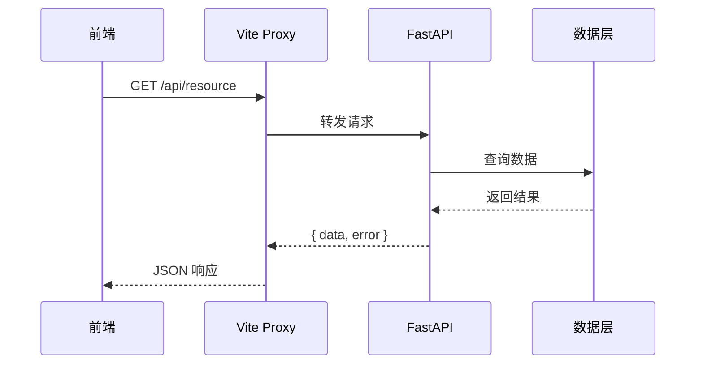
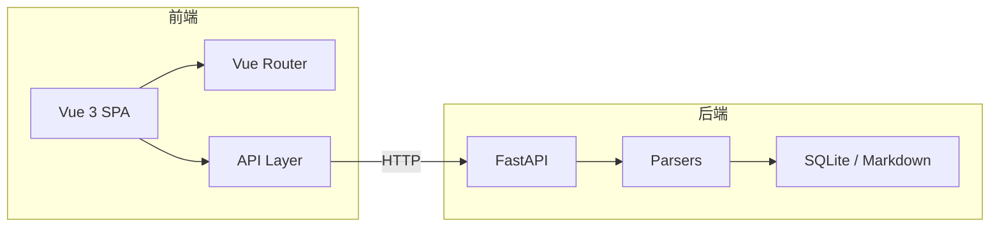

## 基本原则

- 使用 RESTful 风格，资源命名用名词复数
- 统一返回 `{ data, error }` 结构
- 分页参数统一使用 `offset` + `limit`

## URL 规范

| 操作 | 方法 | 路径 |
|------|------|------|
| 列表 | GET | `/api/resource` |
| 详情 | GET | `/api/resource/{id}` |
| 创建 | POST | `/api/resource` |
| 更新 | PUT | `/api/resource/{id}` |
| 删除 | DELETE | `/api/resource/{id}` |

## 错误处理

所有错误返回统一格式：

```json
{
  "data": null,
  "error": {
    "code": 404,
    "message": "Resource not found"
  }
}
```

## 请求流程



## 系统架构



## 相关文档

- [[git-workflow|Git 工作流规范]] — 提交规范与分支策略
