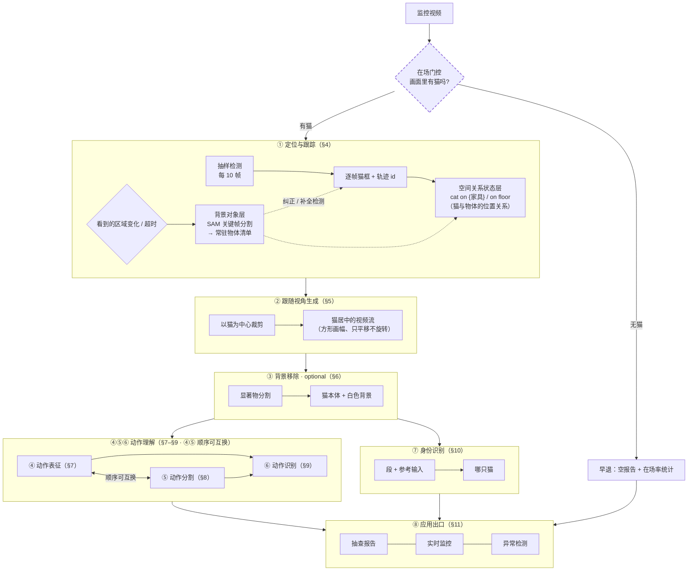
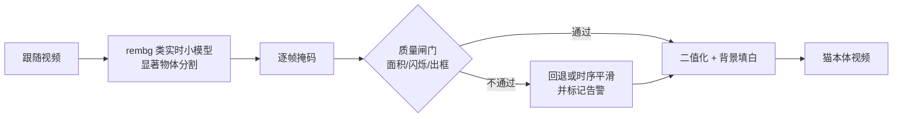
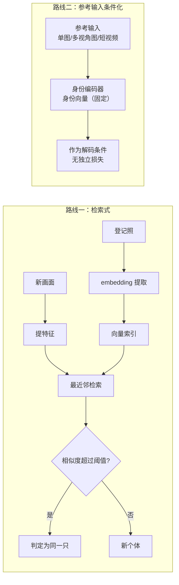

# 系统架构：结构 · 设计 · 进度

> **怎么读**：**§1 端到端设计总图**（整体长什么样）→ **§2 当前待决策**（还剩什么没定）→ **§3 系统级形态**（实时性与流式怎么落）→ **§4–§11 按环节逐一讲解**（①定位跟踪 → ②跟随视角 → ③背景移除（optional）→ ④⑤⑥ 动作理解（表征 · 分割 · 识别，顺序可互换，两路径见 §3）→ ⑦身份 → ⑧出口）。
>
> **本文是所有「结构 / 设计」问题的唯一入口**。模型内部设计（聚合粒度 / 离散化 / 对称架构）见 [8 号《身份-动作 Tokenizer》](./identity-tokenizer.md)；演进 / 进度 / 附录 / 相关文档见同名 `architecture.json`（页面顶部按钮与底部块）。
>
> **深入设计**：模型层 → [8 号《身份-动作 Tokenizer》](./identity-tokenizer.md)；身份两条路线原理 → [7 号《身份标识与检索》](./identity-and-retrieval.md)；数据集 → [2 号《数据集全景》](./datasets.md)；训练 → [4 号《训练体系》](./training-guide.md)。
>
> ⚠️ **命名空间提醒**：本文档 **L1–L8 = 管线层编号**（§4–§11 各章括号内）；各 change 的 design 内部**另有一套 L1–L8**（该 change 自己的决策编号），不是同一命名空间。

## §1 端到端设计总图

整条链路的目标：把监控视频变成「某时段某只猫在做什么」的结构化报告。**先门控有无猫（无猫早退），再有八个环节**，每环输出即下环输入（第 ③ 环的输出并列供给第 ④ 与第 ⑦ 环）。

> **读图要点**：每环只标**输入/输出契约（含时间尺度）**，不标实现细节（分辨率、编码、具体方法）。**各环节时间尺度见环节④与各章内说明。**



**一句话总览**：先**门控有无猫**（无猫早退）→ 得到以猫为中心的视频流 → 抠掉背景（optional）→ **动作理解：④ 表征 · ⑤ 分割 · ⑥ 识别（内部顺序可互换；方案两条路线见 §7–§9）** → 结合身份输出「某时段某猫在做什么」的报告。

**设计要点**：第 3 环节（背景移除）是为第 4 环节服务的——followcam 的相机随猫移动，背景持续变化，若不剥离，动作通道会把相机运动当成动作学进去。空间上下文（在床上/地上）已由第 1 环节的空间关系状态层独立承担，因此抠像不丢信息。


## §2 当前待决策问题

> **只收目标级与系统级决策**：模型内部（④ Tokenizer）的待决策在 [8 号《身份-动作 Tokenizer》](./identity-tokenizer.md) 末表管理（🔴 3 + 🟡 9）；具体参数（阈值 / 间隔 / 数值）属对应 change 的实验测定项，均不进本表。已决项见 sidecar `changelog`。

### 🔴 待审定（不定就开不了工）

**目标与形态级**

- **动作识别能力要到哪一级**——能力分层 A0–A5 见 §8⑤（A0 单帧 → A1 片段单标签 → A3 段列表+时间戳 → A4 组合/长程 → A5 在线）。出口要段列表已明确（≥A3）；待审定：v1 目标定在 A3 还是 A3+A4（「一个视频多个动作」的组合层做不做进 v1）——决定 tokenizer / 分割 / 识别的设计深度与训练预算
- **流式与实时性的量化指标**——定性已裁定（只有⑤分割流式、判别非流式，见 §3）；待审定具体数字：分段边界延迟上限（「秒级」是多少秒）、判别 RTF 硬线（软要求 <1）、端到端出段延迟

**系统 / 管线级**

- **相机数量与视野覆盖**——单机位还是多机位；猫能否走出视野（出画 / 死角）；多机位才有视野重叠交接与盲区报告问题

### 🟡 待定（不阻塞开工）

**系统 / 管线级**

- **门控轻量模型选型**——在场判断（有没有猫）不用 GroundingDINO（慢）；改用更小、更快、算力更省的模型（候选 YOLO-nano 级单类检测 / 轻量二分类器），高频跑以更快早退；GDINO 保留为主检测定位。选型属实验项
- **夜间红外处理方案**——夜里红外画面喂给白天训练的模型前要不要处理：专用红外模型 / 红外+RGB 混输 / IR 上色
- **背景对象层（SAM 引入）的实验项**——独立 change [`background-object-memory`](../../../openspec/changes/background-object-memory/proposal.md)（总管旁支 4D，已立项）承接四件测定：① **重分割触发参数**（机制已定：区域变化超阈值 + 超时兜底；待定阈值数值与兜底间隔）② **自动发现物体的二次分类模型**（检测框 prompt 的物体类别免费——GDINO 框自带类别，即 Grounded-SAM 同思路；候选 CLIP 零样本 / DINOv2 近邻走登记库 / GDINO 二次推理）③ **过分割过滤**（碎片掩码的面积 / 稳定性 / 出现时长阈值）④ **与 GDINO 家具框的合并去重**（方向已定：合并——重叠大〔IoU 超阈值〕判同一物体；低重叠情况实测后定）
- **一个视频多个动作**——长视频里有多个动作时输出怎么组织（滑窗逐窗出标签 + 后处理合并是候选）
- **异常检测机制**——在行为素空间做统计离群 / 与正常库比距离 / 重建误差
- **分词层做法**——行为素序列 → 动作段的聚合规则（unigram 分词 / 变化点检测 / HMM）
- **`video-feature-latent` 阶段划分**——该 change 内部怎么分期交付
- **④⑤⑥ 内部顺序**——先分割再表征还是先表征再分割（两条路径见 §3）

**识别与身份级**

- **身份 embedding 模型**——检索路线用哪个模型把参考图变成向量
- **向量库**——身份向量存哪、怎么查（numpy 暴力检索 / FAISS）
- **动作识别路线**——行为素序列到手后怎么变成动作类别（无监督聚类+命名 / 有监督判别 / 混合）

**模型级（④ Tokenizer 内部）不在本表**——见 [8 号](./identity-tokenizer.md) 末表：🔴 待审定 3 项（参考聚合 / 解码器 feats 路径 / 个体动作风格归属）+ 🟡 待定 9 项（代码骨架 / 初始化 / patch 尺寸 / 输入规格 / 正交基 / 训练粒度 / 共享权重 / register K / 参考通路）。

## §3 系统级形态：实时性与流式

> 跨环节的系统级问题集中说明：**流式用在哪、实时性什么标准、动作段怎么往后传**。环节内部实现见 §4 起；模型内部（④ Tokenizer）见 [8 号](./identity-tokenizer.md)。

### 流式用在哪里：只有动作分割流式

已裁定——**唯一的流式组件是 ⑤ 动作分割**：

| 组件 | 形态 | 说明 |
|---|---|---|
| ①②③ 定位 / 跟随 / 抠像 | 逐帧 / 逐窗批处理 | 无延迟要求，可攒批 |
| **⑤ 动作分割** | **流式（因果）** | 边看边判断「当前这段动作结束了吗」，秒级给出边界 |
| ④⑥ 表征 / 识别 | **非流式** | **边界确定后整段喂入**，不是逐帧出结果 |
| ⑦⑧ 身份 / 出口 | 非流式 | 段级触发（身份随段；报告按段聚合）|

**否决：帧级流式识别**（每帧都出「现在在做什么」）——需要因果 / 在线训练（能力分层 A5 级），成本高且监控场景不需要（段级延迟已够用）。

### 两条实现路径（=「④⑤⑥ 内部顺序」待定项）

流式的落点在 ⑤，但 ⑤ 可以站在不同的输入上——这正是「④⑤⑥ 内部顺序可互换」的实质：

**路径一：先流式分割，再整段表征识别（⑤ → ④⑥）**


- 分割只看**运动能量 / 变化点**（零模型或轻模型），流式产出边界
- **段确定后整段传给 ④⑥**——表征拿到完整段，上下文最全
- 特点：分割零模型依赖、可最先跑通；判别天然非流式

**路径二：先表征，在表征序列上分段（④ → ⑤）**


- 表征先产出**行为素序列**（每 t 帧一份）
- 在序列上找边界——**像语音模型找分段符**（VAD / 词边界）：语义级的「换动作了」信号
- 特点：边界判断带语义信息（更准）；但依赖表征模型先训好

**两路共用的形态契约**：无论哪条路——**分割流式给边界；判别拿到完整段再跑（非流式，RTF<1 软要求）**。总图大框的双向连线即此意。

### 实时性量化指标（🔴 待审定）

定性已定（上表）；待审定的具体数字：

| 指标 | 含义 | 候选 |
|---|---|---|
| 分段边界延迟 | 动作实际结束 → 边界给出 | 秒级（2–5 s？）|
| 判别 RTF | 整段识别耗时 / 段时长 | 软 <1；硬线待定 |
| 端到端出段延迟 | 动作发生 → 报告可见 | 依出口形态定 |

> 数字拍板前，管线的**结构**不受影响（延迟只约束部署侧并发与缓冲策略）。

## §4 环节① 定位与跟踪（L1，第一步：先判断有没有猫）

| 项 | 设计 |
|---|---|
| 输入 | 原始监控视频（白天彩色 / 夜间红外） |
| 输出 | 每帧猫框 + 家具框 + 轨迹 id（JSON）；**背景物体清单**（见下「背景对象层」）|
| 算法 | GroundingDINO 多 prompt 抽样检测（每 10 帧）→ 插值 → **（可选）运动校正**（默认禁用） |
| 代码 | `scripts/pet_detect_track.py`、`scripts/pet_multi_detect.py` |
| 关键决策 | 不用 ByteTrack 全帧率（单猫白天场景过度工程）；关键点降级为辅助信号 |
| 空间语义 | 猫框底边中点落入家具框 → `cat on {家具}`，否则 `on floor`；≥1.5s 迟滞 |

**空间关系状态层**（本环节的第二个输出，与轨迹并列）：由「猫框 + 背景物体清单」推出**随时间变化的猫–物体位置关系**（`cat on {家具}` / `on floor`，还可扩展 `near` / `under` 等）。它承担两件事：① 为下游**提供空间上下文**（动作发生在床上还是地上）；② 是**「交互」类语义的载体**——「猫在碗边」「趴在被子上」这类描述由它给出。因此背景移除（§6）剥掉背景后，空间信息并不丢。
| 状态 | ✅ 已归档（`multi-object-detect-gate`、`batch-followcam-extraction`）|

**① 在场门控（**本环节的第 0 步，早退分支**）**

> ⚠️ 这是全管线的**前置门控**：监控视频里**大部分时间可能没有猫**。没有猫就不该往下跑——

```
监控视频
  ↓ 在场门控（判据：每 10 帧抽样检测是否检出猫）
  ├── ❌ 无猫 ─→ 【早退】记录「猫不在场」→ 输出空报告 + 在场率统计 → 不进入 ②～⑧
  └── ✅ 有猫 ─→ 继续 ② 检测跟踪 → 跟随视角 → …
```

| 项 | 设计 |
|---|---|
| 判据 | **独立轻量门控模型**（GroundingDINO 较慢，退出门控）——候选 YOLO-nano 级单类「猫」检测 / 轻量二分类器，可高频甚至逐帧跑，无猫早退更快；**GroundingDINO 保留为主检测**（每 10 帧抽样定位+跟踪），不再是门控信号源 |
| 粒度 | **按时间区间**：连续无猫区间（含最短持续时间阈值）判定为「不在场段」 |
| 输出 | ① 在场/不在场时间轴 ② **在场率**（已在产出：34 段 mean **0.939**）|
| 早退效果 | 不在场区间**跳过**检测跟踪 / 跟随裁剪 / 抠像 / 表征 / 分割 / 识别（省算力，且避免对空画面产出无意义结果）|
| 报告语义 | **空白时段三分法（已裁定）**：① 在场静止 = 动作类别「静止」（进行为词表，正常输出）② 出画 / 死角 = 不处理（门控早退，报告显式标注「不在场」，**不得计为静止**）③ 被遮挡 = 标注「无法测量」状态（测量状态，非动作类别；遮挡判定属实现细节）|
| ⚠️ 门控风险 | **门控漏了则后面全漏**（行业模式 1 的已知代价）→ 阈值需保守，宁可多跑不可漏判 |

**为什么不用 ByteTrack 全帧率**：单猫白天场景下"每 10 帧抽样检测 + 插值"已经够用，再叠多层跟踪器是过度工程。

**背景对象层（已立项：独立 change `background-object-memory`，总管旁支 4D）**

**为什么需要**：GroundingDINO 只能检出「写了 prompt 的类别」（现为 5 类），**被遮挡或无 prompt 的物体检不到**；而跟随视角下相机随猫移动、画面内的背景持续变化 → 需要一层「背景里有什么、在哪」的**持续记忆**。

**机制（关键帧触发，不是逐帧）**：

```
触发（机制已定；阈值与超时间隔为实验测定项）：
① 看到的区域变化超阈值（画面裁剪模拟的窗口移动 / 相机真实转动）   ② 距上次分割超时
   ↓
SAM 在关键帧上分割（自动网格 prompt / 已有检测框 prompt）
   ↓
更新「场景常驻物体清单」每条目 = {object_id, mask, bbox, embedding, last_moved, semantic_label}
   ↓
输出：背景物体位置（供空间关系状态层）+ 纠正/补全 GroundingDINO
   ↓
两次关键帧之间：真实机位不动 → 物体在【原帧坐标系】里静止
   → 裁剪帧内的位置 = 全局坐标 − 裁剪偏移（免费换算，无需重新分割）
```

**三项职责**：① **背景对象记忆**（"一直知道有哪些背景物体"，含被猫遮挡时）② **纠正** GroundingDINO 识别错误 ③ **补** GroundingDINO 盲区（无 prompt 的物体）

**为什么 SAM 不可替代**：猫遮挡物体时（趴在碗上、挡在门前）GDINO **检不到**，而 SAM 的记忆注意力能保住掩码（半 amodal）。这是单靠检测器做不到的。

**与 L3 抠像的关系**：**两个用途、两套模型**——L3 抠**猫**（`rembg` 小模型）；本层分割**背景物体**（SAM）。互不耦合。

**机制细节已有成稿**：触发三重过滤、状态机、清单数据结构见 `registry-retrieval` design R1/R2/R2b；已迁出为独立 change `background-object-memory`（SAM 引入 + 四件实验项：重分割参数 / 二次分类选型 / 过分割过滤 / GDINO 合并去重）。

**待定项**：见 §2 速览 🟡 背景对象层四件（重分割参数 / 掩码类别来源 / 过分割过滤 / 与 GDINO 家具框的关系）——重分割机制已定，仅参数待实验。

**运动校正（可选）**：猫被柱子/家具遮一下又出来、重新框到时位置可能跳变，运动校正让位置平滑。它是**插值之后的独立开关，默认禁用**（治标有限，关键帧丢就让它丢，渲染层过滤兜底）。参数与实测见 [9 号《研究结论与踩坑》§5.1](./lessons.md)。展开说明见 [7 号 §1](./identity-and-retrieval.md)。

## §5 环节② 跟随视角生成（L2）

| 项 | 设计 |
|---|---|
| 输入 | 轨迹 JSON |
| 输出 | 512×512 以猫为中心的 H.264 短片 |
| 算法 | 自适应跟随裁剪（猫居中）+ 尺寸离群过滤 + 渲染层漂移过滤。裁剪窗是**正置的方形**（与画面坐标轴对齐）：**只平移跟随、不随猫朝向旋转**——旋转会引入插值模糊，还会丢掉「猫相对房间的朝向」 |
| 代码 | `scripts/make_followcam.py`、`scripts/pet_batch_run.py` |
| 状态 | ✅ 34/34 段完成（共 14.7 分钟）|

**为什么它是主表示载体**：跟随视角是后续所有特征学习的载体——下游模型拿到的不再是"整张监控画面"，而是"这只猫此刻的画面"。好处：① 模型不用再学"找猫在哪里" ② 分辨率不再被浪费在背景上 ③ 帧间变化幅度集中在猫身上，更利于动作建模。详见 [7 号 §5](./identity-and-retrieval.md)。

## §6 环节③ 背景移除（L3，**optional**）



| 项 | 设计 |
|---|---|
| 输入 | 跟随视频 + 猫检测框（复用 L1 产物）|
| 输出 | 仅含猫本体、背景填充**白色**（纯色常量）的视频（帧数/帧率/分辨率对齐，不覆盖原视频）|
| 主选 | **`rembg` 类实时小模型**——显著物体分割（followcam 猫居中且占主体 → 猫天然是最显著物体）；候选 `u2net` / `u2netp` / `silueta`（Apache-2.0）、`isnet-general-use`（Apache-2.0）、`birefnet-general-lite`（MIT）；GPU 几十毫秒/帧 |
| 许可分档（🟢🟡🔴，见页面附录）| `rembg` 库 = 🟢 MIT；候选权重 `u2net`/`isnet`/`birefnet-lite` = 🟢 Apache/MIT → **交付路径用这些**。`bria-rmbg`（rembg 默认模型）= 🟡 **CC BY-NC 4.0**（科研可用，商用需 BRIA 协议）→ 可作**质量上限对照**，登记「商业化前替换」。RVM = 🔴 GPL-3.0（传染）|
| 多猫同框 | **已裁定：逐猫分离**——整条管线以猫为单位（跟踪 id / followcam / 身份 / 报告「哪只猫在做什么」）；并集会让身份训练的「单猫片段」切分失效 |
| 已否决 | RVM（人物域 + GPL-3.0 传染）；**SAM2 退出抠猫**（改用于背景对象层）|
| 质量兜底 | 面积突变 / 帧间闪烁 / **掩码出框（显著物体选错对象）** / 检测丢失 → 回退或时序平滑 + 告警，不静默输出脏数据 |
| 状态 | 📋 `pet-background-removal` 已立项（4/4 规划，待实施）|
| optional | **可选组件**：训练管线默认开启（消除背景运动污染），其他场景按需 |
| 关联 | **背景对象层（SAM，关键帧）**：维护背景物件清单 + 纠正/补全 GroundingDINO。独立 change `background-object-memory`；与本环节是**两个用途、两套模型** |

## §7 环节④ 动作表征（L4）

> **方案两条路线**：**A 自研行为素 tokenizer**（现设计主线，下文「路线 A」，深设计在 8 号）/ **B 现成动作识别模型**（VideoMAE V2 等 + 滑窗后处理成段，下文「路线 B」）。总图大框对两条路线保持通用（输入猫居中视频流窗口，输出段 + 类别）。

这是全项目最复杂环节。**路线 A 产出「行为素序列」**——动作的可解释表征；结构骨架与深设计见 [8 号《身份-动作 Tokenizer》](./identity-tokenizer.md)。

**路线 A 要点**（深设计在 8 号）：

| 项 | 设计 |
|---|---|
| 产出 | **行为素序列**（每 t 帧一份、每份 M 维系数；分量曲线可画、可命名、可聚类）|
| 分解 | 身份（参考输入 → 身份向量）与动作（正交基系数）在架构层解耦；架构主源 FLOAT（TivTok 备档）|
| 训练 | 两阶段：A UCF101（13320 段，NAS）验证架构 → B 猫语料迁移 + 参考输入 |
| 待决策 | 模型级 12 项见 8 号末表（🔴 3 + 🟡 9）|
| 状态 | ⏳ 主线 2.3（规划完成，待实施）|

**为什么先无监督发现行为**，而不是直接套人工标注类别？因为 cats v1 的人工 activity 标注里"伞类"占了一半——意思是人也不知道猫到底分几类活动。让数据自己聚成簇、再人工命名，往往比"先拍脑袋定 5 类"更靠谱。详见 [2 号《数据集全景》§5](./datasets.md)。

**验收四闸门**：线性可分性、可命名率、码本健康度、**身份泄漏审计**（防止行为表征被身份信号污染）。详见 [9 号《研究结论与踩坑》](./lessons.md)。

#### 路线 A：自研行为素 tokenizer（现设计主线）

**行为素**：本方案产出的基本动作单元——自研 tokenizer 在**正交运动基**条件下提取的系数（每 t 帧一份，当前 t=4 ≈ 0.27 s/份 @15fps；数学记号与提取细节见 [8 号](./identity-tokenizer.md) §4）。行为素序列即「这段时间在动什么」的可解释记录。**行为素与本方案绑定**——若走路线 B（现成模型），表征为其特征序列，不涉及正交基与系数。

- 符号速查：8 号 §4.0 · 逐组件设计：8 号 §4 · 变长输入与输出：8 号 §4.2c
- 训练流程与细节（阶段 A UCF101 → 阶段 B 猫语料）：8 号 §5 / §5.1 · 理论对比（为什么解耦而非直接监督）：8 号 §5.2


#### 输入 / 输出时间尺度

| 环节 | 时间单位 | 当前取值 | 备注 |
|---|---|---|---|
| ① 检测抽样 | 抽样间隔 | **每 10 帧**一次 | 插值补齐到逐帧 |
| ④ 表征 · **输入窗口** | 一次前向的**时间跨度** | **`clip_len=16` × `frame_interval=4` = 64 帧 ≈ 4.3 s** @15fps | 本仓 4 个 config（VideoMAE / VideoMAEv2 / AIM / VideoMAE-base）实测一致 |
| ④ 表征 · **输出粒度** | 行为素的**分辨率** | **patch `t=4` 帧 ≈ 0.27 s** | 一次前向 64 帧 → 出 **16 份**行为素 |
| ④ 表征 · 窗口步长 | stride | **待定**（重叠 vs 不重叠）| 见 8 号「patch 尺寸」与「一个视频多个动作」（滑窗实现）|
| ⑤ 分段 · 段长 | 不定长 | 由变化点检测定 | 最小段长 / 滞回约束待定 |
| ⑥ ⑦ | 每段一次 | — | 以段为单位 |

**⚠️ 最易混：「输入窗口跨度」≠「输出粒度」**

```
喂进去：64 帧（≈ 4.3 秒）
吐出来：16 份行为素，每份覆盖 4 帧（≈ 0.27 秒）
```

| 问法 | 答案 |
|---|---|
| 模型一次前向看多长的**时间**？ | **64 帧 ≈ 4.3 s**（16 个采样帧 × 间隔 4）|
| 采样了多少**帧**？ | **16 帧**（稀疏采样，非连续）|
| 每份行为素代表多少帧？ | **4 帧 ≈ 0.27 s** |
| 一次前向产出几份？ | **16 份** |

**稀疏 vs 密的差别**：本仓 config 是**稀疏采样**（`frame_interval=4`）→ 16 个采样点跨 **4.3 s**；改**密采样**（`frame_interval=1`）则 16 帧只覆盖 **1.07 s**。**两者含义完全不同**，15 fps 环境尤其要看清。

**多时间尺度很便宜**：VideoMAE 用 **sin-cos 位置编码**（`use_learnable_pos_emb=False`，`vit_mae.py:306-313`）→ 换 `T` 不必重训位置编码。


#### 路线 B：现成动作识别模型

直接用现成动作识别模型（如 **VideoMAE V2**，K400 / K710 预训练）对窗口片段分类（A1 能力），滑窗 + 时序后处理成段（模拟 A3/A4 输出形态，见本章能力分层）。

| | 路线 A：自研行为素 tokenizer | 路线 B：现成模型 |
|---|---|---|
| 训练成本 | 两阶段自监督训练 | **零训练，当天可跑** |
| 下游能力 | 行为素曲线 / 行为聚类 / 异常检测 / 身份剥离 | 特征不可解释、身份污染、无行为词表 |
| 定位 | 主线（编码器优先）| 快速基线 / 回退 |

两条路线的 I/O 契约相同（总图大框通用）；切换只影响 §7–§9 内部实现，不影响门控 / 跟踪 / 跟随视角 / 身份 / 出口。

## §8 环节⑤ 动作分割（L5）

#### 能力分层 A0–A5：主流为什么给不出段列表

> 为什么要分层：**「动作识别模型」不是一个东西**——不同层的模型能力差好几个量级，而名字都叫"动作识别"。**看输入输出就能分清。**

| 层 | 名称 | 输入 → 输出 | 该层**新增**的能力 | 多动作 | 时间戳 | 全程覆盖 | 在线 | 代表模型 | 需要的标注 |
|---|---|---|---|---|---|---|---|---|---|
| **A0** | 单帧分类 | 一张图 → 1 类别 | 基础识别 | ❌ | ❌ | — | ✅ | ResNet / ViT（ImageNet）| 单图类别 |
| **A1** | **片段分类**（主流）| 定长片段 → **1 类别** | **+ 时间**（多帧）| ❌ | ❌ | ❌ | ❌ | **VideoMAE / UniformerV2 / SlowFast / TSN / 本仓 mmaction2 全部** | 片段类别 |
| **A2** | 多标签片段分类 | 定长片段 → **多类别** | + 一段可有多个动作 | ✅ | ❌ | ❌ | ❌ | 多标签变体 | 多标签 |
| **A3** | 时序动作检测（TAD）| 长视频 → **多个变长段 + 起止秒** | + **定位（时间戳）** | ✅ | ✅ | ❌ | ❌ | ActionFormer / TriDet / TadTR | **边界标注** |
| **A4** | 时序动作分割（TAS）| 长视频 → **逐帧标签 → 覆盖全程的段** | + **全程覆盖**（含背景类）| ✅ | ✅ | ✅ | ❌ | MS-TCN / ASFormer / DiffAct | **逐帧标注** |
| **A5** | 在线动作检测（OAD）| 视频流 → 当前时刻动作 | + **因果 / 在线** | ✅ | ✅ | ✅ | ✅ | LSTR / OadTR / TeSTra | 在线逐帧标注 |

**能力是逐层叠加的**（这才是"分层"的意义）：

```
A0 基础识别
 └─ A1 +时间（多帧 → 一个标签）        ← 主流停在这里
     └─ A2 +一段可有多个动作
         └─ A3 +定位（给时间戳、变长输出）
             └─ A4 +全程覆盖（每个时刻都有标签，含背景）
                 └─ A5 +因果/在线（不看未来帧）
```

**关键：A1（也就是 99% 叫"动作识别"的东西）的输入输出形状**

```
输入：一段【已裁好的】视频（谁裁的？人裁的）
  内部：均匀采 T 帧（T 固定 16/32/64）压成定长张量
输出：[1 个类别]    shape [num_classes]
⚠️ 输出里【没有时间这个维度】
```

**一个例子最直观**（10 秒视频：0-3s 舔毛 → 3-7s 走动 → 7-10s 睡觉）：

```
用 A1（VideoMAE / UniformerV2）：
   你必须【自己先裁成 3 段】再分别喂进去 → 每段出 1 个标签 "grooming"
   它不会说「0-3s 是舔毛」——那个 0 和 3 是你裁的时候自己定的，不是它给的

用 A3（如 ActionFormer）：
   直接喂 10 秒整段 → [{"0-3s": grooming}, {"3-7s": walking}, {"7-10s": sleeping}]
   时间戳是它给的
```

> **一句话**：A1 做的是「**给一个已切好的片段贴一个标签**」；A3/A4 做的是「**从长视频里找出动作在哪、有哪几段**」。

> ⚠️ **三个必须先破除的混淆**：
> 1. **「喂变长视频」≠「理解变长」**——混淆点在【数据文件】与【模型张量】是两个层面：
>    ```
>    【数据文件】 sit_001.mp4 —— 时长任意（变长）          ← 数据加载器看到的
>          ↓ SampleFrames（dataset 的 __getitem__）
>             从任意长视频里【均匀采 T 帧】→ [T,H,W,3]（定长） ← 模型只看到这个
>          ↓
>    【模型】   输出 [num_classes] —— 1 个标签
>    ```
>    采样是「**抹平**」而不是「**理解**」：模型不知道原视频多长、也不在乎。所以**喂变长视频是常规操作**，但它**换不来**「识别变长动作」的能力——60 秒含 3 个动作的视频喂进 A1 仍是 1 个标签（三个动作的**混合**）。
>    **本仓实证**：7 个训练 config 全部定长采样（`clip_len=16/48/1`）；标注格式 `<video> <class>`（一行一视频一类别）；mmaction2 里的 `UntrimmedSampleFrames` 是给 TAD/TAS 准备的，我们一个都没用。
> 2. **输入变长 ≠ 输出变长**——A1 是「变长输入 → **定长输出**」
> 3. **多 clip 测试 ≠ 多动作**——`num_clips=10` 是把**同一个** clip 采样 10 次做平均，输出**仍然只有 1 个标签**

> ✅ **但「变长输出」可以用定长模型 + 滑窗做出来**：定长窗口铺满长段 → 每窗一个标签 → 后处理合并成段。**这正是「一个视频多个动作」的滑窗合并路线**——本质是「**用 A1 能力模拟 A3/A4 的输出形态**」，模型本身仍是 A1。

**为什么主流停在 A1**：训练数据形态锁死的——Kinetics / UCF101 / ActivityNet(裁剪版) 的标注就是「一片段一类别」，模型架构（固定采 T 帧）与标注体系互相锁定。

> ✅ **框定：主流做法不是错，是另一个任务的正确解。**
> A1 的任务定义就是「给一个**已裁剪好、只含一个动作**的片段，输出它的类别」。在那个定义下，**固定 T 帧 + 1 个标签是正确且高效的**。
> 我们不是要「纠正」它，而是**任务不同**：我们要从**未裁剪的长视频**里切出**多个段 + 时间戳**（A4 级输出）。两者不可互相替代，也不存在谁更先进。
> 更完整的模型族、输入契约与数据集细节见 `papers/docs/action-recognition-models.md`（wiki 外，见仓库）。

**我们落在哪层 ／ 目标哪层**：

| 层 | 我们能否用 | 说明 |
|---|---|---|
| A0 / A1 | ✅ 能 | 现有：16 帧窗口。**用无监督聚类替代分类器**（activity 标注是「伞类」，不能直接当监督）|
| A2 | 🟡 可近似 | 多标签可用「聚类 + 阈值」得到 |
| **A3 / A4** | ❌ **不能直接训** | **缺边界标注（A3）/ 逐帧标注（A4）** |
| A5 | ❌ | 需在线/因果训练 |

| 范式 | 必需标注 | 我们有吗 |
|---|---|---|
| A3 TAD | **边界标注**（每段起止秒 + 类别）| ❌ |
| A4 TAS | **逐帧标注**（含背景类）| ❌ |
| 实际持有 | cats v1 activity 标注（「伞类占一半」）+ 无边界 | ⚠️ 弱标注 |

**我们的路径**：

```
需求层 = A4 级输出（覆盖全程的段列表 + 时间戳）
   例：「3:00–3:15 舔毛，3:15–3:40 走动，3:40–4:10 睡觉」

但标注只支持 A1
   ↓
方案 = A1 能力（逐窗标签，无监督聚类）
       + 时序后处理（变化点检测 / 最小段长约束 / Viterbi）
       → 模拟 A3/A4 的输出形态（见「一个视频多个动作」滑窗合并）

在线（A5）若要做 → 滚动窗口近似（延迟 = 窗长），见 §11
```

**所以"多段 + 时间戳"不是"要不要"的问题，而是输出形态决定的。**


#### 本环节设计

> **正式立项**：独立 change `video-action-segmentation`（总管 2.4b）。
> 概念与音频类比见下文；领域背景见 `papers/docs/action-recognition-models.md`（wiki 外，见仓库）。

**为什么需要这一层**：**行为素 ≠ 动作**（行为素=单词，动作=句子）。`video-feature-latent` 的阶段一/二建的是**行为素词表**；若不补这一层，就只能输出「这一瞬间是第 7 号行为素」，给不出「猫在舔毛」。

**更硬的约束**：出口要的是**段列表 + 时间戳**（「3:00–3:15 舔毛，3:15–3:40 走动」），而**主流动作识别模型（A1 层）输出恒定 1 个标签、给不出时间戳**（详见本章能力分层与综述）⇒ 分段是**出口形态的必要前置**。

| 项 | 设计 |
|---|---|
| 输入 | 行为素序列（来自 L4）+ 段/窗口表征（来自 `video-feature-latent`）|
| 输出 | **只有边界的段列表** `[{start_sec, end_sec, boundary_conf, n_primitives}]`（**不含类型**——类型由 L6 给）|
| 流程 | **两步（只定边界，不贴标签）**：① 行为素运动能量预分段（零成本：各方向系数绝对值求和）→ 切成「行为块」 ② 块内做**细分段**（变化点检测 / 无监督 TAS / 层次 HMM）→ 段边界 |
| 静止段处理 | **按时长阈值分流**：`< T_pause` = 停顿（分隔符，不单独成段）；`≥ T_pause` = **静止型行为**（睡觉），**保留为独立段**交 L6 判类型 |
| 关键约束 | **不先离散化行为素**（音频实证：神经离散化的序列过长会使分词失效，arXiv 2106.04298）|
| 借鉴来源 | 视觉：TAEC（2303.05166）/ TW-Hierarchical Clustering（2103.11264）/ CTE / ASAL；音频：1603.02845（联合分割+词表发现）/ 1806.01665（层次 HMM+时长先验）/ NLP unigram 分词 |
| 已知局限 | pause-based 分段*"pauses do not necessarily coincide with semantic boundaries"* + 会**过分割**（arXiv 2203.15479）⇒ 能量边界**只作强候选**，不单独定段 |
| 状态 | 📋 `video-action-segmentation` 已立项，待启动 |

> **为什么不与 L6 合并**（用户裁定）：
> ① **逻辑顺序**——不分段就不知道该对哪一段做识别；② **方法族完全不同**——分段是几何/时序问题（变化点检测 / HMM / 能量曲线，**纯无监督、不需要词表**），识别是语义问题（每段 → 类别，**需要词表**）；③ 拆开后「分词层做法」与「动作识别路线」才能分开讨论。
> ⚠️ 注意与学术界的差异：**无监督 TAS 通常把分段与聚类"联合"做**（TAEC / TW-Hierarchical Clustering）。本项目**显式拆成两步**——分段可先跑（不依赖词表），识别可后做且方法可选（聚类+命名 / 人工标注监督）。


#### 行为素 → 动作：分层、分词与成熟模型

> 用户提出的类比：**行为素 = 单词，动作 = 句子**（动作由多个行为素拼成）。本节给出该层的做法与已有成熟工作。

##### 1 层级

```
帧（15fps）/ 行为素（0.27 s）  →  动作段
                    （单词）    （句子，由多个行为素组合）
```

**关键纠正**：**行为素 ≠ 动作**。当前 `video-feature-latent` 阶段一/二做的「窗口特征 → 聚类 → 行为簇 + 命名」在建的是**行为素词表（词层）**，不是动作（句层）。

##### 2 音频领域的对应问题链（可直接借鉴）

音频：`波形 → 帧特征 → 音素(离散单元) → 音节 → 单词 → 句子`

| 工作 | 做法 | 对我们 |
|---|---|---|
| **无监督分词 + 词表发现**（arXiv 1603.02845）| *"a potential word segment (of **arbitrary length**) is embedded in a **fixed-dimensional** acoustic vector space... builds a whole-word acoustic model **while jointly performing segmentation**"*；**不预设词表大小** | **联合分割 + 类型发现**，正对应「先无监督发现动作类型」的主线 |
| **层次 HMM + 时长先验**（arXiv 1806.01665）| 两层 HMM 推断音节/音素边界；**时长先验作转移概率**；*"no phoneme class labels are used"* | 比「中值滤波」严格得多；等价于「最小段长约束」|
| ⚠️ **神经离散化难分词**（arXiv 2106.04298）| *"neural models for speech discretization are **difficult to exploit**... it might be necessary to **adapt them to limit sequence length**"*；最佳结果来自**高压缩的 Bayesian 表示** | **不要先把行为素离散化**——序列越长越难分词。支持我们的「去量化」决策 |
| **NLP unigram 分词范式** | 用动作词表对序列做**最优切分**（最大化 `Σ log P(段) + log P(长度)`），DP/Viterbi 求解 | 「一个视频多个动作」滑窗合并的严格版 |

##### 3 已有成熟模型：无监督时序动作分割（Unsupervised TAS）

| 工作 | 要点 |
|---|---|
| **TAEC**（arXiv 2303.05166）| *"annotating action classes and **frame-wise boundaries** is extremely time consuming... we propose an **unsupervised** approach"* |
| **Temporally-Weighted Hierarchical Clustering**（arXiv 2103.11264）| *"Action segmentation refers to **inferring boundaries of semantically consistent visual concepts**"* → 层次聚类同时得边界与段类型 |
| CTE（2019）· ASAL（2023）| 连续嵌入 / optimal transport |
| （有监督对照组）MS-TCN · ASFormer · DiffAct | 需**逐帧标注**，本项目不具备 |

**无监督 TAS 的输入输出与本项目完全一致**：输入长未裁剪视频 → 输出**段边界 + 每段一个学到的类别**，不需标注。**可直接借鉴/复用，优于自研「后处理」。**

##### 4 「静止段作为分隔符」——用户的直觉

**用户类比**：画面中物体一段时间静止 → 可当**分隔符**（≈ NLP 的句号）。

**音频先例（支持）**：pause-based segmentation / VAD 是 ASR 的常用前置。
**音频已指出的局限**（arXiv 2203.15479）：*"pauses **do not necessarily coincide with semantic boundaries**. **Over-segmentation**"*。

**对本项目需额外处理的两点**：

| # | 问题 |
|---|---|
| 1 | **静止既是「分隔符」又是「一种行为」**——蹲 3 秒可能是停顿，蹲 20 分钟是「睡觉」⇒ 需**时长阈值**区分（同一信号两种语义）|
| 2 | **不是所有切换都有停顿**——走→跑是连续过渡 ⇒ 只靠静止会漏边界 |

**但我们有一个优势**：L3 抠像后画面只剩猫 ⇒ **「画面运动能量」≈「猫的运动能量」**，无需背景建模；而且**行为素本身就是运动系数** ⇒ 各方向系数绝对值求和即为能量曲线 **直接就是运动能量曲线**（零成本边界信号）。

##### 5 推荐的组合（三步）

```
第 1 步（零成本预热）：行为素运动能量曲线 → 低能量段作【强边界候选】→ 长视频切成若干「行为块」
第 2 步（成熟模型）  ：每块内用【无监督 TAS】做细分段 + 类型聚类
第 3 步（人工）      ：命名段类型
```

**理由**：静止边界把问题**降维**（长视频 → 若干净块），使第 2 步的模型工作在**更短、更同质**的片段上——正好回应 arXiv 2106.04298 的「序列过长时神经方法难以分词」警示。


##### 6 行业架构模式（联网调研）

完整调研见 `papers/docs/action-recognition-products.md`（wiki 外，见仓库）。**核心结论：委托方假设「先分段再逐段识别」作为普遍规律不成立**——业界主流是「门控/跟踪/规则 → 定长窗口分类 → 时序后处理聚合成段」。

| 模式 | 谁在用 | 关键取舍 |
|---|---|---|
| **1 门控-精算级联** | Frigate / Viseron / VideoPipe | 算力省 1–2 个数量级；**门控漏了则后面全漏** |
| **2 跟踪区间即段** | DeepStream / 安防 | 天然带 ID；但**段 = 轨迹区间**，多动作重合无法表达 |
| **3 窗口分类 + 时序聚合** | mmaction2 长视频 demo / Google `FRAME_MODE` / 畜牧 | 改造量最小；**与本项目现状 100% 兼容** |
| **4 先段后判（非语义切分）** | Google `SHOT_MODE` / 视频索引产品 | 段可控；但**段 = 镜头段 ≠ 动作** |
| **5 联合定位-分类** | 学术界 / 体育事件（TAD、action spotting）| 唯一真给时间戳；**标注成本高、缺生产级封装** |

**已核实的关键事实**（🟩）：Google 的 `LabelDetectionMode` = `SHOT_MODE` / `FRAME_MODE` / `SHOT_AND_FRAME_MODE`（另提供 `stationary_camera` 选项，固定机位可用）；AWS 的 `SegmentType` 只有 `SHOT` / `TECHNICAL_CUE`；Frigate 的 review item = *"segments of time … that bundle together the objects and audio that were active at once"*，即**活动区间聚合**；本仓 vendored mmaction2 **确实含 TAL 配置**（`configs/localization/{bmn,bsn,drn,tcanet}`），但属**另一任务族**。

**⭐ 最贴近本项目的动物行为先例：Keypoint-MoSeq**（本仓已 vendored `third-party/keypoint-moseq/`，一手可核）

```
姿态/关键点序列 → [HDP-HMM] → syllable（细粒度单元）→ 组合 → motif（动作）
```

| 我们的层级 | Keypoint-MoSeq | 备注 |
|---|---|---|
| 行为素（t=4 帧 ≈ **0.27 s** @15fps）| **syllable**（鼠类目标 **400 ms**）| **粒度惊人接近** |
| 行为素 | syllable | 同层 |
| 动作段 | **motif** | 同层 |
| `T_pause`（停顿 vs 静止型行为）| **`target syllable duration`**（由 `kappa` 调）| 同一种「时长先验」|

其**已知风险**亦印证我们的担忧：*"Substantial size variation … may cause **syllables to become over-fractionated**, i.e. the same behaviors may be split into multiple syllables"*。
→ **我们不是没有先例**：这是「细粒度单元 → 组合动作」的成熟无监督范式，且**用 HDP-HMM**（正好对应 design D5 的路径 B）。

## §9 环节⑥ 动作识别（L6）

> **本节背景**：用户指出动作识别前必须先分段，且总图里"识别"未独立出现。

**职责**：给 L5 切出的**每一段**贴一个动作类别。**只做分类，不改边界。**

| 项 | 设计 |
|---|---|
| 输入 | L5 的段列表（边界）+ 段内表征（行为素汇总 / 段嵌入）|
| 输出 | 段列表补上 `action_type` + `confidence` → `[{start_sec, end_sec, action_type, confidence, ...}]` |
| 类别来源（**三选，见「动作识别路线」**）| **① 无监督**：对段嵌入聚类 → 行为簇 → 人工命名（主线）<br>**② 有监督**：片段级人工标注 → 训判别模型（路线②）<br>**③ 聚类辅助 + 监督**：聚类降标注量，再用标注训分类器（当前推荐）|
| 方法族 | 段嵌入 + 分类器：线性探针（验收闸门）/ 小 Transformer / n-gram / 语言模型式序列模型 |
| 与 L5 的区别 | L5 = **找边界**（不需要词表）；L6 = **贴标签**（需要词表）|
| 词表对齐 | 与 `video-feature-latent` 的行为簇命名表**共用或收敛为同一套**（见「阶段划分」）|
| 状态 | ⏳ 由 `video-action-segmentation`（2.4b）与 `video-feature-latent`（2.4）协作交付 |

> **为什么类别来源是"三选"**：分段不需要标签，但识别一定需要"类别的定义从哪来"。我们的 cats v1 activity 标注是**伞类**（一半以上），直接监督会学到伪类别 ⇒ 主线走①（聚类+命名），但**片段级人工标注是可行备选**（路线②）。

## §10 环节⑦ 身份识别（L7）

两条并行路线，**共享同一原理**：同猫跨时间/视角要聚到一起，不同猫要区分开。



| 路线 | 机制 | 特点 | 状态 |
|---|---|---|---|
| 检索式 | **embedding 检索**：登记照 → embedding → 向量库最近邻 + 阈值（猫与物体共用一套抽象）| 零训练、可解释、易上线 | ⏸️ `registry-retrieval`（待批准）|
| Token 式 | **参考输入条件化**：`w_identity`（固定向量）作为解码条件；监督由重建承担 | 与动作表征同源、交换验证免费 | ⏳ 随 L4 产出 |

> **模型选型规则**：上表"检索式"里的 **embedding 模型** 与 **向量库** 是**槽位**，不是已定方案（DINOv2+FAISS 仅为默认候选且**未实测**）。选型在实施 `registry-retrieval` 时做实测（候选见该 change design D9b）。**结构先定，选型后调研。**
>
> **参考输入为身份默认形态**（用户裁定）：不要求从待分析视频推断身份；用户事先拍一张（或几张 / 一段）猫的参考即可。单猫语料只需一份参考，**零额外标注**。

两条路线的相同性质：**同猫跨时间/视角特征要聚到一起（positive invariance）、不同猫/物体要互相区分（negative discrimination）**。抓住这一条，主线就稳了。详见 [7 号 §4/§6](./identity-and-retrieval.md)。

## §11 环节⑧ 应用出口（L8）

#### 实时形态（已裁定）

**两种出口**：

| 形态 | 契约 | 延迟 | 精度 | 状态 |
|---|---|---|---|---|
| **抽查报告**（主产品）| 批 + 非因果后处理 | 分钟级可接受 | 最高 | ⏳ `spot-check-cli` 规划完成 |
| **实时监控** | 流式分段 + 边界触发**整段判别**（与抽查同一判别模型）| 秒级（= 边界检出延迟）| 与抽查一致 | ⏳ 同上（复用 live 流式设施）|
| 异常检测 | 行为表征序列 | — | — | ⏸️ `behavior-anomaly-detection`（研究型，延后）|

**共享**：两出口 MUST 共享同一份行为簇字典（离线发现、在线分配）——即"同一内核、两种外层契约"，**不是两套模型**。

> **已定（见下文实时形态）**：按组件拆——分段流式、判别非流式（RTF<1 软要求）。

异常检测的候选机制：正常 = 高频已命名簇，异常 = 低频簇 / 行为素向量转移突变 / 滑窗簇 ID 直方图偏离（HDBSCAN 簇 ID 序列、马尔可夫、孤立森林待调研）。

---

> **演进记录 / 进度 / 附录（环境隔离、部署拓扑、许可分档、选型状态、重点决策说明）/ 相关文档**：见同名 `architecture.json`（页面顶部按钮与底部块按需查看）。

#### 实时：要不要、要哪种（已裁定）

问题只有两个：**要不要做到实时？要的是哪种实时？**

**裁定**：不要「边跑边逐帧说出动作」的帧级流式识别。**实时性只落在动作分段上**：

```
监控帧 → 在场门控：画面里有猫吗？
            ├─ 无猫 → 不跑
            └─ 有猫 → 帧写入缓存（持续录）
                        │
                        ▼
        流式动作分段模型（唯一的流式组件）
        只判断：当前动作是否已截止（边界）
                        │ 截止
                        ▼
        缓存帧【整段】交动作判别模型（非流式，一次判一段）
                        ▼
        片段 + 动作类别 → 出口（抽查报告 / 实时监控 / 检索）
```

| 组件 | 流式？ | 速度要求 |
|---|---|---|
| **动作分段** | ✅ 流式（因果，逐帧增量）| 边界检出延迟秒级即可 |
| **动作判别** | ❌ 非流式（段触发，一次判一段）| **RTF < 1 即可**（判别速度跟上录制速度，缓存不堆积）；宠物动作识别没有更高实时要求 |

**推论**：判别模型就是普通离线模型——不需要因果内核、不需要流式训练；「低延迟内核（延迟 < 窗长）」的 v2 条件项**取消**。抽查（批）与实时监控**共用同一套组件**，只差触发方式：批 = 整段离线跑分段；监控 = 在线跑分段、边界触发判别。

