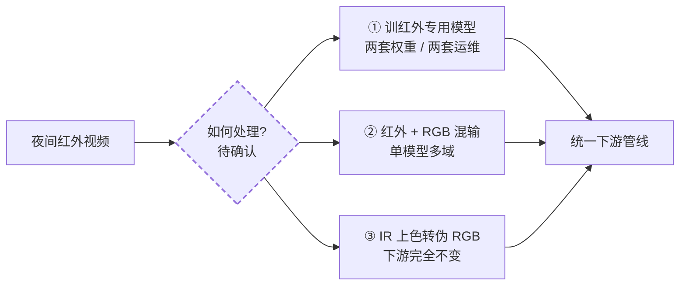
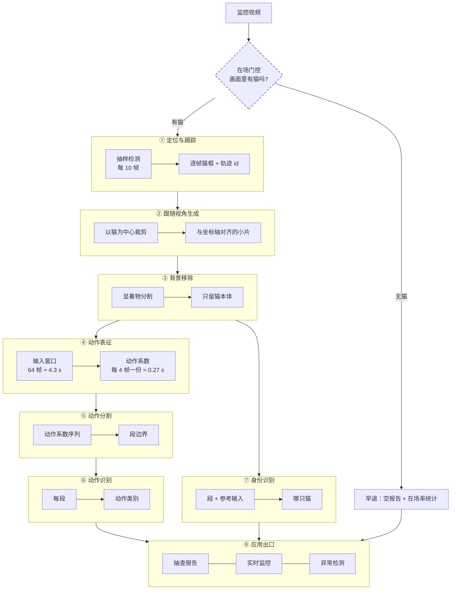
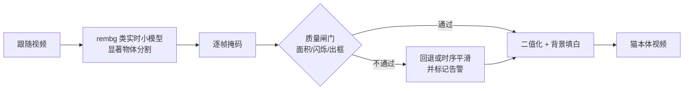
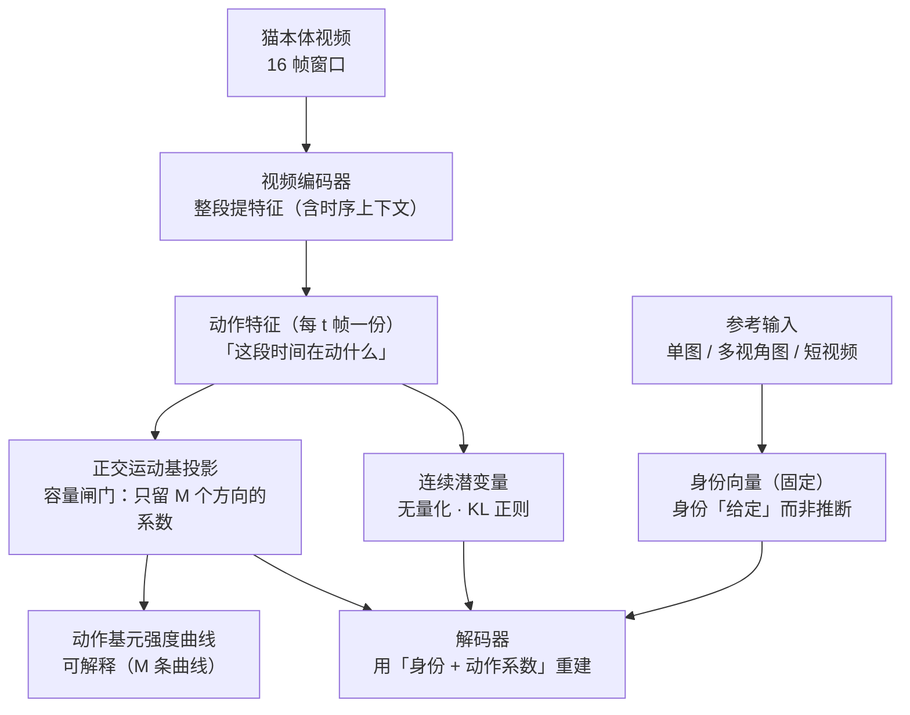
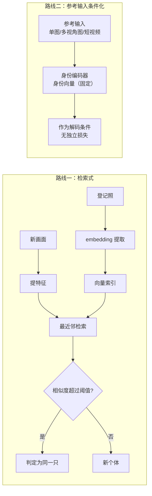
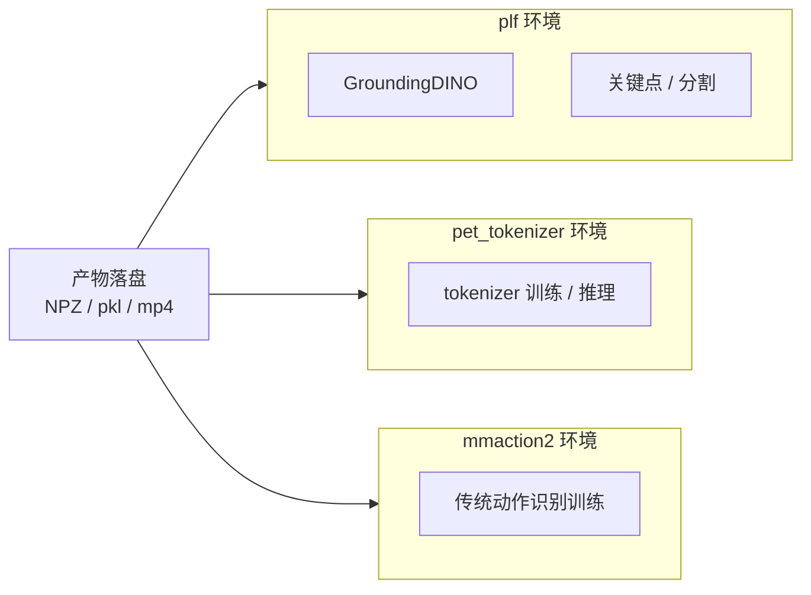
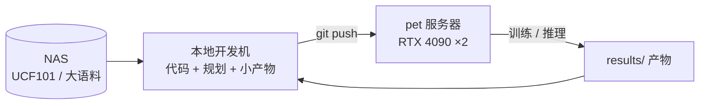

# 系统架构：结构 · 设计 · 进度

> **怎么读**：先看 **§2 待决策登记表**（我们面临什么选择）与 **§1 概念补充**（能力分层 A0–A5 等通用知识）→ 再看 **§3 端到端总图 / §4 分层设计**（设计现状）→ 其余为索引、约定、演进与进度。
>
> **本文是所有「结构 / 设计」问题的唯一入口**：术语表（§0）→ 概念补充（§1）→ **待决策登记表（§2）** → 端到端总图（§3）→ 分层设计（§4）→ 跨切面（§5）→ 决策索引（§6）→ 约定（§7）→ 演进记录（§8）→ 进度（§9）。
>
> **深入设计**：模型层 → [8 号《身份-动作 Tokenizer》](./identity-tokenizer.md)；身份两条路线原理 → [7 号《身份标识与检索》](./identity-and-retrieval.md)；数据集 → [2 号《数据集全景》](./datasets.md)；训练 → [4 号《训练体系》](./training-guide.md)。

## §0 术语表

> 首次出现的术语都集中在这里查一遍；后续正文里就不重复定义。

- **mmaction2**：动作识别（视频分类）开源框架，本仓库用它做训练与推理
- **GroundingDINO**：开放词汇检测器——给它一句文字提示（"cat"），它就能在图里框出物体
- **DINOv2**：自监督训练出来的视觉特征提取器，把图/帧变成长长的一串数字（向量），特点是"同一个东西的向量应该相近"。（**身份 embedding 的当前默认候选，未实测**）
- **FAISS**：向量相似度检索库，把一堆向量存进去，新来一个向量能快速找出库里最像的前 N 个。（**向量库候选之一；本项目登记库极小，默认用 numpy 暴力检索**）
- **SAM / SAM2**：Meta 出品的分割模型，给一个点/框/提示就能把物体边缘精确抠出来；SAM2 加了记忆注意力，能沿时间传播掩码。**本项目的用法**：**背景对象层**（维护背景物件清单 + 纠正/补全 GroundingDINO），**仅关键帧触发**；**不用于抠猫**（抠猫用 `rembg` 类实时小模型）
- **OWLv2**：开放词汇检测器，跟 GroundingDINO 思路类似
- **HDBSCAN**：基于密度的聚类算法，把一堆向量自动分成若干簇，不用事先指定要分几类
- **ByteTrack**：经典的多目标跟踪算法，给检测框配上身份 id、维持轨迹
- **CatHuBERT**：借用 HuBERT 语音预训练范式，给视频里"行为素"打伪码再自监督预训练
- **TivTok / SIF**：视频 tokenizer，用 TIV（时间不变）+ TV（时间可变）两组 token 表达视频。⬇️ **已降为备档**（身份改由参考输入提供后 TIV 冗余）——备档见 [`papers/docs/tivtok-reference.md`](../../papers/docs/tivtok-reference.md)
- **FLOAT / LIA**：身份-动作解耦方法；运动 latent = 正交运动基的线性组合 `z_t = Σ λ_m·v_m`
- **TiTok**：视觉 tokenizer，用几十个 token 就能表达一张图（而不是动辄几百个 patch token）
- **正交运动基**：M 个两两正交的运动方向（QR 硬约束）；每帧的动作 = 这些方向的加权和，系数 `λ_m(t)` 可读
- **checkpoint**：训练好的模型权重文件，本仓库放在远程 pet 服务器
- **NAS**：网络存储，本项目指挂载在开发机上的共享磁盘（UCF101 等大语料放这里）
- **RTF**（Real-Time Factor）：推断速度指标，每秒视频时长除以每秒推断时长，0.032 表示处理速度约为实时 30 倍
- **对比学习（contrastive learning）**：核心思想——把「同一类」样本在特征空间里拉近、把「不同类」样本推远（正样本对 invariance / 负样本对 discrimination）。**本项目里它是身份识别的统一原理**：猫 Re-ID 的 embedding 检索、物体实例识别都按此实现（其中 embedding 模型与向量库为**待实测槽位**）。注意：它是**原理**，不等于必须用对比损失——身份-动作 Tokenizer 的身份通道走**参考输入条件化 + 重建**（见 [8 号](./identity-tokenizer.md) §2.6）。

## §1 概念补充

> 本节是**通用概念/知识**，用来理解 §2 的各个决策项。**概念不进待决策登记表**（§2 的体例是「每项必填：选项/倾向/判据/落点」）。

> ⚠️ **命名空间提醒**：本文档的 **`L1`–`L8` = 管线层编号**（定位跟踪 / 跟随视角 / 背景移除 / 动作表征 / 动作分割 / 动作识别 / 身份识别 / 应用出口）。
> 各 change 的 `design.md` 内部**另有一套 `L1`–`L8`**（那是该 change 自己的**决策**编号，如 `video-feature-latent` 的 L1–L8 决策节）。**两者不是同一命名空间**，跨文档引用时请带上下文。

**符号速查**（读 §1 与 §4.4 前先过一遍；后文不再重复解释）

| 记号 | 读作 | 一句话 |
|---|---|---|
| `w_identity` | 身份向量 | 从**参考输入**（用户拍的猫图/短视频）提取的**固定向量**——"这是哪只猫"；与待分析视频无关 |
| `z_j` | 动作特征 | 第 j 个 **tubelet**（覆盖 t 帧）编码出来的连续特征 |
| `V = {v_1…v_M}` | 正交运动基 | **M 个互相垂直的运动方向**（每次前向做一次 QR 强制正交；M ≈ 20–32）|
| `λ_j = (λ_1…λ_M)` | 动作系数 | `z_j` 在这 M 个方向上的**坐标**；**每 t 帧一份**（t = tubelet 跨度，默认 4）|
| `λ_m(t)` | 动作基元曲线 | 第 m 个运动方向随时间的强度曲线（可画、可命名）|
| `t` / `p` | tubelet 尺寸 | 3D patch 的时间跨度（默认 4 帧）/ 空间边长（默认 8×8）|
| 重建 | — | `decode(w_identity + Σ_m λ_m(t)·v_m)` → 第 t 帧 |

> 与 **FLOAT** 的对应：`w_identity` ↔ FLOAT 的身份 latent `w_{S→r}`；`Σ_m λ_m·v_m` ↔ FLOAT 的运动 latent `w_{r→S}`。**命名提示**：FLOAT 论文写 `λ`，而其**代码变量名叫 `alpha`**——同一东西，**本文件统一写作 `λ`**。

### §1.1 动作识别模型的能力分层（A0–A5）

> 为什么要分层：**「动作识别模型」不是一个东西**——不同层的模型能力差好几个量级，而名字都叫"动作识别"。**看输入输出就能分清。**

| 层 | 名称 | 输入 → 输出 | 该层**新增**的能力 | 多动作 | 时间戳 | 全程覆盖 | 在线 | 代表模型 | 需要的标注 |
|---|---|---|---|---|---|---|---|---|---|
| **A0** | 单帧分类 | 一张图 → 1 类别 | 基础识别 | ❌ | ❌ | — | ✅ | ResNet / ViT（ImageNet）| 单图类别 |
| **A1** | **片段分类**（主流）| 定长片段 → **1 类别** | **+ 时间**（多帧）| ❌ | ❌ | ❌ | ❌ | **VideoMAE / UniformerV2 / SlowFast / TSN / 本仓 mmaction2 全部** | 片段类别 |
| **A2** | 多标签片段分类 | 定长片段 → **多类别** | + 一段可有多个动作 | ✅ | ❌ | ❌ | ❌ | 多标签变体 | 多标签 |
| **A3** | 时序动作检测（TAD）| 长视频 → **多个变长段 + 起止秒** | + **定位（时间戳）** | ✅ | ✅ | ❌ | ❌ | ActionFormer / TriDet / TadTR | **边界标注** |
| **A4** | 时序动作分割（TAS）| 长视频 → **逐帧标签 → 覆盖全程的段** | + **全程覆盖**（含背景类）| ✅ | ✅ | ✅ | ❌ | MS-TCN / ASFormer / DiffAct | **逐帧标注** |
| **A5** | 在线动作检测（OAD）| 视频流 → 当前时刻动作 | + **因果 / 在线** | ✅ | ✅ | ✅ | ✅ | LSTR / OadTR / TeSTra | 在线逐帧标注 |

#### §1.1.1 「变长视频」到底怎么被处理的（三层 + 采样器实证）

**先拆三层**（混着问就永远说不清）：

| 层 | 问题 | 答案 |
|---|---|---|
| (a) **能不能吃进去** | 接受任意长度输入？| ✅ **都能**——靠采样压成定长张量 |
| (b) **输出是否随长度变** | 更长视频 → 更多结果？| ❌ **都不能**——恒为 1 个标签 |
| (c) **是否理解「时长」差异** | 打哈欠 1 s vs 睡觉 30 min？| 🟡 **取决于采样器** |

**关键：本仓用的两种采样器语义完全不同**（源码实证）：

| 采样器 | 语义 | 本仓谁在用 | 遇 30 s 视频 | 遇 1 s 视频 |
|---|---|---|---|---|
| **`SampleFrames(clip_len, frame_interval)`** | **固定跨度** `ori_clip_len = clip_len × frame_interval`；长视频**随机（训练）/居中（测试）取一段** | VideoMAE / VideoMAEv2 / AIM / VideoMAE-base（`16, 4`，**8 处**）| ⚠️ **只看到其中 2.1 s**，其余完全没进模型 | `np.mod` **循环重复采样**补足 |
| **`UniformSampleFrames(clip_len)`** | 源码描述：*"divide the video into n segments of equal length and randomly sample one frame from each segment"* → **铺满整段** | PoseC3D（`48`）| 铺满 30 s，但每点间隔 **0.6 s** → **快动作丢失** | 铺满 1 s（大量重复）|
| `SampleFrames(1, 1, num_clips=3)` | 取 3 帧 | TSN | 只看到 3 帧 | 取 3 帧 |

代码级证据（`mmaction2/.../loading.py`）：
```python
ori_clip_len = clip_len * frame_interval      # 时间跨度
frame_inds = np.mod(frame_inds, total_frames) # 越界即循环重复
```

**由此得到那个根本矛盾（= C19 的由来）**：
```
窗口覆盖长 → 时间分辨率低（快动作丢失）
窗口覆盖短 → 长动作看不全
→ 单一时间尺度无法两头兼顾
```

#### §1.1.1b 补充：VideoMAE 的「输入长度可配置」≠「处理变长」

**常见误解**：「VideoMAE 能处理变长视频吧？」——**对一半**。

```
VideoMAE：输入长度【可配置】（T 是超参）  ✅
        ≠ 输入长度【可变】（一次前向吃任意长）        ❌
        ≠ 输出长度随输入变化（多段 + 时间戳）         ❌
```

**为什么它对输入长度友好（代码级原因）**：

```python
# models/mmaction2/mmaction/models/backbones/vit_mae.py
use_learnable_pos_emb: bool = False     # 本仓 config 未设 → 默认 False
num_patches = (img_size // patch_size) ** 2 * (num_frames // tubelet_size)
pos_embed = get_sinusoid_encoding(num_patches, embed_dims)   # 按 grid【算】出来
self.register_buffer('pos_embed', pos_embed)                 # 不是学出来的
```

→ **sin-cos 位置编码是算出来的、不是学出来的** ⇒ 换 T 时**位置编码不必重训**（按新 grid 重算即可）。
**论文佐证**：*"Our VideoMAE can easily scale up with more powerful backbones (e.g. ViT-Large and ViT-Huge) and **more frames (e.g. 32)**."*

**但换 T 仍不是免费的**：

| 步骤 | 代价 |
|---|---|
| ① 重建模型（改 `num_frames`）| ✅ 免费（sin-cos 自动算）|
| ② 迁移 transformer 权重 | ✅ 免费（权重不含 T 维度）|
| ③ **重新微调** | ⚠️ **不免费**——分类头与所有层均在原 T 下训得；实践中换 T 通常需重新微调 |

（若 `use_learnable_pos_emb=True`，还须**插值**学出来的位置编码，更麻烦。）

**⭐ 对本项目最有用的推论**：**多时间尺度变便宜了**——同一套权重换 T 只差一次微调 ⇒ **C19「多时间尺度」可用「同一骨干的不同 T 变体」实现，不必两套架构**。

**但仍需注意**：本仓 `num_frames=16` ⇒ 该 checkpoint **固定看 16 帧（≈2.1 s）**，长视频其余部分**从未进入模型**，要出多个结果仍须**在外面滑窗**。

#### §1.1.2 我们的 `λ` 能处理变长吗 —— 能，且输出天然变长

```
长视频 → 滑窗（16 帧/窗）→ 每窗出 λ → λ 序列（长度 ∝ 输入长度）
```

| | 主流识别模型 | 我们的 `λ` |
|---|---|---|
| 输入变长 | ✅ 采样压平 | ✅ 滑窗 |
| **输出** | ❌ 定长（1 标签）| ✅ **变长**（λ 序列）|
| 时间分辨率 | 被采样固定死 | 由滑窗 stride 决定（**可调**）|
| 长动作（30 min）| 压成 N 点 → 丢细节 | 切成多窗 → **每窗都有 λ** |
| 短动作（1 s）| 可能被采样漏掉 | 落在某窗内即可捕获 |
| **多时间尺度** | 要改架构 / 多模型 | **天然**（换窗口大小即得另一组 λ）|

**3 个限制（必须承认）**：
1. **单窗口内仍是定长（16 帧）** → 超过 16 帧的动作只看局部 → 段边界的「完整时序理解」受限
2. **跨窗口独立**：相邻窗口 λ 独立算（除非重叠）→ 需后处理平滑（= C20 选项②）
3. 若要「**模型内部**处理任意长序列」→ 需因果/流式或长窗注意力 → 属 C18 / C19

> **一句话**：我们**不比主流强在「窗口内理解更长的动作」**（那要靠多时间尺度），但**强在「输出天然是变长的」**——而这恰是多动作 / 时间戳的前提。

**能力是逐层叠加的**（这才是"分层"的意义）：

```
A0 基础识别
 └─ A1 +时间（多帧 → 一个标签）        ← 主流停在这里
     └─ A2 +一段可有多个动作
         └─ A3 +定位（给时间戳、变长输出）
             └─ A4 +全程覆盖（每个时刻都有标签，含背景）
                 └─ A5 +因果/在线（不看未来帧）
```

**关键：A1（也就是 99% 叫"动作识别"的东西）的输入输出形状**

```
输入：一段【已裁好的】视频（谁裁的？人裁的）
  内部：均匀采 T 帧（T 固定 16/32/64）压成定长张量
输出：[1 个类别]    shape [num_classes]
⚠️ 输出里【没有时间这个维度】
```

**一个例子最直观**（10 秒视频：0-3s 舔毛 → 3-7s 走动 → 7-10s 睡觉）：

```
用 A1（VideoMAE / UniformerV2）：
   你必须【自己先裁成 3 段】再分别喂进去 → 每段出 1 个标签 "grooming"
   它不会说「0-3s 是舔毛」——那个 0 和 3 是你裁的时候自己定的，不是它给的

用 A3（如 ActionFormer）：
   直接喂 10 秒整段 → [{"0-3s": grooming}, {"3-7s": walking}, {"7-10s": sleeping}]
   时间戳是它给的
```

> **一句话**：A1 做的是「**给一个已切好的片段贴一个标签**」；A3/A4 做的是「**从长视频里找出动作在哪、有哪几段**」。

> ⚠️ **三个必须先破除的混淆**：
> 1. **「喂变长视频」≠「理解变长」**——混淆点在【数据文件】与【模型张量】是两个层面：
>    ```
>    【数据文件】 sit_001.mp4 —— 时长任意（变长）          ← 数据加载器看到的
>          ↓ SampleFrames（dataset 的 __getitem__）
>             从任意长视频里【均匀采 T 帧】→ [T,H,W,3]（定长） ← 模型只看到这个
>          ↓
>    【模型】   输出 [num_classes] —— 1 个标签
>    ```
>    采样是「**抹平**」而不是「**理解**」：模型不知道原视频多长、也不在乎。所以**喂变长视频是常规操作**，但它**换不来**「识别变长动作」的能力——60 秒含 3 个动作的视频喂进 A1 仍是 1 个标签（三个动作的**混合**）。
>    **本仓实证**：7 个训练 config 全部定长采样（`clip_len=16/48/1`）；标注格式 `<video> <class>`（一行一视频一类别）；mmaction2 里的 `UntrimmedSampleFrames` 是给 TAD/TAS 准备的，我们一个都没用。
> 2. **输入变长 ≠ 输出变长**——A1 是「变长输入 → **定长输出**」
> 3. **多 clip 测试 ≠ 多动作**——`num_clips=10` 是把**同一个** clip 采样 10 次做平均，输出**仍然只有 1 个标签**

> ✅ **但「变长输出」可以用定长模型 + 滑窗做出来**：定长窗口铺满长段 → 每窗一个标签 → 后处理合并成段。**这正是 C20 选项② 的路线**——本质是「**用 A1 能力模拟 A3/A4 的输出形态**」，模型本身仍是 A1。

**为什么主流停在 A1**：训练数据形态锁死的——Kinetics / UCF101 / ActivityNet(裁剪版) 的标注就是「一片段一类别」，模型架构（固定采 T 帧）与标注体系互相锁定。

> ✅ **框定：主流做法不是错，是另一个任务的正确解。**
> A1 的任务定义就是「给一个**已裁剪好、只含一个动作**的片段，输出它的类别」。在那个定义下，**固定 T 帧 + 1 个标签是正确且高效的**。
> 我们不是要「纠正」它，而是**任务不同**：我们要从**未裁剪的长视频**里切出**多个段 + 时间戳**（A4 级输出）。两者不可互相替代，也不存在谁更先进。
> 更完整的模型族、输入契约与数据集细节见 [`papers/docs/action-recognition-models.md`](../../papers/docs/action-recognition-models.md)。

**我们落在哪层 ／ 目标哪层**：

| 层 | 我们能否用 | 说明 |
|---|---|---|
| A0 / A1 | ✅ 能 | 现有：16 帧窗口。**用无监督聚类替代分类器**（activity 标注是「伞类」，不能直接当监督）|
| A2 | 🟡 可近似 | 多标签可用「聚类 + 阈值」得到 |
| **A3 / A4** | ❌ **不能直接训** | **缺边界标注（A3）/ 逐帧标注（A4）** |
| A5 | ❌ | 需在线/因果训练 |

| 范式 | 必需标注 | 我们有吗 |
|---|---|---|
| A3 TAD | **边界标注**（每段起止秒 + 类别）| ❌ |
| A4 TAS | **逐帧标注**（含背景类）| ❌ |
| 实际持有 | cats v1 activity 标注（「伞类占一半」）+ 无边界 | ⚠️ 弱标注 |

**我们的路径**：

```
需求层 = A4 级输出（覆盖全程的段列表 + 时间戳）
   例：「3:00–3:15 舔毛，3:15–3:40 走动，3:40–4:10 睡觉」

但标注只支持 A1
   ↓
方案 = A1 能力（逐窗标签，无监督聚类）
       + 时序后处理（变化点检测 / 最小段长约束 / Viterbi）
       → 模拟 A3/A4 的输出形态（见 C20 选项②）

在线（A5）若要做 → 滚动窗口近似（延迟 = 窗长），见 §1.2 三层表
```

**所以"多段 + 时间戳"不是"要不要"的问题，而是输出形态决定的。**

### §1.2 「实时」的语义：四个正交轴 + 因果性三层

| # | 轴 | 取值 | 我们 |
|---|---|---|---|
| ① | **吞吐** | RTF < 1 / > 1 | ✅ 轻松满足（≈0.1）|
| ② | **流式性** | 批（有界输入）/ 流式（无界流）| 两者都要 |
| ③ | **因果性** | 非因果（可见未来）/ 因果（仅过去）| 见下 |
| ④ | **触发与输出** | 按需一次性 / 常驻逐秒推 | 按需 + 按需开启 |

> **RTF < 1 ≠ 实时交互**：RTF=0.1 但处理 1 小时录像要 6 分钟 → 等 6 分钟才出结果 = 交互上不实时。
> 真正的实时约束 = **端到端延迟 + 因果性**。RTF 对我们是瓶颈外的事（14.7 分钟语料分钟级处理完）。

**关键：因果性差异不在模型内核，而在时序后处理**

模型内核吃的就是 **16 帧窗口** → **滚动窗口推理（每次喂 `[t−15, t]`）与训练完全一致，零重训代价**，延迟 = 窗长（≈0.5 s @30fps）。

| 层 | 抽查（非流式）| 实时（流式）| 需重训？ |
|---|---|---|---|
| ① **模型内核**（16 帧 → `λ_j`）| 整段切片 | **滚动窗口** | ❌ 一致，零代价 |
| ② **时序后处理**（段边界/平滑/簇分配）| 全局非因果平滑（更准）| 因果在线平滑（有延迟）| ❌ 只是后处理 |
| ③ **低延迟内核**（延迟 < 窗长，如只等 4 帧 tubelet）| — | 因果注意力 + 流式训练 | ✅ **需重训（v2 条件启动）** |

### §1.3 为什么 `λ` 不逐帧（= tubelet 粒度）

**先说 `λ` 是什么**（见上方符号速查）：视频编码器对每个时间位置输出一个**动作特征** `z`；把 `z` 投影到 **M 个互相垂直的运动方向** `V = {v_m}` 上，得到的**坐标**就是**动作系数** `λ = (λ_1…λ_M)`——它描述「这一小段时间里，各个基础运动方向各占多强」。方向正交 ⇒ 坐标可读、可单独解释。

**本节的「不逐帧」指时间粒度**：`λ` 不是一帧一个，而是**每 t 帧一个**（t = tubelet 时间跨度，默认 4 → 16 帧窗口得 4 个 `λ`）。

1. **内在一致性**：3D patchify 的 tubelet 覆盖 t 帧 → 编码器输出**天然**只有 `T/t` 个时间位置，**给不出逐帧**。此前文档写「逐帧 `λ_t`」与 tubelet 自相矛盾
2. **物理直觉（用户提的）**：**运动是过程量，单帧提不出来**
   - FLOAT 的「运动系数」（**论文写 `λ`、代码变量叫 `alpha`**，同一东西）能单帧算，是因为它定义的「动作」是**相对参考的姿态偏离**——姿态是**状态量**，单帧可算
   - 我们要的是**运动**（速度 / 方向 / 轨迹）——必须多帧

**为什么 tubelet 粒度够用**：动作基元曲线够密（0.13 s/点）· 段边界 ±1.5 s 要求远宽于该粒度 · 行为聚类本就不需帧级 · 时间维 token 降至 1/t

### §1.4 离散化（VQ）的好处与代价——以及我们为什么不做

**先回答「为什么要离散化」——它真实的好处有 6 条**：

| # | 好处 | 说明 |
|---|---|---|
| 1 | **自回归生成的接口** | 离散 token 才能喂给 LLM 式 next-token prediction。**这是 TiTok / TivTok / VidTok / AdapTok 这条线存在的根本原因**——它们是为「用语言模型的方式生成图像/视频」而生的。连续 latent 生成要走 diffusion / flow matching（另一套范式）|
| 2 | **明确的比特预算** | `log2(K)` bits/码字是硬信息预算，天然支持变长码（AdapTok 的自适应 token 预算就依赖它）|
| 3 | **防「后验塌缩」** | 强制信息穿过瓶颈，防止解码器忽略 latent 直接抄输入（VQ-VAE 的原始动机之一）|
| 4 | **可枚举的「词表」** | 码字可枚举、可统计频次、可做 n-gram / Markov、可说「这一段对应哪个码」 |
| 5 | **训练更稳** | latent 被钉在有限集合上，无尺度漂移 |
| 6 | **可精确比较 / 传输** | 离散码无浮点误差累积 |

**代价 5 条**：量化误差（重建下降，**但非必然**——TiTok 官方 VAE 模式反而更好 0.84 vs 1.49）· **码本塌缩**（VidTok 实测 VQ-262144 利用率仅 **0.2%**）· 不可微（需 straight-through 等 trick）· 梯度信息损失 · 表达能力受限（K 个码字 vs 连续 `R^d`）。

**逐条对照我们——6 条好处一条都没命中**：

| 好处 | 命中我们？ |
|---|---|
| 1 自回归生成接口 | ❌ **我们不做 AR 生成**；将来若做可控生成，走 **flow matching**（FLOAT 路线，本来就是连续的）|
| 2 比特预算 | ❌ 不做极端压缩；token 数由算力决定即可 |
| 3 防后验塌缩 | 🟡 用 **KL 正则**替代（TiTok VAE 模式同款）|
| 4 可枚举词表 | ❌ **我们已经有词表了**（见下）|
| 5 训练更稳 | 🟡 用 KL + 监控（λ 方差谱）替代 |
| 6 可精确比较 | ❌ 不依赖 |

**关键：我们已经有「离散化」了，而且是更好的那一层**

```
帧级 VQ（被否）      每帧 / 每 tubelet → 一个离散码
                    8192 个无语义码字，要人工一个个解释     ← 又冗余又难懂

序列级聚类（已有）    一整段行为 → 一个簇 ID + 人工命名
                    （video-feature-latent 的 HDBSCAN + 命名）
                    ← 这才是我们真正要的「动作词表」，且有语义
```

→ **帧级 VQ 冗余**，且比序列级聚类更不可解释。

**判断标准（什么时候真的需要离散化）**：

| 条件 | 需要？ |
|---|---|
| 要用 AR / LLM 式生成 | ✅ |
| 需要硬比特预算 / 极端压缩 | ✅ 可能 |
| 下游是聚类 / 探针 / 异常检测 | ❌ **连续更好**（SoftVQ 论文自己的证据也是连续优于 VQ）|

→ 我们落在第 3 行。

**结论**：v1 **不量化**；**保留为条件触发**——若将来走 AR 生成路线，或需要一个「动作词表」而聚类效果不佳时再启用。

> 易混点：**后处理里的离散化是另一回事**——例如在 `λ_m(t)` 曲线上做阈值化，得到「第 3 号基元被激活」这种**事件流**。那是**推理期**的离散化，与**训练期 VQ** 无关，也属于「离散化交给后处理」的做法。

### §1.5 对称架构：参考视频与输入视频共用同一套结构

**来源**：FLOAT 本来就是对称的——`net_app`（外观编码）与 `fc`（运动头）**同一套参数**分别作用于 source 与 target（`float/models/float/encoder.py`），两个输入都算出「身份 + 运动系数」。我们把它推广为：**参考也输入一段视频**（而非单张图）。

```
参考视频 → patchify ─┐
                     ├→ [编码器（同一套参数）] → registers     → 身份_ref
输入视频 → patchify ─┘                        → tubelet 特征 → λ（逐位置）
重建：decode(身份_ref + Σ_m λ_m·v_m)
```

**两个输入都走同一套分解**，**差别只在我们取哪部分输出**。

#### §1.5.1 ⚠️ 隔离约束：两组输出**互不看**（关键）

TivTok 的 SIF 里 `TV tokens` 的 scope **包含 TIV tokens**——即**身份 tokens 参与动作 tokens 的注意力**。**在我们这里这是一个泄漏通道**：身份信息会顺着注意力流进 λ，而我们的审计要求「λ 上训个体分类器应接近随机」。

**因此本设计必须与 SIF 不同**：

```
register tokens       → 可以 attend patch tokens（这是它聚合信息的方式）
patch / tubelet tokens → 【不能】attend register tokens     ← 关键约束
两者互不看
```

→ 隔离后，**动作侧 = 纯视频编码（tubelet）→ 正交基投影 → λ**，与 FLOAT 的动作侧在**分解结构**上一致。

**与 FLOAT 的差异（必须说清）**：

| | FLOAT 动作侧 | 我们 |
|---|---|---|
| 编码器 | **conv encoder（图像，逐帧）** → 全局特征 | **视频编码器（3D tubelet）** |
| 运动系数 | `α = MLP(全局特征)`，**只看一帧** | `λ` 从**逐 tubelet** 特征投影 |
| 时序上下文 | **无**（靠 flow-matching transformer 在序列上补）| **tubelet 自带 t 帧** |

→ ✅ 一致的是**分解结构**（`w = 身份 + Σλ_m·v_m`、正交基、残差式）与**输入流分离**；❌ **不能一样的是动作编码器**（FLOAT 逐帧无时序，我们已定 tubelet）。

#### §1.5.2 它顺手解决的三件事

| # | 解决什么 |
|---|---|
| 1 | **C13 的「参考运动污染」顾虑消失**——参考视频**也走同一套分解**，其自身运动被分到 `λ_ref`，**不进 `身份_ref`**；无新增泄漏面 |
| 2 | **变长参考 → 定长身份**——`身份_ref` 由 **register tokens** 联合融合得到（这是 register 的职责；与「逐图编码后平均」不同，register 能做跨视角关系推理）|
| 3 | **补上身份监督缺口**——参考与输入**是同一只猫** ⇒ `身份_ref ≈ 身份_in` 是**无标注、无负样本**的一致性信号（不同于对比学习：不需要「哪只猫」标签，也不需要负样本对）|

### §1.6 从解耦训练到动作识别：**完整流程**（端到端一张图）

> 这一节回答「**怎么参考 LIA 解耦、拆出动作特征、再用它做识别**」。前面各节讲了零件，这里讲装配与用法。

**两个阶段**：

```
阶段一（自监督，无需动作标签）：猫视频 → 学一个「能拆开身份 / 动作」的编码器
阶段二（拿 λ 去识别）        ：新视频 → 编码器 → 动作码 λ 序列 → 动作识别
```

#### §1.6.1 阶段一：学解耦（LIA 式自重建，零动作标签）

**数据构造**（零标注，同一段视频取两份）：
```
同一只猫的两段：一段当【参考】（提供身份）、一段当【驱动】（提供动作）
⚠️ MUST 来自【不同片段】——否则参考里已含动作，λ 可以偷懒（这是最容易踩的坑）
```

**前向 + 损失**：

```
参考 → 编码 → w_identity（减掉运动子空间分量）
驱动 → 编码 → λ（逐 tubelet，投影到 M 个正交方向）
decode(w_identity + Σ_m λ_m·v_m) → 重建【驱动的第 j 个 tubelet】
损失 = 重建(L1) + 感知 + 对抗      ← 全是重建类：没有动作标签、没有对比损失
```

**产出**：**一个训练好的编码器**，它的两个输出正是我们要的两样东西。

> **LIA 贡献的是什么**：论文原话 *"disentangle motion and appearance **within a single encoder-generator architecture**"*——**不用额外模块、不用结构表示**，靠「参考帧桥接 + 正交基分解 + 自重建」把运动从外观里拆出来。我们借的正是这三样。

#### §1.6.2 阶段二：拿 `λ` 做动作识别

```
新视频 → 编码器 → λ 序列（16 帧 → 4 个 λ，每个 M 维）   ← 这就是「动作特征」
                    ↓
① 无监督发现（主路线）  λ 序列 → UMAP + HDBSCAN → 行为簇 → 人工命名
② 线性探针（验收闸门）  λ → 线性分类器 → 动作类别 top1
③ 段列表输出（产品）    λ 序列 + 时序后处理（中值滤波 / Viterbi / 最小段长）
                        → 「3:00–3:15 舔毛，3:15–3:40 走动」
```

**为什么用 `λ` 而不是普通窗口特征**：

| | 普通窗口特征 | `λ` |
|---|---|---|
| 身份污染 | ✅ 有（外观混在里面）| ❌ **审计过，接近随机** |
| 维度 | 高（768+）| 低（M 维 / 时间位置），曲线可画 |
| 可解释 | ❌ | ✅ 每个 `λ_m(t)` 是一条可命名的曲线 |
| 跨猫可比 | 需归一化 | ✅ 同构（同一组正交基的坐标）|

→ **解耦的目的是让识别器看到一个「干净、低维、可比」的信号。**

#### §1.6.3 关键澄清：`w_identity` **必须在，但不必好用**

```
训练期：w_identity 必须存在 —— 它是吸收外观的「垃圾桶」
        若没有它，外观只能挤进 λ，解耦就崩了
使用期：完全可以不用它 —— 不拿它做 Re-ID / 检索，只当训练期的配角
```

**即：`w_identity` 是解耦机制的**必要零件**，但不是产品目标。**

**身份特征「有了更好」体现在三处**：

| 用途 | 说明 |
|---|---|
| 报告可读性 | 「哪只猫在做什么」——多猫时必须说清是谁 |
| **训练期的免费监督** | `w_id(参考A) ≈ w_id(参考B)`（同猫不同参考）→ 帮身份码收敛，**间接让 λ 更干净** |
| **解耦验证的手段** | 换参考 → 外观变、动作不变（审计 λ 的关键测试）|

#### §1.6.4 分工（避免混淆）

| 谁提供 | 什么 |
|---|---|
| **LIA / FLOAT** | 分解公式 + 正交基 + 自重建训练范式（= 阶段一的做法）|
| **本项目额外要做的** | ① 参考 = 视频（多参考聚合）② 3D tubelet（运动需多帧）③ 参考身份通路（见 C29 / C30 / C31）|

### §1.7 理论对比：解耦路线 vs 直接监督

> 问题：**「先解耦出 λ 再识别」和「直接端到端监督做动作分类」，哪种理论上更优？**

#### §1.7.1 理论骨架：约束只会损失信息

```
直接监督 = 无约束优化    模型可自由使用任何信息（外观/背景/光照/动作…）降损
解耦路线 = 有约束优化    信息必须先穿过 λ 这个瓶颈才能用于分类
```

**data processing 不等式**：约束只会**损失**信息，不会凭空增加。
→ **给定充足且高质量标签、且测试分布＝训练分布时，直接监督的能力上限 ≥ 解耦路线。**

#### §1.7.2 但前提不成立时，结论反转

| 条件 | 谁更优 | 为什么 |
|---|---|---|
| 标签充足高质量 + 分布一致 | **直接监督** | 无约束最优 |
| **标签稀缺 / 质量差** | **解耦路线** | 自监督不需标签；此时另一个**根本不可行**（不是更优，是唯一可选）|
| **跨个体 / 跨域泛化** | **解耦路线** | λ 强制与身份无关 → **抑制「按外观走捷径」** |
| **动作与身份有交互**（个体特有动作）| **直接监督** | 解耦把该信息清掉了 ← 即 **C32** |
| 可解释 / 可复用 / 可聚类 | 解耦路线 | λ 可画曲线、可聚类、可迁移 |

#### §1.7.3 精确类比：这就是「自监督预训练 vs 端到端监督」

```
解耦路线 = 自监督预训练（LIA 式重建目标）+ 下游分类
直接监督 = 端到端监督训练
```
CV/NLP 的经验结论：**标签充足 → 两者接近（监督可能更好）；标签稀缺 + 无标注充足 → 自监督明显更优**；且**自监督目标与下游任务的对齐度**决定提升幅度。

**我们的对齐度比一般重建目标高**——目标做过两次「手术」：
```
① 抠像     → 移除背景与相机运动
② 身份剥离 → 移除外观（进 w_identity）
剩下的 λ 主要是动作   ← 与下游对齐度较高
```

#### §1.7.4 对照我们的实际情况

| 条件 | 我们 | 结论 |
|---|---|---|
| 标签充足？ | ❌ cats v1 **伞类占一半** | 直接监督不可行 |
| 无标注数据充足？ | ✅ followcam 34 + mammal 2234 + cats 717 + **UCF101 13320** | 自监督有料 |
| 跨个体泛化重要？ | ✅ 多猫 + 多环境 | 解耦有利 |
| 动作与身份有交互？ | 🟡 待定（**C32**）| 潜在代价 |
| 可解释 / 段列表重要？ | ✅ 要命名行为、要报告 | 解耦有利 |

→ **我们的条件明确落在「解耦路线更优」一侧**，但理由是「**直接监督的前提不满足** + 泛化/可解释需求」，**不是「解耦方法本身更强」**。

#### §1.7.5 一个可能最优的混合，与它对 λ 的要求

```
λ（无身份）+ w_identity（身份）→ 【两者都喂给分类器】（监督）
   → 若动作与身份真有交互，分类器能用上；若无，学会忽略
   → 上限 = 直接监督 + 更好的预训练初始化
   代价 = 放弃「λ 无身份」的审计意义
```

**关键区分（下游形态决定对 λ 的严格要求）**：

| 下游 | 对 `λ` 的要求 |
|---|---|
| **无监督发现（聚类）** | **必须严格无身份**——否则簇会按个体分 |
| **有监督分类** | 可以用上身份（有标签能纠正）|

### §1.8 行为素 → 动作：分层、分词与成熟模型

> 用户提出的类比：**行为素 = 单词，动作 = 句子**（动作由多个行为素拼成）。本节给出该层的做法与已有成熟工作。

#### §1.8.1 层级

```
帧 / λ（0.27 s）  →  行为素  →  动作段
                    （单词）    （句子，由多个行为素组合）
```

**关键纠正**：**行为素 ≠ 动作**。当前 `video-feature-latent` 阶段一/二做的「窗口特征 → 聚类 → 行为簇 + 命名」在建的是**行为素词表（词层）**，不是动作（句层）。

#### §1.8.2 音频领域的对应问题链（可直接借鉴）

音频：`波形 → 帧特征 → 音素(离散单元) → 音节 → 单词 → 句子`

| 工作 | 做法 | 对我们 |
|---|---|---|
| **无监督分词 + 词表发现**（arXiv 1603.02845）| *"a potential word segment (of **arbitrary length**) is embedded in a **fixed-dimensional** acoustic vector space... builds a whole-word acoustic model **while jointly performing segmentation**"*；**不预设词表大小** | **联合分割 + 类型发现**，正对应「先无监督发现动作类型」的主线 |
| **层次 HMM + 时长先验**（arXiv 1806.01665）| 两层 HMM 推断音节/音素边界；**时长先验作转移概率**；*"no phoneme class labels are used"* | 比「中值滤波」严格得多；等价于「最小段长约束」|
| ⚠️ **神经离散化难分词**（arXiv 2106.04298）| *"neural models for speech discretization are **difficult to exploit**... it might be necessary to **adapt them to limit sequence length**"*；最佳结果来自**高压缩的 Bayesian 表示** | **不要先把 λ 离散化**——序列越长越难分词。支持我们的「去量化」决策 |
| **NLP unigram 分词范式** | 用动作词表对序列做**最优切分**（最大化 `Σ log P(段) + log P(长度)`），DP/Viterbi 求解 | C20 选项② 的严格版 |

#### §1.8.3 已有成熟模型：无监督时序动作分割（Unsupervised TAS）

| 工作 | 要点 |
|---|---|
| **TAEC**（arXiv 2303.05166）| *"annotating action classes and **frame-wise boundaries** is extremely time consuming... we propose an **unsupervised** approach"* |
| **Temporally-Weighted Hierarchical Clustering**（arXiv 2103.11264）| *"Action segmentation refers to **inferring boundaries of semantically consistent visual concepts**"* → 层次聚类同时得边界与段类型 |
| CTE（2019）· ASAL（2023）| 连续嵌入 / optimal transport |
| （有监督对照组）MS-TCN · ASFormer · DiffAct | 需**逐帧标注**，本项目不具备 |

**无监督 TAS 的输入输出与本项目完全一致**：输入长未裁剪视频 → 输出**段边界 + 每段一个学到的类别**，不需标注。**可直接借鉴/复用，优于自研「后处理」。**

#### §1.8.4 「静止段作为分隔符」——用户的直觉

**用户类比**：画面中物体一段时间静止 → 可当**分隔符**（≈ NLP 的句号）。

**音频先例（支持）**：pause-based segmentation / VAD 是 ASR 的常用前置。
**音频已指出的局限**（arXiv 2203.15479）：*"pauses **do not necessarily coincide with semantic boundaries**. **Over-segmentation**"*。

**对本项目需额外处理的两点**：

| # | 问题 |
|---|---|
| 1 | **静止既是「分隔符」又是「一种行为」**——蹲 3 秒可能是停顿，蹲 20 分钟是「睡觉」⇒ 需**时长阈值**区分（同一信号两种语义）|
| 2 | **不是所有切换都有停顿**——走→跑是连续过渡 ⇒ 只靠静止会漏边界 |

**但我们有一个优势**：L3 抠像后画面只剩猫 ⇒ **「画面运动能量」≈「猫的运动能量」**，无需背景建模；而且 **`λ` 本身就是运动系数** ⇒ `Σ_m|λ_m(j)|` **直接就是运动能量曲线**（零成本边界信号）。

#### §1.8.5 推荐的组合（三步）

```
第 1 步（零成本预热）：λ 运动能量曲线 → 低能量段作【强边界候选】→ 长视频切成若干「行为块」
第 2 步（成熟模型）  ：每块内用【无监督 TAS】做细分段 + 类型聚类
第 3 步（人工）      ：命名段类型
```

**理由**：静止边界把问题**降维**（长视频 → 若干净块），使第 2 步的模型工作在**更短、更同质**的片段上——正好回应 arXiv 2106.04298 的「序列过长时神经方法难以分词」警示。


#### §1.8.6 行业架构模式（联网调研 2026-09-17）

完整调研见 [`papers/docs/action-recognition-products.md`](../../papers/docs/action-recognition-products.md)。**核心结论：委托方假设「先分段再逐段识别」作为普遍规律不成立**——业界主流是「门控/跟踪/规则 → 定长窗口分类 → 时序后处理聚合成段」。

| 模式 | 谁在用 | 关键取舍 |
|---|---|---|
| **1 门控-精算级联** | Frigate / Viseron / VideoPipe | 算力省 1–2 个数量级；**门控漏了则后面全漏** |
| **2 跟踪区间即段** | DeepStream / 安防 | 天然带 ID；但**段 = 轨迹区间**，多动作重合无法表达 |
| **3 窗口分类 + 时序聚合** | mmaction2 长视频 demo / Google `FRAME_MODE` / 畜牧 | 改造量最小；**与本项目现状 100% 兼容** |
| **4 先段后判（非语义切分）** | Google `SHOT_MODE` / 视频索引产品 | 段可控；但**段 = 镜头段 ≠ 动作** |
| **5 联合定位-分类** | 学术界 / 体育事件（TAD、action spotting）| 唯一真给时间戳；**标注成本高、缺生产级封装** |

**已核实的关键事实**（🟩）：Google 的 `LabelDetectionMode` = `SHOT_MODE` / `FRAME_MODE` / `SHOT_AND_FRAME_MODE`（另提供 `stationary_camera` 选项，固定机位可用）；AWS 的 `SegmentType` 只有 `SHOT` / `TECHNICAL_CUE`；Frigate 的 review item = *"segments of time … that bundle together the objects and audio that were active at once"*，即**活动区间聚合**；本仓 vendored mmaction2 **确实含 TAL 配置**（`configs/localization/{bmn,bsn,drn,tcanet}`），但属**另一任务族**。

**⭐ 最贴近本项目的动物行为先例：Keypoint-MoSeq**（本仓已 vendored `third-party/keypoint-moseq/`，一手可核）

```
姿态/关键点序列 → [HDP-HMM] → syllable（细粒度单元）→ 组合 → motif（动作）
```

| 我们的层级 | Keypoint-MoSeq | 备注 |
|---|---|---|
| `λ`（t=4 帧 ≈ **0.27 s** @15fps）| **syllable**（鼠类目标 **400 ms**）| **粒度惊人接近** |
| 行为素 | syllable | 同层 |
| 动作段 | **motif** | 同层 |
| `T_pause`（停顿 vs 静止型行为）| **`target syllable duration`**（由 `kappa` 调）| 同一种「时长先验」|

其**已知风险**亦印证我们的担忧：*"Substantial size variation … may cause **syllables to become over-fractionated**, i.e. the same behaviors may be split into multiple syllables"*。
→ **我们不是没有先例**：这是「细粒度单元 → 组合动作」的成熟无监督范式，且**用 HDP-HMM**（正好对应 design D5 的路径 B）。

## §2 待决策登记表（**唯一权威**）

> **规则**
> 1. **本表是唯一权威来源**——其他文档（8 号模型设计、各 change design）只**引用 ID**，不复制内容，避免多处副本漂移
> 2. **编号连续（C01…Cn），按【追加顺序】**；新增项一律给下一个号、**不插队、不复用废号**（因此编号顺序**可能与章节顺序不一致**）；§2.10 有旧→新对照
> 3. **状态三档**：🔴 **待审定**（不定就开不了工）· 🟡 **待定**（不阻塞开工，可并行）· ⚪ **暂不适用**（保留备查）
> 4. **已决项移出本表** → 进 §2.8 已决项清单（保留 ID 备查）与 §8 演进记录
> 5. 每项必填：**选项 / 倾向（若有）/ 判据 / 落点**

### §2.0 总索引（先看这一页）

> **引用格式统一用「名字（Cxx）」**，不要裸用编号——编号会随重排变化，名字不会。

**🔴 待审定（不定就开不了工，共 7 项）**

| ID | 决策项 | 位置 |
|---|---|---|
| **C18** | **推理形态：流式 vs 非流式** | §2.6 |
| **C23** | **背景对象层触发信号**（虚拟裁剪窗口 / 真实机位）| §2.8 |
| **C27** | **相机数量与拓扑**（单机位 / 多机位协作）| §2.1 |
| **C28** | **报告「空白时段」的语义分类**（静止 / 出画 / 未覆盖 / 被遮挡）| §2.1 |
| **C30** | **多图/视频身份如何聚合**（残差聚合 / register+约束）| §2.5 |
| **C31** | **解码器是否加参考特征路径**（FLOAT/LIA 的 `feats`）| §2.5 |
| **C32** | **个体动作风格归属**（身份码 / `λ` / 明确忽略）| §2.5 |

**🟡 待定（不阻塞开工，共 23 项）**

| ID | 决策项 | 位置 |  | ID | 决策项 | 位置 |
|---|---|---|---|---|---|---|
| C01 | 夜间红外处理方案 | §2.1 |  | C19 | 动作长度（定长/不定长）| §2.6 |
| C02 | 多猫场景掩码 | §2.2 |  | C20 | 一个视频多个动作 | §2.6 |
| C03 | 视频编码器**代码骨架** | §2.3 |  | C21 | 实时模式延迟预算 | §2.6 |
| C04 | 编码器初始化 | §2.3 |  | C22 | 异常检测机制 | §2.7 |
| C05 | patch 尺寸 `t×p×p` | §2.3 |  | C24 | 掩码的类别来源 | §2.8 |
| C06 | 输入规格（分辨率/帧数）| §2.3 |  | C25 | 过分割过滤 | §2.8 |
| C08 | 正交基元数 M / d / 符号 | §2.4 |  | C26 | 与 GDINO 家具框的关系 | §2.8 |
| C12 | 训练粒度（**依赖 C04**）| §2.4 |  | C29 | 参考身份通路（三方案消融）| §2.5 |
| C33 | **动作识别路线**（无监督/监督/聚类辅助）| §2.6 |  | C34 | **分词层做法**（能量预分段/TAS/HMM/DP）| §2.6 |
| C35 | **`video-feature-latent` 阶段划分**（分词层是否提主线）| §2.6 |  | — | | |
| C14 | 参考/视频编码器是否共享权重 | §2.5 |  | — | | |
| C15 | register token 数量 K | §2.5 |  | — | | |
| C16 | 身份 embedding 模型（检索路线）| §2.5 |  | — | | |
| C17 | 向量库 | §2.5 |  | — | | |

**⚪ 暂不适用**：C07 自适应 token 预算（§2.3）

**✅ 已决项**（10 项）见 §2.9；历史讨论用的**旧编号**见 §2.10（两套编号**不同命名空间**，勿混）

### §2.1 输入域（跨环节）

**背景**：现有语料（34 段 followcam）只覆盖白天彩色；夜间红外段尚未处理。下游**全部环节**（L1 检测 → L3 抠像 → L4 表征 → L5 动作分割 → L6 身份）都默认 RGB 输入，红外域一致性必须先解决——否则夜间数据要么进不了管线，要么静默拉低下游指标。



| ID | 状态 | 选择项 | 选项 | 倾向 / 判据 |
|---|---|---|---|---|
| C01 | 🟡 | 夜间红外处理方案 | ① 训专用模型 / ② 红外+RGB 混输 / ③ IR 上色 | **未定**。① 成本最高（红外语料少 + 两套运维）；② 中等，需防 RGB 性能回退；③ 最低（复用全链路）但上色纹理可能污染动作/身份特征。**判据（待实测）**：夜间有效样本量、上色后特征与真彩色的分布距离、下游闸门指标。**落点**：独立 change（暂名 `night-infrared-ingest`）|
**⚠️ 场景边界条件（三条事实，必须先确定——它们直接决定 L1/L5/L6 的设计）**

| # | 问题 | 现状 | 证据 |
|---|---|---|---|
| ① | **猫会不会出画？** | ✅ **已确认会发生** | 批处理报告 3 个告警段是「低猫在场率」（段 `100505` 检出率仅 0.227）；[9 号 §1](./lessons.md) 明确「监控视频里几乎必然发生（猫会走出画面、被家具遮一半）」|
| ② | **摄像头能否覆盖整个房间？会不会有死角？** | ❌ **完全空白** | 文档从未提及覆盖范围/死角 |
| ③ | **只有一个摄像头，还是多机位协作？** | ⚠️ **假设过但未确认** | [7 号 §3](./identity-and-retrieval.md) 以「客厅 + 卧室两台摄像头」为 Re-ID 场景假设；live 模块 `stream_sources` **设计上支持多路**，但当前只注册 **1 路**；34 段 followcam 全部来自同一天（大概率单机位）|

| ID | 状态 | 选择项 | 选项 | 倾向 / 判据 |
|---|---|---|---|---|
| C27 | 🔴 **待审定** | **相机数量与拓扑** | ① 单机位 ② 多机位协作（需跨相机 ID 关联 + **时钟同步** + 视野重叠分析）| **未定**。单机位 = L5 只需"轨迹内 + 跨天 Re-ID"；多机位额外要：跨相机同一只猫的关联、跨相机时间轴对齐、相机拓扑（有无重叠视野决定能否靠时间连续性关联）|
| C28 | 🔴 **待审定** | **报告"空白时段"的语义分类** | ① 不区分（现状）② 区分四类：**在场但静止** / **出画** / **未覆盖（死角）** / **被遮挡** | **未定**。现状会让用户把「无行为记录」误读为「猫没做任何事」；而实际可能是"猫根本不在覆盖范围"。**覆盖范围问题（①/②）未澄清前，这条无法定** |

> **为什么这三条要紧**：若相机只覆盖部分区域，则「不在画面」≠「猫不在这」——报告里的「在场率 0.3」到底是"猫 70% 时间不在家"还是"70% 时间不在覆盖范围"，**目前无法区分**。


### §2.2 背景移除（L3）

| ID | 状态 | 选择项 | 选项 | 倾向 / 判据 |
|---|---|---|---|---|
| C02 | 🟡 | 多猫场景掩码 | 掩码并集 / 逐猫分离 | **待定**：并集简单，但身份训练需要单猫片段 |

### §2.3 视频编码器（L4）

| ID | 状态 | 选择项 | 选项 | 倾向 / 判据 |
|---|---|---|---|---|
| C03 | 🟡 | 视频编码器**代码骨架**（⚠️ 不是结构复用）| AdapTok（MIT）/ VidTok（MIT）/ LARP（MIT）/ 从零 | **AdapTok 代码骨架**可借鉴，但**只有代码部件可复用**：3D patchify 实现 / transformer block / 训练循环 / 数据管线 / 规模超参（12L·768d）/ 训练配方。<br>❌ **结构不能复用**：**block-causal 掩码**（为自回归设计；我们主产品离线、能看整段 → 是白白限制）、**SVQ 量化器**（已弃）、**1D 全局 latent 读出**（AdapTok 整段一组 L 个，我们要逐 tubelet）、**block-mask 自适应预算**（已弃）、**解码器量化输入接口**（我们喂连续 latent，分布不同）|
| C04 | 🟡 | 编码器初始化 | AdapTok 权重 / VidTok·LARP 权重 / 从零训 | **待实测，优先级下调**（2026-09-17）：AdapTok 编码器是 **block-causal + 输出全局 latent**，与我们要的**逐 tubelet / 非因果**不同 → 「同形所以权重可迁移」的论据**减弱**，需实测可迁移比例；**从零训的可行性上升**。~~SoftVQ-VAE 权重~~ 已排除（图像 tokenizer + 自带不用的量化器）|
| C05 | 🟡 | patch 尺寸 `t×p×p` | t ∈ {2,4,8}；p ∈ {8,16} | `t=4, p=8`（AdapTok 口径）为起点，做消融 |
| C06 | 🟡 | 输入规格 | 128 vs 256 分辨率；窗口长度 | **待定**：256 贴近 FLOAT 口径，128 省算力 |
| C07 | ⚪ | 自适应 token 预算 | 用 block-mask + ILP / 不用 | **暂不适用**（原挂在 AdapTok block-mask；SIF 移除后降为 v2 备选）|

### §2.4 动作通道（L4）

| ID | 状态 | 选择项 | 选项 | 倾向 / 判据 |
|---|---|---|---|---|
| C08 | 🟡 | 正交基元数 M / 维度 d / 符号 | M 取值；是否固定符号 | M 起点 **20–32**（LIA/FLOAT 用 20）、d=512；冻结基时必须固定符号，否则 λ 语义漂移 |
| C12 | 🟡 | **训练粒度**（⚠️ **依赖 C04**）| A-1 冻结可复用部分、只训新加组件 → A-2 端到端 | **两段都做**。**但「冻结什么」取决于 C04**：<br>· C04 选 **AdapTok 权重** → 可冻结**编码器/解码器块**，只训新增组件（正交基 / 身份分支 / λ 投影）——目的是把「新组件能否学会」与「骨干要不要重训」两个变量分开<br>· C04 选 **从零训** → **无骨干可冻结**，A-1 不成立（应直接端到端）<br>⚠️ **可迁移性待实测**：AdapTok 解码器是从**量化瓶颈**（SVQ 8192 码本）训出来的，我们喂**连续 latent**，输入分布不同 |

> **为什么 `λ` 不逐帧 → 见 §1.3。**

### §2.5 身份通道（L5）

| ID | 状态 | 选择项 | 选项 | 倾向 / 判据 |
|---|---|---|---|---|
| C13 | ✅ **已定：B（参考视频）** | ~~A. 高质量多图 / B. 参考视频~~ | — | **选 B**（用户裁定 2026-09-17）：① 对称架构下参考也走**同一套分解** → **「参考运动污染」不再是问题**（见 §1.5.1）；② 视频能覆盖猫**前后左右全部方向**（可要求用户拍得标准）→ 身份更完整；③ 与视频编码器**天然同构**（一套结构两个输入）。<br>~~原 A 方案~~（高质量多图）的"原理最干净"优势已被对称架构取代。<br>**B ⊇ A**：从参考视频抽 N 帧即得「多图」（OmniMate 的 MRCM 证明多参考图可轻量处理：in-context concat + 负 RoPE，无需融合模块，见 [`papers/docs/tokenizer-architecture-refs.md` §5d](../../papers/docs/tokenizer-architecture-refs.md)）|
| C14 | 🟡 | 参考编码器 vs 视频编码器是否共享权重 | 共享 / 分开 | **倾向共享**（须两次独立前向）；共享时用**两组 register tokens**（身份组 / 运动组）|
| C15 | 🟡 | register token 数量 K | — | 待消融（K 大→信息全但冗余，K 小→瓶颈）|
| C16 | 🟡 | 身份 embedding 模型（**检索路线**，与 C13 无关）| DINOv2 / DINOv3 / CLIP·SigLIP / SuperAnimal / 猫专用 Re-ID / 登记集弱监督微调 | **默认候选 DINOv2，未实测**。判据：登记集自测 rank-1/rank-5 + 跨视角稳健性 + 许可。**在 `registry-retrieval` 实施时实测** |
| C17 | 🟡 | 向量库 | numpy 暴力检索 / FAISS | **numpy 暴力检索**（登记库 ≈ 几十个向量，毫秒级且零依赖）；FAISS 仅当场景常物清单长起来才需要 |

| C29 | 🟡 | **参考身份通路（三方案消融，含对照组）** | **A0 纯 in-context（对照组）** / **A1 3D patchify + register（当前主线）** / **A2 VAE latent + register → 1D tokens** | **待实测对比**（2026-09-17 用户提出）：<br>**A0**（OmniMate 式）参考 latent **直接拼进序列**、不压缩 → 优点：细节好、实现最简；❌ **容量闸门失效**（λ 可能带身份）+ **没有可施加约束的身份向量**（「同身份潜变量接近」无处施加）→ **仅作对照组**<br>**A1**（当前主线）像素 → 3D patchify → register 聚合 → `w_identity`<br>**A2**（新提）像素 → **VAE 潜变量** → register → **1D tokens**；优点：**序列长度降约 1/64**（可上更长窗口）、复用成熟 VAE（省训练预算）、潜空间更语义、天然得定长 token；⚠️ **风险：猫身份靠花纹（高频），而 VAE 的首要压缩对象正是高频细节**（人靠低频五官结构，猫不同）→ 对 A2 而言「身份判别性」是成败关键<br>**统一训练方案（三方案共用，唯一变量是输入表示与身份通路）**：① 重建 ② 跨参考交换（同身份、同一份 λ）③ 身份一致性 `w_id(A)≈w_id(B)` ④（可选）跨身份交换<br>**统一评测**：重建（LPIPS/PSNR/rFVD）· **身份判别性**（`w_id` 上分类器应高）· **λ 身份泄漏**（应接近随机）· 身份一致性（同猫不同参考余弦）· 换参考验证 · 成本 |

| C30 | 🔴 **待审定** | **多图/视频身份如何聚合**（LIA 机制的直接推论） | **① 残差聚合**（最贴 LIA/FLOAT）：逐图算 `id_i = E(x_i) − Σ_m a_i,m·d_m`，再聚合 → `id_i ⊥ span(V)` **由构造保证**，同身份不同图**天然接近**、聚合不互相污染<br>**② register 聚合 + 显式约束**：`w_identity` 在 V 上投影 ≈ 0<br>**③ in-context 拼接不聚合**（= A0 对照组）| **未定**。① 更贴 LIA 且更省（正交性白送）；<br>⚠️ **① 的风险（成败关键，必须实测）**：它要求**运动子空间吃掉每张图的姿态**——人脸姿态≈低维（LIA 成立），**但猫姿态维度高得多（身体关节多）→ M=20 可能不够 → 残差残留姿态 → 同身份不同图不再接近**。<br>判据：同身份不同参考的 `w_id` 余弦 + `w_id` 重建出来的姿态是否一致 |

| C31 | 🔴 **待审定（重开）** | **解码器是否加参考特征路径**（FLOAT/LIA 的 `feats`）| ⓐ 补 / ⓑ 不补 / ⓒ 折中 | **2026-09-17 重开**。原判「ⓑ 不补」（理由：我们目标是表征、不关心重建质量）**已被 LIA 精读推翻**——`feats` **不只是一条重建质量通道，而是分离机制的一环**：<br>LIA 解码器先用 `G` 解出光流场，再 **warp 源图及其 `feats`** → **外观是「搬」来的、不是「合成」的** → 运动通道（20 维）只需表达「搬到哪」，不必表达「长什么样」→ 天然不需要身份进运动通道。<br>我们没有 `feats` → 外观必须**合成** → λ 更有动机携带外观 → 泄漏压力显著更大。<br>**判据**：补/不补 两组的「λ 身份泄漏审计」+「换参考验证」+ 重建质量。<br>**现有两份独立证据都指向「补」**：① **LIA**：外观靠 warp 搬运 → 运动通道不必装外观；② **DiLA**（2605.15725）：细节必须「offloading visual details to a **separate content pathway**」——**必须有独立卸载通路**，否则细节会挤进动作码。详见 `papers/docs/tokenizer-architecture-refs.md` §5e / §5g |

| C32 | 🔴 **待审定** | **「个体特有的动作风格」归身份码还是 λ**（Slot-ID 引出）| A. 全放身份码 / B. 全放 `λ` / C. **明确忽略个体风格**（只做动作类别层面的解耦）| **未定**。Slot-ID（arXiv 2601.01352）指出身份**包含「特征性动态」**（如 *"how smiles form"*）；但我们的审计要求 **`λ` 无身份**。<br>**A** 的后果：λ 少了"个体风格"，且身份码含动态成分 → 破坏"身份是常量"；**B** 违反泄漏审计；**C** 是**当前设计的隐含假设**（此前未被显式承认），代价是放弃"这只猫的独特动作风格"这一信息。<br>详见 `papers/docs/tokenizer-architecture-refs.md` §5f |

| C33 | 🟡 | **动作识别路线**（λ 拿到之后怎么变成"动作类别"）| **① 纯无监督**（λ→聚类→命名，状态）<br>**② 纯监督**（片段级标注→训判别模型）<br>**③ 聚类辅助标注 + 监督**（推荐）| **待定**（2026-09-17 用户提出）<br>**① 的硬风险**：聚类优化「密度」不优化「可分性」→ 簇语义不保证（可能按光照/位置/个体聚）；可命名率 ≥60% 是硬门槛；簇数由算法定<br>**② 的风险**：现有 cats v1 标注**伞类占一半**，直接监督会**学到伪类别**（比无监督更糟）<br>**③ 的做法**：①聚类 → 人工看代表帧命名/合并/拆分 → 得到**片段级标签** → 训判别模型。**聚类在此是「加速标注的工具」，不是最终分类器**（cluster-then-label）<br>**关键澄清**：用户提议的「**片段级**标注」与现有「**视频级** activity 标注」完全不同——标「这 2 秒猫在做什么」比标「这段视频是什么活动」**容易且一致得多**，且标注量可被聚类进一步降低 → **「标注质量差」这个反对理由对片段级标注不成立**<br>**落点**：`video-feature-latent` 三阶段计划目前只有「闸门失败 → 自监督升级（CatHuBERT）」分支，**缺「片段级人工标注」分支** → 需补 |

| C34 | 🟡 | **分词层（行为素 → 动作段）的具体做法** | ① **λ 运动能量预分段**（零成本，低能量段作强边界）② **无监督 TAS 模型**（TAEC / TW-HC）③ **层次 HMM + 时长先验**（音频 1806.01665 范式）④ **DP/Viterbi 最优分词**（NLP unigram 范式）| **待定**。四者可组合（推荐 ① 预热 → ② 细分段）。<br>⚠️ **音频已知局限**：pause-based 分段*"pauses do not necessarily coincide with semantic boundaries"* + 会**过分割**（arXiv 2203.15479）；对本项目还须处理「**静止既是分隔符又是一种行为**」（3 秒蹲是停顿 vs 20 分钟蹲是睡觉 ⇒ 需时长阈值）与「**不是所有切换都有停顿**」。详见 §1.8；**落点**：change `video-action-segmentation`（总管 2.4b）|
| C35 | 🟡 | **`video-feature-latent` 阶段划分调整** | ① 序列/分词层保持「条件启动」 ② **提为主线必要一层** | **倾向 ②**（用户类比：句子必然要分词）——否则若阶段二闸门通过，输出停在「行为素词表」，给不出「猫在舔毛」这种**组合型动作**。<br>**✅ 已落地方案**：分词层已独立立项为 change **`video-action-segmentation`**（总管 2.4b，2026-09-17），故本项实际已定（原阶段三的「序列层」由该 change 承接）|


> **概念见 §1**：§1.1 能力分层 A0–A5（本节 C19/C20 的背景）· §1.2「实时」的四轴与因果性 · §1.3 为什么 `λ` 不逐帧

> **概念（能力分层 A0–A5）见 §1.1**。

| ID | 状态 | 选择项 | 选项 | 倾向 / 判据 |
|---|---|---|---|---|
| **C18** | 🔴 **待审定** | **推理形态：流式 vs 非流式** | ① **只做非流式**（定长段/滚动窗口 + 批量处理，抽查为主）② **只做流式**（实时为主，需因果内核 + 流式训练）③ **两者都做**（同一内核 + 两种外层契约）④ 混合 | **未定（2026-09-17 用户指出这是决策、不是既定）**。**成本差异**：①② 是单一路径；③ 需维护两套外层契约（非因果全局后处理 vs 因果在线后处理），但**模型内核可复用**（16 帧窗口 → 滚动窗口 = 训练/推理一致）；② 若要求延迟 < 窗长，还需**因果注意力 + 重训**。**判据**：主产品形态（段列表报告 vs 实时告警）、可接受延迟、是否值得两套后处理 |
| C19 | 🟡 | 动作长度 | ① 先定长、后不定长 ② 直接不定长 | **① 先定长跑通，再上多尺度**。真实时长跨度 1 s ~ 30 min（3 个数量级），单窗口物理上覆盖不了 → 需多时间尺度（短窗 + 长窗分层）|
| C20 | 🟡 | 一个视频多个动作（= **行为素 → 动作** 的组合层）| ① 逐窗多标签（sigmoid）② 逐窗标签 + 时序后处理成段（中值滤波/Viterbi/最小段长）③ 直接用 TAD 模型（需边界标注）④ **借鉴无监督 TAS**（TAEC / Temporally-Weighted Hierarchical Clustering）+ **λ 运动能量预分段** | **倾向 ④ + 能量预分段**（2026-09-17 更新）：无监督 TAS 的输入输出与本项目一致（长视频 → 段边界 + 学到的类别，无需标注）且**成熟可直接借鉴**，优于自研后处理；能量预分段把长视频降维成若干短块。详见 §1.8 |
| C21 | 🟡 | 实时模式延迟预算（**仅当选 C18 的②或③**）| 秒级 / 更高 | **待定**（`spot-check-cli` Open Question）|

**三个必须承认的难点**（与 C19/C20 绑定）：

1. **跨边界混合窗污染行为词表**——窗口跨动作边界 → 特征是两动作混合 → 会被聚成"混合簇"。对策：变化点检测 / 在低变化处切窗 / 重叠窗 + 逐帧判定
2. **时间尺度跨度**——16 帧（≈0.5 s）覆盖不了 30 min 的睡觉 → 需**多时间尺度**（短窗 + 长窗分层）
3. **输出形态决定架构**——"某时段某猫在做什么"的答案必须是**段列表**（起止秒 + 标签 + 置信度），不是单标签 → **时序后处理层不可省**

**已有的有利条件**：`λ_j` 的时间粒度是 **t 帧**（@30fps ≈ 0.13 s，远细于要求的 ±1.5 s 段边界）→ 天然支持「逐段标签 → 后处理成段」，不受「窗口 = 一个动作」限制。

### §2.7 出口

| ID | 状态 | 选择项 | 选项 | 倾向 / 判据 |
|---|---|---|---|---|
| C22 | 🟡 | 异常检测机制 | HDBSCAN 簇 ID 序列 / `λ` 向量转移突变 / 马尔可夫 / 孤立森林 | **待调研**（研究型 change `behavior-anomaly-detection`）|

### §2.8 背景对象层（L1，计划中）

> 机制与职责见 §4.1「背景对象层」；机制细节成稿在 `registry-retrieval` R1/R2/R2b。

| ID | 状态 | 选择项 | 选项 | 倾向 / 判据 |
|---|---|---|---|---|
| C23 | 🔴 **待审定** | **触发信号取哪个** | ① **虚拟裁剪窗口**的位移量（现成、免费） ② **真实机位**运动（需帧间全局运动估计） | **未定**：取决于"摄像头动了"指哪个——虚拟跟随裁剪（我们的相机是虚拟的）还是真实 PTZ 机位 |
| C24 | 🟡 | **掩码的类别来源**（SAM 只出掩码、不给类别）| ① mask 内二次 GDINO 推理 ② CLIP 零样本分类 ③ DINOv2 特征近邻（走登记库） | **待定**：需要一个"标注器"才能说"这是碗"而不只是"这里有个东西" |
| C25 | 🟡 | **过分割过滤**（自动分割会出大量碎片掩码）| 面积阈值 / 跨关键帧稳定性 / 与已有清单去重 | **待定**：需组合策略 |
| C26 | 🟡 | 本层与 GDINO **家具框**的关系 | ① 替换 ② 互补 ③ 融合 | **待定**：现家具框来自 GDINO 多 prompt（5 类），本层覆盖更广但无类别 |

### §2.9 已决项（移出待定表，备查）

| 已决 | 结论 | 日期 | 详情位置 |
|---|---|---|---|
| 抠像模型 | `rembg` 类**实时小模型**（显著物体分割）| 2026-09-17 | `pet-background-removal` D2/D2b |
| 掩码形态 | 二值（背景填**白**，见 D1b）| 2026-09-17 | `pet-background-removal` D1/D1b |
| 量化器 | **无量化**（连续潜变量 + KL 正则）；理由与 VQ 利弊见 **§1.4** | 2026-09-17 | `identity-action-tokenizer` T-A4b |
| 正交基实现 | **QR 分解**（Gram-Schmidt 的算法形式）| — | 同上 T-A4 |
| 潜空间正则 | KL 正则（per-dim 尺度归一）| 2026-09-17 | 同上 |
| 身份读出机制 | **register tokens 联合融合 → 投影成单向量** | 2026-09-17 | 同上 T-A5 |
| 身份监督形式 | **无需独立损失**（参考输入 + 容量闸门 + 重建已足够）| 2026-09-17 | 同上 T-A5 |
| 视频内 TIV 去留 | **去掉**（身份改由参考提供后冗余）| 2026-09-17 | 同上 T-A5c |
| 身份架构主源 | **FLOAT**（TivTok SIF 退出主线，降为备档）| 2026-09-17 | `papers/docs/tivtok-reference.md` |
| `λ` 的时间粒度（原 C09）| = **tubelet 粒度**（每 t 帧一份）| 2026-09-17 | **§1.3**；**是 C05（patch `t`）的直接推论，非独立决策** |
| `λ` 的时序上下文（原 C10）| **3D tubelet 自带**（t>1 即成立）| 2026-09-17 | 同上；**同为 C05 的推论**（故 C09/C10 两条不再单列）|
| 对齐教师（原 C11）| **v1 不做**（不引入 DeRA 式对齐）| 2026-09-17 | 用户裁定；保留为「训练不稳时的可选手段」 |

### §2.10 编号对照（旧 → 新，便于追溯历史讨论）

> ⚠️ **本表两列属于不同命名空间，同名编号不是同一件事。**
> 例：**左列 `旧C13` = 自适应 token 预算**；而**现行 `C13` = 参考输入形态**。
> 讨论与引用**一律用现行编号 + 名字**（见 §2.0 总索引）。

| 旧号（历史） | 现行号 | 说明 |
|---|---|---|
| C1 / C2 | 移出 §2.8 | 抠像模型 / 掩码形态（已决）|
| C3 | **C02** | 多猫场景 |
| C4 | **C04** | 编码器初始化 |
| C5 | 移出 §2.8 | 量化器（已决）|
| C6 | ✖ 已移除 | TIV:TV 比例（随 SIF 退出）|
| C7 | **C08** | 正交基元数 M |
| C8 | 移出 §2.8 | 正交基实现（已决）|
| C9 | **C08**（并入）| 基的符号 |
| C10 | ✖ 并入已决项 | `λ` 的时序上下文（= C05 的推论）|
| C11 | **C11**（不变）| 对齐教师 → 已决「v1 不做」|
| C12 | **C06** | 输入规格 |
| C13 | **C07** | 自适应 token 预算（⚪）|
| C14 | 移出 §2.8 | 身份监督形式（已决）|
| C15 | **C21** | 实时模式延迟预算 |
| C16 | **C22** | 异常检测机制 |
| C17 | **C01** | 夜间红外处理方案 |
| C18 | **C18**（不变）| 推理形态（改为🔴待审定）|
| C19 / C20 | **C19 / C20**（不变）| 动作长度 / 一个视频多动作 |
| C21 / C22 | **C16 / C17** | 身份 embedding / 向量库 |
| C23 | **C13** | 参考输入形态（🔴）|
| C24 | 拆分 | 参考输入架构落地 → 拆入 C13/C14/C15 + §2.8 |
| C25 | 移出 §2.8 | w_identity 形状（已消解）|
| C26 / C27 | **C14 / C15** | 编码器共享权重 / register 数量 K |
| C28 | **C31（重开）** | 解码器 feats 路径——曾定「不补」，因 LIA 精读证据**重审** |
| C29 | ✖ 并入已决项 | λ 的时序上下文 |
| 8号 本地 1–25 | 见上对应行 | **8 号不再使用本地编号**（改为引用 C-ID）|

## §3 端到端设计总图

整条链路的目标：把监控视频变成"某时段某只猫在做什么"的结构化报告。六个环节，每个环节的输出都是下一环节的输入（第 4/6 环节并列消费第 3 环节）。



**一句话总览**：先**门控有无猫**（无猫早退）→ 切成「以猫为中心的小片」→ 抠掉背景 → 学可分解的动作表征（`λ`）→ **先分段（找边界）再识别（贴标签）** → 结合身份输出「某时段某猫在做什么」的报告。

**设计要点**：第 3 环节（背景移除）是为第 4 环节服务的——followcam 的相机随猫移动，背景持续变化，若不剥离，动作通道会把相机运动当成动作学进去。空间上下文（在床上/地上）已由第 1 环节的空间关系状态层独立承担，因此抠像不丢信息。

### §3.1 时间窗口契约（**每环的时间尺度**）

> ⚠️ **本表回答「一个窗口多少帧」**。这比分辨率/编码格式重要得多——**分辨率、编码、颜色属实现细节，不进总图**（归属各环节详细设计）。

| 环节 | 时间单位 | 当前取值 | 备注 |
|---|---|---|---|
| ① 检测抽样 | 抽样间隔 | **每 10 帧**一次 | 插值补齐到逐帧 |
| ④ 表征 · **输入窗口** | 一次前向的**时间跨度** | **`clip_len=16` × `frame_interval=4` = 64 帧 ≈ 4.3 s** @15fps | 本仓 4 个 config（VideoMAE / VideoMAEv2 / AIM / VideoMAE-base）实测一致 |
| ④ 表征 · **输出粒度** | 动作系数的**分辨率** | **tubelet `t=4` 帧 ≈ 0.27 s** | 一次前向 64 帧 → 出 **16 份**系数 |
| ④ 表征 · 窗口步长 | stride | **待定**（重叠 vs 不重叠）| 见 **C09 / C19** |
| ⑤ 分段 · 段长 | 不定长 | 由变化点检测定 | 最小段长 / 滞回约束待定 |
| ⑥ ⑦ | 每段一次 | — | 以段为单位 |

**⚠️ 最易混：「输入窗口跨度」≠「输出粒度」**

```
喂进去：64 帧（≈ 4.3 秒）
吐出来：16 份动作系数，每份覆盖 4 帧（≈ 0.27 秒）
```

| 问法 | 答案 |
|---|---|
| 模型一次前向看多长的**时间**？ | **64 帧 ≈ 4.3 s**（16 个采样帧 × 间隔 4）|
| 采样了多少**帧**？ | **16 帧**（稀疏采样，非连续）|
| 每份系数代表多少帧？ | **4 帧 ≈ 0.27 s** |
| 一次前向产出几份？ | **16 份** |

**稀疏 vs 密的差别**：本仓 config 是**稀疏采样**（`frame_interval=4`）→ 16 个采样点跨 **4.3 s**；改**密采样**（`frame_interval=1`）则 16 帧只覆盖 **1.07 s**。**两者含义完全不同**，15 fps 环境尤其要看清。

**多时间尺度很便宜**：VideoMAE 用 **sin-cos 位置编码**（`use_learnable_pos_emb=False`，`vit_mae.py:306-313`）→ 换 `T` 不必重训位置编码。

> 夜间红外处理方案待定（**C01**），见 §2.1。

## §4 分层设计

### §4.1 L1 定位与跟踪

| 项 | 设计 |
|---|---|
| 输入 | 原始监控视频（白天彩色 / 夜间红外） |
| 输出 | 每帧猫框 + 家具框 + 轨迹 id（JSON）；**背景物体清单**（见下「背景对象层」）|
| 算法 | GroundingDINO 多 prompt 抽样检测（每 10 帧）→ 插值 → **（可选）运动校正**（默认禁用） |
| 代码 | `scripts/pet_detect_track.py`、`scripts/pet_multi_detect.py` |
| 关键决策 | 不用 ByteTrack 全帧率（单猫白天场景过度工程）；关键点降级为辅助信号 |
| 空间语义 | 猫框底边中点落入家具框 → `cat on {家具}`，否则 `on floor`；≥1.5s 迟滞 |
| 状态 | ✅ 已归档（`multi-object-detect-gate`、`batch-followcam-extraction`）|

**① 在场门控（**本环节的第 0 步，早退分支**）**

> ⚠️ 这是全管线的**前置门控**：监控视频里**大部分时间可能没有猫**。没有猫就不该往下跑——

```
监控视频
  ↓ 在场门控（判据：每 10 帧抽样检测是否检出猫）
  ├── ❌ 无猫 ─→ 【早退】记录「猫不在场」→ 输出空报告 + 在场率统计 → 不进入 ②～⑧
  └── ✅ 有猫 ─→ 继续 ② 检测跟踪 → 跟随视角 → …
```

| 项 | 设计 |
|---|---|
| 判据 | **抽样检测本身即门控**——每 10 帧的 GroundingDINO 未检出猫 → 该帧无猫 |
| 粒度 | **按时间区间**：连续无猫区间（含最短持续时间阈值）判定为「不在场段」 |
| 输出 | ① 在场/不在场时间轴 ② **在场率**（已在产出：34 段 mean **0.939**）|
| 早退效果 | 不在场区间**跳过**检测跟踪 / 跟随裁剪 / 抠像 / 表征 / 分割 / 识别（省算力，且避免对空画面产出无意义结果）|
| 报告语义 | 不在场区间 MUST 在报告中显式标注（**不得计为"猫静止无动作"**）→ 见 **C28**（空白时段语义分类）与 **C27**（相机数量）|
| ⚠️ 门控风险 | **门控漏了则后面全漏**（行业模式 1 的已知代价）→ 阈值需保守，宁可多跑不可漏判 |

**为什么不用 ByteTrack 全帧率**：单猫白天场景下"每 10 帧抽样检测 + 插值"已经够用，再叠多层跟踪器是过度工程。

**背景对象层（计划中；独立 change 暂名 `background-object-memory`）**

**为什么需要**：GroundingDINO 只能检出「写了 prompt 的类别」（现为 5 类），**被遮挡或无 prompt 的物体检不到**；而跟随视角下相机随猫移动、画面内的背景持续变化 → 需要一层「背景里有什么、在哪」的**持续记忆**。

**机制（关键帧触发，不是逐帧）**：

```
触发：① 视点变化（裁剪窗口位移 / 真实机位转动）超阈值   ② 距上次分割超时
   ↓
SAM 在关键帧上分割（自动网格 prompt / 已有检测框 prompt）
   ↓
更新「场景常驻物体清单」每条目 = {object_id, mask, bbox, embedding, last_moved, semantic_label}
   ↓
输出：背景物体位置（供空间关系状态层）+ 纠正/补全 GroundingDINO
   ↓
两次关键帧之间：真实机位不动 → 物体在【原帧坐标系】里静止
   → 裁剪帧内的位置 = 全局坐标 − 裁剪偏移（免费换算，无需重新分割）
```

**三项职责**：① **背景对象记忆**（"一直知道有哪些背景物体"，含被猫遮挡时）② **纠正** GroundingDINO 识别错误 ③ **补** GroundingDINO 盲区（无 prompt 的物体）

**为什么 SAM 不可替代**：猫遮挡物体时（趴在碗上、挡在门前）GDINO **检不到**，而 SAM 的记忆注意力能保住掩码（半 amodal）。这是单靠检测器做不到的。

**与 L3 抠像的关系**：**两个用途、两套模型**——L3 抠**猫**（`rembg` 小模型）；本层分割**背景物体**（SAM）。互不耦合。

**机制细节已有成稿**：触发三重过滤、状态机、清单数据结构见 `registry-retrieval` design R1/R2/R2b；本层拟从该 change **迁出为独立 change**（因与登记-检索解耦后职责更清晰）。

**待定项**：见 §2.8 **C23–C26**。

**运动校正（可选）**：猫被柱子/家具遮一下又出来、重新框到时位置可能跳变，运动校正让位置平滑。它是**插值之后的独立开关，默认禁用**（治标有限，关键帧丢就让它丢，渲染层过滤兜底）。参数与实测见 [9 号《研究结论与踩坑》§4.1](./lessons.md)。展开说明见 [7 号 §1](./identity-and-retrieval.md)。

### §4.2 L2 跟随视角生成

| 项 | 设计 |
|---|---|
| 输入 | 轨迹 JSON |
| 输出 | 512×512 以猫为中心的 H.264 短片 |
| 算法 | 自适应跟随裁剪（猫居中）+ 尺寸离群过滤 + 渲染层漂移过滤 |
| 代码 | `scripts/make_followcam.py`、`scripts/pet_batch_run.py` |
| 状态 | ✅ 34/34 段完成（共 14.7 分钟）|

**为什么它是主表示载体**：跟随视角是后续所有特征学习的载体——下游模型拿到的不再是"整张监控画面"，而是"这只猫此刻的画面"。好处：① 模型不用再学"找猫在哪里" ② 分辨率不再被浪费在背景上 ③ 帧间变化幅度集中在猫身上，更利于动作建模。详见 [7 号 §2](./identity-and-retrieval.md)。

### §4.3 L3 背景移除



| 项 | 设计 |
|---|---|
| 输入 | 跟随视频 + 猫检测框（复用 L1 产物）|
| 输出 | 仅含猫本体、背景填充**白色**（纯色常量）的视频（帧数/帧率/分辨率对齐，不覆盖原视频）|
| 主选 | **`rembg` 类实时小模型**——显著物体分割（followcam 猫居中且占主体 → 猫天然是最显著物体）；候选 `u2net` / `u2netp` / `silueta`（Apache-2.0）、`isnet-general-use`（Apache-2.0）、`birefnet-general-lite`（MIT）；GPU 几十毫秒/帧 |
| 许可（见 §7.1 分档）| `rembg` 库 = 🟢 MIT；候选权重 `u2net`/`isnet`/`birefnet-lite` = 🟢 Apache/MIT → **交付路径用这些**。`bria-rmbg`（rembg 默认模型）= 🟡 **CC BY-NC 4.0**（科研可用，商用需 BRIA 协议）→ 可作**质量上限对照**，登记「商业化前替换」。RVM = 🔴 GPL-3.0（传染）|
| 已否决 | RVM（人物域 + GPL-3.0 传染）；**SAM2 退出抠猫**（改用于背景对象层）|
| 质量兜底 | 面积突变 / 帧间闪烁 / **掩码出框（显著物体选错对象）** / 检测丢失 → 回退或时序平滑 + 告警，不静默输出脏数据 |
| 状态 | 📋 `pet-background-removal` 已立项（4/4 规划，待实施）|
| 关联 | **背景对象层（SAM，关键帧）**：维护背景物件清单 + 纠正/补全 GroundingDINO。独立 change（暂名 `background-object-memory`）；与本环节是**两个用途、两套模型** |

### §4.4 L4 动作表征（模型层）

这是全项目最复杂的环节，深入设计见 [8 号《身份-动作 Tokenizer》](./identity-tokenizer.md)。此处只给结构骨架：



**图中的读法（符号含义）**：见 §1 开头的**符号速查表**（`w_identity` = 身份向量 · `λ_j` = 动作系数 · `V` = 正交运动基 · `z_j` = 动作特征）。

> **架构主源 = FLOAT**（2026-09-17 重心转向）。TivTok 的 SIF 双 token **暂不采用**（身份改由参考输入提供后 TIV 冗余）——备档见 [`papers/docs/tivtok-reference.md`](../../papers/docs/tivtok-reference.md)。

| 项 | 设计 |
|---|---|
| 基座 | **视频编码器代码基座候选**：AdapTok（MIT，12L/768d/patch 4×8×8）/ VidTok（MIT）/ LARP（MIT）；⚠️ SIF 移除后其 mask 框架不再需要 |
| 分解骨架 | **FLOAT 式**：`w_identity`（参考输入）+ `Σ λ_m·v_m`（视频逐帧）→ 解码；对应 FLOAT Eq. 8-9 |
| 视频 patchify | **3D patchify / tubelet**（`t×p×p` = 4×8×8）——**t 帧拼成三维体再整体切块**，不是逐帧切二维块；运动直接进 patch、token 数降 t 倍（借 AdapTok）|
| 量化器 | **无量化**（连续潜变量 + KL 正则，TiTok VAE 模式同思路）；SoftVQ 软码本仅作备用正则 |
| 动作通道 | FLOAT/LIA 正交运动基：`z_t = Σ λ_m·v_m`，基由 QR 每次前向正交化；λ 曲线即动作基元强度 |
| 离散化 | **不在帧级做**——交给行为聚类（HDBSCAN + 命名，序列级）|
| 身份通道 | **参考输入** → **register tokens 联合融合**（reg attend 全部参考 token）→ 投影成 `w_identity ∈ R^d`；单图/多图/视频**共用一套结构**；与运动分支**独立前向** |
| 身份完整性 | **正交运动基容量闸门**：运动压到 M 维 → 外观只能进 `w_identity`（FLOAT 机制）|
| 监督 | 重建（L1 + 感知 + 对抗）+ 动作伪行为素 CE；**身份无需独立损失** |
| 两阶段 | A：UCF101（13320 段，NAS）验证架构 → B：猫语料迁移 + 身份监督 |
| 状态 | ⏳ 主线 2.3（规划完成，待实施）|

**为什么先无监督发现行为**，而不是直接套人工标注类别？因为 cats v1 的人工 activity 标注里"伞类"占了一半——意思是人也不知道猫到底分几类活动。让数据自己聚成簇、再人工命名，往往比"先拍脑袋定 5 类"更靠谱。详见 [2 号《数据集全景》§2](./datasets.md)。

**验收四闸门**：线性可分性、可命名率、码本健康度、**身份泄漏审计**（防止行为表征被身份信号污染）。详见 [9 号《研究结论与踩坑》](./lessons.md)。

### §4.5 L5 动作分割（**行为素 → 动作段**）

> **正式立项**（2026-09-17 用户裁定）：独立 change `video-action-segmentation`（总管 2.4b）。
> 概念与音频类比见 §1.8；领域背景见 [`papers/docs/action-recognition-models.md`](../../papers/docs/action-recognition-models.md)。

**为什么需要这一层**：**行为素 ≠ 动作**（行为素=单词，动作=句子）。`video-feature-latent` 的阶段一/二建的是**行为素词表**；若不补这一层，就只能输出「这一瞬间是第 7 号行为素」，给不出「猫在舔毛」。

**更硬的约束**：出口要的是**段列表 + 时间戳**（「3:00–3:15 舔毛，3:15–3:40 走动」），而**主流动作识别模型（A1 层）输出恒定 1 个标签、给不出时间戳**（详见 §1.1 与综述）⇒ 分段是**出口形态的必要前置**。

| 项 | 设计 |
|---|---|
| 输入 | `λ` 序列（来自 L4）+ 段/窗口表征（来自 `video-feature-latent`）|
| 输出 | **只有边界的段列表** `[{start_sec, end_sec, boundary_conf, n_primitives}]`（**不含类型**——类型由 L6 给）|
| 流程 | **两步（只定边界，不贴标签）**：① `λ` 运动能量预分段（零成本，`Σ_m\|λ_m(j)\|`）→ 切成「行为块」 ② 块内做**细分段**（变化点检测 / 无监督 TAS / 层次 HMM）→ 段边界 |
| 静止段处理 | **按时长阈值分流**：`< T_pause` = 停顿（分隔符，不单独成段）；`≥ T_pause` = **静止型行为**（睡觉），**保留为独立段**交 L6 判类型 |
| 关键约束 | **不先离散化 `λ`**（音频实证：神经离散化的序列过长会使分词失效，arXiv 2106.04298）|
| 借鉴来源 | 视觉：TAEC（2303.05166）/ TW-Hierarchical Clustering（2103.11264）/ CTE / ASAL；音频：1603.02845（联合分割+词表发现）/ 1806.01665（层次 HMM+时长先验）/ NLP unigram 分词 |
| 已知局限 | pause-based 分段*"pauses do not necessarily coincide with semantic boundaries"* + 会**过分割**（arXiv 2203.15479）⇒ 能量边界**只作强候选**，不单独定段 |
| 状态 | 📋 `video-action-segmentation` 已立项（2026-09-17），待启动 |

> **为什么不与 L6 合并**（2026-09-17 用户裁定）：
> ① **逻辑顺序**——不分段就不知道该对哪一段做识别；② **方法族完全不同**——分段是几何/时序问题（变化点检测 / HMM / 能量曲线，**纯无监督、不需要词表**），识别是语义问题（每段 → 类别，**需要词表**）；③ 拆开后 C34（分词层做法）与 C33（动作识别路线）才能分开讨论。
> ⚠️ 注意与学术界的差异：**无监督 TAS 通常把分段与聚类"联合"做**（TAEC / TW-Hierarchical Clustering）。本项目**显式拆成两步**——分段可先跑（不依赖词表），识别可后做且方法可选（聚类+命名 / 人工标注监督）。

### §4.6 L6 动作识别（**每段 → 类别**）

> **本文档新增于 2026-09-17**（用户指出：动作识别前必须先分段，且总图里"识别"未独立出现）。

**职责**：给 L5 切出的**每一段**贴一个动作类别。**只做分类，不改边界。**

| 项 | 设计 |
|---|---|
| 输入 | L5 的段列表（边界）+ 段内表征（`λ` 汇总 / 段嵌入）|
| 输出 | 段列表补上 `action_type` + `confidence` → `[{start_sec, end_sec, action_type, confidence, ...}]` |
| 类别来源（**三选，见 C33**）| **① 无监督**：对段嵌入聚类 → 行为簇 → 人工命名（主线）<br>**② 有监督**：片段级人工标注 → 训判别模型（C33 路线②）<br>**③ 聚类辅助 + 监督**：聚类降标注量，再用标注训分类器（C33 推荐）|
| 方法族 | 段嵌入 + 分类器：线性探针（验收闸门）/ 小 Transformer / n-gram / 语言模型式序列模型 |
| 与 L5 的区别 | L5 = **找边界**（不需要词表）；L6 = **贴标签**（需要词表）|
| 词表对齐 | 与 `video-feature-latent` 的行为簇命名表**共用或收敛为同一套**（见 C35）|
| 状态 | ⏳ 由 `video-action-segmentation`（2.4b）与 `video-feature-latent`（2.4）协作交付 |

> **为什么类别来源是"三选"**：分段不需要标签，但识别一定需要"类别的定义从哪来"。我们的 cats v1 activity 标注是**伞类**（一半以上），直接监督会学到伪类别 ⇒ 主线走①（聚类+命名），但**片段级人工标注是可行备选**（C33）。

### §4.7 L7 身份识别

两条并行路线，**共享同一原理**：同猫跨时间/视角要聚到一起，不同猫要区分开。



| 路线 | 机制 | 特点 | 状态 |
|---|---|---|---|
| 检索式 | **embedding 检索**：登记照 → embedding → 向量库最近邻 + 阈值（猫与物体共用一套抽象）| 零训练、可解释、易上线 | ⏸️ `registry-retrieval`（待批准）|
| Token 式 | **参考输入条件化**：`w_identity`（固定向量）作为解码条件；监督由重建承担 | 与动作表征同源、交换验证免费 | ⏳ 随 L4 产出 |

> **模型选型规则（2026-09-17）**：上表"检索式"里的 **embedding 模型** 与 **向量库** 是**槽位**，不是已定方案（DINOv2+FAISS 仅为默认候选且**未实测**）。选型在实施 `registry-retrieval` 时做实测（候选见该 change design D9b）。**结构先定，选型后调研。**
>
> **参考输入为身份默认形态**（2026-09-17 用户裁定）：不要求从待分析视频推断身份；用户事先拍一张（或几张 / 一段）猫的参考即可。单猫语料只需一份参考，**零额外标注**。

两条路线的相同性质：**同猫跨时间/视角特征要聚到一起（positive invariance）、不同猫/物体要互相区分（negative discrimination）**。抓住这一条，主线就稳了。详见 [7 号 §3/§4](./identity-and-retrieval.md)。

### §4.8 L8 应用出口

> **「实时」的语义（四轴 / 因果性 / 为什么 RTF<1 不等于实时）→ 见 §1.2。**

**两种出口**：

| 形态 | 契约 | 延迟 | 精度 | 状态 |
|---|---|---|---|---|
| **抽查报告**（主产品）| 批 + 非因果后处理 | 分钟级可接受 | 最高 | ⏳ `spot-check-cli` 规划完成 |
| **实时监控** | 流式外壳 + **同一内核**（滚动窗口）| **= 窗长 ≈0.5–2 s** | 略低（因果平滑）| ⏳ 同上（复用 live 流式设施）|
| 异常检测 | 行为表征序列 | — | — | ⏸️ `behavior-anomaly-detection`（研究型，延后）|

**共享**：两出口 MUST 共享同一份行为簇字典（离线发现、在线分配）——即"同一内核、两种外层契约"，**不是两套模型**。

> **⚠️ 以上是「如何实现」的分析，不是「做哪个」的结论**——**做什么由 §2.6 C18 审定**（🔴 待审定）：① 只做非流式 / ② 只做流式 / ③ 两者都做 / ④ 混合。本节的层级表只说明：**若**两者都做，模型内核可复用（唯一额外成本在两套后处理）。

异常检测的候选机制：正常 = 高频已命名簇，异常 = 低频簇 / `λ` 向量转移突变 / 滑窗簇 ID 直方图偏离（HDBSCAN 簇 ID 序列、马尔可夫、孤立森林待调研）。


## §5 跨切面设计

### §5.1 双环境隔离

依赖冲突无法在一个环境里共存，因此按用途切分：



**原则**：环境间**不 import 跨用**，靠产物落盘交接；管线脚本用 subprocess + 环境切换调用。GroundingDINO/HQSAM/ViTPose 这套依赖重且与 mmcv 约束冲突风险高，所以 pet 上另起 conda env `plf`（决策 D5）。

### §5.2 可替换模块（petlib）

检测 / 跟踪 / 关键点三大能力封装在 `petlib/` 下，以抽象基类 + 契约测试保障可替换（13 项契约测试通过）。

### §5.3 部署与数据拓扑



**纪律**：远程 = 只读执行环境，所有文件改动在本地完成、经 git 同步；GPU 任务前查占用；产物只写项目路径。

## §6 设计决策索引

已定决策的全局 ID（跨文档引用不变）：

| ID | 主题 | 位置 |
|---|---|---|
| D1 | 检测/跟踪/居中工程形态 | `batch-followcam-extraction/design.md` |
| D1b/D1c | GatedTracker 否决 / 候选跟踪器原理 | `tracker-selection/design.md` |
| D2 | 关键点选型裁定（降级为辅助）| `batch-followcam-extraction/design.md` |
| D2b | HQSAM 定位 | `video-feature-latent/design.md` |
| D3 | 隐空间架构 | `video-feature-latent/design.md` |
| D4 | 推理形态（抽查 + 实时双模式，2026-09-16 修订）| `spot-check-cli/design.md` |
| D5 | 环境隔离 | `pet-motion-latent-pipeline/design.md` |
| D6 | petlib 接口 | `pet-motion-latent-pipeline/design.md` |
| D7 | 身份体系 | `spot-check-cli/design.md` |
| D8 | 主表示选型 | `video-feature-latent/design.md` |
| D9 | 登记-检索架构 | `registry-retrieval/design.md` |

**模型层设计决策**（T-A1…T-A9，含两阶段数据、损失、token 骨架、正交基、评测矩阵）见 `openspec/changes/identity-action-tokenizer/design.md`；**抠像层**（二值掩码、`rembg` 小模型选型与许可门槛、质量闸门、输出规格、批处理）见 `openspec/changes/pet-background-removal/design.md`。

## §7 约定

### §7.1 许可分档约定（2026-09-17 新增）

**关键区分：限制「使用范围」与限制「衍生作品传染」是两回事，不可同档处理。**

| 档 | 许可类型 | 含义 | 策略 |
|---|---|---|---|
| 🟢 **无条件可用** | MIT / Apache-2.0 | 无限制 | 直接用（u2net、ISNet、BiRefNet、SAM2、AdapTok、LARP、rembg 库本身）|
| 🟡 **有条件可用** | **CC BY-NC**（非商用）/ CC BY-NC-**ND**（禁衍生）| **使用范围**受限；科研/非商业允许 | **科研阶段可用**。必须**登记在案**并标注「**商业化前必须替换**」；建议作**离线对照/质量上限**，不作最终交付组件。代表：BRIA RMBG 系（抠像）、LIA / FLOAT（架构借鉴）|
| 🔴 **避免引入代码库** | **GPL-3.0** | **衍生作品传染**：你的代码也须 GPL 开源 | **不复制代码**；必要时只借鉴算法。（代表：RVM）|

**🟡 与 🔴 的本质区别**：🟡 是**可逆**的（组件级替换，代价 = 换个权重文件）；🔴 是**基本不可逆**的（代码融合后难以清洗）。所以「非商用」不等于「禁用」。

**借鉴算法的合法性**：著作权保护**表达**、不保护**思想**。因此「只借鉴算法、代码自行实现」对 🟡🟡🔴 三档都成立（如 FLOAT 的架构借鉴）。

**待确认**：项目**最终是否商用**（关系到 🟡 档能否放宽到「直接用」而不必预留替换）。现状：二期计划含「端侧 pipeline / 部署链路与验收」，产品化方向存在 → **默认按 🟡 处理（预留替换）**。

### §7.2 选型状态标注约定（2026-09-17 新增）

为区分「有实测支撑」与「只是有倾向」，全局统一三档标注：

| 标注 | 含义 | 文档写法要求 |
|---|---|---|
| ✅ **已实测** | 有实测数据支撑 | 写进决策表 + 附指标/产物位置 |
| 🎯 **默认候选** | 有倾向但**未实测** | 必须出现"候选/预计"字样；实施时进选型实测任务 |
| 🔍 **待调研** | 方向未定 | 进 §2 待定清单，编号 Cxx |

**原则**：架构层定**槽位/接口/判据**，不定具体模型；模型选型在实施对应 change 时做实测。

## §8 设计演进记录

| 日期 | 变更 | 影响 |
|---|---|---|
| **2026-09-17** | **全文重排**：`§1 概念补充`（能力分层 A0–A5 / 实时语义 / λ 粒度）与 `§2 待决策登记表` **前置**到文档开头——读者先看到「要决定什么」与「能力边界」，再读设计现状；原 §1/§2/§3/§4/§5–§8 顺延为 §3/§4/§5/§6/§8–§10；`§5b/§5b'` 独立为 `§7 约定`。**全部 ~20 处跨文件引用同步重映射** | 全篇 |
| 2026-09-15 | 关键点降级为辅助信号；K400 人类先验不适用 → 候选重构 | L1/L4 |
| 2026-09-15 | 运动校正参数定稿（可选开关，默认禁用）| L1 |
| 2026-09-16 | 推理形态由"仅抽查"修订为**抽查 + 实时双模式** | L6 |
| 2026-09-16 | 路线顺序调整：**编码器优先**——先建 tokenizer，再做行为发现 | L4 |
| 2026-09-16 | 架构收敛：TivTok（骨架）+ FLOAT/LIA（正交基）+ AdapTok（基座）| L4 |
| 2026-09-16 | 新增 L3 背景移除环节（独立 change）| 全链路 |
| 2026-09-16 | 方案否证记录：参考帧机制、双独立编码器、模型内 VQ 码本（register tokens 一条经 09-17 反复：曾否决 → 采用 → 简化为平均 → **回退为 register**，最终定：register 联合融合 + 投影成单向量）| L4 |
| **2026-09-17** | **全面去量化**：移除 VQ/SoftVQ，改连续潜变量 + KL；正交仅加在运动基（M≈20–32 方向），不加在码本（R^d 中最多 d 个正交向量，码本 8192 个不可能正交）；离散化交给序列级行为聚类 | L4 |
| 2026-09-17 | 先例核查（联网）：TiTok 官方 `quantize_mode: "vae"` 已有预训练权重且重建更好（0.84 vs 1.49）；SoftVQ-VAE 论文标题即 "Continuous Tokenizer"；MAR / AR-Video-w/o-VQ 跨域印证 | L4 |
| 2026-09-17 | **本文合并**：原 6 号《系统架构》+ 12 号《架构设计》合为一篇，消除重复与漂移 | 全篇 |
| **2026-09-17** | **记录待办：夜间红外处理方案**（① 训专用模型 / ② 红外+RGB 混输 / ③ IR 上色，三选一）——总图已标待确认，详 §2.1 **C01** | 全链路输入域 |
| **2026-09-17** | 记录待审定：推理形态与时间尺度（C18 流式 vs 非流式 / C19 定长 vs 不定长 / C20 一个视频多动作）——详 §2.6 | L4/L6 |
| 2026-09-17 | 抠像模型由 SAM2 改为 **rembg 类实时小模型**；SAM 移至背景对象层（关键帧）| L1/L3 |
| **2026-09-17** | **身份改为参考输入（默认设定）**：不要求从待分析视频推断身份；用户事先拍参考（单图/多视角图/短视频）。连带：**InfoNCE 移出主监督**（FLOAT 全文 0 次，且判别式目标不保完整性）；**正交基升为容量闸门**（逼身份承担外观）| L4/L5 |
| 2026-09-17 | 新增 **§7.1 选型状态标注约定**；身份 embedding 从"DINOv2+FAISS"改为待实测槽位 | 全篇 |
| **2026-09-17** | **架构主源转向 FLOAT，TivTok SIF 退出主线**：身份由参考输入提供后，视频内 TIV 与身份通道职责重叠 → SIF 存在意义消失。TivTok 材料已整理为备档 [`papers/docs/tivtok-reference.md`](../../papers/docs/tivtok-reference.md) | L4 |
| **2026-09-17** | **L1 补「背景对象层」**（SAM 关键帧触发 + 场景常驻物体清单 + 纠正/补全 GDINO）；拟从 `registry-retrieval` 迁出为独立 change `background-object-memory`，新增待定 C23–C26 | L1 |
| **2026-09-17** | **§2 重建为「唯一权威待决策登记表」**：编号连续（C01–C22）、顺序与正文一致、**已决项移出**到 §2.8、附旧→新编号对照；8 号 §7 不再用本地编号（消除「同一决策两个 ID」）| 全篇 |

| **2026-09-17** | **动作分割正式立项**：新增 change `video-action-segmentation`（总管 2.4b，插在 2.4 与 2.5 之间）；架构新增 **L5 动作分割**（原 L5 身份识别 → L6、L6 出口 → L7）；新增综述文档 [`papers/docs/action-recognition-models.md`](../../papers/docs/action-recognition-models.md) | L5 全链路 |

## §9 当前进度与未来计划

> 基准日 2026-09-17；执行中进度看 `management/projects/*/tasks.json`，change 状态以 `openspec/changes/pet-motion-latent-pipeline/tasks.md` §4 路线图为准。

### §9.1 子 change 路线图

| # | 子 change | 内容 | 依赖/触发 | 状态 |
|---|---|---|---|---|
| 2.1 | `multi-object-detect-gate` | 多目标检测（五类）+ 空间关系状态层 | — | ✅ 已归档（2026-09-15）|
| 2.2 | `batch-followcam-extraction` | 全量批处理 34 段 + followcam 产出 | 2.1 | ✅ 34/34 闭环（14.7 分钟），**待归档** |
| 2.3 | `identity-action-tokenizer` | 🔬 升主线（encoder 优先）：**FLOAT 式参考输入 + 正交运动基**（UCF101→猫语料两阶段）| 2.2 | ⏳ 待 2.2 归档 |
| 2.3b | `pet-background-removal` | 猫本体抠像——消除背景运动对动作通道的污染 | 可并行 2.3 阶段 A；**2.3 阶段 B 前必须完成** | 📋 已创建待启动 |
| 2.4 | `video-feature-latent` | 消费 2.3 编码器做行为发现 + 探针评测（现成 backbone 降为回退）| 2.3 | ⏳ 待 2.3 |
| 2.5 | `spot-check-cli` | 抽查 CLI + 实时监控模式 + 猫身份登记 | 2.4 | ⏳ 待 2.4 |
| 4A | `tracker-selection` | 跟踪器选型（多猫场景）| 多猫数据出现 | ⏸️ 延后 |
| 4B | `registry-retrieval` | 碗/摄像头实例识别 + 猫 Re-ID | 用户批准实施 | ⏸️ 延后 |
| 4C | `behavior-anomaly-detection` | 行为异常检测（研究型）| 2.4 归档 + 用户发起 | ⏸️ 延后 |

**主线一句话**：`2.2 归档` → `2.3 编码器（+2.3b 抠像并行）` → `2.4 行为发现` → `2.5 抽查出口`。

### §9.2 验收闸门与里程碑

- **video-feature-latent 四闸门**：线性可分性 / 可命名率 / 码本健康度 / 身份泄漏审计
- **identity-action-tokenizer 阶段 A 中期检查点**：UCF101 上 z_t 探针 top1@101 类 + 身份 dropout/交换消融
- **11 月中期验收 KPI**：来自 2026-08-15 二期计划（P0 精度攻坚进行中，P1 端侧 pipeline 待启动）

### §9.3 二期计划对照

| 阶段 | 内容 | 现状 |
|---|---|---|
| P0 精度攻坚 | 8 月中–9 月底 | 多模型训练 5 个 run **全部 error**，问题在数据/接口；k400 烟测 top1 0.77 已验证管线可跑通 |
| P1 端侧 pipeline | 9 月–11 月中 | 34 段白天批处理已 34/34 完成，验证管线；夜间红外段待处理 |
| P2 部署链路与验收 | 11 月–12 月 | 抽查 CLI/异常检测待启动 |

## §10 相关文档

- [`papers/docs/action-recognition-models.md`](../../papers/docs/action-recognition-models.md)（**现有动作识别模型综述**：方法与输入细节）
- [`papers/docs/action-recognition-products.md`](../../papers/docs/action-recognition-products.md)（**现有动作识别产品/框架架构调研**：云 API / 边缘 VMS / 体育 / 畜牧 / 开源；5 条行业架构模式）

- [8 号《身份-动作 Tokenizer》（模型层深入设计）](./identity-tokenizer.md)
- [7 号《身份标识与检索》](./identity-and-retrieval.md)（定位追踪 / 猫 Re-ID / 物体标识）
- [1 号《仓库资产盘点》](./repo-inventory.md)（资产索引 + 归档 change 清单）
- [2 号《数据集全景》](./datasets.md) / [3 号《模型》](./models.md) / [4 号《训练体系》](./training-guide.md)
- [9 号《研究结论与踩坑》](./lessons.md) / [10 号《第三方项目借鉴》](./third-party-notes.md) / [11 号《交接与协作指南》](./handover-guide.md)
- 远程执行纪律：`.claude/skills/remote-servers/`、`.claude/skills/remote-server-discipline/`
