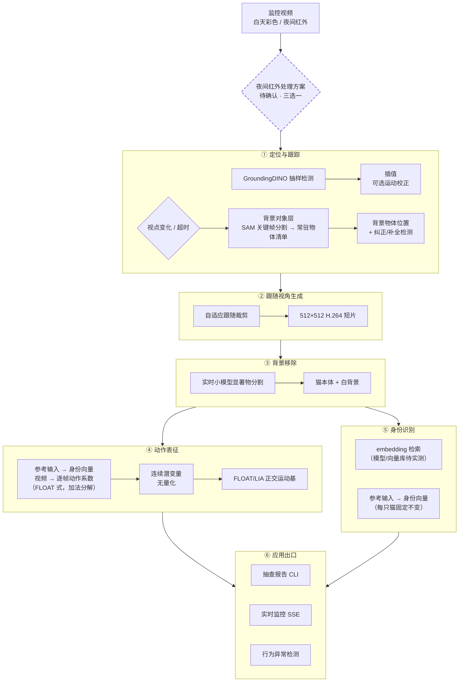
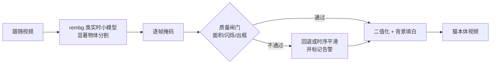
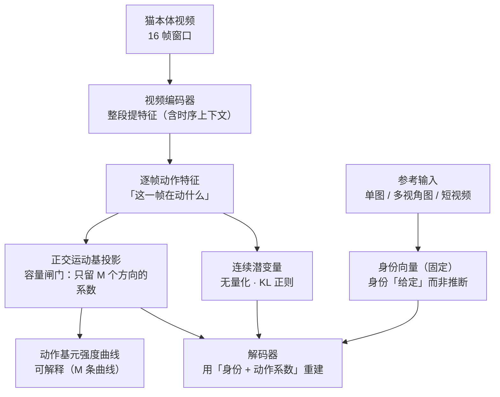
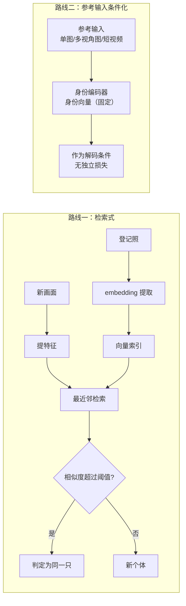
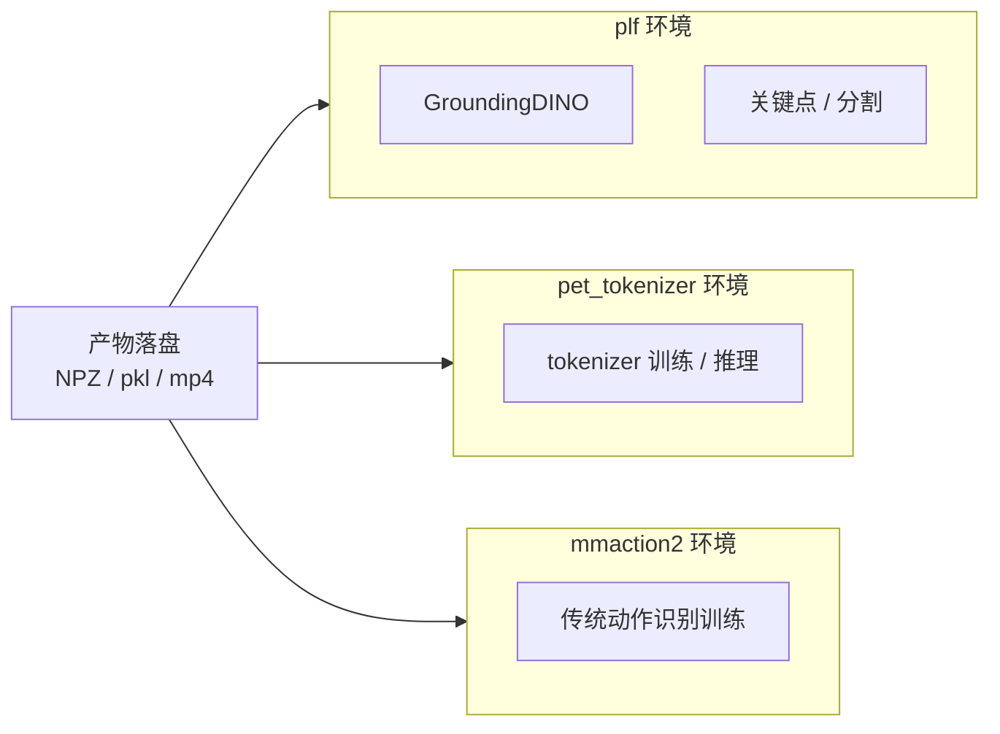
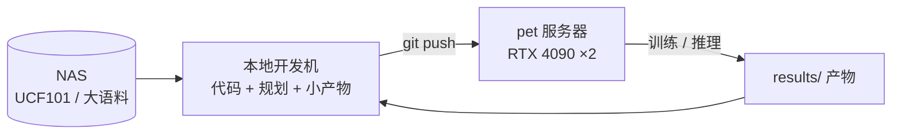
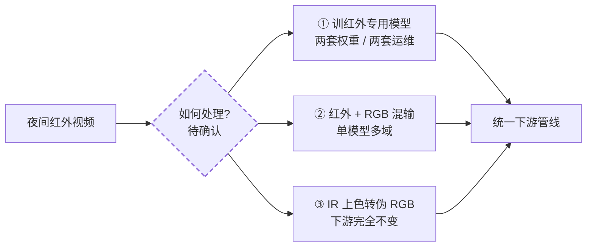

# 系统架构：结构 · 设计 · 进度

> **本文是所有「结构 / 设计」问题的唯一入口**：术语表（§0）→ 端到端总图（§1）→ 分层设计（§2）→ 跨切面（§3）→ 待定选择（§4）→ 决策索引（§5）→ 演进记录（§6）→ 进度（§7）。
>
> **深入设计**：模型层 → [8 号《身份-动作 Tokenizer》](./identity-tokenizer.md)；身份两条路线原理 → [7 号《身份标识与检索》](./identity-and-retrieval.md)；数据集 → [2 号《数据集全景》](./datasets.md)；训练 → [4 号《训练体系》](./training-guide.md)。

## §0 术语表

> 首次出现的术语都集中在这里查一遍；后续正文里就不重复定义。

- **mmaction2**：动作识别（视频分类）开源框架，本仓库用它做训练与推理
- **GroundingDINO**：开放词汇检测器——给它一句文字提示（"cat"），它就能在图里框出物体
- **DINOv2**：自监督训练出来的视觉特征提取器，把图/帧变成长长的一串数字（向量），特点是"同一个东西的向量应该相近"。（**身份 embedding 的当前默认候选，未实测**）
- **FAISS**：向量相似度检索库，把一堆向量存进去，新来一个向量能快速找出库里最像的前 N 个。（**向量库候选之一；本项目登记库极小，默认用 numpy 暴力检索**）
- **SAM / SAM2**：Meta 出品的分割模型，给一个点/框/提示就能把物体边缘精确抠出来；SAM2 加了记忆注意力，能沿时间传播掩码。**本项目的用法**：**背景对象层**（维护背景物件清单 + 纠正/补全 GroundingDINO），**仅关键帧触发**；**不用于抠猫**（抠猫用 `rembg` 类实时小模型）
- **OWLv2**：开放词汇检测器，跟 GroundingDINO 思路类似
- **HDBSCAN**：基于密度的聚类算法，把一堆向量自动分成若干簇，不用事先指定要分几类
- **ByteTrack**：经典的多目标跟踪算法，给检测框配上身份 id、维持轨迹
- **CatHuBERT**：借用 HuBERT 语音预训练范式，给视频里"行为素"打伪码再自监督预训练
- **TivTok / SIF**：视频 tokenizer，用 TIV（时间不变）+ TV（时间可变）两组 token 表达视频。⬇️ **已降为备档**（身份改由参考输入提供后 TIV 冗余）——备档见 [`papers/docs/tivtok-reference.md`](../../papers/docs/tivtok-reference.md)
- **FLOAT / LIA**：身份-动作解耦方法；运动 latent = 正交运动基的线性组合 `z_t = Σ λ_m·v_m`
- **TiTok**：视觉 tokenizer，用几十个 token 就能表达一张图（而不是动辄几百个 patch token）
- **正交运动基**：M 个两两正交的运动方向（QR 硬约束）；每帧的动作 = 这些方向的加权和，系数 `λ_m(t)` 可读
- **checkpoint**：训练好的模型权重文件，本仓库放在远程 pet 服务器
- **NAS**：网络存储，本项目指挂载在开发机上的共享磁盘（UCF101 等大语料放这里）
- **RTF**（Real-Time Factor）：推断速度指标，每秒视频时长除以每秒推断时长，0.032 表示处理速度约为实时 30 倍
- **对比学习（contrastive learning）**：核心思想——把「同一类」样本在特征空间里拉近、把「不同类」样本推远（正样本对 invariance / 负样本对 discrimination）。**本项目里它是身份识别的统一原理**：猫 Re-ID 的 embedding 检索、物体实例识别都按此实现（其中 embedding 模型与向量库为**待实测槽位**）。注意：它是**原理**，不等于必须用对比损失——身份-动作 Tokenizer 的身份通道走**参考输入条件化 + 重建**（见 [8 号](./identity-tokenizer.md) §4.6）。

## §1 端到端设计总图

整条链路的目标：把监控视频变成"某时段某只猫在做什么"的结构化报告。六个环节，每个环节的输出都是下一环节的输入（第 4/5 环节并列消费第 3 环节）。



**一句话总览**：把监控视频切成"以猫为中心的小片"→ 抠掉背景 → 给每片学一个可分解的动作表征 → 用表征做检索或异常检测，最终产品是"某时段某猫在做什么"的报告。

**设计要点**：第 3 环节（背景移除）是为第 4 环节服务的——followcam 的相机随猫移动，背景持续变化，若不剥离，动作通道会把相机运动当成动作学进去。空间上下文（在床上/地上）已由第 1 环节的空间关系状态层独立承担，因此抠像不丢信息。

## §2 分层设计

### §2.1 L1 定位与跟踪

| 项 | 设计 |
|---|---|
| 输入 | 原始监控视频（白天彩色 / 夜间红外） |
| 输出 | 每帧猫框 + 家具框 + 轨迹 id（JSON）；**背景物体清单**（见下「背景对象层」）|
| 算法 | GroundingDINO 多 prompt 抽样检测（每 10 帧）→ 插值 → **（可选）运动校正**（默认禁用） |
| 代码 | `scripts/pet_detect_track.py`、`scripts/pet_multi_detect.py` |
| 关键决策 | 不用 ByteTrack 全帧率（单猫白天场景过度工程）；关键点降级为辅助信号 |
| 空间语义 | 猫框底边中点落入家具框 → `cat on {家具}`，否则 `on floor`；≥1.5s 迟滞 |
| 状态 | ✅ 已归档（`multi-object-detect-gate`、`batch-followcam-extraction`）|

**为什么不用 ByteTrack 全帧率**：单猫白天场景下"每 10 帧抽样检测 + 插值"已经够用，再叠多层跟踪器是过度工程。

**背景对象层（计划中；独立 change 暂名 `background-object-memory`）**

**为什么需要**：GroundingDINO 只能检出「写了 prompt 的类别」（现为 5 类），**被遮挡或无 prompt 的物体检不到**；而跟随视角下相机随猫移动、画面内的背景持续变化 → 需要一层「背景里有什么、在哪」的**持续记忆**。

**机制（关键帧触发，不是逐帧）**：

```
触发：① 视点变化（裁剪窗口位移 / 真实机位转动）超阈值   ② 距上次分割超时
   ↓
SAM 在关键帧上分割（自动网格 prompt / 已有检测框 prompt）
   ↓
更新「场景常驻物体清单」每条目 = {object_id, mask, bbox, embedding, last_moved, semantic_label}
   ↓
输出：背景物体位置（供空间关系状态层）+ 纠正/补全 GroundingDINO
   ↓
两次关键帧之间：真实机位不动 → 物体在【原帧坐标系】里静止
   → 裁剪帧内的位置 = 全局坐标 − 裁剪偏移（免费换算，无需重新分割）
```

**三项职责**：① **背景对象记忆**（"一直知道有哪些背景物体"，含被猫遮挡时）② **纠正** GroundingDINO 识别错误 ③ **补** GroundingDINO 盲区（无 prompt 的物体）

**为什么 SAM 不可替代**：猫遮挡物体时（趴在碗上、挡在门前）GDINO **检不到**，而 SAM 的记忆注意力能保住掩码（半 amodal）。这是单靠检测器做不到的。

**与 L3 抠像的关系**：**两个用途、两套模型**——L3 抠**猫**（`rembg` 小模型）；本层分割**背景物体**（SAM）。互不耦合。

**机制细节已有成稿**：触发三重过滤、状态机、清单数据结构见 `registry-retrieval` design R1/R2/R2b；本层拟从该 change **迁出为独立 change**（因与登记-检索解耦后职责更清晰）。

**待定项**：见 §4.8 **C23–C26**。

**运动校正（可选）**：猫被柱子/家具遮一下又出来、重新框到时位置可能跳变，运动校正让位置平滑。它是**插值之后的独立开关，默认禁用**（治标有限，关键帧丢就让它丢，渲染层过滤兜底）。参数与实测见 [9 号《研究结论与踩坑》§4.1](./lessons.md)。展开说明见 [7 号 §1](./identity-and-retrieval.md)。

### §2.2 L2 跟随视角生成

| 项 | 设计 |
|---|---|
| 输入 | 轨迹 JSON |
| 输出 | 512×512 以猫为中心的 H.264 短片 |
| 算法 | 自适应跟随裁剪（猫居中）+ 尺寸离群过滤 + 渲染层漂移过滤 |
| 代码 | `scripts/make_followcam.py`、`scripts/pet_batch_run.py` |
| 状态 | ✅ 34/34 段完成（共 14.7 分钟）|

**为什么它是主表示载体**：跟随视角是后续所有特征学习的载体——下游模型拿到的不再是"整张监控画面"，而是"这只猫此刻的画面"。好处：① 模型不用再学"找猫在哪里" ② 分辨率不再被浪费在背景上 ③ 帧间变化幅度集中在猫身上，更利于动作建模。详见 [7 号 §2](./identity-and-retrieval.md)。

### §2.3 L3 背景移除



| 项 | 设计 |
|---|---|
| 输入 | 跟随视频 + 猫检测框（复用 L1 产物）|
| 输出 | 仅含猫本体、背景填充**白色**（纯色常量）的视频（帧数/帧率/分辨率对齐，不覆盖原视频）|
| 主选 | **`rembg` 类实时小模型**——显著物体分割（followcam 猫居中且占主体 → 猫天然是最显著物体）；候选 `u2net` / `u2netp` / `silueta`（Apache-2.0）、`isnet-general-use`（Apache-2.0）、`birefnet-general-lite`（MIT）；GPU 几十毫秒/帧 |
| 许可（见 §5b 分档）| `rembg` 库 = 🟢 MIT；候选权重 `u2net`/`isnet`/`birefnet-lite` = 🟢 Apache/MIT → **交付路径用这些**。`bria-rmbg`（rembg 默认模型）= 🟡 **CC BY-NC 4.0**（科研可用，商用需 BRIA 协议）→ 可作**质量上限对照**，登记「商业化前替换」。RVM = 🔴 GPL-3.0（传染）|
| 已否决 | RVM（人物域 + GPL-3.0 传染）；**SAM2 退出抠猫**（改用于背景对象层）|
| 质量兜底 | 面积突变 / 帧间闪烁 / **掩码出框（显著物体选错对象）** / 检测丢失 → 回退或时序平滑 + 告警，不静默输出脏数据 |
| 状态 | 📋 `pet-background-removal` 已立项（4/4 规划，待实施）|
| 关联 | **背景对象层（SAM，关键帧）**：维护背景物件清单 + 纠正/补全 GroundingDINO。独立 change（暂名 `background-object-memory`）；与本环节是**两个用途、两套模型** |

### §2.4 L4 动作表征（模型层）

这是全项目最复杂的环节，深入设计见 [8 号《身份-动作 Tokenizer》](./identity-tokenizer.md)。此处只给结构骨架：



**图的读法（符号对照）**：

| 图中的说法 | 设计里的记号 | 一句话 |
|---|---|---|
| 身份向量 | `w_identity` | 从**参考输入**提取的固定向量——"这是哪只猫"；与待分析视频无关 |
| 逐帧动作特征 | `z_t` | 第 t 帧的连续特征 |
| 动作系数 | `λ_t = (λ_1…λ_M)` | 动作特征在 **M 个正交运动方向**上的坐标；每帧一份 |
| 动作基元强度曲线 | `λ_m(t)` | 第 m 个方向随时间的强度曲线（可读、可命名）|
| 正交运动基 | `V = {v_m}` | M 个互相垂直的运动方向（`torch.linalg.qr` 每前向强制正交）|
| 重建 | `decode(w_identity + Σ_m λ_m(t)·v_m)` | 身份向量 + 动作加权和 → 第 t 帧 |

> **架构主源 = FLOAT**（2026-09-17 重心转向）。TivTok 的 SIF 双 token **暂不采用**（身份改由参考输入提供后 TIV 冗余）——备档见 [`papers/docs/tivtok-reference.md`](../../papers/docs/tivtok-reference.md)。

| 项 | 设计 |
|---|---|
| 基座 | **视频编码器代码基座候选**：AdapTok（MIT，12L/768d/patch 4×8×8）/ VidTok（MIT）/ LARP（MIT）；⚠️ SIF 移除后其 mask 框架不再需要 |
| 分解骨架 | **FLOAT 式**：`w_identity`（参考输入）+ `Σ λ_m·v_m`（视频逐帧）→ 解码；对应 FLOAT Eq. 8-9 |
| 视频 patchify | **3D patchify / tubelet**（`t×p×p` = 4×8×8）——**t 帧拼成三维体再整体切块**，不是逐帧切二维块；运动直接进 patch、token 数降 t 倍（借 AdapTok）|
| 量化器 | **无量化**（连续潜变量 + KL 正则，TiTok VAE 模式同思路）；SoftVQ 软码本仅作备用正则 |
| 动作通道 | FLOAT/LIA 正交运动基：`z_t = Σ λ_m·v_m`，基由 QR 每次前向正交化；λ 曲线即动作基元强度 |
| 离散化 | **不在帧级做**——交给行为聚类（HDBSCAN + 命名，序列级）|
| 身份通道 | **参考输入** → **register tokens 联合融合**（reg attend 全部参考 token）→ 投影成 `w_identity ∈ R^d`；单图/多图/视频**共用一套结构**；与运动分支**独立前向** |
| 身份完整性 | **正交运动基容量闸门**：运动压到 M 维 → 外观只能进 `w_identity`（FLOAT 机制）|
| 监督 | 重建（L1 + 感知 + 对抗）+ 动作伪行为素 CE；**身份无需独立损失** |
| 两阶段 | A：UCF101（13320 段，NAS）验证架构 → B：猫语料迁移 + 身份监督 |
| 状态 | ⏳ 主线 2.3（规划完成，待实施）|

**为什么先无监督发现行为**，而不是直接套人工标注类别？因为 cats v1 的人工 activity 标注里"伞类"占了一半——意思是人也不知道猫到底分几类活动。让数据自己聚成簇、再人工命名，往往比"先拍脑袋定 5 类"更靠谱。详见 [2 号《数据集全景》§2](./datasets.md)。

**验收四闸门**：线性可分性、可命名率、码本健康度、**身份泄漏审计**（防止行为表征被身份信号污染）。详见 [9 号《研究结论与踩坑》](./lessons.md)。

### §2.5 L5 身份识别

两条并行路线，**共享同一原理**：同猫跨时间/视角要聚到一起，不同猫要区分开。



| 路线 | 机制 | 特点 | 状态 |
|---|---|---|---|
| 检索式 | **embedding 检索**：登记照 → embedding → 向量库最近邻 + 阈值（猫与物体共用一套抽象）| 零训练、可解释、易上线 | ⏸️ `registry-retrieval`（待批准）|
| Token 式 | **参考输入条件化**：`w_identity`（固定向量）作为解码条件；监督由重建承担 | 与动作表征同源、交换验证免费 | ⏳ 随 L4 产出 |

> **模型选型规则（2026-09-17）**：上表"检索式"里的 **embedding 模型** 与 **向量库** 是**槽位**，不是已定方案（DINOv2+FAISS 仅为默认候选且**未实测**）。选型在实施 `registry-retrieval` 时做实测（候选见该 change design D9b）。**结构先定，选型后调研。**
>
> **参考输入为身份默认形态**（2026-09-17 用户裁定）：不要求从待分析视频推断身份；用户事先拍一张（或几张 / 一段）猫的参考即可。单猫语料只需一份参考，**零额外标注**。

两条路线的相同性质：**同猫跨时间/视角特征要聚到一起（positive invariance）、不同猫/物体要互相区分（negative discrimination）**。抓住这一条，主线就稳了。详见 [7 号 §3/§4](./identity-and-retrieval.md)。

### §2.6 L6 应用出口

**⚠️ 术语澄清（2026-09-17）："实时 / 非实时"压了四个正交轴，不要混用**

| # | 轴 | 取值 | 我们 |
|---|---|---|---|
| ① | **吞吐** | RTF < 1 / > 1 | ✅ 轻松满足（≈0.1）|
| ② | **流式性** | 批（有界输入）/ 流式（无界流）| 两者都要 |
| ③ | **因果性** | 非因果（可见未来）/ 因果（仅过去）| 见下 |
| ④ | **触发与输出** | 按需一次性 / 常驻逐秒推 | 按需 + 按需开启 |

> **RTF < 1 ≠ 实时交互**：RTF=0.1 但处理 1 小时录像要 6 分钟 → 等 6 分钟才出结果 = 交互上不实时。
> 真正的实时约束 = **端到端延迟 + 因果性**。RTF 对我们是瓶颈外的事（14.7 分钟语料分钟级处理完）。

**关键：因果性差异不在模型内核，而在时序后处理**

模型内核吃的就是 **16 帧窗口** → **滚动窗口推理（每次喂 `[t−15, t]`）与训练完全一致，零重训代价**，延迟 = 窗长（≈0.5 s @30fps）。

| 层 | 抽查（非流式）| 实时（流式）| 需重训？ |
|---|---|---|---|
| ① **模型内核**（16 帧 → `λ_t`）| 整段切片 | **滚动窗口** | ❌ 一致，零代价 |
| ② **时序后处理**（段边界/平滑/簇分配）| 全局非因果平滑（更准）| 因果在线平滑（有延迟）| ❌ 只是后处理 |
| ③ **低延迟内核**（延迟 < 窗长，如只等 4 帧 tubelet）| — | 因果注意力 + 流式训练 | ✅ **需重训（v2 条件启动）** |

**两种出口**：

| 形态 | 契约 | 延迟 | 精度 | 状态 |
|---|---|---|---|---|
| **抽查报告**（主产品）| 批 + 非因果后处理 | 分钟级可接受 | 最高 | ⏳ `spot-check-cli` 规划完成 |
| **实时监控** | 流式外壳 + **同一内核**（滚动窗口）| **= 窗长 ≈0.5–2 s** | 略低（因果平滑）| ⏳ 同上（复用 live 流式设施）|
| 异常检测 | 行为表征序列 | — | — | ⏸️ `behavior-anomaly-detection`（研究型，延后）|

**共享**：两出口 MUST 共享同一份行为簇字典（离线发现、在线分配）——即"同一内核、两种外层契约"，**不是两套模型**。

> **⚠️ 以上是「如何实现」的分析，不是「做哪个」的结论**——**做什么由 §4.6 C18 审定**（🔴 待审定）：① 只做非流式 / ② 只做流式 / ③ 两者都做 / ④ 混合。本节的层级表只说明：**若**两者都做，模型内核可复用（唯一额外成本在两套后处理）。

异常检测的候选机制：正常 = 高频已命名簇，异常 = 低频簇 / `λ` 向量转移突变 / 滑窗簇 ID 直方图偏离（HDBSCAN 簇 ID 序列、马尔可夫、孤立森林待调研）。

## §3 跨切面设计

### §3.1 双环境隔离

依赖冲突无法在一个环境里共存，因此按用途切分：



**原则**：环境间**不 import 跨用**，靠产物落盘交接；管线脚本用 subprocess + 环境切换调用。GroundingDINO/HQSAM/ViTPose 这套依赖重且与 mmcv 约束冲突风险高，所以 pet 上另起 conda env `plf`（决策 D5）。

### §3.2 可替换模块（petlib）

检测 / 跟踪 / 关键点三大能力封装在 `petlib/` 下，以抽象基类 + 契约测试保障可替换（13 项契约测试通过）。

### §3.3 部署与数据拓扑



**纪律**：远程 = 只读执行环境，所有文件改动在本地完成、经 git 同步；GPU 任务前查占用；产物只写项目路径。

## §4 待决策登记表（**唯一权威**）

> **规则**
> 1. **本表是唯一权威来源**——其他文档（8 号模型设计、各 change design）只**引用 ID**，不复制内容，避免多处副本漂移
> 2. **编号连续、按本表顺序**（C01…Cn）；新增项**追加在末尾**，不插队
> 3. **状态三档**：🔴 **待审定**（不定就开不了工）· 🟡 **待定**（不阻塞开工，可并行）· ⚪ **暂不适用**（保留备查）
> 4. **已决项移出本表** → 进 §4.8 已决项清单（保留 ID 备查）与 §6 演进记录
> 5. 每项必填：**选项 / 倾向（若有）/ 判据 / 落点**

### §4.1 输入域（跨环节）

**背景**：现有语料（34 段 followcam）只覆盖白天彩色；夜间红外段尚未处理。下游**全部环节**（L1 检测 → L3 抠像 → L4 表征 → L5 身份）都默认 RGB 输入，红外域一致性必须先解决——否则夜间数据要么进不了管线，要么静默拉低下游指标。



| ID | 状态 | 选择项 | 选项 | 倾向 / 判据 |
|---|---|---|---|---|
| C01 | 🟡 | 夜间红外处理方案 | ① 训专用模型 / ② 红外+RGB 混输 / ③ IR 上色 | **未定**。① 成本最高（红外语料少 + 两套运维）；② 中等，需防 RGB 性能回退；③ 最低（复用全链路）但上色纹理可能污染动作/身份特征。**判据（待实测）**：夜间有效样本量、上色后特征与真彩色的分布距离、下游闸门指标。**落点**：独立 change（暂名 `night-infrared-ingest`）|

### §4.2 背景移除（L3）

| ID | 状态 | 选择项 | 选项 | 倾向 / 判据 |
|---|---|---|---|---|
| C02 | 🟡 | 多猫场景掩码 | 掩码并集 / 逐猫分离 | **待定**：并集简单，但身份训练需要单猫片段 |

### §4.3 视频编码器（L4）

| ID | 状态 | 选择项 | 选项 | 倾向 / 判据 |
|---|---|---|---|---|
| C03 | 🟡 | 视频编码器代码基座 | AdapTok（MIT）/ VidTok（MIT）/ LARP（MIT）/ 从零 | **AdapTok**（同形 12L/768d/patch 4×8×8 + 训练脚本）；其 mask 框架在 SIF 移除后已不需要 |
| C04 | 🟡 | 编码器初始化 | AdapTok 权重 / SoftVQ-VAE 权重 / 从零训 | **AdapTok 权重**（同形、MIT）；从零可接受 |
| C05 | 🟡 | patch 尺寸 `t×p×p` | t ∈ {2,4,8}；p ∈ {8,16} | `t=4, p=8`（AdapTok 口径）为起点，做消融 |
| C06 | 🟡 | 输入规格 | 128 vs 256 分辨率；窗口长度 | **待定**：256 贴近 FLOAT 口径，128 省算力 |
| C07 | ⚪ | 自适应 token 预算 | 用 block-mask + ILP / 不用 | **暂不适用**（原挂在 AdapTok block-mask；SIF 移除后降为 v2 备选）|

### §4.4 动作通道（L4）

| ID | 状态 | 选择项 | 选项 | 倾向 / 判据 |
|---|---|---|---|---|
| C08 | 🟡 | 正交基元数 M / 维度 d / 符号 | M 取值；是否固定符号 | M 起点 **20–32**（LIA/FLOAT 用 20）、d=512；冻结基时必须固定符号，否则 λ 语义漂移 |
| C09 | 🟡 | `λ` 的时间粒度 | 接受 t 帧粒度（随 tubelet）/ tubelet 序列 → 逐帧头 / 动作分支用 `t=1` patch | **待定**（3D patchify 带来的张力，见 8 号 §4.2）|
| C10 | 🟡 | `α` 的时序上下文 | ⓐ 逐帧单帧算（FLOAT 忠实版）/ ⓑ 加时序上下文 | **3D tubelet（t=4）折中**：自带 t 帧上下文且保住 per-position α |
| C11 | 🟡 | 对齐教师（DeRA 式）| 无 / DINOv3（外观）/ V-JEPA 2 或 InternVideo2（动作）| **v1 不加**（纯架构解耦）；训练不稳再上 |
| C12 | 🟡 | 训练粒度 | 阶段 A1 冻结骨干 → A2 端到端 | **两段都做**，实测 A1 是否够用 |

### §4.5 身份通道（L5）

| ID | 状态 | 选择项 | 选项 | 倾向 / 判据 |
|---|---|---|---|---|
| **C13** | 🔴 **待审定** | **参考输入形态（初版只支持一种）** | **A. 高质量多图**（3–5 张，用户挑清晰多视角）/ **B. 参考视频**（一段）| **未定**。**A** = 原理最干净（身份本质是时间不变量，静态图与之语义完全对齐 → **架构上不存在参考运动污染**）、质量可控、编码便宜；代价 = 依赖用户挑图、拍不好则信息不全。**B** = 用户成本最低、视角/光照更丰富、**与视频编码器同构**；代价 = ⚠️ **参考运动污染**、需挑窗口、编码贵、质量不可控。**共同点**：两者共用同一套 register 读出结构 → **不阻塞架构** |
| C14 | 🟡 | 参考编码器 vs 视频编码器是否共享权重 | 共享 / 分开 | **倾向共享**（须两次独立前向）；共享时用**两组 register tokens**（身份组 / 运动组）|
| C15 | 🟡 | register token 数量 K | — | 待消融（K 大→信息全但冗余，K 小→瓶颈）|
| C16 | 🟡 | 身份 embedding 模型（**检索路线**，与 C13 无关）| DINOv2 / DINOv3 / CLIP·SigLIP / SuperAnimal / 猫专用 Re-ID / 登记集弱监督微调 | **默认候选 DINOv2，未实测**。判据：登记集自测 rank-1/rank-5 + 跨视角稳健性 + 许可。**在 `registry-retrieval` 实施时实测** |
| C17 | 🟡 | 向量库 | numpy 暴力检索 / FAISS | **numpy 暴力检索**（登记库 ≈ 几十个向量，毫秒级且零依赖）；FAISS 仅当场景常物清单长起来才需要 |

### §4.6 推理形态与时间尺度（L4/L6）

> **概念澄清见 §2.6**（"实时"= 端到端延迟 + 因果性，不是 RTF<1；四个正交轴；模型内核与后处理的层级差异）

**背景：动作识别的四种范式**（决定 C19/C20 的可行空间）

| 范式 | 输入 | 输出 | **一个视频能出多个动作段吗** |
|---|---|---|---|
| **裁剪片段识别**（trimmed recognition）| 定长 clip（如 16 帧）| **1 个标签** | ❌ **不能**（假设「一片段 = 一动作」）|
| **时序动作检测 TAD** | 长未裁剪视频 | **多个变长 proposal**（起止 + 类别）| ✅ **能**，天生如此 |
| **时序动作分割 TAS** | 长视频 | **逐帧标签 → 多个变长段** | ✅ **能**，且每时刻都有标签 |
| **在线动作检测 OAD** | 视频流 | 逐帧 / 当前动作 | ✅ 能（流式因果）|

> ⚠️ **两个必须先破除的混淆**：
> 1. **输入变长 ≠ 输出变长**——主流做法是「变长输入 → **定长输出**」：用均匀采样把任意长视频压成 T 帧，再出 1 个标签
> 2. **多 clip 测试 ≠ 多动作**——`num_clips=10` 是把**同一个** clip 采样 10 次做平均，输出**仍然只有 1 个标签**

**结论**：绝大多数叫「动作识别模型」的（含本仓 mmaction2 全部 config `clip_len=16/48`、`num_clips=1/10`，以及 VideoMAE / UniformerV2 / SlowFast / TSN）都是**定长 + 单标签**，且**需要事先有人把视频裁好**。「从长视频里切出多段」是 TAD/TAS 的活儿。

**为什么主流都是单标签**：训练数据形态锁死的——Kinetics / UCF101 / ActivityNet(裁剪版) 的标注就是「一片段一类别」，模型架构（固定采 T 帧）与标注体系互相锁定。

**TAD/TAS 需要什么标注（我们没有）**：

| 范式 | 必需标注 | 我们有吗 |
|---|---|---|
| TAD | **边界标注**（每段起止秒 + 类别）| ❌ |
| TAS | **逐帧标注** | ❌ |
| 实际持有 | cats v1 activity 标注（「伞类占一半」）+ 无边界 | ⚠️ 弱标注 |

→ **不能直接训 TAD/TAS 模型**；只能走「逐窗标签（无监督聚类）+ 时序后处理成段」（C20 选项②），并配**变化点检测 / 最小段长约束 / Viterbi** 稳定边界（无监督下边界精度无保证）。

**而输出形态本身就要求多段**：用户要的答案形如「3:00–3:15 舔毛，3:15–3:40 走动，3:40–4:10 睡觉」——**这就是多个变长段**。所以**多段不是「要不要」，而是输出形态决定的**。

| ID | 状态 | 选择项 | 选项 | 倾向 / 判据 |
|---|---|---|---|---|
| **C18** | 🔴 **待审定** | **推理形态：流式 vs 非流式** | ① **只做非流式**（定长段/滚动窗口 + 批量处理，抽查为主）② **只做流式**（实时为主，需因果内核 + 流式训练）③ **两者都做**（同一内核 + 两种外层契约）④ 混合 | **未定（2026-09-17 用户指出这是决策、不是既定）**。**成本差异**：①② 是单一路径；③ 需维护两套外层契约（非因果全局后处理 vs 因果在线后处理），但**模型内核可复用**（16 帧窗口 → 滚动窗口 = 训练/推理一致）；② 若要求延迟 < 窗长，还需**因果注意力 + 重训**。**判据**：主产品形态（段列表报告 vs 实时告警）、可接受延迟、是否值得两套后处理 |
| C19 | 🟡 | 动作长度 | ① 先定长、后不定长 ② 直接不定长 | **① 先定长跑通，再上多尺度**。真实时长跨度 1 s ~ 30 min（3 个数量级），单窗口物理上覆盖不了 → 需多时间尺度（短窗 + 长窗分层）|
| C20 | 🟡 | 一个视频多个动作 | ① 逐窗多标签（sigmoid）② **逐窗标签 + 时序后处理成变长段**（中值滤波 / Viterbi / 最小段长约束）③ 直接用 TAD 模型 | **② 后处理成段**——TAS 领域标准做法，也是抽查报告需要的输出形态（起止秒 + 标签）；③ 需边界标注（我们只有弱标注）|
| C21 | 🟡 | 实时模式延迟预算（**仅当选 C18 的②或③**）| 秒级 / 更高 | **待定**（`spot-check-cli` Open Question）|

**三个必须承认的难点**（与 C19/C20 绑定）：

1. **跨边界混合窗污染行为词表**——窗口跨动作边界 → 特征是两动作混合 → 会被聚成"混合簇"。对策：变化点检测 / 在低变化处切窗 / 重叠窗 + 逐帧判定
2. **时间尺度跨度**——16 帧（≈0.5 s）覆盖不了 30 min 的睡觉 → 需**多时间尺度**（短窗 + 长窗分层）
3. **输出形态决定架构**——"某时段某猫在做什么"的答案必须是**段列表**（起止秒 + 标签 + 置信度），不是单标签 → **时序后处理层不可省**

**已有的有利条件**：`λ_m(t)` 本身就是**逐帧**的 → 天然支持"逐帧标签 → 后处理成段"，不受"窗口 = 一个动作"限制。

### §4.7 出口

| ID | 状态 | 选择项 | 选项 | 倾向 / 判据 |
|---|---|---|---|---|
| C22 | 🟡 | 异常检测机制 | HDBSCAN 簇 ID 序列 / `λ` 向量转移突变 / 马尔可夫 / 孤立森林 | **待调研**（研究型 change `behavior-anomaly-detection`）|

### §4.8 背景对象层（L1，计划中）

> 机制与职责见 §2.1「背景对象层」；机制细节成稿在 `registry-retrieval` R1/R2/R2b。

| ID | 状态 | 选择项 | 选项 | 倾向 / 判据 |
|---|---|---|---|---|
| C23 | 🔴 **待审定** | **触发信号取哪个** | ① **虚拟裁剪窗口**的位移量（现成、免费） ② **真实机位**运动（需帧间全局运动估计） | **未定**：取决于"摄像头动了"指哪个——虚拟跟随裁剪（我们的相机是虚拟的）还是真实 PTZ 机位 |
| C24 | 🟡 | **掩码的类别来源**（SAM 只出掩码、不给类别）| ① mask 内二次 GDINO 推理 ② CLIP 零样本分类 ③ DINOv2 特征近邻（走登记库） | **待定**：需要一个"标注器"才能说"这是碗"而不只是"这里有个东西" |
| C25 | 🟡 | **过分割过滤**（自动分割会出大量碎片掩码）| 面积阈值 / 跨关键帧稳定性 / 与已有清单去重 | **待定**：需组合策略 |
| C26 | 🟡 | 本层与 GDINO **家具框**的关系 | ① 替换 ② 互补 ③ 融合 | **待定**：现家具框来自 GDINO 多 prompt（5 类），本层覆盖更广但无类别 |

### §4.9 已决项（移出待定表，备查）

| 已决 | 结论 | 日期 | 详情位置 |
|---|---|---|---|
| 抠像模型 | `rembg` 类**实时小模型**（显著物体分割）| 2026-09-17 | `pet-background-removal` D2/D2b |
| 掩码形态 | 二值（背景填**白**，见 D1b）| 2026-09-17 | `pet-background-removal` D1/D1b |
| 量化器 | **无量化**（连续潜变量 + KL 正则）| 2026-09-17 | `identity-action-tokenizer` T-A4b |
| 正交基实现 | **QR 分解**（Gram-Schmidt 的算法形式）| — | 同上 T-A4 |
| 潜空间正则 | KL 正则（per-dim 尺度归一）| 2026-09-17 | 同上 |
| 身份读出机制 | **register tokens 联合融合 → 投影成单向量** | 2026-09-17 | 同上 T-A5 |
| 解码器参考特征路径 | **不补**（FLOAT 的 `feats`，ⓑ）| 2026-09-17 | 同上 T-A4a |
| 身份监督形式 | **无需独立损失**（参考输入 + 容量闸门 + 重建已足够）| 2026-09-17 | 同上 T-A5 |
| 视频内 TIV 去留 | **去掉**（身份改由参考提供后冗余）| 2026-09-17 | 同上 T-A5c |
| 身份架构主源 | **FLOAT**（TivTok SIF 退出主线，降为备档）| 2026-09-17 | `papers/docs/tivtok-reference.md` |

### §4.10 编号对照（旧 → 新，便于追溯历史讨论）

| 旧 ID | 新 ID | 说明 |
|---|---|---|
| C1 / C2 | 移出 §4.8 | 抠像模型 / 掩码形态（已决）|
| C3 | **C02** | 多猫场景 |
| C4 | **C04** | 编码器初始化 |
| C5 | 移出 §4.8 | 量化器（已决）|
| C6 | ✖ 已移除 | TIV:TV 比例（随 SIF 退出）|
| C7 | **C08** | 正交基元数 M |
| C8 | 移出 §4.8 | 正交基实现（已决）|
| C9 | **C08**（并入）| 基的符号 |
| C10 | **C11** | 对齐教师 |
| C11 | **C12** | 训练粒度 |
| C12 | **C06** | 输入规格 |
| C13 | **C07** | 自适应 token 预算（⚪）|
| C14 | 移出 §4.8 | 身份监督形式（已决）|
| C15 | **C21** | 实时模式延迟预算 |
| C16 | **C22** | 异常检测机制 |
| C17 | **C01** | 夜间红外处理方案 |
| C18 | **C18**（不变）| 推理形态（改为🔴待审定）|
| C19 / C20 | **C19 / C20**（不变）| 动作长度 / 一个视频多动作 |
| C21 / C22 | **C16 / C17** | 身份 embedding / 向量库 |
| C23 | **C13** | 参考输入形态（🔴）|
| C24 | 拆分 | 参考输入架构落地 → 拆入 C13/C14/C15 + §4.8 |
| C25 | 移出 §4.8 | w_identity 形状（已消解）|
| C26 / C27 | **C14 / C15** | 编码器共享权重 / register 数量 K |
| C28 | 移出 §4.8 | 解码器 feats 路径（已决）|
| C29 | **C10** | α 的时序上下文 |
| 8号 本地 1–25 | 见上对应行 | **8 号不再使用本地编号**（改为引用 C-ID）|

## §5 设计决策索引

已定决策的全局 ID（跨文档引用不变）：

| ID | 主题 | 位置 |
|---|---|---|
| D1 | 检测/跟踪/居中工程形态 | `batch-followcam-extraction/design.md` |
| D1b/D1c | GatedTracker 否决 / 候选跟踪器原理 | `tracker-selection/design.md` |
| D2 | 关键点选型裁定（降级为辅助）| `batch-followcam-extraction/design.md` |
| D2b | HQSAM 定位 | `video-feature-latent/design.md` |
| D3 | 隐空间架构 | `video-feature-latent/design.md` |
| D4 | 推理形态（抽查 + 实时双模式，2026-09-16 修订）| `spot-check-cli/design.md` |
| D5 | 环境隔离 | `pet-motion-latent-pipeline/design.md` |
| D6 | petlib 接口 | `pet-motion-latent-pipeline/design.md` |
| D7 | 身份体系 | `spot-check-cli/design.md` |
| D8 | 主表示选型 | `video-feature-latent/design.md` |
| D9 | 登记-检索架构 | `registry-retrieval/design.md` |

**模型层设计决策**（T-A1…T-A9，含两阶段数据、损失、token 骨架、正交基、评测矩阵）见 `openspec/changes/identity-action-tokenizer/design.md`；**抠像层**（二值掩码、`rembg` 小模型选型与许可门槛、质量闸门、输出规格、批处理）见 `openspec/changes/pet-background-removal/design.md`。

### §5b 许可分档约定（2026-09-17 新增）

**关键区分：限制「使用范围」与限制「衍生作品传染」是两回事，不可同档处理。**

| 档 | 许可类型 | 含义 | 策略 |
|---|---|---|---|
| 🟢 **无条件可用** | MIT / Apache-2.0 | 无限制 | 直接用（u2net、ISNet、BiRefNet、SAM2、AdapTok、LARP、rembg 库本身）|
| 🟡 **有条件可用** | **CC BY-NC**（非商用）/ CC BY-NC-**ND**（禁衍生）| **使用范围**受限；科研/非商业允许 | **科研阶段可用**。必须**登记在案**并标注「**商业化前必须替换**」；建议作**离线对照/质量上限**，不作最终交付组件。代表：BRIA RMBG 系（抠像）、LIA / FLOAT（架构借鉴）|
| 🔴 **避免引入代码库** | **GPL-3.0** | **衍生作品传染**：你的代码也须 GPL 开源 | **不复制代码**；必要时只借鉴算法。（代表：RVM）|

**🟡 与 🔴 的本质区别**：🟡 是**可逆**的（组件级替换，代价 = 换个权重文件）；🔴 是**基本不可逆**的（代码融合后难以清洗）。所以「非商用」不等于「禁用」。

**借鉴算法的合法性**：著作权保护**表达**、不保护**思想**。因此「只借鉴算法、代码自行实现」对 🟡🟡🔴 三档都成立（如 FLOAT 的架构借鉴）。

**待确认**：项目**最终是否商用**（关系到 🟡 档能否放宽到「直接用」而不必预留替换）。现状：二期计划含「端侧 pipeline / 部署链路与验收」，产品化方向存在 → **默认按 🟡 处理（预留替换）**。

### §5b' 选型状态标注约定（2026-09-17 新增）

为区分「有实测支撑」与「只是有倾向」，全局统一三档标注：

| 标注 | 含义 | 文档写法要求 |
|---|---|---|
| ✅ **已实测** | 有实测数据支撑 | 写进决策表 + 附指标/产物位置 |
| 🎯 **默认候选** | 有倾向但**未实测** | 必须出现"候选/预计"字样；实施时进选型实测任务 |
| 🔍 **待调研** | 方向未定 | 进 §4 待定清单，编号 Cxx |

**原则**：架构层定**槽位/接口/判据**，不定具体模型；模型选型在实施对应 change 时做实测。

## §6 设计演进记录

| 日期 | 变更 | 影响 |
|---|---|---|
| 2026-09-15 | 关键点降级为辅助信号；K400 人类先验不适用 → 候选重构 | L1/L4 |
| 2026-09-15 | 运动校正参数定稿（可选开关，默认禁用）| L1 |
| 2026-09-16 | 推理形态由"仅抽查"修订为**抽查 + 实时双模式** | L6 |
| 2026-09-16 | 路线顺序调整：**编码器优先**——先建 tokenizer，再做行为发现 | L4 |
| 2026-09-16 | 架构收敛：TivTok（骨架）+ FLOAT/LIA（正交基）+ AdapTok（基座）| L4 |
| 2026-09-16 | 新增 L3 背景移除环节（独立 change）| 全链路 |
| 2026-09-16 | 方案否证记录：参考帧机制、双独立编码器、模型内 VQ 码本（register tokens 一条经 09-17 反复：曾否决 → 采用 → 简化为平均 → **回退为 register**，最终定：register 联合融合 + 投影成单向量）| L4 |
| **2026-09-17** | **全面去量化**：移除 VQ/SoftVQ，改连续潜变量 + KL；正交仅加在运动基（M≈20–32 方向），不加在码本（R^d 中最多 d 个正交向量，码本 8192 个不可能正交）；离散化交给序列级行为聚类 | L4 |
| 2026-09-17 | 先例核查（联网）：TiTok 官方 `quantize_mode: "vae"` 已有预训练权重且重建更好（0.84 vs 1.49）；SoftVQ-VAE 论文标题即 "Continuous Tokenizer"；MAR / AR-Video-w/o-VQ 跨域印证 | L4 |
| 2026-09-17 | **本文合并**：原 6 号《系统架构》+ 12 号《架构设计》合为一篇，消除重复与漂移 | 全篇 |
| **2026-09-17** | **记录待办：夜间红外处理方案**（① 训专用模型 / ② 红外+RGB 混输 / ③ IR 上色，三选一）——总图已标待确认，详 §4.1 **C01** | 全链路输入域 |
| **2026-09-17** | 记录待审定：推理形态与时间尺度（C18 流式 vs 非流式 / C19 定长 vs 不定长 / C20 一个视频多动作）——详 §4.6 | L4/L6 |
| 2026-09-17 | 抠像模型由 SAM2 改为 **rembg 类实时小模型**；SAM 移至背景对象层（关键帧）| L1/L3 |
| **2026-09-17** | **身份改为参考输入（默认设定）**：不要求从待分析视频推断身份；用户事先拍参考（单图/多视角图/短视频）。连带：**InfoNCE 移出主监督**（FLOAT 全文 0 次，且判别式目标不保完整性）；**正交基升为容量闸门**（逼身份承担外观）| L4/L5 |
| 2026-09-17 | 新增 **§5b 选型状态标注约定**；身份 embedding 从"DINOv2+FAISS"改为待实测槽位 | 全篇 |
| **2026-09-17** | **架构主源转向 FLOAT，TivTok SIF 退出主线**：身份由参考输入提供后，视频内 TIV 与身份通道职责重叠 → SIF 存在意义消失。TivTok 材料已整理为备档 [`papers/docs/tivtok-reference.md`](../../papers/docs/tivtok-reference.md) | L4 |
| **2026-09-17** | **L1 补「背景对象层」**（SAM 关键帧触发 + 场景常驻物体清单 + 纠正/补全 GDINO）；拟从 `registry-retrieval` 迁出为独立 change `background-object-memory`，新增待定 C23–C26 | L1 |
| **2026-09-17** | **§4 重建为「唯一权威待决策登记表」**：编号连续（C01–C22）、顺序与正文一致、**已决项移出**到 §4.8、附旧→新编号对照；8 号 §7 不再用本地编号（消除「同一决策两个 ID」）| 全篇 |

## §7 当前进度与未来计划

> 基准日 2026-09-17；执行中进度看 `management/projects/*/tasks.json`，change 状态以 `openspec/changes/pet-motion-latent-pipeline/tasks.md` §2 路线图为准。

### §7.1 子 change 路线图

| # | 子 change | 内容 | 依赖/触发 | 状态 |
|---|---|---|---|---|
| 2.1 | `multi-object-detect-gate` | 多目标检测（五类）+ 空间关系状态层 | — | ✅ 已归档（2026-09-15）|
| 2.2 | `batch-followcam-extraction` | 全量批处理 34 段 + followcam 产出 | 2.1 | ✅ 34/34 闭环（14.7 分钟），**待归档** |
| 2.3 | `identity-action-tokenizer` | 🔬 升主线（encoder 优先）：**FLOAT 式参考输入 + 正交运动基**（UCF101→猫语料两阶段）| 2.2 | ⏳ 待 2.2 归档 |
| 2.3b | `pet-background-removal` | 猫本体抠像——消除背景运动对动作通道的污染 | 可并行 2.3 阶段 A；**2.3 阶段 B 前必须完成** | 📋 已创建待启动 |
| 2.4 | `video-feature-latent` | 消费 2.3 编码器做行为发现 + 探针评测（现成 backbone 降为回退）| 2.3 | ⏳ 待 2.3 |
| 2.5 | `spot-check-cli` | 抽查 CLI + 实时监控模式 + 猫身份登记 | 2.4 | ⏳ 待 2.4 |
| 4A | `tracker-selection` | 跟踪器选型（多猫场景）| 多猫数据出现 | ⏸️ 延后 |
| 4B | `registry-retrieval` | 碗/摄像头实例识别 + 猫 Re-ID | 用户批准实施 | ⏸️ 延后 |
| 4C | `behavior-anomaly-detection` | 行为异常检测（研究型）| 2.4 归档 + 用户发起 | ⏸️ 延后 |

**主线一句话**：`2.2 归档` → `2.3 编码器（+2.3b 抠像并行）` → `2.4 行为发现` → `2.5 抽查出口`。

### §7.2 验收闸门与里程碑

- **video-feature-latent 四闸门**：线性可分性 / 可命名率 / 码本健康度 / 身份泄漏审计
- **identity-action-tokenizer 阶段 A 中期检查点**：UCF101 上 z_t 探针 top1@101 类 + 身份 dropout/交换消融
- **11 月中期验收 KPI**：来自 2026-08-15 二期计划（P0 精度攻坚进行中，P1 端侧 pipeline 待启动）

### §7.3 二期计划对照

| 阶段 | 内容 | 现状 |
|---|---|---|
| P0 精度攻坚 | 8 月中–9 月底 | 多模型训练 5 个 run **全部 error**，问题在数据/接口；k400 烟测 top1 0.77 已验证管线可跑通 |
| P1 端侧 pipeline | 9 月–11 月中 | 34 段白天批处理已 34/34 完成，验证管线；夜间红外段待处理 |
| P2 部署链路与验收 | 11 月–12 月 | 抽查 CLI/异常检测待启动 |

## §8 相关文档

- [8 号《身份-动作 Tokenizer》（模型层深入设计）](./identity-tokenizer.md)
- [7 号《身份标识与检索》](./identity-and-retrieval.md)（定位追踪 / 猫 Re-ID / 物体标识）
- [1 号《仓库资产盘点》](./repo-inventory.md)（资产索引 + 归档 change 清单）
- [2 号《数据集全景》](./datasets.md) / [3 号《模型》](./models.md) / [4 号《训练体系》](./training-guide.md)
- [9 号《研究结论与踩坑》](./lessons.md) / [10 号《第三方项目借鉴》](./third-party-notes.md) / [11 号《交接与协作指南》](./handover-guide.md)
- 远程执行纪律：`.claude/skills/remote-servers/`、`.claude/skills/remote-server-discipline/`
