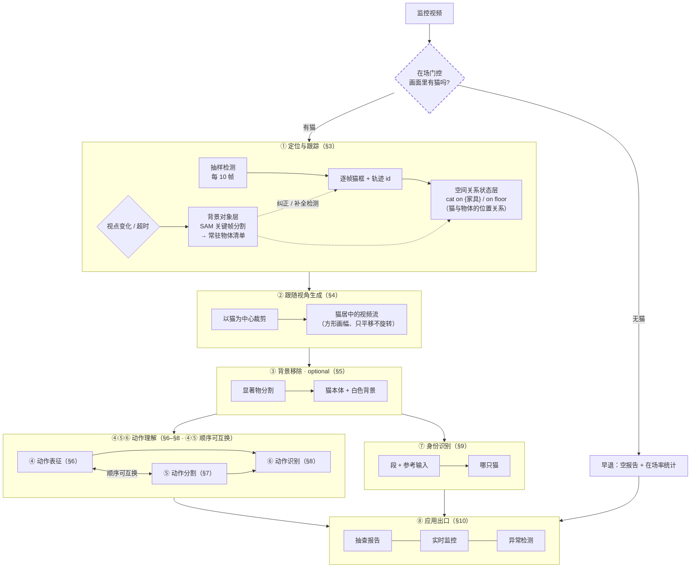
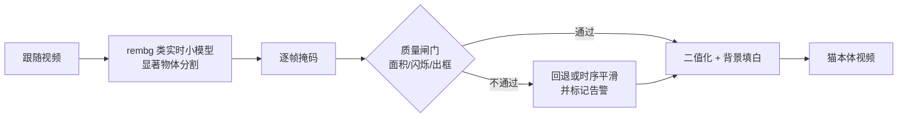
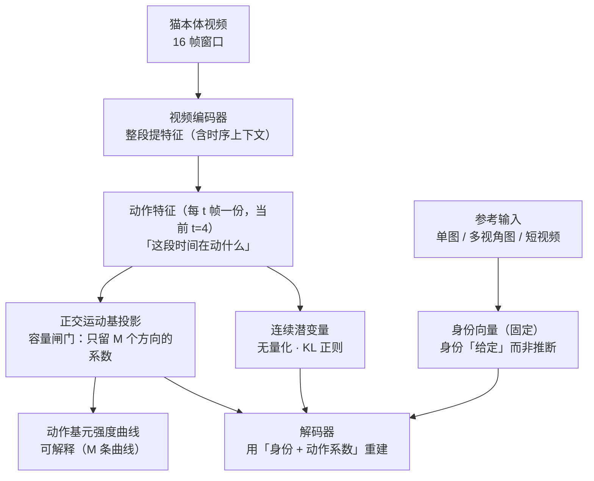
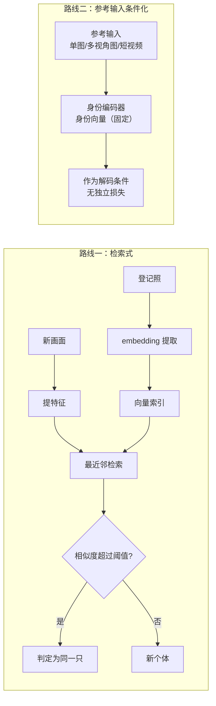

# 系统架构：结构 · 设计 · 进度

> **怎么读**：**§1 端到端设计总图**（整体长什么样）→ **§2 当前待决策**（还剩什么没定）→ **§3–§10 按环节逐一讲解**（①定位跟踪 → ②跟随视角 → ③背景移除（optional）→ ④⑤⑥ 动作理解（表征 · 分割 · 识别，顺序可互换 C36）→ ⑦身份 → ⑧出口；每个环节自带它需要的概念）。
>
> **本文是所有「结构 / 设计」问题的唯一入口**。模型内部设计（聚合粒度 / 离散化 / 对称架构）见 [8 号《身份-动作 Tokenizer》](./identity-tokenizer.md)；演进 / 进度 / 附录 / 相关文档见同名 `architecture.json`（页面顶部按钮与底部块）。
>
> **深入设计**：模型层 → [8 号《身份-动作 Tokenizer》](./identity-tokenizer.md)；身份两条路线原理 → [7 号《身份标识与检索》](./identity-and-retrieval.md)；数据集 → [2 号《数据集全景》](./datasets.md)；训练 → [4 号《训练体系》](./training-guide.md)。
>
> ⚠️ **命名空间提醒**：本文档 **L1–L8 = 管线层编号**（§3–§10 各章括号内）；各 change 的 design 内部**另有一套 L1–L8**（该 change 自己的决策编号），不是同一命名空间。

## §1 端到端设计总图

整条链路的目标：把监控视频变成「某时段某只猫在做什么」的结构化报告。**先门控有无猫（无猫早退），再有八个环节**，每环输出即下环输入（第 ③ 环的输出并列供给第 ④ 与第 ⑦ 环）。

> **读图要点**：每环只标**输入/输出契约（含时间尺度）**，不标实现细节（分辨率、编码、具体方法）。**各环节时间尺度见环节④与各章内说明。**



**一句话总览**：先**门控有无猫**（无猫早退）→ 得到以猫为中心的视频流 → 抠掉背景（optional）→ **动作理解：④ 表征 · ⑤ 分割 · ⑥ 识别（内部顺序可互换；方案两条路线见 §6–§8）** → 结合身份输出「某时段某猫在做什么」的报告。

**设计要点**：第 3 环节（背景移除）是为第 4 环节服务的——followcam 的相机随猫移动，背景持续变化，若不剥离，动作通道会把相机运动当成动作学进去。空间上下文（在床上/地上）已由第 1 环节的空间关系状态层独立承担，因此抠像不丢信息。


## §2 当前待决策问题

> 只列索引：ID + 名字 + 状态。选项 / 判据 / 落点在对应 change；已决项见 sidecar `changelog` 与正文就地说明；v7 前的登记表全文归档于 `architecture.json` 附录。

**🔴 待审定（不定就开不了工）**

- **C27 相机数量与拓扑**（🔴）
- **C28 报告"空白时段"的语义分类**（🔴）
- **C30 多图/视频身份如何聚合（LIA 机制的直接推论）**（🔴）
- **C31 解码器是否加参考特征路径（FLOAT/LIA 的 `feats`）**（🔴）
- **C32 「个体特有的动作风格」归身份码还是 λ（Slot-ID 引出）**（🔴）
- **C23 触发信号取哪个**（🔴）

**🟡 待定（不阻塞开工）**

- **C36 ④⑤⑥ 内部顺序**（🟡）——分割与表征先后可互换：先分割 = 运动能量前置（零模型依赖）/ 先表征 = 特征序列分段（更准，依赖表征模型）
- **C01 夜间红外处理方案**（🟡）
- **C02 多猫场景掩码**（🟡）
- **C03 视频编码器代码骨架（⚠️ 不是结构复用）**（🟡）
- **C04 编码器初始化**（🟡）
- **C05 patch 尺寸 `t×p×p`**（🟡）
- **C06 输入规格**（🟡）
- **C08 正交基元数 M / 维度 d / 符号**（🟡）
- **C12 训练粒度（⚠️ 依赖 C04）**（🟡）
- **C14 参考编码器 vs 视频编码器是否共享权重**（🟡）
- **C15 register token 数量 K**（🟡）
- **C16 身份 embedding 模型（检索路线，与 C13 无关）**（🟡）
- **C17 向量库**（🟡）
- **C29 参考身份通路（三方案消融，含对照组）**（🟡）
- **C33 动作识别路线（λ 拿到之后怎么变成"动作类别"）**（🟡）
- **C34 分词层（行为素 → 动作段）的具体做法**（🟡）
- **C35 `video-feature-latent` 阶段划分调整**（🟡）
- **C19 动作长度**（🟡）
- **C20 一个视频多个动作（= 行为素 → 动作 的组合层）**（🟡）
- **C22 异常检测机制**（🟡）
- **C24 掩码的类别来源（SAM 只出掩码、不给类别）**（🟡）
- **C25 过分割过滤（自动分割会出大量碎片掩码）**（🟡）
- **C26 本层与 GDINO 家具框的关系**（🟡）

## §3 环节① 定位与跟踪（L1，第一步：先判断有没有猫）

| 项 | 设计 |
|---|---|
| 输入 | 原始监控视频（白天彩色 / 夜间红外） |
| 输出 | 每帧猫框 + 家具框 + 轨迹 id（JSON）；**背景物体清单**（见下「背景对象层」）|
| 算法 | GroundingDINO 多 prompt 抽样检测（每 10 帧）→ 插值 → **（可选）运动校正**（默认禁用） |
| 代码 | `scripts/pet_detect_track.py`、`scripts/pet_multi_detect.py` |
| 关键决策 | 不用 ByteTrack 全帧率（单猫白天场景过度工程）；关键点降级为辅助信号 |
| 空间语义 | 猫框底边中点落入家具框 → `cat on {家具}`，否则 `on floor`；≥1.5s 迟滞 |

**空间关系状态层**（本环节的第二个输出，与轨迹并列）：由「猫框 + 背景物体清单」推出**随时间变化的猫–物体位置关系**（`cat on {家具}` / `on floor`，还可扩展 `near` / `under` 等）。它承担两件事：① 为下游**提供空间上下文**（动作发生在床上还是地上）；② 是**「交互」类语义的载体**——「猫在碗边」「趴在被子上」这类描述由它给出。因此背景移除（§5）剥掉背景后，空间信息并不丢。
| 状态 | ✅ 已归档（`multi-object-detect-gate`、`batch-followcam-extraction`）|

**① 在场门控（**本环节的第 0 步，早退分支**）**

> ⚠️ 这是全管线的**前置门控**：监控视频里**大部分时间可能没有猫**。没有猫就不该往下跑——

```
监控视频
  ↓ 在场门控（判据：每 10 帧抽样检测是否检出猫）
  ├── ❌ 无猫 ─→ 【早退】记录「猫不在场」→ 输出空报告 + 在场率统计 → 不进入 ②～⑧
  └── ✅ 有猫 ─→ 继续 ② 检测跟踪 → 跟随视角 → …
```

| 项 | 设计 |
|---|---|
| 判据 | **抽样检测本身即门控**——每 10 帧的 GroundingDINO 未检出猫 → 该帧无猫 |
| 粒度 | **按时间区间**：连续无猫区间（含最短持续时间阈值）判定为「不在场段」 |
| 输出 | ① 在场/不在场时间轴 ② **在场率**（已在产出：34 段 mean **0.939**）|
| 早退效果 | 不在场区间**跳过**检测跟踪 / 跟随裁剪 / 抠像 / 表征 / 分割 / 识别（省算力，且避免对空画面产出无意义结果）|
| 报告语义 | 不在场区间 MUST 在报告中显式标注（**不得计为"猫静止无动作"**）→ 见 **C28**（空白时段语义分类）与 **C27**（相机数量）|
| ⚠️ 门控风险 | **门控漏了则后面全漏**（行业模式 1 的已知代价）→ 阈值需保守，宁可多跑不可漏判 |

**为什么不用 ByteTrack 全帧率**：单猫白天场景下"每 10 帧抽样检测 + 插值"已经够用，再叠多层跟踪器是过度工程。

**背景对象层（计划中；独立 change 暂名 `background-object-memory`）**

**为什么需要**：GroundingDINO 只能检出「写了 prompt 的类别」（现为 5 类），**被遮挡或无 prompt 的物体检不到**；而跟随视角下相机随猫移动、画面内的背景持续变化 → 需要一层「背景里有什么、在哪」的**持续记忆**。

**机制（关键帧触发，不是逐帧）**：

```
触发：① 视点变化（裁剪窗口位移 / 真实机位转动）超阈值   ② 距上次分割超时
   ↓
SAM 在关键帧上分割（自动网格 prompt / 已有检测框 prompt）
   ↓
更新「场景常驻物体清单」每条目 = {object_id, mask, bbox, embedding, last_moved, semantic_label}
   ↓
输出：背景物体位置（供空间关系状态层）+ 纠正/补全 GroundingDINO
   ↓
两次关键帧之间：真实机位不动 → 物体在【原帧坐标系】里静止
   → 裁剪帧内的位置 = 全局坐标 − 裁剪偏移（免费换算，无需重新分割）
```

**三项职责**：① **背景对象记忆**（"一直知道有哪些背景物体"，含被猫遮挡时）② **纠正** GroundingDINO 识别错误 ③ **补** GroundingDINO 盲区（无 prompt 的物体）

**为什么 SAM 不可替代**：猫遮挡物体时（趴在碗上、挡在门前）GDINO **检不到**，而 SAM 的记忆注意力能保住掩码（半 amodal）。这是单靠检测器做不到的。

**与 L3 抠像的关系**：**两个用途、两套模型**——L3 抠**猫**（`rembg` 小模型）；本层分割**背景物体**（SAM）。互不耦合。

**机制细节已有成稿**：触发三重过滤、状态机、清单数据结构见 `registry-retrieval` design R1/R2/R2b；本层拟从该 change **迁出为独立 change**（因与登记-检索解耦后职责更清晰）。

**待定项**：见 §2 速览 **C23–C26**。

**运动校正（可选）**：猫被柱子/家具遮一下又出来、重新框到时位置可能跳变，运动校正让位置平滑。它是**插值之后的独立开关，默认禁用**（治标有限，关键帧丢就让它丢，渲染层过滤兜底）。参数与实测见 [9 号《研究结论与踩坑》§5.1](./lessons.md)。展开说明见 [7 号 §1](./identity-and-retrieval.md)。

## §4 环节② 跟随视角生成（L2）

| 项 | 设计 |
|---|---|
| 输入 | 轨迹 JSON |
| 输出 | 512×512 以猫为中心的 H.264 短片 |
| 算法 | 自适应跟随裁剪（猫居中）+ 尺寸离群过滤 + 渲染层漂移过滤。裁剪窗是**正置的方形**（与画面坐标轴对齐）：**只平移跟随、不随猫朝向旋转**——旋转会引入插值模糊，还会丢掉「猫相对房间的朝向」 |
| 代码 | `scripts/make_followcam.py`、`scripts/pet_batch_run.py` |
| 状态 | ✅ 34/34 段完成（共 14.7 分钟）|

**为什么它是主表示载体**：跟随视角是后续所有特征学习的载体——下游模型拿到的不再是"整张监控画面"，而是"这只猫此刻的画面"。好处：① 模型不用再学"找猫在哪里" ② 分辨率不再被浪费在背景上 ③ 帧间变化幅度集中在猫身上，更利于动作建模。详见 [7 号 §4](./identity-and-retrieval.md)。

## §5 环节③ 背景移除（L3，**optional**）



| 项 | 设计 |
|---|---|
| 输入 | 跟随视频 + 猫检测框（复用 L1 产物）|
| 输出 | 仅含猫本体、背景填充**白色**（纯色常量）的视频（帧数/帧率/分辨率对齐，不覆盖原视频）|
| 主选 | **`rembg` 类实时小模型**——显著物体分割（followcam 猫居中且占主体 → 猫天然是最显著物体）；候选 `u2net` / `u2netp` / `silueta`（Apache-2.0）、`isnet-general-use`（Apache-2.0）、`birefnet-general-lite`（MIT）；GPU 几十毫秒/帧 |
| 许可分档（🟢🟡🔴，见页面附录）| `rembg` 库 = 🟢 MIT；候选权重 `u2net`/`isnet`/`birefnet-lite` = 🟢 Apache/MIT → **交付路径用这些**。`bria-rmbg`（rembg 默认模型）= 🟡 **CC BY-NC 4.0**（科研可用，商用需 BRIA 协议）→ 可作**质量上限对照**，登记「商业化前替换」。RVM = 🔴 GPL-3.0（传染）|
| 已否决 | RVM（人物域 + GPL-3.0 传染）；**SAM2 退出抠猫**（改用于背景对象层）|
| 质量兜底 | 面积突变 / 帧间闪烁 / **掩码出框（显著物体选错对象）** / 检测丢失 → 回退或时序平滑 + 告警，不静默输出脏数据 |
| 状态 | 📋 `pet-background-removal` 已立项（4/4 规划，待实施）|
| optional | **可选组件**：训练管线默认开启（消除背景运动污染），其他场景按需 |
| 关联 | **背景对象层（SAM，关键帧）**：维护背景物件清单 + 纠正/补全 GroundingDINO。独立 change（暂名 `background-object-memory`）；与本环节是**两个用途、两套模型** |

## §6 环节④ 动作表征（L4）

> **方案两条路线**：**A 自研 λ tokenizer**（现设计主线，下文「路线 A」，深设计在 8 号）/ **B 现成动作识别模型**（VideoMAE V2 等 + 滑窗后处理成段，下文「路线 B」）。总图大框对两条路线保持通用（输入猫居中视频流窗口，输出段 + 类别）。

这是全项目最复杂环节。**路线 A** 的结构骨架（深入设计见 [8 号《身份-动作 Tokenizer》](./identity-tokenizer.md)）：



**图中的读法（符号含义）**：见本章开头的**符号速查表**（`w_identity` = 身份向量 · `λ_j` = 动作系数 · `V` = 正交运动基 · `z_j` = 动作特征）。

> **架构主源 = FLOAT**（2026-09-17 重心转向）。TivTok 的 SIF 双 token **暂不采用**（身份改由参考输入提供后 TIV 冗余）——备档见 `papers/docs/tivtok-reference.md`（wiki 外，见仓库）。

| 项 | 设计 |
|---|---|
| 基座 | **视频编码器代码基座候选**：AdapTok（MIT，12L/768d/patch 4×8×8）/ VidTok（MIT）/ LARP（MIT）；⚠️ SIF 移除后其 mask 框架不再需要 |
| 分解骨架 | **FLOAT 式**：`w_identity`（参考输入）+ `Σ λ_m·v_m`（视频逐帧）→ 解码；对应 FLOAT Eq. 8-9 |
| 视频 patchify | **3D patchify / t 帧块**（`t×p×p` = 4×8×8）——**t 帧拼成三维体再整体切块**，不是逐帧切二维块；运动直接进 patch、token 数降 t 倍（借 AdapTok）|
| 量化器 | **无量化**（连续潜变量 + KL 正则，TiTok VAE 模式同思路）；SoftVQ 软码本仅作备用正则 |
| 动作通道 | FLOAT/LIA 正交运动基：`z_t = Σ λ_m·v_m`，基由 QR 每次前向正交化；λ 曲线即动作基元强度 |
| 离散化 | **不在帧级做**——交给行为聚类（HDBSCAN + 命名，序列级）|
| 身份通道 | **参考输入** → **register tokens 联合融合**（reg attend 全部参考 token）→ 投影成 `w_identity ∈ R^d`；单图/多图/视频**共用一套结构**；与运动分支**独立前向** |
| 身份完整性 | **正交运动基容量闸门**：运动压到 M 维 → 外观只能进 `w_identity`（FLOAT 机制）|
| 监督 | 重建（L1 + 感知 + 对抗）+ 动作伪行为素 CE；**身份无需独立损失** |
| 两阶段 | A：UCF101（13320 段，放 NAS 网络存储）验证架构 → B：猫语料迁移 + 身份监督 |
| 状态 | ⏳ 主线 2.3（规划完成，待实施）|

**为什么先无监督发现行为**，而不是直接套人工标注类别？因为 cats v1 的人工 activity 标注里"伞类"占了一半——意思是人也不知道猫到底分几类活动。让数据自己聚成簇、再人工命名，往往比"先拍脑袋定 5 类"更靠谱。详见 [2 号《数据集全景》§4](./datasets.md)。

**验收四闸门**：线性可分性、可命名率、码本健康度、**身份泄漏审计**（防止行为表征被身份信号污染）。详见 [9 号《研究结论与踩坑》](./lessons.md)。

#### 路线 A：自研 λ tokenizer（现设计主线）

**符号速查**（读路线 A 前先过一遍）

| 记号 | 读作 | 一句话 |
|---|---|---|
| `w_identity` | 身份向量 | 从**参考输入**（用户拍的猫图/短视频）提取的**固定向量**——"这是哪只猫"；与待分析视频无关 |
| `z_j` | 动作特征 | 第 j 个 **t 帧块**（覆盖 4 帧）编码出来的连续特征 |
| `V = {v_1…v_M}` | 正交运动基 | **M 个互相垂直的运动方向**（每次前向做一次 QR 强制正交；M ≈ 20–32）|
| `λ_j = (λ_1…λ_M)` | 动作系数 | `z_j` 在这 M 个方向上的**坐标**；**每 t 帧一份**（当前 t=4 ≈ 0.27 s/份 @15fps；消融 t∈{2,4,8} 见 C05）|
| `λ_m(t)` | 动作基元曲线 | 第 m 个运动方向随时间的强度曲线（可画、可命名）|
| `t` / `p` | patch 尺寸 | 3D patch 的时间跨度（默认 4 帧）/ 空间边长（默认 8×8）|
| 重建 | — | `decode(w_identity + Σ_m λ_m(t)·v_m)` → 第 t 帧 |

> 与 **FLOAT** 的对应：`w_identity` ↔ FLOAT 的身份 latent `w_{S→r}`；`Σ_m λ_m·v_m` ↔ FLOAT 的运动 latent `w_{r→S}`。**命名提示**：FLOAT 论文写 `λ`，而其**代码变量名叫 `alpha`**——同一东西，**本文件统一写作 `λ`**。


#### 输入 / 输出时间尺度

| 环节 | 时间单位 | 当前取值 | 备注 |
|---|---|---|---|
| ① 检测抽样 | 抽样间隔 | **每 10 帧**一次 | 插值补齐到逐帧 |
| ④ 表征 · **输入窗口** | 一次前向的**时间跨度** | **`clip_len=16` × `frame_interval=4` = 64 帧 ≈ 4.3 s** @15fps | 本仓 4 个 config（VideoMAE / VideoMAEv2 / AIM / VideoMAE-base）实测一致 |
| ④ 表征 · **输出粒度** | 动作系数的**分辨率** | **patch `t=4` 帧 ≈ 0.27 s** | 一次前向 64 帧 → 出 **16 份**系数 |
| ④ 表征 · 窗口步长 | stride | **待定**（重叠 vs 不重叠）| 见 **C05（patch 尺寸 t）/ C19** |
| ⑤ 分段 · 段长 | 不定长 | 由变化点检测定 | 最小段长 / 滞回约束待定 |
| ⑥ ⑦ | 每段一次 | — | 以段为单位 |

**⚠️ 最易混：「输入窗口跨度」≠「输出粒度」**

```
喂进去：64 帧（≈ 4.3 秒）
吐出来：16 份动作系数，每份覆盖 4 帧（≈ 0.27 秒）
```

| 问法 | 答案 |
|---|---|
| 模型一次前向看多长的**时间**？ | **64 帧 ≈ 4.3 s**（16 个采样帧 × 间隔 4）|
| 采样了多少**帧**？ | **16 帧**（稀疏采样，非连续）|
| 每份系数代表多少帧？ | **4 帧 ≈ 0.27 s** |
| 一次前向产出几份？ | **16 份** |

**稀疏 vs 密的差别**：本仓 config 是**稀疏采样**（`frame_interval=4`）→ 16 个采样点跨 **4.3 s**；改**密采样**（`frame_interval=1`）则 16 帧只覆盖 **1.07 s**。**两者含义完全不同**，15 fps 环境尤其要看清。

**多时间尺度很便宜**：VideoMAE 用 **sin-cos 位置编码**（`use_learnable_pos_emb=False`，`vit_mae.py:306-313`）→ 换 `T` 不必重训位置编码。


#### 变长视频：输入侧怎么被处理
#### 变长视频：输入侧怎么被处理

> ④ 的输入是**变长视频**；本节讲输入侧怎么处理。输出能力分类（A0–A5）见 §7⑤ 的能力分层。

##### 三层拆解 + 采样器实证（+ 可配置 ≠ 可变）

**拆三层**（混着问就说不清）：

| 层 | 问题 | 答案 |
|---|---|---|
| (a) **能不能吃进去** | 接受任意长度输入？| ✅ **都能**——靠采样压成定长张量 |
| (b) **输出是否随长度变** | 更长视频 → 更多结果？| ❌ **都不能**——恒为 1 个标签 |
| (c) **是否理解「时长」差异** | 打哈欠 1 s vs 睡觉 30 min？| 🟡 **取决于采样器** |

**关键：本仓用的两种采样器语义完全不同**（源码实证）：

| 采样器 | 语义 | 本仓谁在用 | 遇 30 s 视频 | 遇 1 s 视频 |
|---|---|---|---|---|
| **`SampleFrames(clip_len, frame_interval)`** | **固定跨度** `ori_clip_len = clip_len × frame_interval`；长视频**随机（训练）/居中（测试）取一段** | VideoMAE / VideoMAEv2 / AIM / VideoMAE-base（`16, 4`，**8 处**）| ⚠️ **只看到其中 2.1 s**，其余完全没进模型 | `np.mod` **循环重复采样**补足 |
| **`UniformSampleFrames(clip_len)`** | 源码描述：*"divide the video into n segments of equal length and randomly sample one frame from each segment"* → **铺满整段** | PoseC3D（`48`）| 铺满 30 s，但每点间隔 **0.6 s** → **快动作丢失** | 铺满 1 s（大量重复）|
| `SampleFrames(1, 1, num_clips=3)` | 取 3 帧 | TSN | 只看到 3 帧 | 取 3 帧 |

代码级证据（`mmaction2/.../loading.py`）：
```python
ori_clip_len = clip_len * frame_interval      # 时间跨度
frame_inds = np.mod(frame_inds, total_frames) # 越界即循环重复
```

**由此得到那个根本矛盾（= C19 的由来）**：
```
窗口覆盖长 → 时间分辨率低（快动作丢失）
窗口覆盖短 → 长动作看不全
→ 单一时间尺度无法两头兼顾
```

**「输入长度可配置」≠「处理变长」**

「模型输入长度是超参、想设多少设多少，那不就是能吃变长视频吗？」——**对一半**。对**任何**输入为定长张量的视频模型都成立：

```
输入长度【可配置】（窗口大小是超参，改配置即可）  ✅
    ≠ 输入长度【可变】（一次前向吃任意长）         ❌
    ≠ 输出长度随输入变化（多段 + 时间戳）          ❌
```

**为什么「可配置」对换输入长度友好（通用原因）**：只要位置编码是**按网格算出来的**（sin-cos 等）而非**学出来的**，换窗口大小就不必重训位置编码；主干权重本身也不含时间维。
**举例（VideoMAE）**：

```python
# models/mmaction2/mmaction/models/backbones/vit_mae.py
use_learnable_pos_emb: bool = False     # 本仓 config 未设 → 默认 False
num_patches = (img_size // patch_size) ** 2 * (num_frames // t 帧块_size)
pos_embed = get_sinusoid_encoding(num_patches, embed_dims)   # 按 grid【算】出来
self.register_buffer('pos_embed', pos_embed)                 # 不是学出来的
```

→ **sin-cos 位置编码是算出来的、不是学出来的** ⇒ 换 T 时**位置编码不必重训**（按新 grid 重算即可）。
论文佐证（VideoMAE 原文）：「Our VideoMAE can easily scale up with more powerful backbones (e.g. ViT-Large and ViT-Huge) and more frames (e.g. 32).」

**但换窗口大小仍不是免费的**（同样通用）：

| 步骤 | 代价 |
|---|---|
| ① 重建模型（改窗口帧数）| ✅ 免费（位置编码按新网格重算）|
| ② 迁移主干权重 | ✅ 免费（权重不含时间维）|
| ③ **重新微调** | ⚠️ **不免费**——分类头与所有层均在原窗口大小下训得；实践中换窗口通常需重新微调 |

（若位置编码是学出来的，还须**插值**，更麻烦。）

**⭐ 对本项目的推论**：**多时间尺度变便宜了**——同一套权重换窗口大小只差一次微调 ⇒ **C19「多时间尺度」可用「同一骨干的不同窗口变体」实现，不必两套架构**。

**本仓 checkpoint 仍固定看 `num_frames=16` 个采样帧（跨度 64 帧）**，长视频其余部分**从未进入模型**，要出多个结果仍须**在外面滑窗**。

##### 我们的 `λ` 能处理变长吗 —— 能，且输出天然变长

```
长视频 → 滑窗（16 帧/窗）→ 每窗出 λ → λ 序列（长度 ∝ 输入长度）
```

| | 主流识别模型 | 我们的 `λ` |
|---|---|---|
| 输入变长 | ✅ 采样压平 | ✅ 滑窗 |
| **输出** | ❌ 定长（1 标签）| ✅ **变长**（λ 序列）|
| 时间分辨率 | 被采样固定死 | 由滑窗 stride 决定（**可调**）|
| 长动作（30 min）| 压成 N 点 → 丢细节 | 切成多窗 → **每窗都有 λ** |
| 短动作（1 s）| 可能被采样漏掉 | 落在某窗内即可捕获 |
| **多时间尺度** | 要改架构 / 多模型 | **天然**（换窗口大小即得另一组 λ）|

**3 个限制（必须承认）**：
1. **单窗口内仍是定长（16 帧）** → 超过 16 帧的动作只看局部 → 段边界的「完整时序理解」受限
2. **跨窗口独立**：相邻窗口 λ 独立算（除非重叠）→ 需后处理平滑（= C20 选项②）
3. 若要「**模型内部**处理任意长序列」→ 需因果/流式或长窗注意力 → 分段组件需流式（见 §10）；窗口跨度属 C19

> **一句话**：我们**不比主流强在「窗口内理解更长的动作」**（那要靠多时间尺度），但**强在「输出天然是变长的」**——而这恰是多动作 / 时间戳的前提。


#### 训练与使用：完整流程


> 这一节回答「**怎么参考 LIA 解耦、拆出动作特征、再用它做识别**」。前面各节讲了零件，这里讲装配与用法。

**两个阶段**：

```
阶段一（自监督，无需动作标签）：猫视频 → 学一个「能拆开身份 / 动作」的编码器
阶段二（拿 λ 去识别）        ：新视频 → 编码器 → 动作码 λ 序列 → 动作识别
```

##### 阶段一：学解耦（LIA 式自重建，零动作标签）

**数据构造**（零标注，同一段视频取两份）：
```
同一只猫的两段：一段当【参考】（提供身份）、一段当【驱动】（提供动作）
⚠️ MUST 来自【不同片段】——否则参考里已含动作，λ 可以偷懒（这是最容易踩的坑）
```

**前向 + 损失**：

```
参考 → 编码 → w_identity（减掉运动子空间分量）
驱动 → 编码 → λ（逐 t 帧块，投影到 M 个正交方向）
decode(w_identity + Σ_m λ_m·v_m) → 重建【驱动的第 j 个 t 帧块】
损失 = 重建(L1) + 感知 + 对抗      ← 全是重建类：没有动作标签、没有对比损失
```

**产出**：**一个训练好的编码器**，它的两个输出正是我们要的两样东西。

> **LIA 贡献的是什么**：论文原话 *"disentangle motion and appearance **within a single encoder-generator architecture**"*——**不用额外模块、不用结构表示**，靠「参考帧桥接 + 正交基分解 + 自重建」把运动从外观里拆出来。我们借的正是这三样。

##### 阶段二：拿 `λ` 做动作识别

```
新视频 → 编码器 → λ 序列（16 帧 → 4 个 λ，每个 M 维）   ← 这就是「动作特征」
                    ↓
① 无监督发现（主路线）  λ 序列 → UMAP + HDBSCAN → 行为簇 → 人工命名
② 线性探针（验收闸门）  λ → 线性分类器 → 动作类别 top1
③ 段列表输出（产品）    λ 序列 + 时序后处理（中值滤波 / Viterbi / 最小段长）
                        → 「3:00–3:15 舔毛，3:15–3:40 走动」
```

**为什么用 `λ` 而不是普通窗口特征**：

| | 普通窗口特征 | `λ` |
|---|---|---|
| 身份污染 | ✅ 有（外观混在里面）| ❌ **审计过，接近随机** |
| 维度 | 高（768+）| 低（M 维 / 时间位置），曲线可画 |
| 可解释 | ❌ | ✅ 每个 `λ_m(t)` 是一条可命名的曲线 |
| 跨猫可比 | 需归一化 | ✅ 同构（同一组正交基的坐标）|

→ **解耦的目的是让识别器看到一个「干净、低维、可比」的信号。**

##### `w_identity` **必须在，但不必好用**

```
训练期：w_identity 必须存在 —— 它是吸收外观的「垃圾桶」
        若没有它，外观只能挤进 λ，解耦就崩了
使用期：完全可以不用它 —— 不拿它做 Re-ID / 检索，只当训练期的配角
```

**即：`w_identity` 是解耦机制的**必要零件**，但不是产品目标。**

**身份特征「有了更好」体现在三处**：

| 用途 | 说明 |
|---|---|
| 报告可读性 | 「哪只猫在做什么」——多猫时必须说清是谁 |
| **训练期的免费监督** | `w_id(参考A) ≈ w_id(参考B)`（同猫不同参考）→ 帮身份码收敛，**间接让 λ 更干净** |
| **解耦验证的手段** | 换参考 → 外观变、动作不变（审计 λ 的关键测试）|

##### 分工（避免混淆）

| 谁提供 | 什么 |
|---|---|
| **LIA / FLOAT** | 分解公式 + 正交基 + 自重建训练范式（= 阶段一的做法）|
| **本项目额外要做的** | ① 参考 = 视频（多参考聚合）② 3D t 帧块（运动需多帧）③ 参考身份通路（见 C29 / C30 / C31）|


#### 理论对比：解耦路线 vs 直接监督
> 问题：**「先解耦出 λ 再识别」和「直接端到端监督做动作分类」，哪种理论上更优？**

##### 1 理论骨架：约束只会损失信息

```
直接监督 = 无约束优化    模型可自由使用任何信息（外观/背景/光照/动作…）降损
解耦路线 = 有约束优化    信息必须先穿过 λ 这个瓶颈才能用于分类
```

**data processing 不等式**：约束只会**损失**信息，不会凭空增加。
→ **给定充足且高质量标签、且测试分布＝训练分布时，直接监督的能力上限 ≥ 解耦路线。**

##### 2 但前提不成立时，结论反转

| 条件 | 谁更优 | 为什么 |
|---|---|---|
| 标签充足高质量 + 分布一致 | **直接监督** | 无约束最优 |
| **标签稀缺 / 质量差** | **解耦路线** | 自监督不需标签；此时另一个**根本不可行**（不是更优，是唯一可选）|
| **跨个体 / 跨域泛化** | **解耦路线** | λ 强制与身份无关 → **抑制「按外观走捷径」** |
| **动作与身份有交互**（个体特有动作）| **直接监督** | 解耦把该信息清掉了 ← 即 **C32** |
| 可解释 / 可复用 / 可聚类 | 解耦路线 | λ 可画曲线、可聚类、可迁移 |

##### 3 精确类比：这就是「自监督预训练 vs 端到端监督」

```
解耦路线 = 自监督预训练（LIA 式重建目标）+ 下游分类
直接监督 = 端到端监督训练
```
CV/NLP 的经验结论：**标签充足 → 两者接近（监督可能更好）；标签稀缺 + 无标注充足 → 自监督明显更优**；且**自监督目标与下游任务的对齐度**决定提升幅度。

**我们的对齐度比一般重建目标高**——目标做过两次「手术」：
```
① 抠像     → 移除背景与相机运动
② 身份剥离 → 移除外观（进 w_identity）
剩下的 λ 主要是动作   ← 与下游对齐度较高
```

##### 4 对照我们的实际情况

| 条件 | 我们 | 结论 |
|---|---|---|
| 标签充足？ | ❌ cats v1 **伞类占一半** | 直接监督不可行 |
| 无标注数据充足？ | ✅ followcam 34 + mammal 2234 + cats 717 + **UCF101 13320** | 自监督有料 |
| 跨个体泛化重要？ | ✅ 多猫 + 多环境 | 解耦有利 |
| 动作与身份有交互？ | 🟡 待定（**C32**）| 潜在代价 |
| 可解释 / 段列表重要？ | ✅ 要命名行为、要报告 | 解耦有利 |

→ **我们的条件明确落在「解耦路线更优」一侧**，但理由是「**直接监督的前提不满足** + 泛化/可解释需求」，**不是「解耦方法本身更强」**。

##### 5 一个可能最优的混合，与它对 λ 的要求

```
λ（无身份）+ w_identity（身份）→ 【两者都喂给分类器】（监督）
   → 若动作与身份真有交互，分类器能用上；若无，学会忽略
   → 上限 = 直接监督 + 更好的预训练初始化
   代价 = 放弃「λ 无身份」的审计意义
```

**关键区分（下游形态决定对 λ 的严格要求）**：

| 下游 | 对 `λ` 的要求 |
|---|---|
| **无监督发现（聚类）** | **必须严格无身份**——否则簇会按个体分 |
| **有监督分类** | 可以用上身份（有标签能纠正）|

#### 路线 B：现成动作识别模型

直接用现成动作识别模型（如 **VideoMAE V2**，K400 / K710 预训练）对窗口片段分类（A1 能力），滑窗 + 时序后处理成段（模拟 A3/A4 输出形态，见本章能力分层）。

| | 路线 A：自研 λ | 路线 B：现成模型 |
|---|---|---|
| 训练成本 | 两阶段自监督训练 | **零训练，当天可跑** |
| 下游能力 | λ 曲线 / 行为聚类 / 异常检测 / 身份剥离 | 特征不可解释、身份污染、无行为词表 |
| 定位 | 主线（编码器优先）| 快速基线 / 回退 |

两条路线的 I/O 契约相同（总图大框通用）；切换只影响 §6–§8 内部实现，不影响门控 / 跟踪 / 跟随视角 / 身份 / 出口。

## §7 环节⑤ 动作分割（L5）

#### 能力分层 A0–A5：主流为什么给不出段列表

> 为什么要分层：**「动作识别模型」不是一个东西**——不同层的模型能力差好几个量级，而名字都叫"动作识别"。**看输入输出就能分清。**

| 层 | 名称 | 输入 → 输出 | 该层**新增**的能力 | 多动作 | 时间戳 | 全程覆盖 | 在线 | 代表模型 | 需要的标注 |
|---|---|---|---|---|---|---|---|---|---|
| **A0** | 单帧分类 | 一张图 → 1 类别 | 基础识别 | ❌ | ❌ | — | ✅ | ResNet / ViT（ImageNet）| 单图类别 |
| **A1** | **片段分类**（主流）| 定长片段 → **1 类别** | **+ 时间**（多帧）| ❌ | ❌ | ❌ | ❌ | **VideoMAE / UniformerV2 / SlowFast / TSN / 本仓 mmaction2 全部** | 片段类别 |
| **A2** | 多标签片段分类 | 定长片段 → **多类别** | + 一段可有多个动作 | ✅ | ❌ | ❌ | ❌ | 多标签变体 | 多标签 |
| **A3** | 时序动作检测（TAD）| 长视频 → **多个变长段 + 起止秒** | + **定位（时间戳）** | ✅ | ✅ | ❌ | ❌ | ActionFormer / TriDet / TadTR | **边界标注** |
| **A4** | 时序动作分割（TAS）| 长视频 → **逐帧标签 → 覆盖全程的段** | + **全程覆盖**（含背景类）| ✅ | ✅ | ✅ | ❌ | MS-TCN / ASFormer / DiffAct | **逐帧标注** |
| **A5** | 在线动作检测（OAD）| 视频流 → 当前时刻动作 | + **因果 / 在线** | ✅ | ✅ | ✅ | ✅ | LSTR / OadTR / TeSTra | 在线逐帧标注 |

**能力是逐层叠加的**（这才是"分层"的意义）：

```
A0 基础识别
 └─ A1 +时间（多帧 → 一个标签）        ← 主流停在这里
     └─ A2 +一段可有多个动作
         └─ A3 +定位（给时间戳、变长输出）
             └─ A4 +全程覆盖（每个时刻都有标签，含背景）
                 └─ A5 +因果/在线（不看未来帧）
```

**关键：A1（也就是 99% 叫"动作识别"的东西）的输入输出形状**

```
输入：一段【已裁好的】视频（谁裁的？人裁的）
  内部：均匀采 T 帧（T 固定 16/32/64）压成定长张量
输出：[1 个类别]    shape [num_classes]
⚠️ 输出里【没有时间这个维度】
```

**一个例子最直观**（10 秒视频：0-3s 舔毛 → 3-7s 走动 → 7-10s 睡觉）：

```
用 A1（VideoMAE / UniformerV2）：
   你必须【自己先裁成 3 段】再分别喂进去 → 每段出 1 个标签 "grooming"
   它不会说「0-3s 是舔毛」——那个 0 和 3 是你裁的时候自己定的，不是它给的

用 A3（如 ActionFormer）：
   直接喂 10 秒整段 → [{"0-3s": grooming}, {"3-7s": walking}, {"7-10s": sleeping}]
   时间戳是它给的
```

> **一句话**：A1 做的是「**给一个已切好的片段贴一个标签**」；A3/A4 做的是「**从长视频里找出动作在哪、有哪几段**」。

> ⚠️ **三个必须先破除的混淆**：
> 1. **「喂变长视频」≠「理解变长」**——混淆点在【数据文件】与【模型张量】是两个层面：
>    ```
>    【数据文件】 sit_001.mp4 —— 时长任意（变长）          ← 数据加载器看到的
>          ↓ SampleFrames（dataset 的 __getitem__）
>             从任意长视频里【均匀采 T 帧】→ [T,H,W,3]（定长） ← 模型只看到这个
>          ↓
>    【模型】   输出 [num_classes] —— 1 个标签
>    ```
>    采样是「**抹平**」而不是「**理解**」：模型不知道原视频多长、也不在乎。所以**喂变长视频是常规操作**，但它**换不来**「识别变长动作」的能力——60 秒含 3 个动作的视频喂进 A1 仍是 1 个标签（三个动作的**混合**）。
>    **本仓实证**：7 个训练 config 全部定长采样（`clip_len=16/48/1`）；标注格式 `<video> <class>`（一行一视频一类别）；mmaction2 里的 `UntrimmedSampleFrames` 是给 TAD/TAS 准备的，我们一个都没用。
> 2. **输入变长 ≠ 输出变长**——A1 是「变长输入 → **定长输出**」
> 3. **多 clip 测试 ≠ 多动作**——`num_clips=10` 是把**同一个** clip 采样 10 次做平均，输出**仍然只有 1 个标签**

> ✅ **但「变长输出」可以用定长模型 + 滑窗做出来**：定长窗口铺满长段 → 每窗一个标签 → 后处理合并成段。**这正是 C20 选项② 的路线**——本质是「**用 A1 能力模拟 A3/A4 的输出形态**」，模型本身仍是 A1。

**为什么主流停在 A1**：训练数据形态锁死的——Kinetics / UCF101 / ActivityNet(裁剪版) 的标注就是「一片段一类别」，模型架构（固定采 T 帧）与标注体系互相锁定。

> ✅ **框定：主流做法不是错，是另一个任务的正确解。**
> A1 的任务定义就是「给一个**已裁剪好、只含一个动作**的片段，输出它的类别」。在那个定义下，**固定 T 帧 + 1 个标签是正确且高效的**。
> 我们不是要「纠正」它，而是**任务不同**：我们要从**未裁剪的长视频**里切出**多个段 + 时间戳**（A4 级输出）。两者不可互相替代，也不存在谁更先进。
> 更完整的模型族、输入契约与数据集细节见 `papers/docs/action-recognition-models.md`（wiki 外，见仓库）。

**我们落在哪层 ／ 目标哪层**：

| 层 | 我们能否用 | 说明 |
|---|---|---|
| A0 / A1 | ✅ 能 | 现有：16 帧窗口。**用无监督聚类替代分类器**（activity 标注是「伞类」，不能直接当监督）|
| A2 | 🟡 可近似 | 多标签可用「聚类 + 阈值」得到 |
| **A3 / A4** | ❌ **不能直接训** | **缺边界标注（A3）/ 逐帧标注（A4）** |
| A5 | ❌ | 需在线/因果训练 |

| 范式 | 必需标注 | 我们有吗 |
|---|---|---|
| A3 TAD | **边界标注**（每段起止秒 + 类别）| ❌ |
| A4 TAS | **逐帧标注**（含背景类）| ❌ |
| 实际持有 | cats v1 activity 标注（「伞类占一半」）+ 无边界 | ⚠️ 弱标注 |

**我们的路径**：

```
需求层 = A4 级输出（覆盖全程的段列表 + 时间戳）
   例：「3:00–3:15 舔毛，3:15–3:40 走动，3:40–4:10 睡觉」

但标注只支持 A1
   ↓
方案 = A1 能力（逐窗标签，无监督聚类）
       + 时序后处理（变化点检测 / 最小段长约束 / Viterbi）
       → 模拟 A3/A4 的输出形态（见 C20 选项②）

在线（A5）若要做 → 滚动窗口近似（延迟 = 窗长），见 §10
```

**所以"多段 + 时间戳"不是"要不要"的问题，而是输出形态决定的。**


#### 本环节设计

> **正式立项**（2026-09-17 用户裁定）：独立 change `video-action-segmentation`（总管 2.4b）。
> 概念与音频类比见下文；领域背景见 `papers/docs/action-recognition-models.md`（wiki 外，见仓库）。

**为什么需要这一层**：**行为素 ≠ 动作**（行为素=单词，动作=句子）。`video-feature-latent` 的阶段一/二建的是**行为素词表**；若不补这一层，就只能输出「这一瞬间是第 7 号行为素」，给不出「猫在舔毛」。

**更硬的约束**：出口要的是**段列表 + 时间戳**（「3:00–3:15 舔毛，3:15–3:40 走动」），而**主流动作识别模型（A1 层）输出恒定 1 个标签、给不出时间戳**（详见本章能力分层与综述）⇒ 分段是**出口形态的必要前置**。

| 项 | 设计 |
|---|---|
| 输入 | `λ` 序列（来自 L4）+ 段/窗口表征（来自 `video-feature-latent`）|
| 输出 | **只有边界的段列表** `[{start_sec, end_sec, boundary_conf, n_primitives}]`（**不含类型**——类型由 L6 给）|
| 流程 | **两步（只定边界，不贴标签）**：① `λ` 运动能量预分段（零成本，`Σ_m\|λ_m(j)\|`）→ 切成「行为块」 ② 块内做**细分段**（变化点检测 / 无监督 TAS / 层次 HMM）→ 段边界 |
| 静止段处理 | **按时长阈值分流**：`< T_pause` = 停顿（分隔符，不单独成段）；`≥ T_pause` = **静止型行为**（睡觉），**保留为独立段**交 L6 判类型 |
| 关键约束 | **不先离散化 `λ`**（音频实证：神经离散化的序列过长会使分词失效，arXiv 2106.04298）|
| 借鉴来源 | 视觉：TAEC（2303.05166）/ TW-Hierarchical Clustering（2103.11264）/ CTE / ASAL；音频：1603.02845（联合分割+词表发现）/ 1806.01665（层次 HMM+时长先验）/ NLP unigram 分词 |
| 已知局限 | pause-based 分段*"pauses do not necessarily coincide with semantic boundaries"* + 会**过分割**（arXiv 2203.15479）⇒ 能量边界**只作强候选**，不单独定段 |
| 状态 | 📋 `video-action-segmentation` 已立项（2026-09-17），待启动 |

> **为什么不与 L6 合并**（2026-09-17 用户裁定）：
> ① **逻辑顺序**——不分段就不知道该对哪一段做识别；② **方法族完全不同**——分段是几何/时序问题（变化点检测 / HMM / 能量曲线，**纯无监督、不需要词表**），识别是语义问题（每段 → 类别，**需要词表**）；③ 拆开后 C34（分词层做法）与 C33（动作识别路线）才能分开讨论。
> ⚠️ 注意与学术界的差异：**无监督 TAS 通常把分段与聚类"联合"做**（TAEC / TW-Hierarchical Clustering）。本项目**显式拆成两步**——分段可先跑（不依赖词表），识别可后做且方法可选（聚类+命名 / 人工标注监督）。


#### 行为素 → 动作：分层、分词与成熟模型

> 用户提出的类比：**行为素 = 单词，动作 = 句子**（动作由多个行为素拼成）。本节给出该层的做法与已有成熟工作。

##### 1 层级

```
帧 / λ（0.27 s）  →  行为素  →  动作段
                    （单词）    （句子，由多个行为素组合）
```

**关键纠正**：**行为素 ≠ 动作**。当前 `video-feature-latent` 阶段一/二做的「窗口特征 → 聚类 → 行为簇 + 命名」在建的是**行为素词表（词层）**，不是动作（句层）。

##### 2 音频领域的对应问题链（可直接借鉴）

音频：`波形 → 帧特征 → 音素(离散单元) → 音节 → 单词 → 句子`

| 工作 | 做法 | 对我们 |
|---|---|---|
| **无监督分词 + 词表发现**（arXiv 1603.02845）| *"a potential word segment (of **arbitrary length**) is embedded in a **fixed-dimensional** acoustic vector space... builds a whole-word acoustic model **while jointly performing segmentation**"*；**不预设词表大小** | **联合分割 + 类型发现**，正对应「先无监督发现动作类型」的主线 |
| **层次 HMM + 时长先验**（arXiv 1806.01665）| 两层 HMM 推断音节/音素边界；**时长先验作转移概率**；*"no phoneme class labels are used"* | 比「中值滤波」严格得多；等价于「最小段长约束」|
| ⚠️ **神经离散化难分词**（arXiv 2106.04298）| *"neural models for speech discretization are **difficult to exploit**... it might be necessary to **adapt them to limit sequence length**"*；最佳结果来自**高压缩的 Bayesian 表示** | **不要先把 λ 离散化**——序列越长越难分词。支持我们的「去量化」决策 |
| **NLP unigram 分词范式** | 用动作词表对序列做**最优切分**（最大化 `Σ log P(段) + log P(长度)`），DP/Viterbi 求解 | C20 选项② 的严格版 |

##### 3 已有成熟模型：无监督时序动作分割（Unsupervised TAS）

| 工作 | 要点 |
|---|---|
| **TAEC**（arXiv 2303.05166）| *"annotating action classes and **frame-wise boundaries** is extremely time consuming... we propose an **unsupervised** approach"* |
| **Temporally-Weighted Hierarchical Clustering**（arXiv 2103.11264）| *"Action segmentation refers to **inferring boundaries of semantically consistent visual concepts**"* → 层次聚类同时得边界与段类型 |
| CTE（2019）· ASAL（2023）| 连续嵌入 / optimal transport |
| （有监督对照组）MS-TCN · ASFormer · DiffAct | 需**逐帧标注**，本项目不具备 |

**无监督 TAS 的输入输出与本项目完全一致**：输入长未裁剪视频 → 输出**段边界 + 每段一个学到的类别**，不需标注。**可直接借鉴/复用，优于自研「后处理」。**

##### 4 「静止段作为分隔符」——用户的直觉

**用户类比**：画面中物体一段时间静止 → 可当**分隔符**（≈ NLP 的句号）。

**音频先例（支持）**：pause-based segmentation / VAD 是 ASR 的常用前置。
**音频已指出的局限**（arXiv 2203.15479）：*"pauses **do not necessarily coincide with semantic boundaries**. **Over-segmentation**"*。

**对本项目需额外处理的两点**：

| # | 问题 |
|---|---|
| 1 | **静止既是「分隔符」又是「一种行为」**——蹲 3 秒可能是停顿，蹲 20 分钟是「睡觉」⇒ 需**时长阈值**区分（同一信号两种语义）|
| 2 | **不是所有切换都有停顿**——走→跑是连续过渡 ⇒ 只靠静止会漏边界 |

**但我们有一个优势**：L3 抠像后画面只剩猫 ⇒ **「画面运动能量」≈「猫的运动能量」**，无需背景建模；而且 **`λ` 本身就是运动系数** ⇒ `Σ_m|λ_m(j)|` **直接就是运动能量曲线**（零成本边界信号）。

##### 5 推荐的组合（三步）

```
第 1 步（零成本预热）：λ 运动能量曲线 → 低能量段作【强边界候选】→ 长视频切成若干「行为块」
第 2 步（成熟模型）  ：每块内用【无监督 TAS】做细分段 + 类型聚类
第 3 步（人工）      ：命名段类型
```

**理由**：静止边界把问题**降维**（长视频 → 若干净块），使第 2 步的模型工作在**更短、更同质**的片段上——正好回应 arXiv 2106.04298 的「序列过长时神经方法难以分词」警示。


##### 6 行业架构模式（联网调研 2026-09-17）

完整调研见 `papers/docs/action-recognition-products.md`（wiki 外，见仓库）。**核心结论：委托方假设「先分段再逐段识别」作为普遍规律不成立**——业界主流是「门控/跟踪/规则 → 定长窗口分类 → 时序后处理聚合成段」。

| 模式 | 谁在用 | 关键取舍 |
|---|---|---|
| **1 门控-精算级联** | Frigate / Viseron / VideoPipe | 算力省 1–2 个数量级；**门控漏了则后面全漏** |
| **2 跟踪区间即段** | DeepStream / 安防 | 天然带 ID；但**段 = 轨迹区间**，多动作重合无法表达 |
| **3 窗口分类 + 时序聚合** | mmaction2 长视频 demo / Google `FRAME_MODE` / 畜牧 | 改造量最小；**与本项目现状 100% 兼容** |
| **4 先段后判（非语义切分）** | Google `SHOT_MODE` / 视频索引产品 | 段可控；但**段 = 镜头段 ≠ 动作** |
| **5 联合定位-分类** | 学术界 / 体育事件（TAD、action spotting）| 唯一真给时间戳；**标注成本高、缺生产级封装** |

**已核实的关键事实**（🟩）：Google 的 `LabelDetectionMode` = `SHOT_MODE` / `FRAME_MODE` / `SHOT_AND_FRAME_MODE`（另提供 `stationary_camera` 选项，固定机位可用）；AWS 的 `SegmentType` 只有 `SHOT` / `TECHNICAL_CUE`；Frigate 的 review item = *"segments of time … that bundle together the objects and audio that were active at once"*，即**活动区间聚合**；本仓 vendored mmaction2 **确实含 TAL 配置**（`configs/localization/{bmn,bsn,drn,tcanet}`），但属**另一任务族**。

**⭐ 最贴近本项目的动物行为先例：Keypoint-MoSeq**（本仓已 vendored `third-party/keypoint-moseq/`，一手可核）

```
姿态/关键点序列 → [HDP-HMM] → syllable（细粒度单元）→ 组合 → motif（动作）
```

| 我们的层级 | Keypoint-MoSeq | 备注 |
|---|---|---|
| `λ`（t=4 帧 ≈ **0.27 s** @15fps）| **syllable**（鼠类目标 **400 ms**）| **粒度惊人接近** |
| 行为素 | syllable | 同层 |
| 动作段 | **motif** | 同层 |
| `T_pause`（停顿 vs 静止型行为）| **`target syllable duration`**（由 `kappa` 调）| 同一种「时长先验」|

其**已知风险**亦印证我们的担忧：*"Substantial size variation … may cause **syllables to become over-fractionated**, i.e. the same behaviors may be split into multiple syllables"*。
→ **我们不是没有先例**：这是「细粒度单元 → 组合动作」的成熟无监督范式，且**用 HDP-HMM**（正好对应 design D5 的路径 B）。

## §8 环节⑥ 动作识别（L6）

> **本文档新增于 2026-09-17**（用户指出：动作识别前必须先分段，且总图里"识别"未独立出现）。

**职责**：给 L5 切出的**每一段**贴一个动作类别。**只做分类，不改边界。**

| 项 | 设计 |
|---|---|
| 输入 | L5 的段列表（边界）+ 段内表征（`λ` 汇总 / 段嵌入）|
| 输出 | 段列表补上 `action_type` + `confidence` → `[{start_sec, end_sec, action_type, confidence, ...}]` |
| 类别来源（**三选，见 C33**）| **① 无监督**：对段嵌入聚类 → 行为簇 → 人工命名（主线）<br>**② 有监督**：片段级人工标注 → 训判别模型（C33 路线②）<br>**③ 聚类辅助 + 监督**：聚类降标注量，再用标注训分类器（C33 推荐）|
| 方法族 | 段嵌入 + 分类器：线性探针（验收闸门）/ 小 Transformer / n-gram / 语言模型式序列模型 |
| 与 L5 的区别 | L5 = **找边界**（不需要词表）；L6 = **贴标签**（需要词表）|
| 词表对齐 | 与 `video-feature-latent` 的行为簇命名表**共用或收敛为同一套**（见 C35）|
| 状态 | ⏳ 由 `video-action-segmentation`（2.4b）与 `video-feature-latent`（2.4）协作交付 |

> **为什么类别来源是"三选"**：分段不需要标签，但识别一定需要"类别的定义从哪来"。我们的 cats v1 activity 标注是**伞类**（一半以上），直接监督会学到伪类别 ⇒ 主线走①（聚类+命名），但**片段级人工标注是可行备选**（C33）。

## §9 环节⑦ 身份识别（L7）

两条并行路线，**共享同一原理**：同猫跨时间/视角要聚到一起，不同猫要区分开。



| 路线 | 机制 | 特点 | 状态 |
|---|---|---|---|
| 检索式 | **embedding 检索**：登记照 → embedding → 向量库最近邻 + 阈值（猫与物体共用一套抽象）| 零训练、可解释、易上线 | ⏸️ `registry-retrieval`（待批准）|
| Token 式 | **参考输入条件化**：`w_identity`（固定向量）作为解码条件；监督由重建承担 | 与动作表征同源、交换验证免费 | ⏳ 随 L4 产出 |

> **模型选型规则（2026-09-17）**：上表"检索式"里的 **embedding 模型** 与 **向量库** 是**槽位**，不是已定方案（DINOv2+FAISS 仅为默认候选且**未实测**）。选型在实施 `registry-retrieval` 时做实测（候选见该 change design D9b）。**结构先定，选型后调研。**
>
> **参考输入为身份默认形态**（2026-09-17 用户裁定）：不要求从待分析视频推断身份；用户事先拍一张（或几张 / 一段）猫的参考即可。单猫语料只需一份参考，**零额外标注**。

两条路线的相同性质：**同猫跨时间/视角特征要聚到一起（positive invariance）、不同猫/物体要互相区分（negative discrimination）**。抓住这一条，主线就稳了。详见 [7 号 §3/§5](./identity-and-retrieval.md)。

## §10 环节⑧ 应用出口（L8）

#### 实时形态（C18 已裁定）

**两种出口**：

| 形态 | 契约 | 延迟 | 精度 | 状态 |
|---|---|---|---|---|
| **抽查报告**（主产品）| 批 + 非因果后处理 | 分钟级可接受 | 最高 | ⏳ `spot-check-cli` 规划完成 |
| **实时监控** | 流式分段 + 边界触发**整段判别**（与抽查同一判别模型）| 秒级（= 边界检出延迟）| 与抽查一致 | ⏳ 同上（复用 live 流式设施）|
| 异常检测 | 行为表征序列 | — | — | ⏸️ `behavior-anomaly-detection`（研究型，延后）|

**共享**：两出口 MUST 共享同一份行为簇字典（离线发现、在线分配）——即"同一内核、两种外层契约"，**不是两套模型**。

> **C18 已定（2026-09-17，见下文实时形态）**：按组件拆——分段流式、判别非流式（RTF<1 软要求）；原四选一作废；「低延迟内核」v2 条件项取消。

异常检测的候选机制：正常 = 高频已命名簇，异常 = 低频簇 / `λ` 向量转移突变 / 滑窗簇 ID 直方图偏离（HDBSCAN 簇 ID 序列、马尔可夫、孤立森林待调研）。

---

> **演进记录 / 进度 / 附录（环境隔离、部署拓扑、许可分档、选型状态、重点决策说明）/ 相关文档**：见同名 `architecture.json`（页面顶部按钮与底部块按需查看）。

#### 实时：要不要、要哪种（C18 已裁定）

问题只有两个：**要不要做到实时？要的是哪种实时？**

**裁定（2026-09-17）**：不要「边跑边逐帧说出动作」的帧级流式识别。**实时性只落在动作分段上**：

```
监控帧 → 在场门控：画面里有猫吗？
            ├─ 无猫 → 不跑
            └─ 有猫 → 帧写入缓存（持续录）
                        │
                        ▼
        流式动作分段模型（唯一的流式组件）
        只判断：当前动作是否已截止（边界）
                        │ 截止
                        ▼
        缓存帧【整段】交动作判别模型（非流式，一次判一段）
                        ▼
        片段 + 动作类别 → 出口（抽查报告 / 实时监控 / 检索）
```

| 组件 | 流式？ | 速度要求 |
|---|---|---|
| **动作分段** | ✅ 流式（因果，逐帧增量）| 边界检出延迟秒级即可 |
| **动作判别** | ❌ 非流式（段触发，一次判一段）| **RTF < 1 即可**（判别速度跟上录制速度，缓存不堆积）；宠物动作识别没有更高实时要求 |

**推论**：判别模型就是普通离线模型——不需要因果内核、不需要流式训练；「低延迟内核（延迟 < 窗长）」的 v2 条件项**取消**。抽查（批）与实时监控**共用同一套组件**，只差触发方式：批 = 整段离线跑分段；监控 = 在线跑分段、边界触发判别。

