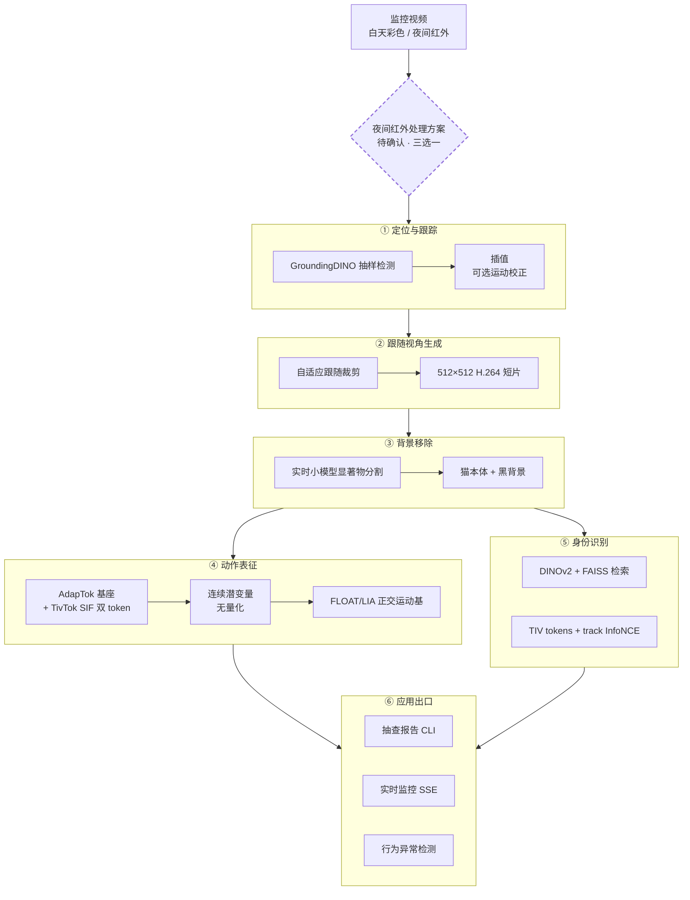
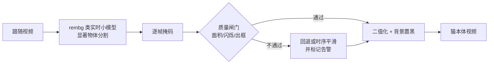
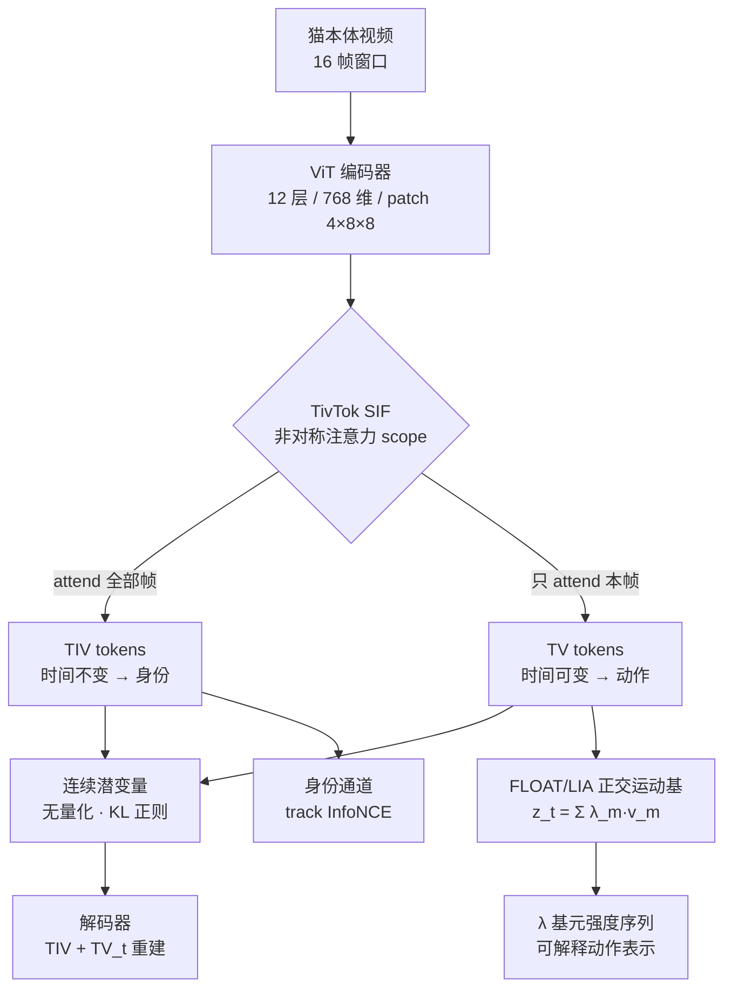
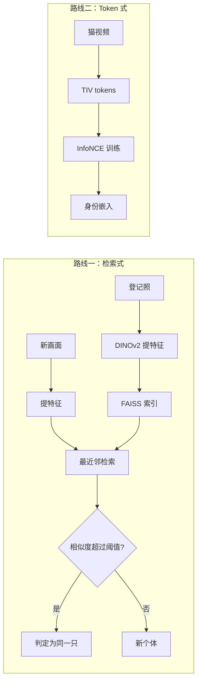
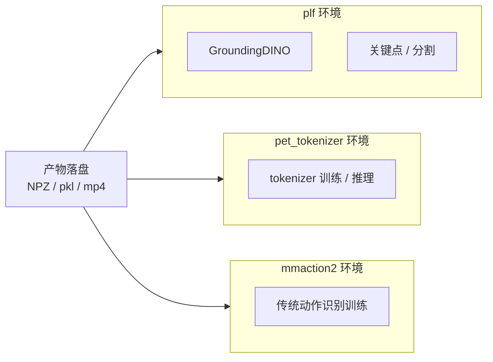
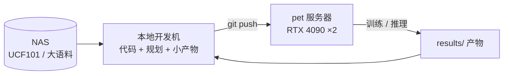
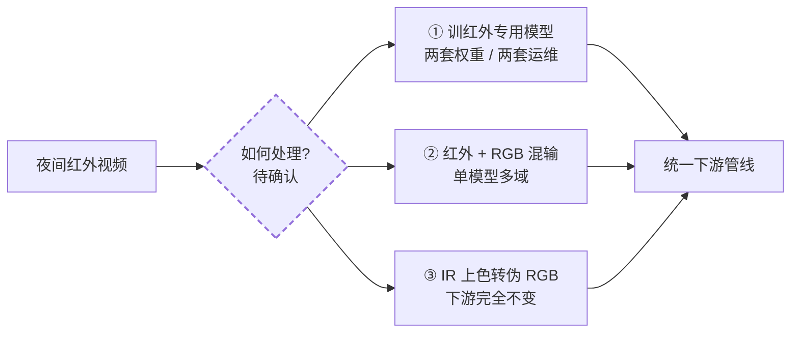

# 系统架构：结构 · 设计 · 进度

> **本文是所有「结构 / 设计」问题的唯一入口**：术语表（§0）→ 端到端总图（§1）→ 分层设计（§2）→ 跨切面（§3）→ 待定选择（§4）→ 决策索引（§5）→ 演进记录（§6）→ 进度（§7）。
>
> **深入设计**：模型层 → [8 号《身份-动作 Tokenizer》](./identity-tokenizer.md)；身份两条路线原理 → [7 号《身份标识与检索》](./identity-and-retrieval.md)；数据集 → [2 号《数据集全景》](./datasets.md)；训练 → [4 号《训练体系》](./training-guide.md)。

## §0 术语表

> 首次出现的术语都集中在这里查一遍；后续正文里就不重复定义。

- **mmaction2**：动作识别（视频分类）开源框架，本仓库用它做训练与推理
- **GroundingDINO**：开放词汇检测器——给它一句文字提示（"cat"），它就能在图里框出物体
- **DINOv2**：自监督训练出来的视觉特征提取器，把图/帧变成长长的一串数字（向量），特点是"同一个东西的向量应该相近"
- **FAISS**：向量相似度检索库，把一堆向量存进去，新来一个向量能快速找出库里最像的前 N 个
- **SAM / SAM2**：Meta 出品的分割模型，给一个点/框/提示就能把物体边缘精确抠出来；SAM2 加了记忆注意力，能沿时间传播掩码。**本项目的用法**：**背景对象层**（维护背景物件清单 + 纠正/补全 GroundingDINO），**仅关键帧触发**；**不用于抠猫**（抠猫用 `rembg` 类实时小模型）
- **OWLv2**：开放词汇检测器，跟 GroundingDINO 思路类似
- **HDBSCAN**：基于密度的聚类算法，把一堆向量自动分成若干簇，不用事先指定要分几类
- **ByteTrack**：经典的多目标跟踪算法，给检测框配上身份 id、维持轨迹
- **CatHuBERT**：借用 HuBERT 语音预训练范式，给视频里"行为素"打伪码再自监督预训练
- **TivTok**：视频 tokenizer，用 **TIV**（时间不变，管身份）+ **TV**（时间可变，管动作）两组 token 表达一段视频；其 SIF 机制靠注意力范围差异实现分解
- **FLOAT / LIA**：身份-动作解耦方法；运动 latent = 正交运动基的线性组合 `z_t = Σ λ_m·v_m`
- **TiTok**：视觉 tokenizer，用几十个 token 就能表达一张图（而不是动辄几百个 patch token）
- **正交运动基**：M 个两两正交的运动方向（QR 硬约束）；每帧的动作 = 这些方向的加权和，系数 `λ_m(t)` 可读
- **checkpoint**：训练好的模型权重文件，本仓库放在远程 pet 服务器
- **NAS**：网络存储，本项目指挂载在开发机上的共享磁盘（UCF101 等大语料放这里）
- **RTF**（Real-Time Factor）：推断速度指标，每秒视频时长除以每秒推断时长，0.032 表示处理速度约为实时 30 倍
- **对比学习（contrastive learning）**：核心思想——把"同一类"样本在特征空间里拉近、把"不同类"样本推远。本项目身份标识的核心视角：**同一只猫应共享同一组身份 tokens（positive invariance），不同猫应有不同身份 tokens（negative discrimination）**。猫 Re-ID（DINOv2+FAISS）与身份-动作 Tokenizer 的 track 级 InfoNCE 是同一原理的不同实现。

## §1 端到端设计总图

整条链路的目标：把监控视频变成"某时段某只猫在做什么"的结构化报告。六个环节，每个环节的输出都是下一环节的输入（第 4/5 环节并列消费第 3 环节）。

**一句话总览**：把监控视频切成"以猫为中心的小片"→ 抠掉背景 → 给每片学一个可分解的动作表征 → 用表征做检索或异常检测，最终产品是"某时段某猫在做什么"的报告。

**设计要点**：第 3 环节（背景移除）是为第 4 环节服务的——followcam 的相机随猫移动，背景持续变化，若不剥离，动作通道会把相机运动当成动作学进去。空间上下文（在床上/地上）已由第 1 环节的空间关系状态层独立承担，因此抠像不丢信息。

## §2 分层设计

### §2.1 L1 定位与跟踪

| 项 | 设计 |
|---|---|
| 输入 | 原始监控视频（白天彩色 / 夜间红外） |
| 输出 | 每帧猫框 + 家具框 + 轨迹 id（JSON） |
| 算法 | GroundingDINO 多 prompt 抽样检测（每 10 帧）→ 插值 → **（可选）运动校正**（默认禁用） |
| 代码 | `scripts/pet_detect_track.py`、`scripts/pet_multi_detect.py` |
| 关键决策 | 不用 ByteTrack 全帧率（单猫白天场景过度工程）；关键点降级为辅助信号 |
| 空间语义 | 猫框底边中点落入家具框 → `cat on {家具}`，否则 `on floor`；≥1.5s 迟滞 |
| 状态 | ✅ 已归档（`multi-object-detect-gate`、`batch-followcam-extraction`）|

**为什么不用 ByteTrack 全帧率**：单猫白天场景下"每 10 帧抽样检测 + 插值"已经够用，再叠多层跟踪器是过度工程。

**运动校正（可选）**：猫被柱子/家具遮一下又出来、重新框到时位置可能跳变，运动校正让位置平滑。它是**插值之后的独立开关，默认禁用**（治标有限，关键帧丢就让它丢，渲染层过滤兜底）。参数与实测见 [9 号《研究结论与踩坑》§4.1](./lessons.md)。展开说明见 [7 号 §1](./identity-and-retrieval.md)。

### §2.2 L2 跟随视角生成

| 项 | 设计 |
|---|---|
| 输入 | 轨迹 JSON |
| 输出 | 512×512 以猫为中心的 H.264 短片 |
| 算法 | 自适应跟随裁剪（猫居中）+ 尺寸离群过滤 + 渲染层漂移过滤 |
| 代码 | `scripts/make_followcam.py`、`scripts/pet_batch_run.py` |
| 状态 | ✅ 34/34 段完成（共 14.7 分钟）|

**为什么它是主表示载体**：跟随视角是后续所有特征学习的载体——下游模型拿到的不再是"整张监控画面"，而是"这只猫此刻的画面"。好处：① 模型不用再学"找猫在哪里" ② 分辨率不再被浪费在背景上 ③ 帧间变化幅度集中在猫身上，更利于动作建模。详见 [7 号 §2](./identity-and-retrieval.md)。

### §2.3 L3 背景移除

| 项 | 设计 |
|---|---|
| 输入 | 跟随视频 + 猫检测框（复用 L1 产物）|
| 输出 | 仅含猫本体、背景置黑的视频（帧数/帧率/分辨率对齐，不覆盖原视频）|
| 主选 | **`rembg` 类实时小模型**——显著物体分割（followcam 猫居中且占主体 → 猫天然是最显著物体）；候选 `u2net` / `u2netp` / `silueta`（Apache-2.0）、`isnet-general-use`（Apache-2.0）、`birefnet-general-lite`（MIT）；GPU 几十毫秒/帧 |
| ⚠️ 许可 | `rembg` 库 MIT，但**权重许可独立**；**`bria-rmbg` 是 rembg 默认模型、BRIA 商用需付费 → 必须显式换掉**；RMBG 系权重为红线 |
| 已否决 | RVM（人物域 + GPL-3.0 传染）；**SAM2 退出抠猫**（改用于背景对象层）|
| 质量兜底 | 面积突变 / 帧间闪烁 / **掩码出框（显著物体选错对象）** / 检测丢失 → 回退或时序平滑 + 告警，不静默输出脏数据 |
| 状态 | 📋 `pet-background-removal` 已立项（4/4 规划，待实施）|
| 关联 | **背景对象层（SAM，关键帧）**：维护背景物件清单 + 纠正/补全 GroundingDINO。独立 change（暂名 `background-object-memory`）；与本环节是**两个用途、两套模型** |

### §2.4 L4 动作表征（模型层）

这是全项目最复杂的环节，深入设计见 [8 号《身份-动作 Tokenizer》](./identity-tokenizer.md)。此处只给结构骨架：

| 项 | 设计 |
|---|---|
| 基座 | **AdapTok**（MIT，12 层 / 768 维 / patch 4×8×8，与 TivTok 同形，自带完整 attention mask 框架）|
| 双 token | TivTok 的 SIF：TIV 看全部帧（身份）、TV 只看本帧（动作），分解由架构诱导而非损失约束 |
| 量化器 | **无量化**（连续潜变量 + KL 正则，TiTok VAE 模式同思路）；SoftVQ 软码本仅作备用正则 |
| 动作通道 | FLOAT/LIA 正交运动基：`z_t = Σ λ_m·v_m`，基由 QR 每次前向正交化；λ 曲线即动作基元强度 |
| 离散化 | **不在帧级做**——交给行为聚类（HDBSCAN + 命名，序列级）|
| 身份通道 | TIV 池化 + track 级 InfoNCE（同猫拉近、异猫推远）|
| 监督 | 重建（L1 + 感知 + 对抗）+ 动作伪行为素 CE + 身份 InfoNCE + 跨猫交换重建（解耦验证）|
| 两阶段 | A：UCF101（13320 段，NAS）验证架构 → B：猫语料迁移 + 身份监督 |
| 状态 | ⏳ 主线 2.3（规划完成，待实施）|

**为什么先无监督发现行为**，而不是直接套人工标注类别？因为 cats v1 的人工 activity 标注里"伞类"占了一半——意思是人也不知道猫到底分几类活动。让数据自己聚成簇、再人工命名，往往比"先拍脑袋定 5 类"更靠谱。详见 [2 号《数据集全景》§2](./datasets.md)。

**验收四闸门**：线性可分性、可命名率、码本健康度、**身份泄漏审计**（防止行为表征被身份信号污染）。详见 [9 号《研究结论与踩坑》](./lessons.md)。

### §2.5 L5 身份识别

两条并行路线，**共享同一原理**：同猫跨时间/视角要聚到一起，不同猫要区分开。

| 路线 | 机制 | 特点 | 状态 |
|---|---|---|---|
| 检索式 | DINOv2 特征 + FAISS 最近邻 | 零训练、可解释、易上线 | ⏸️ `registry-retrieval`（待批准）|
| Token 式 | TIV tokens + track InfoNCE | 与动作表征同源、联合训练 | ⏳ 随 L4 产出 |

两条路线的相同性质：**同猫跨时间/视角特征要聚到一起（positive invariance）、不同猫/物体要互相区分（negative discrimination）**。抓住这一条，主线就稳了。详见 [7 号 §3/§4](./identity-and-retrieval.md)。

### §2.6 L6 应用出口

| 形态 | 输入 | 输出 | 状态 |
|---|---|---|---|
| 抽查报告 | 指定时段录像 | JSON/Markdown（标签/起止秒/track/身份/置信度/在场率/空间状态）| ⏳ `spot-check-cli` 规划完成 |
| 实时监控 | live 视频流 | SSE 推送状态（秒级）| ⏳ 同上（复用 live 模块流式设施）|
| 异常检测 | 行为表征序列 | 异常告警 | ⏸️ `behavior-anomaly-detection`（研究型，延后）|

**形态修订（2026-09-16）**：由"仅非实时抽查"修订为**实时监控 + 非实时抽查双模式**，两者共享同一份行为簇字典（离线发现、在线分配）。

异常检测的候选机制：正常 = 高频已命名簇，异常 = 低频簇 / token 转移突变 / 滑窗直方图偏离（HDBSCAN 簇 ID 序列、VQ token、马尔可夫、孤立森林待调研）。

## §3 跨切面设计

### §3.1 双环境隔离

依赖冲突无法在一个环境里共存，因此按用途切分：

**原则**：环境间**不 import 跨用**，靠产物落盘交接；管线脚本用 subprocess + 环境切换调用。GroundingDINO/HQSAM/ViTPose 这套依赖重且与 mmcv 约束冲突风险高，所以 pet 上另起 conda env `plf`（决策 D5）。

### §3.2 可替换模块（petlib）

检测 / 跟踪 / 关键点三大能力封装在 `petlib/` 下，以抽象基类 + 契约测试保障可替换（13 项契约测试通过）。

### §3.3 部署与数据拓扑

**纪律**：远程 = 只读执行环境，所有文件改动在本地完成、经 git 同步；GPU 任务前查占用；产物只写项目路径。

## §4 目前面临的选择

> 下表是**当前未定**的设计选择。已定的不再列出（见 §5 决策索引）。

### §4.1 背景移除（L3）

| # | 选择项 | 选项 | 倾向与理由 |
|---|---|---|---|
| C1 | 抠像模型 | `rembg` 小模型（`u2net`/`u2netp`/`silueta`/`isnet-general-use`/`birefnet-general-lite`）| **rembg 实时小模型**（2026-09-17 用户裁定）——显著物体分割正好对症 followcam 猫居中场景；GPU 几十毫秒/帧。**SAM2 退出抠像**（改用于背景对象层）；RVM（GPL）与 RMBG 系（非商用）红线 |
| C2 | 掩码形态 | 二值 / alpha | **二值**——下游是特征提取，不需要羽化 |
| C3 | 多猫场景 | 掩码并集 / 逐猫分离 | 待定：并集简单，但身份训练需要单猫片段 |

### §4.2 模型架构（L4）

| # | 选择项 | 选项 | 倾向与理由 |
|---|---|---|---|
| C4 | 编码器初始化 | AdapTok 权重 / SoftVQ-VAE 权重 / 从零训 | **AdapTok 权重**（同形、MIT）；从零训可接受（SoftVQ 权重为次选）|
| C5 | 量化器 | **无量化（连续 + KL）** / SoftVQ 软正则 / FSQ / VQ | **已定：无量化**（2026-09-17）——下游全需连续表征；先例：TiTok 官方 VAE 模式（重建反优于 VQ：0.84 vs 1.49）、SoftVQ-VAE 本就是 continuous tokenizer、MAR/AR-video 去 VQ 先例 |
| C6 | TIV : TV 比例 | 3:1 / 1:1 / 1:3 等 | **3:1**（TivTok 实测口径：TIV 96 + TV 32 @16 帧）|
| C7 | token 数量 | N_TIV / N_TV / 正交基元数 M | 待定：起点 N_TIV 96、N_TV 2/帧、M 20–32，做缩放消融 |
| C8 | 正交基实现 | QR 分解 / 经典 Gram-Schmidt | **QR 分解**——与 LIA/FLOAT 实现一致，数值更稳；论文称 Gram-Schmidt 指同一数学对象 |
| C9 | 基的符号 | 自由 / 训练后固定 | 冻结基时必须固定符号，否则 λ 语义漂移 |
| C10 | 对齐教师 | 无 / DINOv3（外观）/ V-JEPA 2 或 InternVideo2（动作）/ 加 SACP | 待定：先不加（纯架构解耦），训练不稳再上 DeRA 式对齐 |
| C11 | 训练粒度 | 阶段 A1 冻结骨干 → A2 端到端 | **两段都做**，实测 A1 是否够用 |
| C12 | 输入规格 | 128 vs 256 分辨率；16 帧 | 待定：256 贴近 TivTok 口径，128 省算力 |
| C13 | 自适应 token 预算 | 用 AdapTok 的 block-mask + ILP / 不用 | 待定：作为后续增强，本期固定预算 |

### §4.3 身份与出口（L5/L6）

| # | 选择项 | 选项 | 倾向与理由 |
|---|---|---|---|
| C14 | 身份监督形式 | InfoNCE / ArcFace / 两者 | **InfoNCE 为主**（与对比学习主线一致），ArcFace 作增强 |
| C15 | 实时模式延迟预算 | 秒级 / 更高 | 待定（`spot-check-cli` 的 Open Question）|
| C16 | 异常检测机制 | HDBSCAN 簇序列 / VQ token / 马尔可夫 / 孤立森林 | 待调研（研究型 change）|

### §4.4 跨环节：输入域（夜间红外）——**待确认**

**问题**：现有语料（34 段 followcam）只覆盖白天彩色；夜间红外段尚未处理。而下游**全部环节**（L1 检测 → L3 抠像 → L4 动作表征 → L5 身份）都默认 RGB 输入，红外域一致性必须先解决——否则夜间数据要么进不了管线，要么静默拉低下游指标。

| # | 选择项 | 选项 | 说明 |
|---|---|---|---|
| C17 | 夜间红外处理方案 | ① 训专用模型 / ② 红外+RGB 混输 / ③ IR 上色 | **待确认**（2026-09-17 记录）|

| 方案 | 做法 | 成本 | 风险 |
|---|---|---|---|
| ① 训红外专用模型 | 红外域单独训练一套权重 | 最高（红外标注语料少；两套权重/两套运维）| 夜间样本量可能根本不够训 |
| ② 红外 + RGB 混输 | 同模型吃两种模态，域随机化 / 域对齐 | 中等 | 需防止 RGB 性能回退；模态对齐技巧待验证 |
| ③ IR 上色转伪 RGB | 上色模型（如语义引导上色）把红外转伪彩色，下游全链路不变 | 最低（复用现有全部管线）| 上色引入的非真实纹理可能**污染动作/身份特征**；需审计 |

**判定依据（待实测）**：夜间段有效样本量、上色后特征与真彩色的分布距离、下游四闸门指标（线性可分性/可命名率/码本健康度/身份泄漏）。

**落点**：需独立 change（暂名 `night-infrared-ingest`）；待用户裁定方向后再立项登记进路线图。

### §4.5 推理形态与时间尺度（L4/L6）——**待确认**

**背景问题：现有模型处理定长还是不定长？**

| 范式 | 输入 | 输出 | 时长处理 |
|---|---|---|---|
| 裁剪片段识别（trimmed recognition）| **定长 clip**（如 16 帧）| 1 个标签 | 定长 |
| 时序动作检测 TAD | 长未裁剪视频 | **变长 proposal**（起止 + 类别）| 变长 |
| 时序动作分割 TAS | 长视频 | **逐帧标签 → 变长段** | 变长 |
| 在线动作检测 OAD | 视频流 | 逐帧 / 当前动作 | 变长（流式）|

**结论**：主流识别模型（含本仓 mmaction2 全部 config：`clip_len=16/48`、`num_clips=1/10`，以及 VideoMAE / UniformerV2）都吃**定长 clip**；推理时靠"多 clip 平均 / 滑窗"把定长窗口铺满视频。**要真正处理不定长，必须换范式（TAD/TAS/OAD）或加时序后处理**。

**现状**：滑窗 16 帧 stride 8 → 窗口特征 → 聚类 → 行为簇。❌ **"一个窗口 = 一个标签"的假设在真实监控里不成立**：一个视频常含多个动作，动作时长跨度达 3 个数量级（打哈欠 ~1 s ↔ 睡觉 ~30 min）。

**三个纠缠的待定项**：

| # | 决策 | 选项 | 说明 |
|---|---|---|---|
| C18 | **推理形态** | ① 纯流式实时（环形 buffer 逐帧/在线推断）② **定长段非流式**（切定长段→判段内动作）③ 混合（定长段 + 跨段状态）| 流式延迟低但需状态机；定长段实现最简、**延迟 = 段长**。live 模块已是"环形 buffer + 滑窗"雏形 |
| C19 | **动作长度** | ① **先定长、后不定长** ② 直接不定长 | 定长 = 先假设动作 ≈ 固定窗口；不定长 = 承认时长可变。跨度 1 s ~ 30 min 是真实约束 |
| C20 | **一个视频多个动作** | ① 逐窗多标签（sigmoid）② **逐窗标签 + 时序后处理成变长段**（中值滤波 / Viterbi / 最小段长约束）③ 直接用 TAD 模型 | ② 是 TAS 领域标准做法，也是**抽查报告需要的输出形态**（起止秒 + 标签）；③ 需边界标注，而我们只有弱标注 |

**推荐方向（待实验验证，非结论）**：C18 → ②（定长段，但选型为实时可用级，为 L6 预留）· C19 → ①（先定长跑通，再上多尺度）· C20 → ②（后处理成段）。

**三个必须承认的难点**：

1. **跨边界混合窗污染行为词表**——窗口跨动作边界时，特征是两动作混合，会被聚成"混合簇"。对策：变化点检测 / 在低变化处切窗 / 重叠窗 + 逐帧判定
2. **时间尺度跨度**——16 帧（≈0.5 s）窗口物理上覆盖不了 30 min 的睡觉。对策：**多时间尺度**（短窗 + 长窗分层）
3. **输出形态决定架构**——"某时段某猫在做什么"的答案必须是**段列表**（起止秒 + 标签 + 置信度），不是单标签 → **时序后处理层不可省**

**已有的有利条件**：tokenizer 的 TV token 与 `λ_m(t)` 都是**逐帧**的 → 天然支持"逐帧标签 → 后处理成段"，不受"窗口 = 一个动作"限制。缺的正是时序后处理层与多时间尺度。

## §5 设计决策索引

已定决策的全局 ID（跨文档引用不变）：

| ID | 主题 | 位置 |
|---|---|---|
| D1 | 检测/跟踪/居中工程形态 | `batch-followcam-extraction/design.md` |
| D1b/D1c | GatedTracker 否决 / 候选跟踪器原理 | `tracker-selection/design.md` |
| D2 | 关键点选型裁定（降级为辅助）| `batch-followcam-extraction/design.md` |
| D2b | HQSAM 定位 | `video-feature-latent/design.md` |
| D3 | 隐空间架构 | `video-feature-latent/design.md` |
| D4 | 推理形态（抽查 + 实时双模式）| `pet-motion-latent-pipeline/design.md` |
| D5 | 环境隔离 | `pet-motion-latent-pipeline/design.md` |
| D6 | petlib 接口 | `pet-motion-latent-pipeline/design.md` |
| D7 | 身份体系 | `spot-check-cli/design.md` |
| D8 | 主表示选型 | `video-feature-latent/design.md` |
| D9 | 登记-检索架构 | `registry-retrieval/design.md` |

**模型层设计决策**（T-A1…T-A9，含两阶段数据、损失、token 骨架、正交基、评测矩阵）见 `openspec/changes/identity-action-tokenizer/design.md`；**抠像层**（二值掩码、`rembg` 小模型选型与许可门槛、质量闸门、输出规格、批处理）见 `openspec/changes/pet-background-removal/design.md`。

## §6 设计演进记录

| 日期 | 变更 | 影响 |
|---|---|---|
| 2026-09-15 | 关键点降级为辅助信号；K400 人类先验不适用 → 候选重构 | L1/L4 |
| 2026-09-15 | 运动校正参数定稿（可选开关，默认禁用）| L1 |
| 2026-09-16 | 推理形态由"仅抽查"修订为**抽查 + 实时双模式** | L6 |
| 2026-09-16 | 路线顺序调整：**编码器优先**——先建 tokenizer，再做行为发现 | L4 |
| 2026-09-16 | 架构收敛：TivTok（骨架）+ FLOAT/LIA（正交基）+ AdapTok（基座）| L4 |
| 2026-09-16 | 新增 L3 背景移除环节（独立 change）| 全链路 |
| 2026-09-16 | 方案否证记录：参考帧机制、纯 register tokens、双独立编码器、模型内 VQ 码本 | L4 |
| **2026-09-17** | **全面去量化**：移除 VQ/SoftVQ，改连续潜变量 + KL；正交仅加在运动基（M≈20–32 方向），不加在码本（R^d 中最多 d 个正交向量，码本 8192 个不可能正交）；离散化交给序列级行为聚类 | L4 |
| 2026-09-17 | 先例核查（联网）：TiTok 官方 `quantize_mode: "vae"` 已有预训练权重且重建更好（0.84 vs 1.49）；SoftVQ-VAE 论文标题即 "Continuous Tokenizer"；MAR / AR-Video-w/o-VQ 跨域印证 | L4 |
| 2026-09-17 | **本文合并**：原 6 号《系统架构》+ 12 号《架构设计》合为一篇，消除重复与漂移 | 全篇 |
| **2026-09-17** | **记录待办：夜间红外处理方案**（① 训专用模型 / ② 红外+RGB 混输 / ③ IR 上色，三选一）——总图已标待确认，详 §4.4 | 全链路输入域 |
| **2026-09-17** | **记录待确认：推理形态与时间尺度**（C18 流式 vs 定长段 / C19 定长 vs 不定长 / C20 一个视频多动作的处理）——详 §4.5 | L4/L6 |
| 2026-09-17 | 抠像模型由 SAM2 改为 **rembg 类实时小模型**；SAM 移至背景对象层（关键帧）| L1/L3 |

## §7 当前进度与未来计划

> 基准日 2026-09-17；执行中进度看 `management/projects/*/tasks.json`，change 状态以 `openspec/changes/pet-motion-latent-pipeline/tasks.md` §2 路线图为准。

### §7.1 子 change 路线图

| # | 子 change | 内容 | 依赖/触发 | 状态 |
|---|---|---|---|---|
| 2.1 | `multi-object-detect-gate` | 多目标检测（五类）+ 空间关系状态层 | — | ✅ 已归档（2026-09-15）|
| 2.2 | `batch-followcam-extraction` | 全量批处理 34 段 + followcam 产出 | 2.1 | ✅ 34/34 闭环（14.7 分钟），**待归档** |
| 2.3 | `identity-action-tokenizer` | 🔬 升主线（encoder 优先）：TivTok SIF 双 token + FLOAT/LIA 正交运动基（UCF101→猫语料两阶段）| 2.2 | ⏳ 待 2.2 归档 |
| 2.3b | `pet-background-removal` | 猫本体抠像——消除背景运动对动作通道的污染 | 可并行 2.3 阶段 A；**2.3 阶段 B 前必须完成** | 📋 已创建待启动 |
| 2.4 | `video-feature-latent` | 消费 2.3 编码器做行为发现 + 探针评测（现成 backbone 降为回退）| 2.3 | ⏳ 待 2.3 |
| 2.5 | `spot-check-cli` | 抽查 CLI + 实时监控模式 + 猫身份登记 | 2.4 | ⏳ 待 2.4 |
| 4A | `tracker-selection` | 跟踪器选型（多猫场景）| 多猫数据出现 | ⏸️ 延后 |
| 4B | `registry-retrieval` | 碗/摄像头实例识别 + 猫 Re-ID | 用户批准实施 | ⏸️ 延后 |
| 4C | `behavior-anomaly-detection` | 行为异常检测（研究型）| 2.4 归档 + 用户发起 | ⏸️ 延后 |

**主线一句话**：`2.2 归档` → `2.3 编码器（+2.3b 抠像并行）` → `2.4 行为发现` → `2.5 抽查出口`。

### §7.2 验收闸门与里程碑

- **video-feature-latent 四闸门**：线性可分性 / 可命名率 / 码本健康度 / 身份泄漏审计
- **identity-action-tokenizer 阶段 A 中期检查点**：UCF101 上 z_t 探针 top1@101 类 + 身份 dropout/交换消融
- **11 月中期验收 KPI**：来自 2026-08-15 二期计划（P0 精度攻坚进行中，P1 端侧 pipeline 待启动）

### §7.3 二期计划对照

| 阶段 | 内容 | 现状 |
|---|---|---|
| P0 精度攻坚 | 8 月中–9 月底 | 多模型训练 5 个 run **全部 error**，问题在数据/接口；k400 烟测 top1 0.77 已验证管线可跑通 |
| P1 端侧 pipeline | 9 月–11 月中 | 34 段白天批处理已 34/34 完成，验证管线；夜间红外段待处理 |
| P2 部署链路与验收 | 11 月–12 月 | 抽查 CLI/异常检测待启动 |

## §8 相关文档

- [8 号《身份-动作 Tokenizer》（模型层深入设计）](./identity-tokenizer.md)
- [7 号《身份标识与检索》](./identity-and-retrieval.md)（定位追踪 / 猫 Re-ID / 物体标识）
- [1 号《仓库资产盘点》](./repo-inventory.md)（资产索引 + 归档 change 清单）
- [2 号《数据集全景》](./datasets.md) / [3 号《模型》](./models.md) / [4 号《训练体系》](./training-guide.md)
- [9 号《研究结论与踩坑》](./lessons.md) / [10 号《第三方项目借鉴》](./third-party-notes.md) / [11 号《交接与协作指南》](./handover-guide.md)
- 远程执行纪律：`.claude/skills/remote-servers/`、`.claude/skills/remote-server-discipline/`
