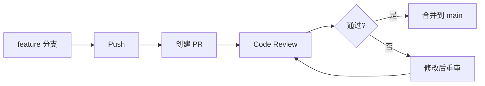

## 分支策略

- `main`：稳定分支，仅接受合并
- `feature/*`：功能分支，从 main 拉取
- `hotfix/*`：紧急修复，从 main 拉取后直接合回

## 提交规范

遵循 [[api-design-conventions|API 设计规范]] 中对版本管理的要求，提交信息格式：

```
<type>: <描述>

type: feat / fix / refactor / style / docs / chore
```

## PR 流程



## 注意事项

- 禁止 force push 到 main
- 合并前确保 CI 通过
- 大型功能用 squash merge 保持历史整洁
