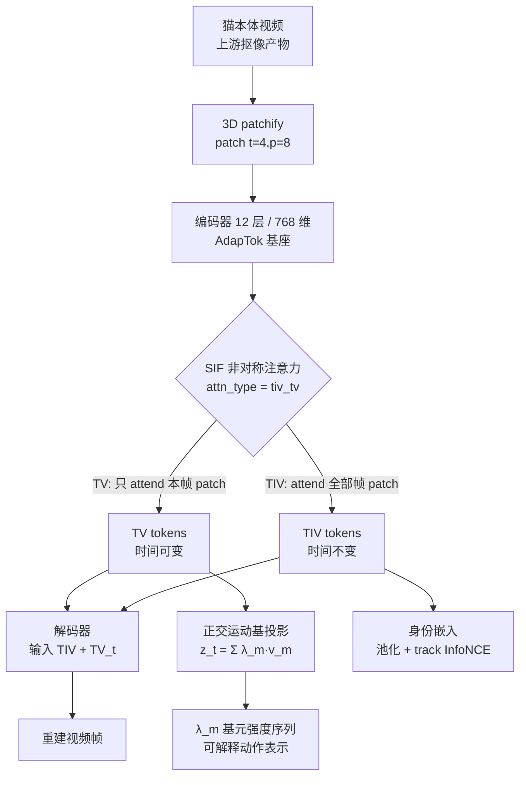
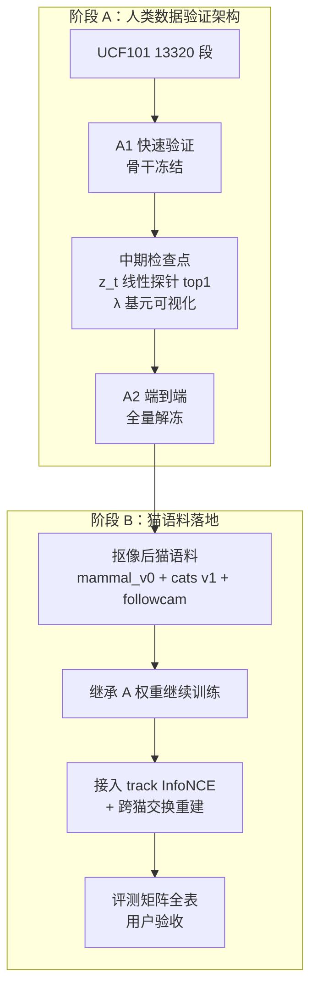

# 身份-动作 Tokenizer：动作识别模型设计

> **一句话**：把一段视频压成两组 token——"这是哪只猫"（TIV，整段共享）与"这帧在动什么"（TV，逐帧一份）；解码器能把两者组合还原视频，说明分解成立。
>
> **定位**：本项目 L4「动作表征」环节的模型设计底稿。上层架构见 [6 号《系统架构》](./architecture.md)，工程实施见 `openspec/changes/identity-action-tokenizer/`。

## §1 设计目标与非目标

**目标**

1. **可分解**：身份与动作在表征层面分开——身份可单独用于 Re-ID，动作可单独用于行为识别
2. **可重建**：`解码器(TIV, TV) → 原视频`，重建可行即分解自洽（这是分解正确性的判据）
3. **动作可解释**：动作 latent 展开为正交基元系数 `λ_m(t)`，每条曲线对应一种基础运动
4. **数据效率**：先在规模大两个数量级的人类数据集验证，再迁移到小规模猫语料

**非目标**

- 不做视频生成产品（解码器只在训练期存在，用于提供监督信号）
- 不做实时推理（那是 L6 出口的职责）
- 不追求像素级完美重建（判据是"分解成立"，不是画质）

## §2 谱系：借什么、否什么

| 来源 | 论文 | 借用内容 |
|---|---|---|
| **TivTok** | arXiv 2606.17590 | **双 token 骨架**：TIV 注意力覆盖全段（身份）、TV 只看本帧（动作）——分解由架构诱导，无需显式监督 |
| **FLOAT** | arXiv 2412.01064 | 正交运动潜空间；`z = 身份 + Σ λ_m·v_m` |
| **LIA** | arXiv 2203.09043 | 正交基的具体实现（QR 每前向正交化）+ 全局池化特征作身份分量 |
| **AdapTok** | arXiv 2505.17011 | **代码基座**：同形超参（12 层/768 维/patch 4×8×8）+ 完整 attention mask 框架 + 训练脚本 |
| **SoftVQ-VAE** | arXiv 2412.10958 | （已降级）其“**连续** tokenizer”定位作为去 VQ 的佐证；其软码本仅作**可选正则器** |
| **MAR** | arXiv 2406.11838 | 反面印证："discrete-valued space … is not a necessity"——连续 token 可行 |
| **AR Video w/o VQ** | arXiv 2412.14169 | 视频域非量化先例 |
| **DeRA** | arXiv 2512.04483 | 显式对齐 + 梯度冲突投影（**备用**：训练不稳时启用） |

**已否定的方案（记录理由，避免重复讨论）**

| 方案 | 否决理由 |
|---|---|
| 参考帧机制（身份只吃 1–2 帧） | TivTok 论文明确指出这是"基于参考帧的手工分解"，弱于架构诱导；且数据效率低 |
| 纯 register tokens（图像分割思路） | 无法实现"从整段视频聚合信息"这一关键需求 |
| 双独立编码器 | 对 FLOAT 的误读；参数量翻倍且 FLOAT 实际是共享骨干 + 末端分叉 |
| 模型内 VQ 码本 | 由离线聚类伪标签替代；**且所有量化器（含 SoftVQ）已于 2026-09-17 全面移除**——下游全需连续表征，量化只服务 AR 生成；序列级离散化已由行为聚类承担（详见 §4.4） |
| 冻结骨干当特征提取器 | 架构本质是端到端 tokenizer，冻结只是快速验证阶段的策略 |

## §3 架构总图



**数据流说明**：TIV 与 TV 共享同一个编码器，通过 attention scope 分离；**无量化层**——编码器输出的连续潜变量直接送入解码器与正交基投影。第 t 帧只由 `TIV + TV_t` 重建（TivTok 的 Invariant Broadcasting）。

## §4 逐组件设计

### §4.1 预处理：背景移除（上游环节）

**为什么必须做**：followcam 的相机随猫移动 → 背景持续变化。TivTok 的假设是"背景稳定"（那样 TIV 能抓到稳定的场景结构），我们的场景不成立——若不剥离背景，**TV 会把相机运动与场景变化当作动作学进去**。

**设计**：上游 change `pet-background-removal` 负责，输出"猫本体 + 黑背景"视频。空间上下文（在床上/地上）由 L1 空间关系状态层承担，因此抠像不丢信息。

### §4.2 基座：AdapTok

| 项 | 取值 | 理由 |
|---|---|---|
| 结构 | 1D 潜 token + block transformer | 与 TivTok 同形 |
| 规模 | 12 层 / 768 维 / 12 头 | 与 TivTok 报告一致 |
| patch | 时间 4 × 空间 8×8 | 同上 |
| 许可 | MIT | 可自由改造 |
| 资产 | 代码 + 预训练权重 + 训练脚本 | 直接可跑 |

**关键优势**：AdapTok 自带**完整的 attention mask 生成框架**（支持多种 `attn_type`），因此实现 SIF 只需**新增一个 mask 类型**，而非重写编码器。

### §4.3 双 token 骨架：TivTok SIF

```
TIV tokens（N_TIV 个，可学习）
    scope = 全部帧的 patch + 全部 TIV + 全部 TV     ← 全局，可见未来

TV tokens（每帧 N_TV 个）
    第 t 帧的 scope = 第 t 帧 patch + 全部 TIV + 自己  ← 局部，看不到别帧
```

**设计原理**（TivTok 原话）：*"一个 token 的信息流应当匹配它的表征角色——要捕捉时间不变量的 token 必须看到整个序列；要捕捉帧级残差的 token 必须被阻止吸收跨帧信息。"*

**实现要点**

1. 新增 `attn_type = "tiv_tv"` 到 mask 生成器（AdapTok 现有类型是**块因果**，只能看同块或前块；SIF 要求 TIV 看全段含未来 → 必须新增非因果类型）
2. 复用 AdapTok 的 `Attention(attn_mask)` 通路（已支持 SDPA 的 mask 传参）
3. **不要用因果掩码**——TivTok 论文明确：因果掩码会让 TV 吸收跨帧信息，与 TIV 职责重叠

**token 配比**：TivTok 实测口径为 **TIV : TV = 3:1**（16 帧时 TIV 96 + TV 32）。我们的 TIV 承担身份，属于信息密集型，应保持 TIV 主导。

### §4.4 潜空间：连续，**无量化**（2026-09-17 修订）

**决策**：移除全部 VQ / SoftVQ 量化层，编码器输出**连续潜变量**（TiTok 官方 VAE 模式同思路）。

| 项 | 取值 |
|---|---|
| 瓶颈 | 无量化——编码器输出 `z` 直接给解码器/下游 |
| 正则 | KL 项（沿用 TiTok VAE 模式）+ 损失端 per-dim 尺度归一 |
| 备选正则 | SoftVQ 软码本（**仅当阶段 B 潜空间散乱时启用**，非 v1 组成）|

**为什么删掉 VQ**（三个层面）：

1. **用途不匹配**：量化的存在意义是给 AR 生成提供离散词表；我们下游是聚类 / 线性探针 / 异常检测 / λ 曲线，**全部只需连续表征**（连续还信息更多）
2. **功能重叠**：管线里已经有离散化步骤——**行为聚类（HDBSCAN + 人工命名）就是序列级离散化**。帧级 VQ 会与之形成两套竞争词表，且更不可解释（8192 个无语义码字 vs 人工命名的行为簇）
3. **先例充分且质量不降**（联网核查 2026-09-17）：
   - **TiTok 官方就支持** `quantize_mode: "vae"`（对角高斯 + KL），**已发布预训练权重**；
   - 且**重建更好**：ImageNet rFID BL-128 **VAE 0.84** vs VQ 1.49，BL-64 VAE 1.25 vs VQ 2.06
   - **SoftVQ-VAE 论文标题就是 "1-Dimensional Continuous Tokenizer"**，`z_q = Σ p_k·c_k` 是连续加权和（前向无 straight-through、无 argmax）→ **TivTok 的“量化”本来就是软的**，我们去 VQ 是**延续而非背离**
   - 跨领域：MAR（2406.11838）"discrete-valued space … is not a necessity"；**视频域**：AR Video w/o VQ（2412.14169）

> ⚠️ **术语提醒**：文献普遍把 SoftVQ 类输出称作 "quantized / discrete code space"（TivTok 原文亦如此），但**实现是连续的**。读论文别被这个词吓住。

**去 VQ 的已知问题与对策**：

| 问题 | 对策 |
|---|---|
| 潜空间可能各向异性 / 尺度失衡，影响聚类 | KL 正则 + 聚类前 whitening（**必须做**）|
| 失去码本利用率这类可观测指标 | 改用「λ 各维方差谱 + 重激活统计」监控 |
| 重建目标可能被低方差维主导 | 损失端 per-dim 标准化 |
| 无离散词表（未来 AR 生成用不了） | 未来生成走 **flow matching**（FLOAT 路线）而非 AR |

### §4.5 动作通道：FLOAT/LIA 正交运动基

**数学形式**

```
z_t = w_identity + Σ_{m=1}^{M} λ_m(t) · v_m
                     └──────────┬──────────┘
                          正交运动基分量
V = {v_1 … v_M}：可学习基矩阵的 QR 分解结果 → 列向量两两正交
λ_m(t)：第 t 帧在第 m 个运动方向上的强度
```

**实现**（与 LIA/FLOAT 代码一致）

```python
self.weight = nn.Parameter(torch.randn(d, M))      # 可学习基矩阵
Q, _ = torch.linalg.qr(self.weight)                # 每次前向正交化
z = Q @ lambda_                                    # 正交基线性组合
```

**关于“论文说 Gram-Schmidt、代码用 QR”**：Gram-Schmidt 正是计算 QR 分解的算法，二者是同一数学对象；代码用 LAPACK 的 Householder QR（数值更稳）。因为 λ 由网络学习，Q 的列符号差异会被训练吸收。**唯一注意点**：若要冻结基作固定组件，须显式固定符号，否则 λ 语义漂移。

**正交的层级（常见混淆，必须分清）**：

```
基 V = {v_1 … v_M}   ← 正交性属于【坐标系】（M 个方向两两正交，QR 保证）
token z_t           ← 是正交空间里的一个【点】，本身无所谓正交不正交
坐标 λ_t             ← 用这把尺子量出的【读数】；正交归一基下 λ_m = <z_t, v_m>
```

| 关系 | 是否正交约束 | 说明 |
|---|---|---|
| 运动基元之间 | ✅ QR 硬约束 | M 个方向互相独立 → 单独编辑 λ_m 不串扰其他基元 |
| 不同帧的 token 之间 | ❌ 不需要 | 帧间本就应该变化 |
| 身份 vs 动作 | ❌ 不靠正交 | 靠 SIF 的 attention scope 分离（§4.3）+ 跨猫交换重建验证 |
| SoftVQ 码字之间 | ❌ **数学上不可能** | R^d 中最多 d 个互相正交的非零向量；码本 8192 个 32 维向量远超维度 |

**维度限制的推论**：正交只能约束“少数方向”（M ≤ d，实际 M=20~32），**不能约束海量码字**。这就是为什么正交应该放在基上、而不应该放在码本上——也是我们不需要码本的又一个理由。

**为什么值得做**（不只是为了解耦）：`λ_m(t)` 是**可读的动作基元强度时间序列**——行为发现可以直接对 λ 向量聚类、把每条基元曲线可视化，行为可解释性显著优于纯黑盒 latent。

**移植风险**（必须自备监督）：LIA/FLOAT 的分解之所以成立，是因为其解码器用**光流 warp** 重建驱动帧。我们禁用 warp，因此**没有任何现成监督在驱赶基指向"运动"** → 必须自备解耦目标（见 §4.7 损失）。

### §4.6 身份通道：TIV + track InfoNCE

| 项 | 设计 |
|---|---|
| 载体 | TIV tokens 池化 → 身份嵌入 |
| 正样本 | 同一只猫的跨帧 / 跨视频片段 |
| 负样本 | 批次内其他猫 + 记忆库（≥4096） |
| 温度 | τ = 0.07 |
| 跨视频扩展 | 登记猫在不同日期的视频互为正样本（天然 Re-ID 监督） |
| 视角无关性 | TIV **注意力覆盖全段视频**，天然聚合多视角信息；另加多裁剪 / 随机擦除 / 颜色抖动增强 |

### §4.7 解码器与损失

**解码器**：轻量 Transformer，输入 `[TIV, TV_t]` 重建第 t 帧（帧作 batch 维，天然并行）。

| 损失项 | 作用 | 权重/配置 |
|---|---|---|
| 重建 L1 | 基础重建 | 1.0 |
| 感知损失 | 画质 | 1.0（VGG 或 LPIPS） |
| 对抗损失 | 锐度 | 0.2；判别器 DINOv2-S；LeCAM 0.001 |
| 动作伪行为素 CE | 动作判别性 | CatHuBERT 离线聚类（K=256）伪标签 |
| 速度匹配 + 平滑 | 时序合理性 | 待定 |
| 身份 InfoNCE | 身份判别性 | τ=0.07 |
| **跨猫交换重建** | **解耦验证** | 猫 A 的 TV × 猫 B 的 TIV → 应重建出"B 做 A 的动作" |

**可选稳定器**：DeRA 式显式对齐（外观 latent ↔ DINOv3，动作 latent ↔ 视频基础模型）+ 梯度冲突投影。**仅当训练不稳定时启用**，v1 不加。

## §5 训练流程



**为什么先人类数据**：猫语料仅 34 段白天视频（14.7 分钟）+ 约 3k 短片段，训不动一个重建型 tokenizer；UCF101 有 13320 段（NAS 现成），量级大两个数量级，用于验证架构可行性。UCF101 上的"身份"= 同一段视频里的同一个人，与猫 Re-ID 同构。

**阶段 A 消融**：冻结骨干（A1）vs 端到端（A2）的重建质量对比；token 数缩放实验。

## §6 评测矩阵

| 维度 | 指标 | 达标参考 |
|---|---|---|
| 重建 | LPIPS / PSNR / rFVD | 与 TivTok 报告同量级 |
| 动作判别 | z_t 线性探针 top1（UCF101 101 类 / 猫 5 类） | 优于冻结基线 |
| **动作可解释** | λ_m(t) 基元曲线 + v_m 可视化 | 基元语义可控、可命名 |
| 身份检索 | 身份嵌入最近邻 rank-1 | 高 |
| **视角无关性** | 同猫不同视角身份余弦相似度 | ≥ 0.7 |
| **身份泄漏** | 在 z_t / λ 上训个体分类器 | 接近随机 |
| 解耦 | 跨猫交换重建质量 | 换身份后外观变、动作保持 |

## §7 待定选择

| # | 选择项 | 选项 | 当前倾向 |
|---|---|---|---|
| 1 | 编码器初始化 | AdapTok 权重 / SoftVQ-VAE 权重 / 从零 | AdapTok 权重（同形 + MIT）；从零可接受 |
| 2 | 量化器 | ~~SoftVQ / FSQ / VQ~~ | **已定：无量化（2026-09-17）**——见 §4.4 |
| 3 | TIV : TV 比例 | 3:1 / 1:1 / 1:3 | 3:1（TivTok 实测） |
| 4 | token 数量 | N_TIV / N_TV / M | 起点 96 / 2 / 20–32，做消融 |
| 5 | 正交基维度与符号 | 基矩阵形状；是否固定符号 | d=512、M=20（LIA 先例）；冻结时固定符号 |
| 6 | 对齐教师 | 无 / DINOv3 / V-JEPA 2 / InternVideo2 | v1 不加，训练不稳再上 |
| 7 | 训练粒度 | 仅 A1 / A1+A2 | 两者都做，实测 |
| 8 | 输入规格 | 128 vs 256 分辨率；窗口长度 | 待定（256 贴近 TivTok，128 省算力） |
| 9 | 自适应 token 预算 | 用 AdapTok 的块掩码 + ILP / 不用 | v2 增强，v1 固定预算 |
| 10 | 身份监督形式 | InfoNCE / ArcFace / 两者 | InfoNCE 为主 |
| 11 | **潜空间正则** | KL（TiTok VAE 模式）/ L2 归一 / SoftVQ 软码本 | **已定：去量化 + KL 正则**（2026-09-17）|

## §8 许可与合规

| 参考 | 许可 | 使用方式 |
|---|---|---|
| AdapTok | MIT | 可直接改造代码 |
| LARP | MIT | 可直接复用 |
| VidTok | MIT | 可复用（重建基线 / 长视频分块） |
| SAM2 | Apache-2.0 | 可直接使用 |
| **FLOAT** | README 声明 **CC BY-NC-ND**（禁衍生），与 LICENSE.md 矛盾 | ⚠️ **只借鉴算法，代码自行实现** |
| **LIA** | CC BY-NC | 非商业可衍生，但**无训练代码** |
| SoftVQ-VAE 仓库 | **无 LICENSE 文件** | ⚠️ **已不作架构组件**（仅参考其连续 tokenizer 论证）；若启用可选软码本正则，只移植算法、自写实现 |
| RVM | **GPL-3.0** | ⚠️ 传染性，避免链接使用 |
| DINOv3 | 自定义 DINOv3 License | 需确认商用条款 |

## §9 参考来源

**本地材料**（`third-party/refs/`，已 gitignore）：`papers/`（18 篇 PDF）、`txt/`（转文本，便于引用行号）、`repos/`（14 个代码库）。

**精读笔记**：[`papers/docs/tokenizer-architecture-refs.md`](../../papers/docs/tokenizer-architecture-refs.md)——含逐篇结论、代码文件行号、对设计的修正清单。

**关键行号索引**

| 主题 | 位置 |
|---|---|
| TivTok SIF 定义 | `txt/2606.17590_tivtok.txt` §3.3 |
| TIV 语义分析（捕获身份而非像素静止） | 同上 §4.5 |
| 正交基实现（QR） | `repos/lia/networks/styledecoder.py:439-458` |
| 正交基在 FLOAT 中 | `repos/float/models/float/styledecoder.py:418-434` |
| AdapTok mask 框架 | `repos/adaptok/models/mask_generator.py:452+` |
| AdapTok mask 通路 | `repos/adaptok/models/block.py:36-61` |
| SoftVQ 实现 | `repos/softvqvae/modelling/quantizers/softvq.py` |

## 相关文档

- [[architecture|系统架构：结构 · 设计 · 进度]]（上层：全项目结构、设计与待定选择）
- [[architecture|系统架构：完整结构总览]]（读者导读）
- [[identity-and-retrieval|身份标识与检索]]（身份路线对比）
- [[datasets|数据集全景]]（UCF101 / 猫语料）
- [[training-guide|训练体系]]
