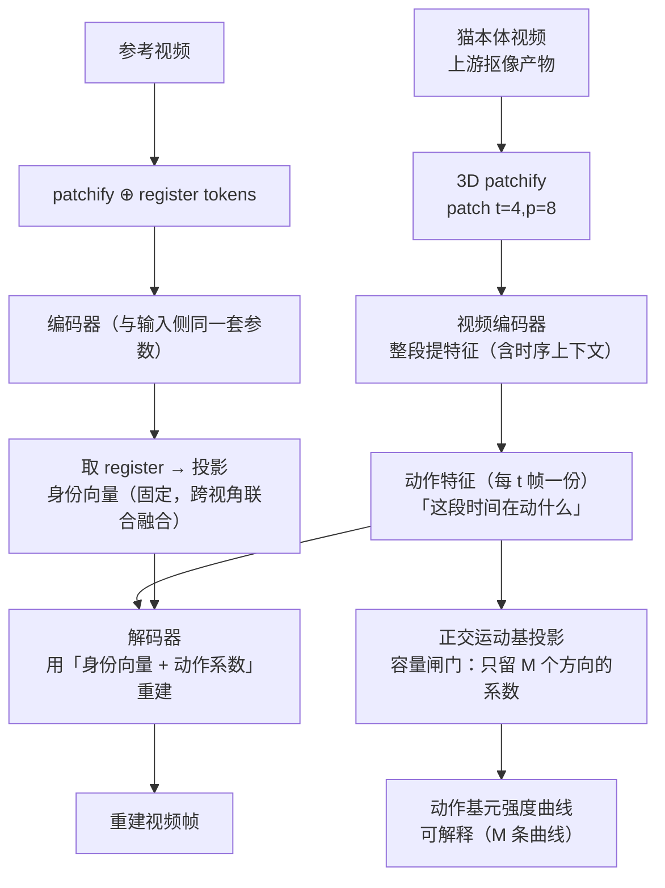
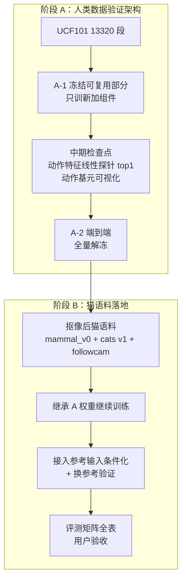

# 身份-动作 Tokenizer：动作识别模型设计

> **一句话**：**参考输入**（用户事先拍的猫图/短视频）→ `w_identity`（这是哪只猫，固定向量）；**待分析视频** → 正交基坐标 `λ_j`（**每 t 帧一份**，这段时间在动什么）；解码器把两者相加还原出帧，就说明分解成立。
>
> **架构主源 = FLOAT**（2026-09-17 重心转向）。
>
> **定位**：本项目 L4「动作表征」环节的模型设计底稿。上层架构见 [6 号《系统架构》](./architecture.md)，工程实施见 `openspec/changes/identity-action-tokenizer/`。

## §1 设计目标与非目标

**目标**

1. **可分解**：身份与动作在表征层面分开——身份可单独用于 Re-ID，动作可单独用于行为识别
2. **可重建**：`decode(w_identity + Σλ_m·v_m) → 原视频`，重建可行即分解自洽（这是分解正确性的判据）
3. **动作可解释**：动作 latent 展开为正交基元系数 `λ_m(t)`，每条曲线对应一种基础运动
4. **数据效率**：先在规模大两个数量级的人类数据集验证，再迁移到小规模猫语料

**非目标**

- 不做视频生成产品（解码器只在训练期存在，用于提供监督信号）
- 不做实时推理（那是 L6 出口的职责）
- 不追求像素级完美重建（判据是"分解成立"，不是画质）

## §2 谱系：借什么、否什么

| 来源 | 论文 | 借用内容 |
|---|---|---|
| **FLOAT** ⭐**主源** | arXiv 2412.01064 | **整套身份-动作分解架构**：`w_S = w_{S→r}(身份) + Σ λ_m·v_m(运动)`（Eq. 8-9）；身份来自**源输入**；训练 = 同片段内 S→D 重建（A.3）|
| **LIA** | arXiv 2203.09043 | 正交基的具体实现（QR 每前向正交化）+ 加法分解 |
| **TivTok** | arXiv 2606.17590 | ⬇️ **已降为备档**（SIF 双 token **暂不采用**）——身份改由参考输入提供后，视频内 TIV 与身份通道职责重叠。备档：[`papers/docs/tivtok-reference.md`](../../papers/docs/tivtok-reference.md) |
| **AdapTok** | arXiv 2505.17011 | **代码基座候选**（MIT）：视频 ViT 自编码器（12 层/768 维/patch 4×8×8）+ 训练脚本；⚠️ 其 mask 框架已不需要（SIF 已移除）|
| **SoftVQ-VAE** | arXiv 2412.10958 | （已降级）其“**连续** tokenizer”定位作为去 VQ 的佐证；其软码本仅作**可选正则器** |
| **MAR** | arXiv 2406.11838 | 反面印证："discrete-valued space … is not a necessity"——连续 token 可行 |
| **AR Video w/o VQ** | arXiv 2412.14169 | 视频域非量化先例 |
| **DeRA** | arXiv 2512.04483 | 显式对齐 + 梯度冲突投影（**备用**：训练不稳时启用） |

**已否定的方案（记录理由，避免重复讨论）**

| 方案 | 否决理由 |
|---|---|
| **TivTok SIF 双 token** | 身份改由参考输入提供后，视频内 TIV 与身份通道职责重叠 → 冗余；SIF 的软分离不如 FLOAT 的硬分离 + 完整性保障（备档已存）|
| **track ID InfoNCE 作身份主监督** | 判别式目标只保证「分得开」不保证「装得下」；FLOAT 全文 `infonce/contrastive` **0 次命中** |
| **任何量化器（含 SoftVQ）** | 下游全需连续表征（量化只服务 AR 生成）；序列级离散化已由行为聚类承担 |
| **模型内 VQ 码本做动作监督** | 由 HuBERT 式离线伪标签 CE 取代（无塌缩风险）|
| **逐图编码后平均（做身份）** | 背包式聚合、图与图无交互 → 无法跨视角融合（详见 §4.6）|
| 双独立编码器 | 对 FLOAT 的误读；参数量翻倍且 FLOAT 实际是共享骨干 + 末端分叉 |
| 冻结骨干当特征提取器 | 架构本质是端到端 tokenizer，冻结只是快速验证阶段的策略 |

## §3 架构总图



**图的读法（符号对照）**：见 [6 号 §4.4](./architecture.md) 的对照表（`w_identity` = 身份向量、`λ_j` = 动作系数（每 t 帧一份）、`V` = 正交运动基）。

> 上图 = **FLOAT 式**（2026-09-17 重心转向）。TivTok 的 SIF 双 token 已移除（备档见 `papers/docs/tivtok-reference.md`）。

**数据流说明**：身份来自**参考输入**（固定向量），运动来自**待分析视频**（`λ_j`，每 t 帧一份）；**无量化层**——连续潜变量直入解码器。第 t 帧由 `w_identity + Σλ_m(t)·v_m` 重建（FLOAT 的加法广播）。

## §4 逐组件设计

### §4.1 预处理：背景移除（上游环节）

**为什么必须做**：followcam 的相机随猫移动 → 背景持续变化。重建式架构隐含假设"背景稳定"，我们的场景不成立——若不剥离背景，**动作通道会把相机运动与场景变化当作动作学进去**。

**设计**：上游 change `pet-background-removal` 负责，输出"猫本体 + 白背景"视频。空间上下文（在床上/地上）由 L1 空间关系状态层承担，因此抠像不丢信息。

### §4.2 视频编码器：**3D patchify（tubelet embedding）**

> ⚠️ **AdapTok 只能借代码、不能借结构**（2026-09-17）：可复用 **3D patchify 实现 / transformer block / 训练循环 / 数据管线 / 12L·768d 规模 / 训练配方**；**不能复用** **block-causal 掩码**（为自回归设计，我们离线能看整段 → 白白限制）、**SVQ 量化器**（已弃）、**1D 全局 latent 读出**（我们要逐 tubelet）、**block-mask 预算**（已弃）、**解码器量化输入接口**（我们喂连续 latent）。详见 6 号 §2.3 C03/C04。

**决策**：视频编码器采用 **3D patchify**——把 **t 帧拼成三维张量 `t×H×W`，再在整个时空体上切块**（patch = `t×p×p`），而不是逐帧单独切二维块。

```
逐帧 2D patch（❌）              3D patchify / tubelet（✅）
帧1 → 块… 帧2 → 块… 帧3 → 块…     t 帧合成 3D 体 → 在时空体上滑窗
每个块只看一帧                    每个块跨 t 帧同一空间位置
```

**为什么明显更好**：

| # | 理由 |
|---|---|
| 1 | **运动直接进 patch**——一个 tubelet 覆盖 t 帧的同一空间位置，时间维上的变化被编码进 patch 本身；2D 逐帧切块则帧间关系只能靠 attention 层事后建立 |
| 2 | **降低 token 数**——时间维下采样 t 倍（t=4 时 token 数降至 1/4）→ attention 成本大幅下降 |
| 3 | **顺带回答 Q2**（`λ_j` 的时序上下文从哪来）——**patch 层面就有时序**，不必依赖"逐帧 local scope"之类的特殊设计 |
| 4 | **与视频 transformer 主流一致**——ViViT / TimeSformer / VideoMAE 均用 tubelet embedding |
| 5 | **补上了 FLOAT/LIA 的缺口**——它们是**图像**自编码器（逐帧、无时序建模）；迁到视频域必须补这一环 |

**参数**（照 AdapTok 口径）：patch `t=4 × p=8 × p=8`

| 项 | 取值 | 来源 |
|---|---|---|
| 规模 | 12 层 / 768 维 / 12 头 | AdapTok `cfgs/adaptok.yaml` |
| 许可 | MIT | 可自由改造 |
| 资产 | 代码 + 预训练权重 + 训练脚本 | 可直接跑 |
| 训练配方 | L1 + LPIPS + GAN（transformer 判别器 w=0.3）+ LeCAM 0.001 | 同上 |

**AdapTok 与本设计的粒度差异（两层，都已定）**：

```
AdapTok 的 latent   = 1D 全局 token（整段给一组 L 个）
我们的 λ            = 逐 tubelet（每 t 帧一份）
                       t=4 时，16 帧片段 → 4 个 λ
```

**为什么 `λ` 不逐帧**（2026-09-17 用户提出）：① tubelet 覆盖 t 帧 → 编码器输出**天然**只有 `T/t` 个时间位置，给不出逐帧；② **运动是过程量，单帧提不出来**——FLOAT 能单帧算 `α` 是因为它要的是「相对参考的姿态偏离」（状态量）。
**粒度够用**：0.13 s/点（@30fps）远细于段边界要求（±1.5 s）。详见 6 号 §1.3（C09 已定）。

### §4.2b 从 AdapTok 可借鉴的其他部分

| # | 可借鉴 | 用途 |
|---|---|---|
| 1 | **3D patchify（tubelet）** | 见上（本节）|
| 2 | 12L/768d/12heads 规模与超参 | 与主源口径对齐 |
| 3 | 训练配方（L1 + LPIPS + GAN + LeCAM） | 重建质量基线 |
| 4 | **block-causal attention** | 若将来走**流式/因果推理**（6 号 §2.6 **C18** 中「延迟 < 窗长」的变体）——AdapTok 现成 |
| 5 | 可跑基座（代码+权重+脚本） | 降低工程风险 |
| ❌ 不借鉴 | attention mask 框架（`tiv_tv` 等）| SIF 已移除（但 mask 通路本身若走流式仍可能复用，见第 4 条）|

### §4.3 分解骨架：**FLOAT 式**（2026-09-17 重写）

```
身份：参考输入（单图 / 3–5 张多视角图 / 短视频）→ E_id → w_identity ∈ R^d
                                                      ※ 固定向量，跨片段不变
运动：待分析视频（16 帧）→ E_mot（**整段提特征**，3D tubelet t=4）
                         → 逐 tubelet 特征 → 正交基投影 → λ_j ∈ R^M（每 t 帧一份）
重建：decode(w_identity + Σ_m λ_m(t)·v_m) → 第 t 帧
```

**与 FLOAT 的逐项对应**（Eq. 8-9 + A.3）：

| FLOAT | 我们 |
|---|---|
| `w_S = w_{S→r} + w_{r→S}` | `w_identity + Σ λ_m·v_m` |
| `w_{S→r}` 来自源图像 S | `w_identity` 来自参考输入 |
| `w_{r→S} = Σ λ_m(S)·v_m` | 逐 tubelet `λ_j`（每 t 帧一份）|
| 生成时 "add the source identity latent" | 解码器输入 `w_identity + Σλ_m·v_m` |
| 训练：同片段内 S→D 重建 | 同左（**UCF101 上可自动构造参考，无需人工标注**）|

**三个关键性质**：
1. 运动被压在 **M 维**正交子空间（容量闸门）→ 外观无处可藏 → **身份必须完整**（§4.5）
2. 身份是**固定常量** → 同一只猫所有片段共享同一身份条件
3. 视频编码器**看整段** → `λ_j` 自带时序上下文（**不需要** SIF 那种「本帧局部 scope」）；粒度 = tubelet

**⚠️ 已移除的旧设计**（TivTok SIF，2026-09-17 暂不采用）：

| 旧设计 | 为何移除 |
|---|---|
| TIV / TV 双 token，attention scope 分离 | 身份改由参考输入提供后，视频内 TIV 与身份通道**职责重叠**；SIF 的存在意义（在同一段视频内分离身份与动作）消失 |
| `attn_type = "tiv_tv"` 自定义 mask | 随 SIF 一并移除；视频编码器用常规注意力 |
| `N_TIV = 96 / N_TV = 2`（3:1） | 超参不再存在 |

> 完整备档见 [`papers/docs/tivtok-reference.md`](../../papers/docs/tivtok-reference.md)（若将来"必须从视频内推断身份"的需求复活，材料现成）。

### §4.4 潜空间：连续，**无量化**（2026-09-17 修订）

**决策**：移除全部 VQ / SoftVQ 量化层，编码器输出**连续潜变量**（TiTok 官方 VAE 模式同思路）。

| 项 | 取值 |
|---|---|
| 瓶颈 | 无量化——编码器输出 `z` 直接给解码器/下游 |
| 正则 | KL 项（沿用 TiTok VAE 模式）+ 损失端 per-dim 尺度归一 |
| 备选正则 | SoftVQ 软码本（**仅当阶段 B 潜空间散乱时启用**，非 v1 组成）|

**为什么删掉 VQ**（三个层面）：

1. **用途不匹配**：量化的存在意义是给 AR 生成提供离散词表；我们下游是聚类 / 线性探针 / 异常检测 / λ 曲线，**全部只需连续表征**（连续还信息更多）
2. **功能重叠**：管线里已经有离散化步骤——**行为聚类（HDBSCAN + 人工命名）就是序列级离散化**。帧级 VQ 会与之形成两套竞争词表，且更不可解释（8192 个无语义码字 vs 人工命名的行为簇）
3. **先例充分且质量不降**（联网核查 2026-09-17）：
   - **TiTok 官方就支持** `quantize_mode: "vae"`（对角高斯 + KL），**已发布预训练权重**；
   - 且**重建更好**：ImageNet rFID BL-128 **VAE 0.84** vs VQ 1.49，BL-64 VAE 1.25 vs VQ 2.06
   - **SoftVQ-VAE 论文标题就是 "1-Dimensional Continuous Tokenizer"**，`z_q = Σ p_k·c_k` 是连续加权和（前向无 straight-through、无 argmax）→ **TivTok 的“量化”本来就是软的**，我们去 VQ 是**延续而非背离**
   - 跨领域：MAR（2406.11838）"discrete-valued space … is not a necessity"；**视频域**：AR Video w/o VQ（2412.14169）

> ⚠️ **术语提醒**：文献普遍把 SoftVQ 类输出称作 "quantized / discrete code space"（TivTok 原文亦如此），但**实现是连续的**。读论文别被这个词吓住。

**去 VQ 的已知问题与对策**：

| 问题 | 对策 |
|---|---|
| 潜空间可能各向异性 / 尺度失衡，影响聚类 | KL 正则 + 聚类前 whitening（**必须做**）|
| 失去码本利用率这类可观测指标 | 改用「λ 各维方差谱 + 重激活统计」监控 |
| 重建目标可能被低方差维主导 | 损失端 per-dim 标准化 |
| 无离散词表（未来 AR 生成用不了） | 未来生成走 **flow matching**（FLOAT 路线）而非 AR |

### §4.5 动作通道：FLOAT/LIA 正交运动基

**数学形式**

```
z_t = w_identity + Σ_{m=1}^{M} λ_m(t) · v_m
                     └──────────┬──────────┘
                          正交运动基分量
V = {v_1 … v_M}：可学习基矩阵的 QR 分解结果 → 列向量两两正交
λ_m(t)：第 t 帧在第 m 个运动方向上的强度
```

**实现**（与 LIA/FLOAT 代码一致）

```python
self.weight = nn.Parameter(torch.randn(d, M))      # 可学习基矩阵
Q, _ = torch.linalg.qr(self.weight)                # 每次前向正交化
z = Q @ lambda_                                    # 正交基线性组合
```

**关于“论文说 Gram-Schmidt、代码用 QR”**：Gram-Schmidt 正是计算 QR 分解的算法，二者是同一数学对象；代码用 LAPACK 的 Householder QR（数值更稳）。因为 λ 由网络学习，Q 的列符号差异会被训练吸收。**唯一注意点**：若要冻结基作固定组件，须显式固定符号，否则 λ 语义漂移。

**正交的层级（常见混淆，必须分清）**：

```
基 V = {v_1 … v_M}   ← 正交性属于【坐标系】（M 个方向两两正交，QR 保证）
token z_t           ← 是正交空间里的一个【点】，本身无所谓正交不正交
坐标 λ_t             ← 用这把尺子量出的【读数】；正交归一基下 λ_m = <z_t, v_m>
```

| 关系 | 是否正交约束 | 说明 |
|---|---|---|
| 运动基元之间 | ✅ QR 硬约束 | M 个方向互相独立 → 单独编辑 λ_m 不串扰其他基元 |
| 不同帧的 token 之间 | ❌ 不需要 | 帧间本就应该变化 |
| 身份 vs 动作 | ❌ 不靠正交 | 靠**输入流分离**（身份来自参考、运动来自视频）+ 换参考验证 |
| SoftVQ 码字之间 | ❌ **数学上不可能** | R^d 中最多 d 个互相正交的非零向量；码本 8192 个 32 维向量远超维度 |

**维度限制的推论**：正交只能约束“少数方向”（M ≤ d，实际 M=20~32），**不能约束海量码字**。这就是为什么正交应该放在基上、而不应该放在码本上——也是我们不需要码本的又一个理由。

**⚠️ 首要作用是「容量闸门」，不是可解释性**（2026-09-17 修正）：

FLOAT 的身份**完整性**靠的是容量不对称：运动被限制在 M=20 维正交子空间 → 其余 ~492 维**只能装外观** → 解码器要能重建这只人，身份 latent 就必须完整。

```
我们的 TV 若不受限（每帧 2×768 维）
  → 外观可以藏进 TV
  → 重建「不再要求」身份完整
  → 「身份变量装下所有身份信息」这个目标就不会自动成立
```

所以 `z_t = Σ λ_m·v_m` 是**机制必需**（不是可选项）；λ 曲线可读只是**副产品**。

**为什么值得做**（不只是为了解耦）：`λ_m(t)` 是**可读的动作基元强度时间序列**——行为发现可以直接对 λ 向量聚类、把每条基元曲线可视化，行为可解释性显著优于纯黑盒 latent。

**移植风险**（必须自备监督）：LIA/FLOAT 的分解之所以成立，是因为其解码器用**光流 warp** 重建驱动帧。我们禁用 warp，因此**没有任何现成监督在驱赶基指向"运动"** → 必须自备解耦目标（见 §4.7 损失）。

### §4.6 身份通道：**参考输入（默认设定）**（2026-09-17 用户裁定）

**身份不从待分析视频里推断**，而由**用户事先拍摄的参考输入**提供：

```
参考输入（单图 / 3–5 张多视角图 / 短视频）→ 身份编码器 → w_identity（固定向量）
待分析视频 → 动作通道 → λ_t
重建 = decode(w_identity, λ_t) → 该视频的帧
```

| 项 | 设计 |
|---|---|
| 参考形态 | 单张全身图 / **3–5 张多视角图（推荐）** / 一段短视频 |
| 身份 latent | **固定常量**——同一参考永远出同一向量，跨片段不变 |
| 完整性保障 | **容量闸门**（§4.5）+ 重建；不需要对比损失 |
| 监督 | **无需独立损失**；训练只需“片段→参考”的**配属（分区）** |
| 单猫语料 | 只需**一份参考**，**零额外标注** |
| 交换验证 | **免费**：`decode(参考B, A 的 λ)` → “B 做 A 的动作” |

**读出机制：对称架构 + register tokens（跨全部参考 token 联合融合）**

> **2026-09-17 修订（用户提议）**：参考与输入视频**共用同一套结构与参数**（FLOAT 即如此），差别只在**取哪部分输出**——参考侧取 register（身份），输入侧取 tubelet 系数（动作）。详见 [6 号 §1.5](./architecture.md)。
>
> ⚠️ **隔离约束（关键）**：`register` 可 attend patch，但 **patch/tubelet 【不能】attend register**——否则身份信息会顺着注意力流进 λ（TivTok SIF 的 TV 会 attend TIV，我们的审计不允许）。两组输出**互不看**。

```
参考输入（单图/多图/视频）→ patchify
   ↓ 拼接可学习 register tokens
[register tokens ⊕ 全部输入 tokens] → 编码器 → 只保留 register tokens
   ↓ 融合后投影
w_identity ∈ R^d（单向量）→ 加法分解照旧
```

| 参考形态 | 处理 |
|---|---|
| 单张图 | registers 在该图全部 patch 上注意力 → 聚焦身份区域、忽略背景/姿态 |
| 3–5 张多视角图 | registers 在**所有图全部 token** 上注意力 → **联合融合** |
| 一段参考视频 | 同上（跨全部帧）|

**为什么不用"逐图编码后平均"**（2026-09-17 用户裁定）：

```
平均：     w = (1/N) Σ E(x_i)         ← 各图独立编码，图与图【无交互】
register： reg attend 所有图的全部 token ← 跨视角关系推理
```

平均是"背包式"聚合，**无法**：判断两视角里的斑块是同一块花纹 / 用另一视角补全遮挡 / **忽略**背景只挑身份区域（池化把空间信息平均掉）。
→ 要满足"**身份变量完整得出所有身份相关信息**"，register 是正确工具，**平均弱一档**。

**形状两全**：register 负责融合，融合完**投影成单个 d 维**，加法分解保持 FLOAT 式简单（d=512 对猫外观充足——瓶颈在"能看多少视角"）。

> ⚠️ **必须独立前向**：身份编码器只吃参考、运动编码器只吃视频；否则"身份不接触视频"的硬保证失效。
> ⚠️ **参考为视频时的运动污染**：registers 可能吸收参考里的运动 → 训练时**参考与驱动必须来自同一只猫的不同片段**（同一片段会掩盖泄漏）。

**为什么比“从视频推断”更好**：

| 维度 | 参考输入 | 从视频推断 |
|---|---|---|
| 身份是给定还是推断 | **给定** | 推断 |
| 完整性 | 容量不对称**强制成立** | ❌ 无保障（外观可藏进 TV）|
| 身份 latent 确定性 | **固定** | 随片段浮动 |
| 监督需求 | 配属（分区） | 个体级正负样本对（**我们没有**）|

**监督从何而来（为什么不需要额外的身份损失）**：

身份监督的**唯一来源是重建**，不需要任何额外的判别式目标：

```
同片段内 S→D 重建（参考 S 与驱动 D 来自同一视频）
  → 解码器要能重建出"这只猫"，身份 latent 就必须装下全部身份信息
  → 装不下 → 重建失败 → 损失直接惩罚
```

**为什么判别式目标（对比损失）不适合这里**：
- 它只保证**分得开**，不保证**装得下**——极端反例：2 维嵌入即可完美区分 2 只猫，但那 2 维几乎不含身份信息
- 而我们要的是**完整**身份信息 → 只有重建能保证
- 参考事例：FLOAT 的身份监督完全由重建承担，身份保真度用外部嵌入的余弦相似度（CSIM）**评测**而非训练

> 历史记录（为什么不曾用对比损失）见 `papers/docs/tokenizer-architecture-refs.md` 与该 change design T-A5b。

**降级路径**（用户不愿提供参考时）：从该猫任一清晰片段取一帧当参考——**同一机制，仅参考来源不同**。

### §4.7 解码器与损失

**解码器**：轻量 Transformer，输入 `w_identity + Σλ_m(t)·v_m` 重建第 t 帧（帧作 batch 维，天然并行）。

| 损失项 | 作用 | 权重/配置 |
|---|---|---|
| 重建 L1 | 基础重建 | 1.0 |
| 感知损失 | 画质 | 1.0（VGG 或 LPIPS） |
| 对抗损失 | 锐度 | 0.2；判别器 DINOv2-S；LeCAM 0.001 |
| 动作伪行为素 CE | 动作判别性 | CatHuBERT 离线聚类（K=256）伪标签 |
| 速度匹配 + 平滑 | 时序合理性 | 待定 |
| **换参考验证** | **解耦验证** | 参考 B × 猫 A 的 λ → 应重建出"B 做 A 的动作"（免费）|

**可选稳定器**：DeRA 式显式对齐（外观 latent ↔ DINOv3，动作 latent ↔ 视频基础模型）+ 梯度冲突投影。**仅当训练不稳定时启用**，v1 不加。

## §5 训练流程



**为什么先人类数据**：猫语料仅 34 段白天视频（14.7 分钟）+ 约 3k 短片段，训不动一个重建型 tokenizer；UCF101 有 13320 段（NAS 现成），量级大两个数量级，用于验证架构可行性。UCF101 上的"身份"= 同一段视频里的同一个人，与猫 Re-ID 同构。

**阶段 A 消融**：A-1（冻结可复用部分、只训新加组件）vs A-2（端到端）的重建质量对比；token 数缩放实验。

**⚠️ A-1 的前提（依赖 C04）**：**只有**选「用 AdapTok 权重初始化」时才有可冻结的东西——

| 能冻结？ | 组件 | 来源 |
|---|---|---|
| ⭕ | 编码器 / 解码器块（12L/768d/12heads）| AdapTok 预训练权重（UCF101+K600，MIT，同形）|
| ❌ | 正交基 `V` + λ 投影 | 我们新加，无预训练 |
| ❌ | 身份分支（register + 投影 + `w_identity`）| 同上 |
| ⚠️ | 解码器可迁移性**待实测** | AdapTok 解码器从**量化瓶颈**训出，我们喂**连续 latent**，输入分布不同 |

→ 若 C04 选「从零训」，**A-1 不成立**，直接端到端。

## §6 评测矩阵

| 维度 | 指标 | 达标参考 |
|---|---|---|
| 重建 | LPIPS / PSNR / rFVD | 与 TivTok 报告同量级 |
| 动作判别 | z_t 线性探针 top1（UCF101 101 类 / 猫 5 类） | 优于冻结基线 |
| **动作可解释** | λ_m(t) 基元曲线 + v_m 可视化 | 基元语义可控、可命名 |
| 身份检索 | 身份嵌入最近邻 rank-1 | 高 |
| **视角无关性** | 同猫不同视角身份余弦相似度 | ≥ 0.7 |
| **身份→动作泄漏** | 在 λ_t 上训个体分类器（喂不同猫）| 接近随机 |
| **动作→身份泄漏** | **固定参考、喂不同动作** → `w_identity` 应**恒定** | 变化量≈0 |
| **分离有效性** | **固定动作、换参考** → λ 应**几乎不变** | 变化量≈0 |
| **参考运动未泄漏**（B 形态专属）| **同一只猫两段运动不同的参考** → `w_identity` 应几乎相同 | 变化量≈0 |
| 解耦 | 跨猫交换重建质量 | 换身份后外观变、动作保持 |

## §7 待决策项（指向唯一登记表）

> **模型层的待决策项已并入全局唯一登记表** → [6 号《系统架构》§2 待决策登记表](./architecture.md)。
>
> ⚠️ 本节**不再维护本地编号**（历史上用过本地 `1–25`，与架构的 `C` 编号并列造成「同一决策两个 ID」，已废弃）。下表只列**模型层相关**的 C-ID 与补注；**内容以 §4 为准**。

| C-ID | 状态 | 决策项 | 模型层补注 |
|---|---|---|---|
| C01 | 🟡 | 夜间红外处理方案 | 输入域，跨环节 |
| C02 | 🟡 | 多猫场景掩码 | 影响身份训练的「单猫片段」切分 |
| C03 | 🟡 | 视频编码器代码基座 | 见 §4.2 |
| C04 | 🟡 | 编码器初始化 | — |
| C05 | 🟡 | patch 尺寸 `t×p×p` | 见 §4.2 |
| C06 | 🟡 | 输入规格（分辨率 / 帧数）| — |
| C07 | ⚪ | 自适应 token 预算 | 暂不适用 |
| C08 | 🟡 | 正交基 M / d / 符号 | 见 §4.5 |
| ~~C09~~ | ✖ | ~~`λ` 的时间粒度~~ | **并入已决项**——同为 C05 的推论 |
| ~~C10~~ | ✖ | ~~`λ` 的时序上下文~~ | **并入已决项**——它是 C05（patch `t`）的推论，非独立决策 |
| ~~C11~~ | ✖ | ~~对齐教师（DeRA）~~ | **已决：v1 不做**（用户裁定 2026-09-17）|
| C12 | 🟡 | 训练粒度（A1 冻结 / A1+A2）| 见 §5 训练流程 |
| **C13** | 🔴 | **参考输入形态** | 见 §4.6 |
| C14 | 🟡 | 参考/视频编码器是否共享权重 | — |
| C15 | 🟡 | register token 数量 K | — |
| **C18** | 🔴 | **推理形态（流式 / 非流式）** | ⚠️ **未定**（2026-09-17 用户指出这是决策不是既定）；概念澄清见 6 号 §1.2 |
| C19 | 🟡 | 动作长度（定长 / 不定长）| — |
| C20 | 🟡 | 一个视频多个动作 | — |

> **v1 窗口假设与 C19/C20 的关系**：v1 先按**定长 16 帧窗口**建模（便于与 UCF101 阶段 A 对齐）。但真实监控里「一个窗口 = 一个标签」不成立——一个视频常含多个动作，时长跨度达 3 个数量级（打哈欠 ~1 s ↔ 睡觉 ~30 min）。
>
> **有利条件**：`λ_m(t)` 本身就是**逐帧**的 → 天然支持「逐帧标签 → 后处理成段」，不受「窗口 = 一个动作」限制；缺的是**时序后处理层**（中值滤波 / Viterbi / 最小段长约束）与**多时间尺度**（短窗+长窗分层）。
>
> **动作识别模型的能力分层（A0–A5）** 见 6 号 §1.1——主流模型停在 A1（定长片段 → 1 个标签，无时间戳）；要给时间戳/多段需 A3/A4，而我们需要 A4 级输出但只有弱标注。

## §8 许可与合规

**分档原则见 [6 号 §7.1](./architecture.md)**：限制「使用范围」（🟡 非商用）与限制「衍生作品传染」（🔴 GPL）是两回事，不可同档处理。

| 参考 | 许可 | 档 | 使用方式 |
|---|---|---|---|
| AdapTok / LARP / VidTok | MIT | 🟢 | 可直接改造代码 |
| SAM2 | Apache-2.0 | 🟢 | 可直接使用 |
| `rembg` 库（u2net / ISNet / BiRefNet 权重）| MIT / Apache-2.0 | 🟢 | 抠像交付路径 |
| **FLOAT** ⭐架构主源 | README 声明 **CC BY-NC-ND**（禁衍生），与 LICENSE.md 矛盾 | 🟡 | ⚠️ **只借鉴算法、代码自行实现**（著作权保护表达不保护思想——借鉴算法合法）|
| **LIA** | CC BY-NC | 🟡 | 无训练代码；借鉴算法，实现自写 |
| `bria-rmbg`（RMBG 系权重）| **CC BY-NC 4.0** | 🟡 | 科研可用；作质量上限对照；**登记「商业化前必须替换」** |
| DINOv3 | 自定义 DINOv3 License | 🟡 | 需确认商用条款（目前仅作对齐教师**候选**）|
| **RVM** | **GPL-3.0** | 🔴 | ⚠️ **传染性——不引入代码**，必要时只借鉴算法 |

> **待确认**：项目最终是否商用 → 关系到 🟡 档能否放宽。现状按 🟡 处理（预留替换）。

## §9 参考来源

**本地材料**（`third-party/refs/`，已 gitignore）：`papers/`（18 篇 PDF）、`txt/`（转文本，便于引用行号）、`repos/`（14 个代码库）。

**精读笔记**：[`papers/docs/tokenizer-architecture-refs.md`](../../papers/docs/tokenizer-architecture-refs.md)——含逐篇结论、代码文件行号、对设计的修正清单。

**关键行号索引**

| 主题 | 位置 |
|---|---|
| TIV 语义分析（捕获身份而非像素静止） | 同上 §4.5 |
| 正交基实现（QR） | `repos/lia/networks/styledecoder.py:439-458` |
| 正交基在 FLOAT 中 | `repos/float/models/float/styledecoder.py:418-434` |
| AdapTok mask 框架 | `repos/adaptok/models/mask_generator.py:452+` |
| AdapTok mask 通路 | `repos/adaptok/models/block.py:36-61` |
| SoftVQ 实现 | `repos/softvqvae/modelling/quantizers/softvq.py` |

## 相关文档

- [[architecture|系统架构：结构 · 设计 · 进度]]（上层：全项目结构、设计与待定选择）
- [[architecture|系统架构：完整结构总览]]（读者导读）
- [[identity-and-retrieval|身份标识与检索]]（身份路线对比）
- [[datasets|数据集全景]]（UCF101 / 猫语料）
- [[training-guide|训练体系]]
