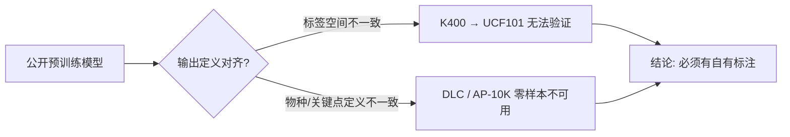

## 概述

本文档总结「先提取骨架关键点、再做动作识别」这条技术路线的三轮零样本实验（t10 / t10-1）暴露的问题。核心结论：**现有公开模型在零样本设定下都达不到 GT（ground truth）质量**，问题不是某个模型调参能解决的，而是检测器能力、关键点语义体系、场景分布三个层面的系统性错位。要走向生产，唯一可行路径是基于人工标注做微调。

面向：后续决定是否继续投入骨架路线、以及如何设计人工标注方案的人。

## 背景

动作识别主线是 RGB 视频分类（mmaction2）。骨架路线的设想是：先用现成的动物姿态估计模型把视频转成关键点序列，再训练基于骨架的动作识别模型——理论上对背景、光照、毛色更鲁棒，且数据需求更低。

为此做了两个任务的对照实验：

| 任务 | 模型 | 关键点定义 | 检测器 |
|------|------|-----------|--------|
| [[pet-action-recognition#t10]] | DeepLabCut SuperAnimal-Quadruped（HRNet-w32） | 39 点（通用四足） | Faster R-CNN（DLC 自带） |
| [[pet-action-recognition#t10-1]] | MMPose AP-10K（RTMPose-m） | 17 点（AP-10K 动物姿态集） | RTMDet-m（COCO 训练） |

验证数据来自 `pet_action_mammal_v0`（2234 段、158 物种），全部在 pet 服务器上完成。

## 实验概况

三轮验证，均以人工看片为最终判据：

| 轮次 | 样本 | 结果 |
|------|------|------|
| t10 全量提取 | 2234 段全量，DLC 零样本 | 83.8% 视频 det_rate ≥ 0.5，但抽检发现漏检 / 身份切换 / 误检，**判定不能当 GT** |
| t10-1 第一轮 | 4 段抽检（大象 / 猴 / 鼠 / 獭） | COCO 覆盖物种（大象）AP-10K 显著优于 DLC；未覆盖物种两者都被检测器卡死 |
| t10-1 第三轮（猫狗域） | 6 段：Dog×3、Jaguarundi、Ocelot、Fox | 白天清晰犬科 AP-10K 可用（conf 0.8~1.0）；截断、暗光、夜视红外、多动物场景两者全失效 |

抽检证据视频：t10 笔记（`management/projects/pet-action-recognition/notes/t10-dlc-skeleton.md`，页面内可播放）；第三轮产物在 pet 的 `results/skeleton/ap10k_catdog/` 与 `results/skeleton/dlc_catdog/`。

## 存在的问题

### 1. 检测器是整个管线的第一瓶颈

两阶段管线（先检测、后估计姿态）意味着**检测失败 = 整帧失败**，与姿态模型本身的能力无关：

- **物种覆盖**：AP-10K 用的 RTMDet 在 COCO 上训练，只认识 10 个动物类。COCO 外的物种（猴、鼠、獭）直接漏检；Jaguarundi 被误检为 bear（conf < 0.3），框住了但类别置信度已经说明检测器在硬猜。
- **暗光 / 夜视红外**：Ocelot 红外 camera trap 片段，AP-10K 全程 `no animal detected`，DLC 只有零星伪点。两个检测器都没见过红外成像。

### 2. 动物身体截断（未完整入画）即崩溃

这是第三轮验证最明确的规律：**只要动物不是整个身体都在画面中，输出就会出现明显错误**。

- Dog 进食片段（头部探出画面、双动物互相遮挡）：AP-10K 的框只锁住局部，17 点被强行压进残缺的框里，姿态结构失真；DLC 的点散布到另一只动物身上。
- 原因：两个姿态模型都是 top-down 设计，默认输入是完整个体；训练数据里截断样本占比极低。而我们的数据集里「动物部分出画」是常态（近距离拍摄、动物主动靠近镜头）。

### 3. 关键点语义体系不统一，结果无法互通

- DLC SuperAnimal 输出 **39 点**，AP-10K 输出 **17 点**，点的语义定义完全不同（DLC 有脊柱多点，AP-10K 有耳、眼等头部点）。
- 这意味着：两个方案的产出**不能合并、不能互相校验**，也不能直接对接任何一个现成的骨架动作识别模型（如 ST-GCN 的输入定义是 COCO 17 点人体）。
- 我们自己的动作识别需求（四足动物的 locomotion / eating / jump 等）到底需要哪些语义点，目前**没有定义**——这是路线继续推进的前置条件。

### 4. 多动物与身份切换无解

- 两个管线都按「单个体」取 top-1 框。双动物同框时随机锁一只，且帧间会切换到另一只（身份切换在 DLC 和 AP-10K 上都观察到）。
- 对动作识别而言，关键点序列的主体不连续 = 序列标签污染。

### 5. 零样本输出不能当 GT，也不能当弱监督

三轮人工抽检的一致结论是：零样本结果的错误模式（漏检、漂移、身份切换、截断失真）**不是随机噪声，而是系统性偏差**。用它当 GT 训练下游模型会把偏差固化进去；即使当弱监督 / 预标注，也需要人工逐帧修正，省不下多少成本。

## 与 K400 经验的共性：标注体系不对齐

Kinetics-400 的教训是同一类问题的另一面：

- K400 预训练模型不能在 UCF101 上直接检验——**标签空间不一致**，400 类与 101 类没有干净的映射，评测数字没有物理意义。
- 骨架路线的问题本质相同：**模型的输出定义（COCO 物种、AP-10K 17 点、DLC 39 点）与我们的任务定义（宠物物种、自定义语义点）不对齐**，零样本迁移的损耗大到人工不可用。

## 结论与建议

1. **骨架路线在零样本设定下不可行**，三个方案（DLC、AP-10K，含其组合）都已验证，不必再做第四轮零样本尝试。
2. 若仍看好骨架路线（对光照 / 背景鲁棒的优点真实存在），下一步是**人工标注微调**：定义自己的关键点集 → 标注少量视频帧（建议先从 Dog/Cat 各几百帧起步）→ 在 DLC 或 AP-10K 权重上微调。建议单独立项评估标注成本。
3. 短期内主线仍应放在 RGB 视频分类上；AP-10K 可作为白天清晰犬猫视频的**粗标注 / 可视化辅助工具**保留，不进训练管线。
4. 任何后续模型选型，第一条检查项改为：**其输出定义与我们的任务定义是否对齐**，而不是先看精度榜单。

## 复活条件分析：t13 检测/跟踪落地之后（2026-08-15）

t13-1（YOLO11 猫域检测微调）与 t13-2（BoT-SORT + ReID 多猫跟踪）立项后，需要重新回答：**骨架路线能否复活**。本节结论不推翻上文——零样本设定仍不可行（结论 1 不变）——而是指出复活的关键在于**用途降级**：

- 作 PoseC3D 训练数据（t10 原目标）：**仍不可行**。门控只提升喂给姿态模型的帧质量，姿态模型在猫域依旧是零样本，系统性偏差原样保留。
- 作线上推理的特征输入（t13-3 事件引擎辅助 / 姿态异常判定）：**可复活**。该用途只需「可用的姿态先验」——第三轮验证已证明白天清晰猫犬帧上 AP-10K conf 0.8~1.0 可用，而门控 + 跟踪恰好就是专门筛出这类帧的机器。

### 前提变化

| 前提 | t10 实验时（2026-08-03） | t13 落地后 |
|---|---|---|
| 检测器 | COCO 零样本（RTMDet-m / Faster R-CNN），没见过红外/逆光，物种覆盖有限 | 自有 cats 视频抽帧标注微调，猫是第一类目；若抽帧刻意覆盖夜视帧，成像域问题也可被吸收 |
| 个体组织 | 单个体 top-1 框，多动物帧间随机切换 | 多目标检测 + BoT-SORT track ID，关键点序列按轨迹组织 |

### 失败模式逐条复核

| t10 失败模式 | t13 组件的作用 | 判定 |
|---|---|---|
| ① 检测漏检（逆光/红外/物种覆盖） | 域内微调直接消掉物种与成像域问题 | ✅ 修复 |
| ② 身体截断即崩溃 | 检测框贴边（留 margin）→ 判截断 → 该帧跳过姿态，零成本；但牺牲覆盖率，需先量化 | ⚠️ 可行，需量化 |
| ③ 关键点语义 39/17 点不互通 | 与检测无关；靠选定单一体系保持一致绕过，自定义点集仍未定义 | ❌ 未解决 |
| ④ 多动物身份切换 | track ID 保证序列主体连续；家庭场景 1–2 只猫，远易于象群 | ✅ 修复（t13-2） |
| ⑤ 零样本姿态不能当 GT | 门控不改变姿态模型自身的域偏差 | ⚠️ 部分改善 |

### 门控设计：分级而非硬开关

「完整检测到才做骨架识别」可行且便宜，但与事件引擎存在内在张力：进食/饮水恰最常发生在低头进盆、身体部分出画的近景时刻，硬开关会把最需要判定的帧全部丢弃。建议分级处理：

- **完整帧**：输出骨架（高质量特征）
- **截断帧**：降级用检测框 + 区域规则——固定机位下盆不动，「猫框邻接盆框」本身即强信号（t13-3 主路径本就依赖框与区域）

投入前先实测 cats 域的门控通过率（mammal_v0 已证实出画是常态，cats 家用摄像头场景待测）。

### 复活验证实验（约一天，全部现成组件）

1. 前置：t13-1 微调检测模型就绪
2. 检测框 → BoT-SORT → 贴边门控 → 通过帧跑现有 AP-10K 权重（`scripts/infer_ap10k_pose.py`，pet 上 dlc / mmpose 环境仍在）
3. 产出三个数：门控通过率、通过帧姿态 conf 分布、10 段人工抽检
4. 视结果决定是否立项姿态微调（猫域标几百帧；固定机位下同类画面极多，预期收益高）

## 相关文档

- [[pet-action-recognition#t10|t10 骨架提取（DeepLabCut）]]
- [[pet-action-recognition#t10-1|t10-1 MMPose AP-10K 对照实验]]
- [[pet-action-recognition#t13-1|t13-1 YOLO11 宠物场景目标检测]]
- [[pet-action-recognition#t13-2|t13-2 BoT-SORT + ReID 多猫跟踪]]
- [[pet-action-recognition#t13-3|t13-3 区域与时序事件引擎]]
- [[mmaction2-overview|mmaction2 训练框架介绍]]
- [[model-onboarding|模型接入指南]]
