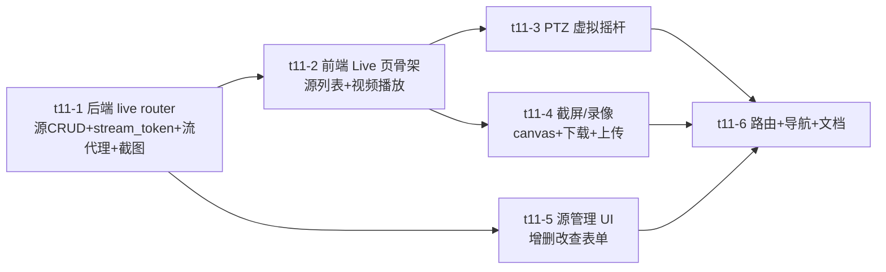

## 概述

在研究平台新增 `/live` 页，集成第三方参考项目 [[third-party-pet-videos]] 的实时能力：摄像头源管理、视频流实时预览、PTZ 云台控制、截屏录像。借鉴 pet-videos 的 `StreamSource` 表 + `stream_token` 安全签名 + `LiveStreamView.tsx` 交互，适配到我们的 FastAPI + Vue 3 + 原生 sqlite3 技术栈。分两期推进，Phase 1 不依赖真实摄像头即可落地，Phase 2 接 RTSP 实时流。

> 任务节点：项目树 `t11`（Live 页：实时视频流与摄像头监控）。本计划落地后拆为 `t11-1`…`t11-6` 子任务。

## 背景与范围

### 为什么做
研究平台目前只能看"评测输出视频回放"（VOD），没有"实时流"能力。集成 pet-videos 的实时 UI 与 stream_token 方案后，平台能：① 接 RTSP 摄像头做实时动作识别 demo；② 用 stream_token 安全代理视频片段回放（替代明文路径）；③ 提供截屏标注能力，方便从视频里截样本入库。

### 范围决策（假设，可在执行中纠正）
研究平台没有现成真实摄像头，因此 Live 页的"源"支持两类：
- **本地源**（Phase 1 主力）：本地视频文件路径或评测输出片段，用 stream_token 代理播放。够 demo + 开发用。
- **RTSP 源**（Phase 2）：真实摄像头 RTSP url，后端 ffmpeg 转 HLS 给浏览器。

不在本期范围：双向对讲、录像切片入库的完整 pipeline（pet-videos 的 SlicingTask 链路）、Push 推送。

## 借鉴 pet-videos 的什么

| pet-videos 组件 | 借鉴点 | 适配方式 |
|---|---|---|
| `backend/models/database.py::StreamSource` | 源表结构（name/alias/stream_url/storage_path/is_active） | 移植到我们 `server/db_live.py`，原生 sqlite3 建表 |
| `backend/utils/security.py` | stream_token = `base64url(alias:file).sha256_short(secret)` | 直接照抄到 `server/live/security.py`，secret 用环境变量 |
| `backend/api/sources.py` | 源 CRUD 模式 | 移植到 `server/routers/live.py` |
| `service/app.py` camera 端点 | add/list/update/delete | 合并进 `live.py` 的源管理端点 |
| `frontend/components/LiveStreamView.tsx` | PTZ 摇杆（transform translate）、canvas 截屏 + Web Audio 快门声、截屏画廊 | 移植逻辑到 Vue 3 `web/src/views/Live.vue` |

## 技术方案

### 后端 `server/routers/live.py` + `server/db_live.py`

```
server/
├── db_live.py            # 新增：live.db，stream_sources + screenshots 表
├── live/
│   └── security.py       # 新增：stream_token 签名/校验（抄 pet-videos）
└── routers/
    └── live.py           # 新增：源 CRUD + /api/live/stream + 截图上传
```

端点：
| 方法 | 路径 | 作用 |
|---|---|---|
| GET | `/api/live/sources` | 列出所有摄像头源 |
| POST | `/api/live/sources` | 新增源（name/stream_url/storage_path） |
| PUT | `/api/live/sources/{id}` | 改源 |
| DELETE | `/api/live/sources/{id}` | 删源 |
| GET | `/api/live/stream?token=...` | 凭 stream_token 代理视频流（Range 支持） |
| POST | `/api/live/screenshots` | 上传截屏（base64 → 存 storage_path） |
| GET | `/api/live/screenshots` | 列截屏 |

`stream_token`：`base64url(alias:filename).sha256(data+LIVE_SECRET)[:16]`；解码校验签名 + 目录白名单 + 扩展名白名单（.mp4/.webm）+ 防穿越。

### 前端 `web/src/views/Live.vue`

```
web/src/
├── api/live.js              # 新增：源/流/截屏 API
├── views/Live.vue           # 新增：主页面
└── components/live/
    ├── VideoPlayer.vue      # 视频流播放（<video> + stream_token url）
    ├── PtzJoystick.vue      # 虚拟云台摇杆（移植 LiveStreamView PTZ）
    └── ScreenshotGallery.vue # 截屏画廊 + 上传
```

页面布局：左侧源列表（选/增/删）+ 中间视频播放器（PTZ 摇杆叠加）+ 右侧截屏画廊。

### 路由与导航
`web/src/router/index.js` 加 `/live` 路由；`MainLayout.vue` 菜单加"实时"项。

## 阶段拆分（子任务）



| 子任务 | 内容 | 产出 |
|---|---|---|
| t11-1 | 后端 live router + db_live + stream_token | `/api/live/*` 端点可用，curl 测通 |
| t11-2 | 前端 Live.vue 骨架 + VideoPlayer + 源选择 | 能选源→播放视频流 |
| t11-3 | PtzJoystick 组件（移植 LiveStreamView） | 摇杆控 transform 模拟云台 |
| t11-4 | ScreenshotGallery + canvas 截屏 + 上传 | 截屏入后端 + 画廊展示 |
| t11-5 | 源管理表单（增删改查 RTSP/本地路径） | UI 可管源 |
| t11-6 | 路由 + 导航 + 本计划落地 + wiki 链接 | 上线可访问 |

## 风险与开放问题

1. **RTSP→浏览器实时流**（Phase 2）：浏览器不能直接播 RTSP，需后端 ffmpeg 转 HLS/WebRTC。Phase 1 用本地文件规避，Phase 2 单独立项。
2. **stream_token secret 管理**：用 `LIVE_SECRET` 环境变量，不硬编码（遵循安全规范）。
3. **PTZ 对本地文件无意义**：PTZ 是摄像头硬件控制，对本地视频文件只是 UI 模拟（transform）。Phase 1 PTZ 纯演示，Phase 2 接真摄像头才有用。
4. **截图入库存储位置**：用 `evaluation/screenshots/` 或新建 `live/screenshots/`，路径配在源 `storage_path`。
5. **与现有评测视频回放的关系**：stream_token 方案可后续替换现有评测视频明文 URL，但本期不改老代码，仅新页用。

## 执行顺序

按依赖：t11-1（后端）→ t11-2（前端骨架）→ 并行 t11-3/t11-4/t11-5 → t11-6（集成）。每个子任务完成即 push + pet 重启验证。

## 相关文档

- [[third-party-pet-videos]]
- [[third-party-remix-petra]]
