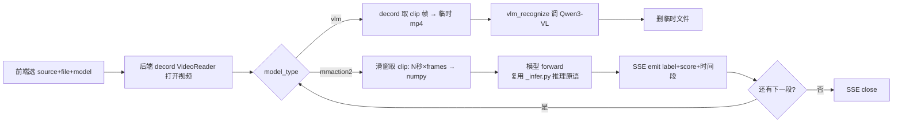

## 概述

在 [[live-page-integration-plan]] 的 Live 页基础上加**同步实时推理**：视频边播边推，推理结果实时叠加在画面（OSD）+ 时间轴色块。支持两条模型路线——视频分类模型（mmaction2，本地 GPU，秒级）和 VLM（Qwen3-VL-Plus，DashScope API，几秒），都同步推理，不做事后队列。

> 任务节点：项目树 `t11-7`（实时推理 SSE 端点）/ `t11-8`（前端实时叠加）/ `t11-9`（模型选择 UI）。挂在 `t11` 下。

## 背景与路线决策

### 现状
Live 页（t11-1/t11-2 已完成）只有 stream_token 代理播放，**无推理**。现有推理能力都是**整视频一次性**：
- `scripts/_infer.py::infer_and_annotate` — mmaction2 整视频推理 + 标注
- `scripts/vlm_infer.py::vlm_recognize` — Qwen3-VL 对整视频调 API（移植自 pet-videos）
- speed run — 整视频 × 多模型

### 路线决策（用户定）
- **同步推理**：边播边推，结果实时叠加。**不**用 pet-videos 的"切片落盘 + 事后 worker 队列"模式。
- **双模型都支持**：
  - 视频分类模型（TSN/SlowFast/Swin/VideoMAE 等）— decord 内存滑动窗口取 clip，numpy 喂 mmaction2 forward，**不落盘**，秒级延迟。
  - VLM（Qwen3-VL-Plus）— 当前段 clip **临时落盘**（decord 取帧→临时 mp4），调 `vlm_recognize`，结果返回后删临时文件。延迟几秒（API 慢），但仍同步（播放段推理完即叠加）。
- 用户原话："落不落盘都可以支持……推理我建议还是同步，边播边推，而不是把整个视频全切掉以后事后去接一个队列。"

## 概念澄清：真流式也要"切"，但切法不同

| | 真流式（本项目方案） | pet-videos 切片模式（不采用） |
|---|---|---|
| 切片形态 | 内存滑动窗口（视频模型）/ 临时文件（VLM，推理后删） | 独立文件落盘入库 |
| 推理时机 | **同步**边播边推，跟播放头 | **异步**事后 worker 队列 |
| 结果呈现 | 实时 OSD 叠加 + 时间轴色块 | 事后行为列表/日报 |
| 延迟 | 秒级（视频模型）/ 几秒（VLM） | 分钟级 |

本质区别不是"切不切"（真流式也按 clip 切），而是**切片是否落盘入库 + 推理同步还是异步**。

## 技术方案

### 后端 SSE 端点 `server/routers/live.py` 增量

```
GET /api/live/analyze/stream
  ?alias=... &filename=... &model_id=... &model_type=mmaction2|vlm
  &clip_sec=1.0 &stride_sec=1.0
→ SSE 流：每推完一段 emit 一条
  data: {"t_start": 0.0, "t_end": 1.0, "label": "archery", "score": 0.83, "model": "..."}
```

推理流程（同步、边播边推）：


关键技术点：
1. **decord 滑窗**：`VideoReader.seek(t)` + `next_batch(frames)` 按固定窗口（如 1 秒 × 8 帧）取 clip，步长 1 秒。视频模型用 numpy clip，VLM 用 decord 取帧后写临时 mp4。
2. **模型加载/缓存**：mmaction2 模型加载慢（几秒），首次请求加载后缓存在模块级 dict（`_MODEL_CACHE[model_id]`），后续 clip forward 复用。VLM 无状态（API 调用）。
3. **SSE**：fastapi `StreamingResponse` + `text/event-stream`，每段推理完 `yield f"data: {json}\n\n"`。前端 `EventSource` 接收。
4. **复用**：`scripts/_infer.py` 的 `_extract_topk`、label_map 加载逻辑；`scripts/vlm_infer.py::vlm_recognize` 直接调；模型 registry 复用 evaluation/models。
5. **不阻塞播放**：推理在后端独立跑，前端播放不受影响；前端按 `t_start/t_end` 在时间轴画色块 + 当前段 label OSD（落后于播放头几秒属正常，显示"已识别段"）。

### 前端 `web/src/views/Live.vue` 增量

- 选 source+file 后，加**模型选择**（dropdown：视频模型列表 + VLM 选项）+ "开始实时推理"按钮。
- 点开始：`new EventSource('/api/live/analyze/stream?...')`，`onmessage` 把结果 push 进 `segments[]`。
- 播放器叠加：
  - **时间轴色块**：每段按 `t_start/t_end` 在进度条上画色块（按 label 颜色映射）。
  - **OSD**：`video.currentTime` 落在某段 → 画面上方显示 `label (score)`。
  - **段列表**：右侧滚动展示已识别段。

### 模型选择 UI（t11-9）
- 视频模型：从 `evaluation/models` registry 读，列出 mmaction2 分类模型（TSN/I3D/SlowFast/...），带 checkpoint 选择（pretrained/trained）。
- VLM：单独选项 "Qwen3-VL-Plus"。

## 阶段拆分（子任务）

| 子任务 | 内容 | 产出 |
|---|---|---|
| t11-7 | 后端 SSE 实时推理端点：decord 滑窗 + 视频模型 forward + VLM 切片临时落盘调 vlm_recognize + 模型缓存 | `/api/live/analyze/stream` SSE，curl 测能看到段结果流 |
| t11-8 | 前端实时叠加：EventSource 接收 + 时间轴色块 + OSD label + 段列表 | 边播边出识别结果叠加 |
| t11-9 | 模型选择 UI：视频模型列表（registry）+ VLM 选项 + checkpoint 选择 | 选模型→推理 |

依赖：t11-7（后端）→ t11-8（前端叠加）+ t11-9（模型选择，可与 t11-8 并行）。

## 风险与开放问题

1. **VLM 延迟**：Qwen3-VL API 调用 2-5 秒/段，边播边推时 OSD 会落后播放头几秒。可接受（显示"已识别段"），或降低 VLM 采样步长（每 3-5 秒一段）。
2. **GPU 占用**：mmaction2 模型常驻显存（VideoMAE ~11GB），pet 是共享机，要先 `nvidia-smi` 看卡。模型缓存只加载用户选的那一个，不全加载。
3. **decord 解码速度**：长视频逐 clip seek 可能慢，可用 `VideoReader` 预读 + 滑窗索引而非反复 seek。
4. **模型加载首延迟**：首次 SSE 请求要等几秒加载模型，前端显示"模型加载中"。
5. **clip 粒度**：视频模型按其 config 的 `clip_len`（如 TSN 1×1×3=3 帧，SlowFast 4×16）定窗口，不能随意切。要按模型 config 的输入格式取 clip。
6. **SSE 连接管理**：前端切换源/模型/关闭页要 `eventSource.close()`，后端要感知断连停止推理（`async for chunk in request` 检测）。
7. **VLM 切片临时文件清理**：推理完即删，异常也要清理（try/finally）。

## 执行顺序

t11-7（后端 SSE）→ t11-9（模型选择 UI，可并行）→ t11-8（前端叠加）→ 整合验证。每步本地 vite dev + Playwright 验证后 push + pet 重启。

## 相关文档

- [[live-page-integration-plan]]
- [[third-party-pet-videos]]
- [[model-onboarding]]
- [[using-mmaction2]]
