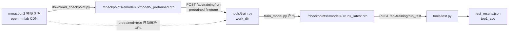

## 概述

mmaction2 是 OpenMMLab 的视频动作识别库，本项目用它作为**训练与评测框架**，覆盖从论文方法到可跑模型的落地。它已 **vendor 进仓库**（`third_party/mmaction2/`，shallow clone，HEAD `a5a167d`），不是 pip 依赖、不是 submodule——文件直接在本仓库历史里，可离线改、可追溯版本。

本文档面向团队新人，介绍 mmaction2 在本项目的角色、注册的 21 个模型族、训练/评测链路、checkpoint 布局与环境要点。**操作级指南**（安装、config 继承、训练入口、排错）见 `.claude/skills/using-mmaction2/SKILL.md`。

## 背景

宠物动作识别的核心挑战是**粗粒度 vs 细粒度的性能鸿沟**：主流方法在粗粒度动作（行走/站立/奔跑）已达 88%+，但细粒度动作（如「反刍-躺卧」vs「反刍-站立」）仅 12.7%–29.6%。要系统对比不同技术路线（2D/3D CNN、Transformer、自监督），需要一个统一的训练/评测底座。mmaction2 提供了 OpenMMLab 体系下最完整的视频动作识别模型集合与 config 系统，直接复用其 21 个模型族的预训练权重，避免重复造轮子。

## 1. 在本项目的角色

| 层 | 内容 | 位置 |
|---|---|---|
| 模型库 | 21 个模型族注册在 `_MMACTION2_REGISTRY` | `server/routers/training.py` |
| 训练/测试/推理包装 | `train_model.py` / `run_test.py` / `inference.py` | `scripts/` |
| mmaction2 本体 | vendor（含 `tools/train.py`、`tools/test.py`、`configs/`） | `third_party/mmaction2/` |
| 四足 config | TSN 的本地适配（PyAV/小分辨率） | `evaluation/configs/quadruped_tsn_r50.py` |
| 产物 | checkpoint、日志、metrics | `./checkpoints/`、`results/training/` |

后端 `server/routers/training.py` 把 HTTP 请求转成 subprocess 调 `scripts/*.py`，后者再调 mmaction2 的 `tools/train.py` / `tools/test.py`，产物落盘后被只读 API 暴露给前端训练页。

## 2. 模型族一览

| ID | 模型 | 类型 | 预训练来源 |
|---|---|---|---|
| `tsn-resnet50` | TSN (ResNet-50) | 2D CNN 帧采样 | Kinetics-400 |
| `tsm-resnet50` | TSM (ResNet-50) | 2D CNN + 时序位移 | Kinetics-400 |
| `i3d-resnet50` | I3D (ResNet-50) | 3D CNN | Kinetics-400 |
| `c3d-sports1m` | C3D (Sports-1M) | 3D CNN | UCF-101 (from Sports-1M) |
| `slowfast-resnet50` | SlowFast (ResNet-50) | 3D CNN 双路径 | Kinetics-400 |
| `slowonly-resnet50` | SlowOnly (ResNet-50) | 3D CNN 单路径 | Kinetics-700 |
| `r2plus1d-resnet34` | R(2+1)D (ResNet-34) | 2.5D CNN | Kinetics-400 |
| `csn-ircsn152` | CSN / irCSN-152 | 3D CNN | Kinetics-400 (from IG-65M) |
| `tin-resnet50` | TIN (ResNet-50) | 2D CNN + 帧插值 | Kinetics-400 (from TSM) |
| `trn-resnet50` | TRN (ResNet-50) | 2D CNN + 关系推理 | Something-Something V2 |
| `tpn-slowonly-r50` | TPN + SlowOnly (ResNet-50) | 3D CNN + 时序金字塔 | Kinetics-400 |
| `tanet-resnet50` | TANet (ResNet-50) | 2D CNN + 时空注意力 | Kinetics-400 |
| `timesformer-divst` | TimeSformer (divST) | ViT 视频 Transformer | Kinetics-400 (from IN-21K ViT) |
| `mvit-small` | MViT (Small) | 多尺度 ViT | Kinetics-400 |
| `swin-tiny` | Swin-Base (K400) | 视频 Swin Transformer | Kinetics-400 (from IN-1K Swin-B) |
| `x3d-xs` | X3D (S) | 轻量 3D CNN | Kinetics-400 (Facebook) |
| `uniformer-base` | UniFormer (Base) | 卷积 + Transformer 统一 | Kinetics-400 (from IN-1K) |
| `videomae-base` | VideoMAE (Base) | MAE 自监督 ViT | Kinetics-400 (MAE SSL) |
| `videomaev2-base` | VideoMAEv2 (Base) | MAEv2 蒸馏 ViT | Kinetics-400 (from ViT-G K710) |
| `c2d-resnet50` | C2D (ResNet-50) | 2D 卷积视频基线 | Kinetics-400 (from IN-1K) |
| `tsn-resnet50-quadruped` | TSN — 四足本地配置 | 2D CNN（PyAV/小分辨率） | Kinetics-400（via tsn-resnet50） |

> 不在 mmaction2 仓库内、需单独集成：VideoMamba、SkeleTR、PMTNet、InternVideo2（README 提及但属外部库）。

## 3. 各模型详解

### 3.1 2D CNN 系（帧采样 + 2D backbone）

- **TSN (ResNet-50)** — Temporal Segment Networks。把视频分成 N 段、每段抽 1 帧，过 2D ResNet 后做段级 consensus（聚合多段预测）。2D CNN 视频识别的经典基线，轻量、训练快、好 finetune，是本项目 pilot 的首选。
- **TSM (ResNet-50)** — 在 2D backbone 里插入时序位移模块（Temporal Shift Module），把部分通道沿时间轴前移/后移，**零参数零额外算力**就让 2D CNN 获得时序建模能力。比 TSN 强、同样轻，2D 路线的高性价比之选。
- **TIN (ResNet-50)** — Temporal Interlacing Network，用时序交错代替显式位移，从 TSM 预训练权重出发。轻量高效，与 TSM 同一档次。
- **TRN (ResNet-50)** — Temporal Relation Network，显式建模帧之间的时序关系（多阶关系），擅长 Something-Something 这类**必须靠时序推理**的任务（故 pretrained 在 SSv2 而非 K400）。粗粒度动作上未必比 TSM 强，但细粒度/时序敏感动作有优势。
- **TANet (ResNet-50)** — Temporal Adaptive Network，在 backbone 加时序自适应注意力，抑制噪声帧。K400 基线。
- **C2D (ResNet-50)** — 纯 2D 卷积视频基线（不做时序位移/3D 膨胀），常用作 SlowFast 论文里的对照实验。K400（from IN-1K）。
- **TPN + SlowOnly (ResNet-50)** — Temporal Pyramid Network 挂在 SlowOnly backbone 上，多尺度时序特征融合。属于"给 backbone 加时序插件"一类。

### 3.2 3D CNN 系（时空卷积）

- **I3D (ResNet-50)** — Inflated 3D ConvNet，把 2D 卷积权重膨胀成 3D，兼顾 3D 时空建模与 ImageNet 预训练复用。3D CNN 经典基线，必跑对照。
- **C3D (Sports-1M)** — 早期 3D CNN 代表，Sports-1M 预训练、UCF101 微调。算力较大、精度偏老，但作为历史对照与"大预训练数据"样本仍有价值。
- **SlowFast (ResNet-50)** — 双路径：慢路径低帧率高通道（语义），快路径高帧率低通道（运动）。3D CNN 的强基线，精度与算力都偏高。粗粒度动作强候选。
- **SlowOnly (ResNet-50)** — SlowFast 去掉快路径的单分支版本，省算力，精度接近。K700 预训练（类别更多）。做"要不要双路径"的消融对照。
- **R(2+1)D (ResNet-34)** — 把 3×3×3 卷积拆成空间 1×3×3 + 时序 3×1×1（2.5D），参数效率与梯度传播优于纯 3D。K400。轻量 3D 路线代表。
- **CSN / irCSN-152 (ResNet-152)** — Channel-Separated Network，通道分组卷积，IG-65M 大规模预训练 + K400 微调。参数多、算力大，但预训练数据丰富，适合作为"重模型上界"对照。
- **X3D (S)** — 轻量 3D CNN，Facebook 工作，面向移动端/高效部署。算力最低的 3D 选项，做边缘部署候选。

### 3.3 Transformer 系

- **TimeSformer (divST)** — 纯 ViT 视频 Transformer，divST（时空分治）注意力。从 IN-21K 预训练 ViT 出发。算力大、需大预训练，但架构纯净，是 Transformer 路线的标杆。
- **MViT (Small)** — Multiscale Vision Transformer，多尺度池化注意力，层次化分辨率。比纯 ViT 更适合视频的多尺度时空结构。
- **Swin-Base (K400)** — 视频 Swin Transformer，层级 + 移位窗口注意力，线性复杂度。从 IN-1K Swin-B 预训练。精度高、架构现代。
- **UniFormer (Base)** — 统一卷积与 Transformer：浅层用卷积（局部时空）、深层用 Transformer（全局）。兼顾效率与表达力，从 IN-1K 预训练。

### 3.4 自监督 / MAE 系

- **VideoMAE (Base)** — 视频掩码自编码器（masked autoencoder）自监督预训练 ViT，再在 K400 监督 finetune。两阶段范式，预训练不依赖标签，是当前视频自监督代表。
- **VideoMAEv2 (Base)** — VideoMAE 第二代，先用 ViT-G 在 K710（更大类别集）自监督 + 蒸馏到 ViT-B，再 K400 finetune。预训练更强，预期精度上限更高。

### 3.5 四足本地配置

- **TSN (ResNet-50) — 四足** — 不是新模型，而是 TSN 的**本地四足适配 config**（`evaluation/configs/quadruped_tsn_r50.py`）：PyAV 后端（不依赖 decord）、64px 小分辨率、`num_classes` 由 `classes.txt` 动态注入。加载 `tsn-resnet50` 的 K400 预训练权重做 finetune。pilot 用它跑通四足链路。

## 4. 训练 / 评测链路



| HTTP 端点 | 作用 |
|---|---|
| `GET /api/training/models` | 模型清单（含已训练 checkpoint） |
| `GET /api/training/pretrained` | 各模型 pretrained_url 列表 |
| `POST /api/training/run` | 触发训练（四种模式见 §5） |
| `POST /api/training/run_test` | 用 checkpoint 跑测试/评测 |
| `POST /api/training/inference` | 单视频推理 |
| `GET /api/training/runs` | 训练 run 列表（含 loss 曲线） |
| `GET /api/training/test_results` | 测试结果 |
| `GET /api/training/outputs/{path}` | 下载 checkpoint/log（防穿越） |

> `evaluation` 模块（`/api/evaluation/*`）是上游 LLM 评测脚手架占位，**不执行真实视频评测**；视频评测走 training 的 `/run_test`。

## 5. 四种训练模式（互斥）

| 模式 | 入参 | 说明 |
|---|---|---|
| 预训练 finetune | `pretrained: true` 或 `"<url\|path>"` | 加载 mmaction2 仓库的 backbone+head 权重（head 维度不匹配自动跳过），finetune |
| 加载权重从头训 | `load_from: "<ckpt\|run_id>"` | 加载我们已有 checkpoint 全部权重，重置 epoch/optimizer/scheduler |
| 断点续训 | `resume_from: "<run_id>"` | 复用 run_id，恢复 epoch/optimizer/scheduler；best 仅在更优时覆盖 |
| 从头训练 | `from_scratch: true` | 随机初始化，禁用 config 里的 `init_cfg` |

## 6. Checkpoint 布局

所有 checkpoint（trained + pretrained）统一在 repo 根 `./checkpoints/<model_id>/`，靠 JSON 的 `type` 字段区分：

```
checkpoints/<model_id>/
  <model_id>_pretrained.pth     # 下载的预训练权重
  <model_id>_pretrained.json    # type=pretrained；url/sha256/size
  <run_id>_latest.pth           # 训练最新 epoch
  <run_id>_latest.json          # type=latest；metrics/epoch
  <run_id>_best.pth             # 训练最佳 top1
  <run_id>_best.json            # type=best
```

`_trained_checkpoints_for` 只收 `latest`/`best`，`pretrained` 自动忽略；`GET /api/training/outputs` 列出全部，`/outputs/checkpoints/...` 前缀解析到 `./checkpoints/`。下载用 `scripts/download_checkpoint.py`，21 个全在 `--all`。

## 7. 环境与坑

pet 服务器（2× RTX 4090）已验证配方：

| 包 | 版本 | 备注 |
|---|---|---|
| python | 3.10 | conda env `pet` |
| torch | 2.1.2+cu121 | 4090 兼容 |
| numpy | 1.26.4 | **必须 <2**（torch 2.1 按 numpy 1.x 编） |
| mmcv | 2.1.0 | **必须 <2.2.0**（mmaction2 1.2.0 硬约束） |
| opencv | 4.10.0.84 | **钉版本**（5.x/4.13 要 numpy≥2 会顶回 2.x） |
| mmengine / mmaction2 / decord | 0.10.7 / 1.2.0 / 0.6.0 | — |

三大版本坑：① numpy 装 ≥2 → `tensor.numpy()` 崩；② mmcv ≥2.2.0 → import 时 AssertionError；③ opencv 不钉 4.10 → 其 metadata 要 numpy≥2，pip 会把 numpy 顶回 2.x。完整安装命令与排错见 `.claude/skills/using-mmaction2/SKILL.md` §1。

## 8. 开发闭环


代码与 config 在本地改，`git push pet main` 后 pet 工作树自动更新（`receive.denyCurrentBranch=updateInstead`）。训练/测试/下载等重活在 pet 跑，产物回写 `./checkpoints/` 与 `results/training/`。

## 9. 数据集现状

四足动物动作数据集（`datasets/quadruped_action/`，猫/狗）目前 `pending_collection`——真实视频尚未收集。pilot 的 finetune/test 等数据到位后再跑（合成数据已弃用）。进度见 [[pet-action-recognition#t9]]。

## 相关文档

- [[pet-action-recognition#t9]] — pet 远程 mmaction2 全模型接入与评测任务
- [[api-design-conventions]] — 后端 API 设计规范
- [[git-workflow]] — Git 工作流规范
- 操作级指南：`.claude/skills/using-mmaction2/SKILL.md`（安装、config 继承、训练入口、排错）
- 集成计划：`docs/plans/2026-07-13-mmaction2-training-integration-plan.md`
