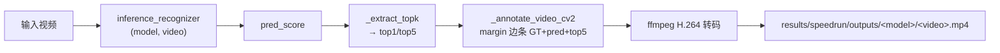
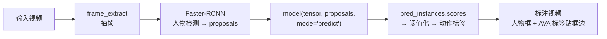
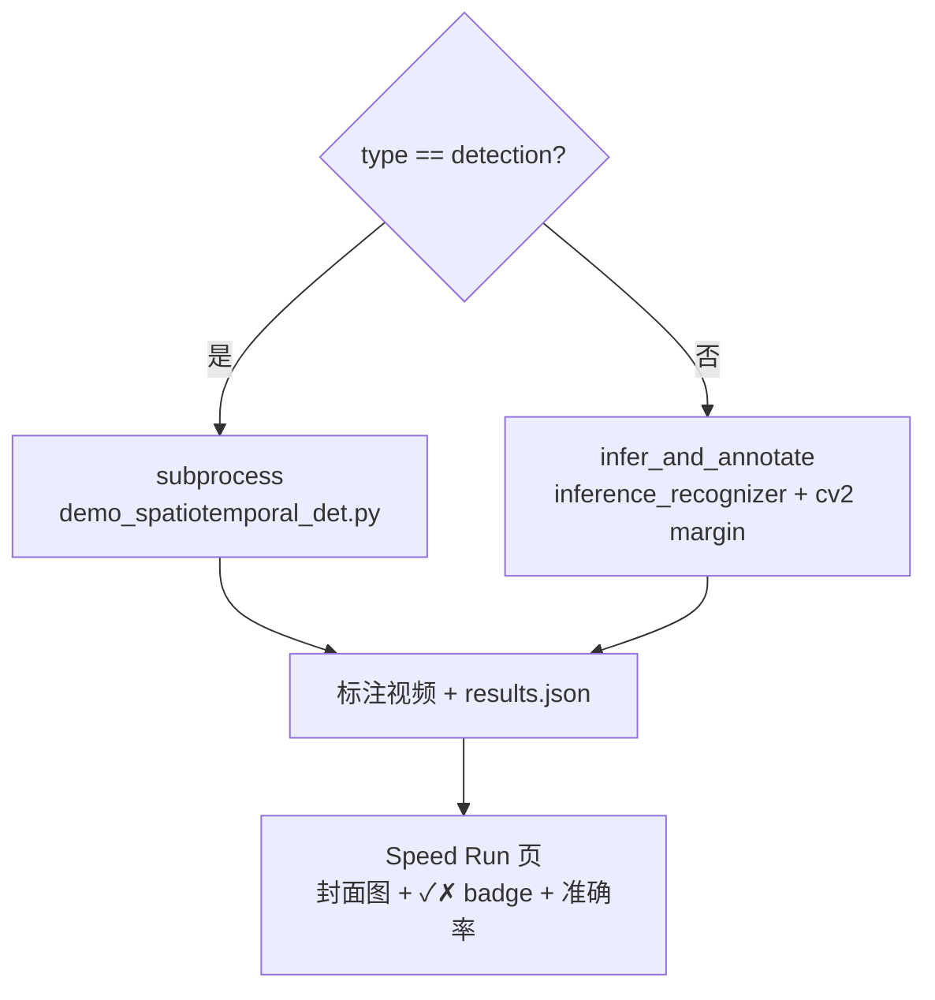

## 概述

本项目在 `server/routers/training.py` 的 `_MMACTION2_REGISTRY` 中注册了 **26 个 mmaction2 模型**：21 个视频动作**分类**模型（TSN/I3D/SlowFast/Swin/VideoMAE 等）+ 5 个 AVA 时空动作**检测**模型（SlowOnly/SlowFast/VideoMAE/ACRN/LFB）。所有模型可通过 speed run 在 UCF101 上验证。

## Registry 字段

每个模型是 `_MMACTION2_REGISTRY` 列表中的一个 dict：

| 字段 | 类型 | 必填 | 说明 |
|------|------|------|------|
| `id` | str | ✅ | 唯一标识（如 `tsn-resnet50`、`slowonly-ava-r101`） |
| `name` | str | ✅ | 显示名 |
| `family` | str | ✅ | 模型族（TSN/I3D/AVA…） |
| `backbone` | str | ✅ | backbone（resnet50/vit_base…） |
| `pretrained_source` | str | ✅ | 预训练数据集（Kinetics-400/AVA v2.1…） |
| `pretrained_url` | str | ✅ | openmmlab checkpoint URL |
| `mmaction2_config` | str | ✅ | config 路径（分类=相对 MMACTION2_DIR；检测=同） |
| `label_map` | str | ❌ | 标签文件路径（默认 K400；c3d→UCF101，slowonly→K700，trn→SSv2，AVA→ava） |
| `type` | str | ❌ | `"detection"` = AVA 检测；不填 = 分类 |
| `det_config` | str | ❌ | 检测专用：Faster-RCNN 人物检测器 config |
| `det_checkpoint` | str | ❌ | 检测专用：Faster-RCNN checkpoint 路径 |
| `description` | str | ✅ | 一句话描述 |

## 分类模型（21 个）

按架构分组，详见 [[mmaction2-overview]] 的「各模型详解」。标签空间：

| 模型 | 标签空间 | label_map 文件 |
|------|----------|---------------|
| 18 个 K400 模型（tsn/tsm/i3d/slowfast/swin/...） | Kinetics-400（400 类） | `tools/data/kinetics/label_map_k400.txt` |
| `c3d-sports1m` | UCF-101（101 类） | `tools/data/ucf101/label_map.txt` |
| `slowonly-resnet50` | Kinetics-700（700 类） | `tools/data/kinetics/label_map_k700.txt` |
| `trn-resnet50` | Something-Something V2（174 类） | `tools/data/sthv2/label_map.txt` |

> 标签空间不匹配会导致 `correct=0`（如用 K400 label_map 查 K700 头的输出 → 标签名错）。per-model `label_map` 字段解决了这个问题。

### 推理路径（分类）



- 入口：`scripts/_infer.py` 的 `infer_and_annotate(video, cfg, ckpt, labels, out_video_path, gt_label)`
- 标注：cv2.putText 画 margin 边条（上=GT+pred，下=top5）→ imageio_ffmpeg 转 H.264（浏览器可播）
- GPU 指标：`torch.cuda.max_memory_allocated()` + nvidia-smi 前后采样 → `gpu_mem_mb` + `gpu_avg_util`
- RTF：`elapsed_s / video_duration` → `rtf`
- 准确率：`_matches(gt_label, top1_label)` — token-set 归一化匹配

## 检测模型（5 个 AVA）

全部是 **AVA 时空动作检测器**（FastRCNN 式，把人物框分类到 60 个 AVA 动作类）。共用同一个 Faster-RCNN 人物检测器 + AVA label_map。

| ID | 架构 | Config | Checkpoint |
|----|------|--------|------------|
| `slowonly-ava-r101` | SlowOnly R101 | `detection/slowonly/...r101_8xb16-8x8x1-20e_ava21-rgb.py` | ✅ 229MB |
| `slowfast-ava-r50` | SlowFast R50 | `detection/slowfast/...r50_8xb16-4x16x1-20e_ava21-rgb.py` | ✅ 130MB |
| `videomae-ava-base` | VideoMAE ViT-B | `detection/videomae/vit-base-p16_..._ava-kinetics-rgb.py` | ✅ 334MB |
| `acrn-ava-r50` | ACRN R50 | `detection/acrn/slowfast-acrn_..._ava21-rgb.py` | ✅ 353MB |
| `lfb-ava-r50` | LFB R50 | `detection/lfb/slowonly-lfb-nl_..._ava21-rgb.py` | ❌ URL 404 |

> 共用：`det_config = demo/demo_configs/faster-rcnn_r50_fpn_2x_coco_infer.py` + `det_checkpoint = checkpoints/faster-rcnn-coco/faster_rcnn_r50_fpn_2x_coco.pth` + `label_map = tools/data/ava/label_map.txt`（60 类）。

### 推理路径（检测）



- 入口：`demo_spatiotemporal_det.py`（**不走** `inference_recognizer`——AVA 需要人物提议框）
- speedrun.py 检测分支：`type=detection` → subprocess `demo_spatiotemporal_det.py`
- `correct=null`（N/A——检测标签空间 ≠ UCF101 GT）
- 标注视频由 demo 自带（moviepy → H.264）

## Checkpoint 下载

### 分类模型
```bash
# 单个
python3 scripts/download_checkpoint.py --model-id tsn-resnet50
# 全部 21 个
python3 scripts/download_checkpoint.py --all
```
- 下到 `checkpoints/<model_id>/<model_id>_pretrained.pth` + JSON 元数据（`type=pretrained`）
- openmmlab 直链（pet 实测可达）；HF 权重 → `hf-mirror.com`

### 检测模型
- AVA checkpoint：从 `configs/detection/<model>/metafile.yml` 的 `Weights:` 字段拿 URL
- Faster-RCNN：`http://download.openmmlab.com/mmdetection/v2.0/faster_rcnn/...`（旧格式 URL 可用）
- ⚠️ **v1.0 URL 部分失效**（如 slowonly R50 404）；旧格式 URL 可用（如 slowonly R101 demo default）。注册前先 `curl -I` 测试。

## Speed Run 集成

`scripts/speedrun.py` 根据 `type` 字段自动选推理路径：



- CLI：`python3 scripts/speedrun.py --videos <path> --models all --device cuda:0 --force`
- API：`POST /api/speedrun/run {videos, models, device, force}`
- 产物：`results/speedrun/outputs/<model>/<video>.mp4`（H.264）+ `results/speedrun/results.json`
- 结果字段：`model_id, video, gt_label, correct, metrics{top1_label, top1_score, top5, gpu_mem_mb}, gpu_avg_util, rtf, elapsed_s, cover_image, status`

## 如何接入新模型

1. **查 config**：在 `models/mmaction2/configs/` 找到模型 config 路径。
2. **查 checkpoint URL**：从对应 `metafile.yml` 的 `Weights:` 拿；`curl -I` 测试可达性。
3. **加 registry 条目**：在 `_MMACTION2_REGISTRY` 加 dict（分类=默认字段；检测=加 `type/det_config/det_checkpoint`）。
4. **下 checkpoint**：`python3 scripts/download_checkpoint.py --model-id <id>`（分类）或手动 curl（检测）。
5. **选 label_map**：K400 默认；非 K400 头（UCF101/K700/SSv2/AVA）加 `label_map` 字段。
6. **测试**：`python3 scripts/speedrun.py --videos <test_video> --models <id> --device cuda:0 --force` → 检查标注视频 + results.json。

详见 [[using-mmaction2]] skill §7（分类模型族映射）+ §9（检测模型接入）。

## 相关文档

- [[mmaction2-overview]] — mmaction2 训练框架介绍 + 21 个模型族详解
- [[pet-action-recognition#t9]] — 全模型接入与评测任务
- 操作级 skill：`.claude/skills/using-mmaction2/SKILL.md`（§7 分类 + §9 检测）
- 训练/测试/datasets skill：`.claude/skills/{training,testing,datasets}/SKILL.md`
