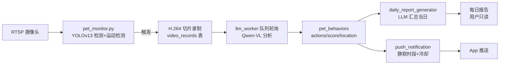

## 概述

`third-party/pet-videos` 是从度小满内网 GitLab（`gitlab.duxiaoman-int.com:8022/fsg-fbfe/pet-videos.git`，wyy 账号）clone 下来的**宠物摄像头 AI 分析**全链路产品：摄像头 RTSP 接入 → YOLOv13 检测切片 → Qwen-VL 行为分析 → LLM 每日报告 → Push 推送。技术栈 **FastAPI + React 18 + SQLite + 阿里云 DashScope**，与我们研究平台（FastAPI + Vue 3 + SQLite）高度重合，且业务方向（宠物动作识别）直接对口，是现成的工程参考。

> 性质：`third-party/` 下 gitignore 的参考项目，不入库；自带 `.git`，clone 不完整（`service/` 同包依赖缺失）。

## 背景

我们做宠物动作识别研究平台，缺乏"视频采集 → 队列分析 → 日报产出"这类长任务调度的工程先例。pet-videos 恰好是一个跑在生产环境、经过多次迭代（CHANGELOG 到 v1.1.0）的真实产品，其 Worker 调度、状态机、安全加固、迁移工程化等实践可直接对照借鉴。

## 技术栈

| 层 | 选型 | 关键依赖 |
|---|---|---|
| 后端 | Python FastAPI | `fastapi==0.109` `uvicorn==0.27` `SQLAlchemy==2.0.25` `pydantic-settings` |
| AI 模型 | 阿里云 DashScope | `dashscope==1.25.7`，调 `qwen3-vl-plus`/`qwen2.5-vl-32b`/`qwen2-vl-72b`/`qwen2-vl-7b` |
| 检测 | YOLOv13 | `scripts/yolov13n.pt`，`pip install -e yolov13/` |
| 数据库 | SQLite | `backend/database/history.db`，10 张表 |
| 鉴权 | JWT | `ADMIN_USERNAME/PASSWORD` + `JWT_SECRET` |
| 前端 | React 18 + TS + Vite | Ant Design 5 + axios + dayjs |
| 视频流 | H.264/H.265 | openh264 / ffmpeg，含 Windows 编码坑修复 |

## 目录结构

```
pet-videos/
├── backend/              # FastAPI 后端
│   ├── api/              # 16 个 router（videos/analysis/history/auth/prompts/sources/
││                        #   tasks/pets/pet_behaviors/daily_reports/llm_queue/...）
│   ├── services/         # 业务服务（llm_worker/daily_report_generator/push_notification/
││                        #   dashscope/video/thumbnail/behavior_feedback/...）
│   ├── models/           # ORM + Pydantic（database.py 10 张表）
│   ├── migrations/       # 40+ 个 Python/SQL 迁移脚本，migrate_init_all.py 一键建表
│   └── utils/            # security.py（HMAC stream_token + 路径白名单防穿越）
├── frontend/             # React + antd 前端（9 标签页 + 15 业务组件）
├── service/              # App 端 BFF（单文件 app.py，22 个端点，clone 不完整）
├── scripts/              # 摄像头采集脚本 pet_monitor*.py（YOLO+运动检测+RTSP 切片）
└── docs/                 # 40+ 篇设计/部署/排障文档
```

## 核心功能链路



1. **摄像头接入与切片录像** — App 经 Service `/api/camera/add` 绑定 RTSP 源（`StreamSource` 表）；后台 `pet_monitor*.py` 用 OpenCV + YOLOv13 做宠物检测 + 运动检测，触发 H.264 切片（`SlicingTask`/`VideoRecord` 表）。
2. **视频 LLM 分析队列** — 切片进 `video_records`（**NULL 状态架构**），`llm_worker_service` 轮询，调 qwen3-vl-plus 分析行为，写 `pet_behaviors`；失败按 `60,300,900` 秒阶梯重试，25h 时间窗。
3. **每日报告** — `daily_report_generator` 按时段（5–23 点 1.5h，夜间 3h）触发，LLM 汇总当日 `pet_behaviors` 生成 `daily_reports`，用户**只读不可编辑**。
4. **Push 推送** — 检测到行为后推 App，含静默时段（23:00–06:00）、1h 冷却、多宠物取 score 最高；`PUSH_ENABLED` 总开关 + 度小满 BNS 消息服务。
5. **前端管理台** — 9 个标签页：视频分析（手填 prompt + 参数 fps/max_pixels + 费用预估）、调用历史、Prompt 管理（含变量系统）、源/任务/宠物/行为管理、日报、切片统计。
6. **App 端 BFF** — Service 层给手机 App 用：设备绑定、摄像头 CRUD、在线检测、按日期查视频、宠物日历、日报查看、行为反馈。

## 关键工程文档速查

| 文档 | 一句话 |
|---|---|
| `CHANGELOG.md` | 版本日志，v1.1.0 视频流 stream_token HMAC 安全加固 |
| `DATABASE_MIGRATION_GUIDE.md` | 统一数据库位置（根/ backend 双份混乱 → 统一到 backend） |
| `MIGRATION_PYTHON_UPGRADE.md` | 迁移从 SQL+Shell/Batch 改为 Python 脚本的理由 |
| `BACKEND_LOGGING_GUIDE.md` | backend 三套独立 logger（DB/慢请求/push/performance） |
| `FIX_BATCH_ENCODING.md` | Windows `.bat` 必须 ANSI/GBK 而非 UTF-8 |
| `PENDING_STATUS_FIX_REPORT.md` | pending/processing 卡死 → 改 NULL 状态架构的修复报告 |
| `docs/DAILY_REPORT_DESIGN.md` | 日报功能设计 + 权限矩阵 |
| `docs/SECURITY.md` | stream_token HMAC + 路径白名单 + 防穿越 |
| `docs/VARIABLE_SYSTEM.md` | Prompt 变量系统（动态变量注入提示词） |
| `docs/VIDEO_ENCODING.md` 等 | H.264/H.265、openh264、Windows 编码、FPS 一整套排障 |

## 可借鉴点

对我们 FastAPI + Vue3 + SQLite 研究平台，以下实践可对照吸收：

1. **FastAPI 三层路由划分** — 公开 API（stream_token 自验签）/ 内部 API（`/api/internal/*`，给脚本/远程机调用，免 JWT）/ 认证 API（`Depends(auth.verify_token)`）。我们做训练/评测触发 API 时可区分"前端用户态"与"内部脚本/远程训练机调用态"。
2. **后台 Worker 服务化** — `llm_worker` 与 `daily_report_generator` 都是 FastAPI startup 拉起的轮询 Worker，配置齐全（`max_concurrent`/`poll_interval`/`retry_delays`/`time_window_hours`/`processing_timeout_minutes`）。我们的训练/评测调度器可照抄这套"DB 状态机 + 阶梯重试 + 超时回收 + 并发上限"。
3. **NULL 状态架构** — 任务表用 NULL + 时间戳代替 `pending/processing` 显式状态，避免 Worker 崩溃后任务卡死。
4. **视频流 HMAC token** — `utils/security.py` 用 `base64(path).signature` + 目录白名单 + 防穿越 + 文件类型白名单替换明文路径。我们评测视频回放、远程训练机视频预览可复用。
5. **SQLite 迁移工程化** — 40+ 个 Python 迁移脚本 + `migrate_init_all.py` 一键建表 + 每次迁移自动备份。轻量可行，但建议我们一开始就上 Alembic 避免文档爆炸。
6. **三套独立 logger** — `performance_logger`（每请求耗时 + `X-Process-Time` 响应头 + 慢请求告警）+ `push_logger` + 主 logger 分离，`propagate=False` 避免污染主日志。
7. **env 分组模板** — `env.example` 用 `# ===== 标题 =====` 分组 + 获取地址/示例/平台差异说明，比 plain key=value 可读性高。
8. **Prompt 变量系统** — 提示词模板化 + 变量注入，我们做评测 prompt 管理时直接对口。

## 警惕的反模式

- **单文件 2000 行的 `service/app.py`** 是反模式，且同包依赖未随仓库提供，clone 不完整，不要照抄结构。
- **README 项目结构描述滞后于代码**（未写 service/pet_behaviors/daily_reports），文档与代码同步机制有缺陷——提醒我们用 skill/CLAUDE.md 维护单一事实源。
- **40+ 迁移脚本 + 散落根目录的 MIGRATION_SUCCESS/FIX_REPORT**，说明缺乏版本化迁移框架——我们应一开始就用 Alembic。

## 相关文档

- [[third-party-remix-petra|第三方参考项目：remix-petra（AI Studio 宠物监控 demo）]]
- [[mmaction2-overview]]
- [[model-onboarding]]
