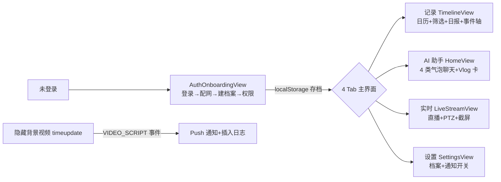

## 概述

`third-party/remix-petra` 是从 Google AI Studio 导出的 demo app **Remix: 派爪Petra**（package.json name: `petguard-demo`），一个宠物监控 App 的**高保真前端原型**。技术栈 React 19 + TypeScript + Vite 6 + Tailwind（CDN）+ Framer Motion。**注意：AI 能力（日报/聊天/识别）全是前端硬编码 mock，未实调 Gemini**——它是个视觉/交互参考，不是功能参考。

> AI Studio 链接：`ai.studio/apps/952461cc-cd96-4bc0-a545-e596c4e579df`

## 背景

我们研究平台偏后端/模型侧，前端 UI 设计是短板。remix-petra 提供了一个完整的"宠物监控 App"交互范式：聊天式 AI 助手、时间轴日志、直播+PTZ、每日 Vlog、配网流程，可作为我们未来做"评测结果可视化""视频片段回放""模型对话式查询"等界面的设计参考。

## 技术栈

| 层 | 选型 | 说明 |
|---|---|---|
| 框架 | React 19 + TS 5.8 | `react@^19.2.4`，`jsx: react-jsx` |
| 构建 | Vite 6 | dev `0.0.0.0:3000`，`@` alias 指根 |
| 样式 | Tailwind CDN | 运行时 JIT（非构建期），`index.html` 内联动画关键帧 |
| 动画 | Framer Motion (`motion/react`) | `AnimatePresence` + `layoutId` 共享元素过渡 |
| 图标 | lucide-react | |
| 持久化 | localStorage | 会话/自定义宠物/活跃宠物名 |
| 状态/路由 | 无 | 顶层 `App.tsx` 单状态机 + tab 切换 |
| Gemini | **未调用** | `metadata.json` 声明 `SERVER_SIDE_GEMINI_API`，但本地代码无任何 SDK/fetch/prompt |

## 目录结构

根目录扁平（无 `src/`）：

```
remix-petra/
├── index.html          # 入口：Tailwind CDN + importmap + 内联动画 CSS
├── index.tsx           # React 挂载点
├── App.tsx             # 顶层状态机 + 4 Tab 路由 + meme 推送定时器
├── constants.tsx       # 静态数据：10 只预设猫档案/VIDEO_SCRIPT/getHistoryLogs/样式工具
├── types.ts            # 全部 TS 接口（PetInfo/LogEntry/ChatMessage...）
├── index.css           # 全局 reset + 扫描线动画
├── components/
│   ├── AuthOnboardingView.tsx   # 2036 行：登录/配网/档案录入/权限全流程
│   ├── HomeView.tsx             # 922 行：AI 助手聊天页 + VlogBubble 自研播放器
│   ├── TimelineView.tsx         # 370 行：日历+筛选+日报卡+事件时间轴
│   ├── LiveStreamView.tsx       # 439 行：直播+PTZ 摇杆+截屏录像
│   ├── SettingsView.tsx         # 245 行：宠物档案/设备/通知开关
│   ├── VideoOverlay/ShareView/EditPetModal.tsx
├── cats-reacting.mp4   # 示例猫反应视频，被 Vlog 片段引用
├── metadata.json       # AI Studio 导出元数据
└── 4 个乱码 .gif       # meme 表情包素材（文件名编码损坏）
```

## 核心功能与交互



### 整体流程
未登录 → `AuthOnboardingView`（登录/注册→设备配网→多宠物档案录入→系统权限）→ 写 localStorage → 进入 4 Tab 主界面。

### AI 日报怎么"生成"
**不调 AI**。`constants.tsx` 里 `INITIAL_PET_DATA[栗子].report` 是写死的 markdown 字符串，`formatText()` 把 `**xxx**` 解析成 `<strong>`。自定义宠物时 `App.tsx` 用模板拼一段假日报。TimelineView 顶部按筛选渲染这些日报卡。

### 聊天机器人
`handleSendMessage` 是**纯关键词匹配**（`vlog/集锦` → 推 vlog 卡；`吃/饿/喂` → 喂食回复；否则 6 条兜底），1.2s `setTimeout` 模拟思考延迟。无 LLM。

### 视频播放：真视频 + 模拟
- 隐藏 `&lt;video&gt;`（Sintel trailer）一直 loop，作"时间轴事件源"：`VIDEO_SCRIPT` 定义第 14 秒触发"多猫互动警报"，`timeupdate` 监听推 Push + 插日志。
- `VideoOverlay`/`LiveStreamView` 是真视频（可 seek）。
- `VlogBubble` 是**自研模拟播放器**：把同一段猫反应视频切成 4 个虚拟段落，`requestAnimationFrame` 累加 `currentTime`（默认 2 倍速），进度条/倍速/全屏沉浸手写状态机。
- 截屏是真的（`canvas.drawImage` → `toDataURL`），录像是假的（只记时长）。

### 宠物档案字段
`PetInfo`：`type/weight/features/avatarColor/report/avatarUrl`。配网时录入更丰富（昵称/品种/性别/毛色/出生/绝育/多角度照片/习惯 tag），`buildAutoFeatures()` 拼成 `features` 文本。预设 10 只猫，有"一键快速填充演示档案（栗子与奶油）"按钮。

## Gemini API 真相

**本地代码完全没调用 Gemini。** 全仓 grep `gemini|genai|@google|generateContent` 只在 `vite.config.ts` 命中——且只是把 env 的 `GEMINI_API_KEY` 注入 `process.env`，无任何 `import`/`fetch`/SDK。

`metadata.json` 的 `majorCapabilities: SERVER_SIDE_GEMINI_API` 是 AI Studio 云端托管时的服务端注入声明；导出到本地 zip 后这套链路不存在，`process.env.GEMINI_API_KEY` 实际是 `undefined`，代码里也无消费点。

**结论**：这是个视觉/交互高保真原型，AI 能力是占位 mock。真实接入需自己补 Gemini 调用层。

## UI/交互设计亮点（可借鉴）

1. **移动端单列布局** — `max-w-md mx-auto shadow-2xl border-x` 模拟手机屏 + 底部 65px Tab Bar + `pb-safe` 安全区适配，4 Tab（记录/AI 助手/实时/设置）+ Lucide 图标，选中态 `scale-110`。
2. **聊天气泡 4 类型复用** — `text/event/meme/vlog` 而非纯文本；同一 `LogEntry` 结构在聊天和时间轴两处复用——一份数据两种呈现。
3. **Vlog 卡=内嵌迷你播放器** — 进度条/倍速/静音/全屏沉浸/段落切换，把"每日精华"做成可交互卡片，体验远好于纯播视频。我们做"评测片段回放"可参考。
4. **时间轴 LogCard** — 缩略图按动作类型上色+图标（饮食→餐具、休息→月亮、活动→闪电、异常→警告），双猫事件按猫名分小段渲染，底部"AI 准吗？👍👎"采集反馈——闭环"AI 结论→用户校验"。我们做 speed run 结果展示可参考这套。
5. **Push 通知样式** — 浮动卡片+左边橙色警示条+`slide-down` 动画，点击直跳视频对应秒数（`handleJumpToVideo(videoTime)`），打通"告警→证据回放"。
6. **直播页 PTZ 虚拟摇杆** — 十字方向+复位，靠 `scale(1.2) translate(x,y)` 模拟云台；截屏用 canvas + Web Audio 合成快门声。
7. **配网流程可视化** — 扫设备码→选 WiFi→生成 App 端配置码→进度条→成功，CSS 画假二维码和扫描线，完整复刻 IoT 配网 UX。
8. **配色语义化** — 橙=告警/活动、紫=多猫互动、蓝=饮食饮水、琥珀=休息、红=异常，色板在 constants 工具函数集中管理。

## 乱码 gif 是什么

不是动作识别演示图，是聊天里推送的 **meme 表情包素材**。`App.tsx` 用 4 个 `setTimeout`（5/8/11/14s）往聊天塞 4 条 `type:'meme'` 消息，引用 4 个中文路径 gif：

| 推送时机 | 文案主题 | 意图文件名 |
|---|---|---|
| 5s | "鬼鬼祟祟的身影...犯罪铁证" | 作案.gif |
| 8s | "隐藏摄像机暴露...大脸怼镜头" | 这监控你安的.gif |
| 11s | "猫猫拳争霸赛...谁先动的手" | 偷袭.gif |
| 14s | "偷粮大盗...掏粮手法" | 饭呢.gif |

磁盘上 4 个 `.gif` 文件名是中文在 AI Studio zip 导出/解压时编码转码错误（疑似 bytes→CP1252→UTF-8）产生的乱码。

> ⚠️ 潜在 bug：磁盘文件名已损坏成 mojibake，而 `App.tsx` 里 `memeUrl` 用的是正确中文路径，本地 `vite dev` 跑起来这些 gif 大概率 404。如要本地运行需重命名回正确中文。

## 警惕的点

- **AI 是 mock**：不要误以为它有可复用的 Gemini 调用代码。
- **无后端/无状态库/无路由库**：纯原型架构，不能照搬做产品。
- **Tailwind 用 CDN 运行时 JIT**：生产环境不宜，应改构建期接入。
- **单组件 2000+ 行**（`AuthOnboardingView`）：原型可以，生产要拆。

## 相关文档

- [[third-party-pet-videos|第三方参考项目：pet-videos（度小满宠物摄像头 AI 分析）]]
- [[mmaction2-overview]]
