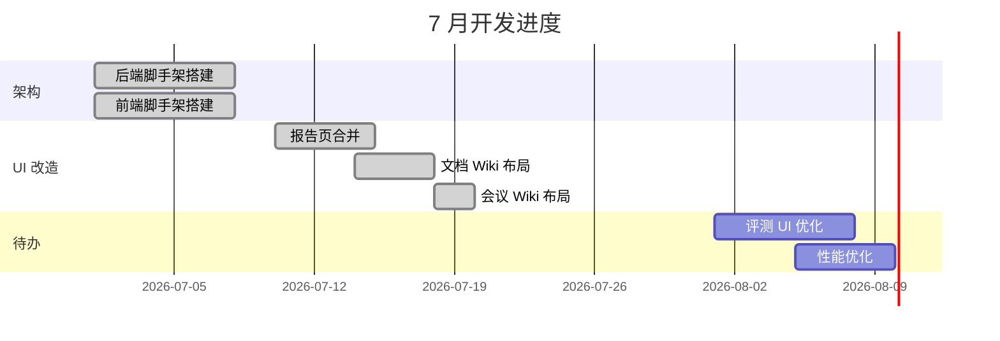

# 月报 — 汤问

## 本月概述

7 月主要聚焦在项目管理平台的基础架构搭建和 UI 统一化改造。完成了三大模块（项目管理、论文搜集、评测体系）的前后端脚手架，并将报告页面和文档系统统一为 wiki 三栏布局。

## 重点成果

### 1. 平台架构搭建
- FastAPI 后端 + Vue 3 前端 + Markdown/SQLite 数据层
- 端口统一：前端 3210、后端 8809
- Vite 开发代理配置

### 2. UI 统一化
- 报告页面合并（6 个组件 → 1 个 ReportPage）
- 文档 wiki 三栏布局（DocPage）
- 会议纪要三栏布局（MeetingList）
- 暗色模式颜色修复

### 3. 基础设施
- AGENTS.md 编写（供 AI Agent 阅读的项目指南）
- upstream-sync 多库同步方案设计与实施
- management skill CRUD 脚本
- [[api-design-conventions|API 设计规范]] 文档编写

## 下月规划

- 评测体系模块 UI 完善
- 论文模块 KaTeX 公式支持
- 性能优化（骨架屏、图片懒加载）
- 补充团队 wiki 文档

## 项目进度

