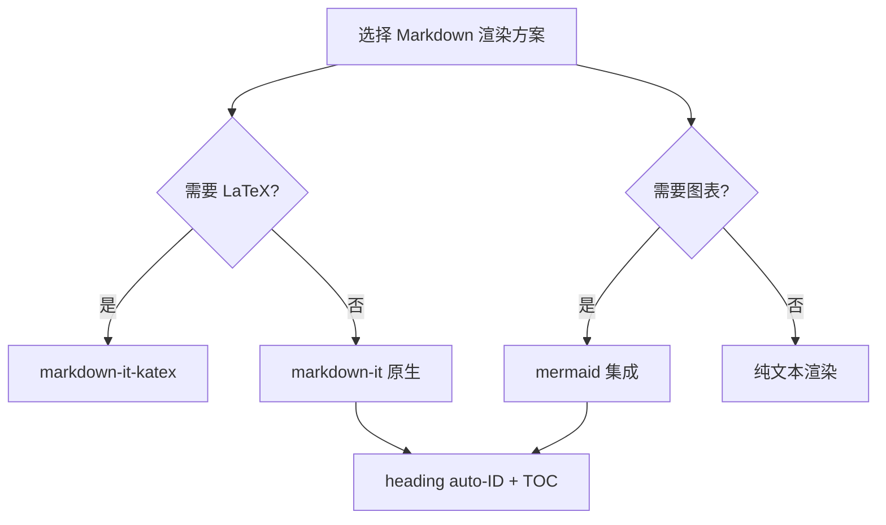

# 周报 — 汤问

## 本周完成

### 架构设计
- 文档 wiki 三栏布局方案设计（参考 InternWiki 模式）
- 报告页面合并方案：6 个 Vue 组件 → 1 个 ReportPage
- 会议纪要页面改为三栏 wiki 布局

### 前端开发
- DocPage.vue 三栏布局实现（sidebar + article + TOC）
- MarkdownRenderer 增加 heading auto-ID
- MeetingList.vue 重构为 wiki 布局
- 修复 Naive UI 暗色模式蓝色偏移问题

### 文档
- 创建 [[api-design-conventions|API 设计规范]] 示例文档
- 更新 AGENTS.md 端口配置

## 下周计划

- 评测体系模块的 UI 优化
- 补充更多 wiki 文档（前端开发规范、Git 工作流）
- 整体 UI 回归测试

## 技术决策流程

