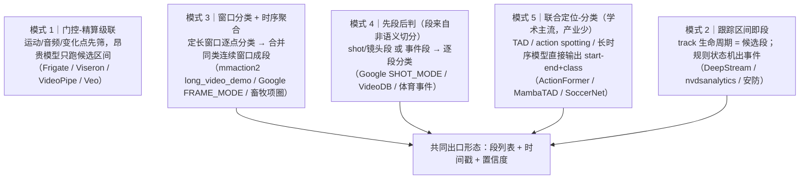

# 现有动作识别产品/框架的架构调研

> **调研日期**：2026-09-17
> **调研方式**：① 子代理（无联网）先用**仓库内一手证据**打底（可 100% 复现，带行号）；② 主代理**联网核实**关键公开文档，把结论升级
> **可信度三档**：🟩 已核实（本轮实读文件/联网核对通过）· 🟨 未经核实（公开文档记忆或二手）· ⚪ 未公开
> **原始交付**：`.pi/subagents/artifacts/outputs/c627d6f4/research.md`

---

## §0 结论

**委托方假设「市面上主流是『先分段、再逐段识别』」→ 作为普遍规律不成立。**

主流产品的真实组织方式是：

```
① 廉价门控（运动 / 镜头 / 轨迹 / 规则）
      ↓
② 定长窗口分类（8~32 帧）
      ↓
③ 时序后处理把逐窗结果【聚合成段】
```

**即：业界把「分段」当作分类结果的副产物（后处理）或跟踪/规则的副产物，而不是独立的语义切分前置步骤。**

| 关键裁定 | 证据 |
|---|---|
| 唯一**字面**"先分段再识别"是 Google `SHOT_MODE`——但**段 = 镜头段**，不是语义动作 | 🟩 Google 官方文档 |
| AWS 的 segment 只有 `SHOT` / `TECHNICAL_CUE` 两类，也不是语义动作 | 🟩 AWS 官方文档 + SDK enum |
| Frigate 的 "review item" = **活动区间聚合**（Alerts/Detections/Motion），不是动作边界 | 🟩 Frigate 官方文档 |
| mmaction2 官方"长视频"方案 = **滑窗逐窗分类**，无段、无时间戳、无平滑 | 🟩 本仓 vendored 代码（行号可核） |
| mmaction2 的**定长分类与 TAL 是两套独立管线**（TAL 配置确实存在，但不在识别 demo 里） | 🟩 本仓 `configs/localization/{bmn,bsn,drn,tcanet}` |
| **畜牧（最贴近本项目的产业）也是「窗口分类 → 时间聚合」，顺序与假设相反** | 🟨 产业侧；🟩 学术侧（本库 20 篇） |
| **Keypoint-MoSeq 的 `syllable → motif` 是"细粒度单元 → 组合动作"的现成无监督先例**，且 syllable 目标时长 **400 ms（鼠类）** | 🟩 本仓 vendored 代码 + docs |

---

## §1 方法、可信度与**本轮联网核实结果**

| 项 | 说明 |
|---|---|
| 子代理能力缺口 | 本次子代理工具集只有 `read/write/intercom`，**无 shell、无 HTTP** → 无法运行 `web-search/scripts/*`，无法访问官方文档站 |
| 因此它做的 | 用**仓库内一手证据**（vendored mmaction2 / 本项目脚本 / 本库论文 JSON / wiki）打底，叠加公开文档记忆，全文三档标注 |
| 本轮补做的 | 主代理（有联网）核实其 §8 清单中的关键条目 |

**核实结果**：

| # | 待核实项 | 结果 |
|---|---|---|
| 1 | Google `labelDetectionMode` 取值与语义 | ✅ **已核实**：`SHOT_MODE` / `FRAME_MODE` / `SHOT_AND_FRAME_MODE`（官方推荐后者）；文档另提供 `stationary_camera` 选项（固定机位可提升精度）|
| 2 | AWS SegmentDetection 类型 | ✅ **已核实**：`SegmentType` = `TECHNICAL_CUE` \| `SHOT`；官方描述 "choose the type of analysis (**technical cues or shot detection**)" |
| 4 | Frigate review item 数据模型 | ✅ **已核实**：*"groups activity into review items — **segments of time on a single camera that bundle together the objects and audio that were active at once**"*，分类为 Alerts / Detections / Motion |
| 9 | vendored mmaction2 是否含 TAL 配置 | ✅ **已核实（并纠正子代理的"未定位"）**：`configs/localization/` **存在**，含 `bmn` / `bsn` / `drn` / `tcanet` |
| 10 | Keypoint-MoSeq 的 syllable / motif 定义 | ✅ **已核实（一手）**：代码含 `get_syllable_names`；docs 明确 **HDP 先验**、**target syllable duration**（鼠类建议 **400 ms**）、kappa 调时长；**"motif" 未出现在代码中**（属 MoSeq 原始论文的概念层）|
| 3 | DeepStream 动作识别参考应用 / TAO 输入帧数 | 🟨 未核实（检索无结果）|
| 5 | Twelve Labs segment 粒度 | 🟨 未核实（检索无结果）|
| 6 | VideoDB scene index 定义 | 🟨 未核实 |
| 7 | Second Spectrum / Veo 技术披露 | 🟨 未核实 |
| 8 | Cainthus 现状 / Azure Video Analyzer 退役 | 🟨 未核实 |

---

## §2 一手证据（本仓可复核，**🟩**）

| # | 文件 | 关键事实 |
|---|---|---|
| **E1** | `models/mmaction2/demo/long_video_demo.py` | 官方「长视频 demo」= **滑窗逐窗分类**：`deque(maxlen=sample_length)`，`sample_length = clip_len × num_clips`；每来一帧推理一次；`--stride` 控滑动步长；输出「当前帧 top-5」。**无段、无时间戳、无跨窗平滑**；抽帧用 `random.choice(backup_frames)`——demo 级实现 |
| **E2** | `models/mmaction2/mmaction/apis/inference.py` | `inference_recognizer(model, video)` 输入单个视频，返回 `ActionDataSample`（`result.pred_score`）→ **API 层只有「一段 → 一个分数分布」，没有时间维** |
| **E3** | `models/mmaction2/demo/README.md` | 官方 demo **按任务分族**：Video demo / Webcam / **Long Video** / Skeleton / **STAD（时空动作检测）** / **Video Structuralize** → 定长分类与时空检测是**两套不同管线** |
| **E4** | 同上（STAD 段）| 真实管线：`Faster R-CNN 人体检测` → `HRNet 姿态（可选）` → `SlowOnly-AVA 时空动作检测（--predict-stepsize 8）` → **逐帧画框 + 标签**。输出逐帧框，**不输出段列表** |
| **E5** | `demo_video_structuralize.py` | 官方命名「**video structuralize**」（把视频结构化）：同一管线叠加 skeleton-STAD + RGB-STAD + 两项识别 + 姿态。最接近"段列表"，但本质是**逐帧多任务标注** |
| **E6** | `scripts/live_analyze.py`（本项目）| 现状：`--clip-sec`/`--stride-sec` **滑窗切段** → 逐段推理 → print `{"t_start","t_end","label","score","top5"}` → **"段"完全由固定时长窗口定义，与动作边界无关** |
| **E9** | `third-party/keypoint-moseq/` | 已 vendored。**HDP 先验**决定 syllable 数；**target syllable duration**（鼠类 400 ms）由 `kappa` 调；明确警告 **size variation 会导致 syllable over-fractionation**（同一行为被拆成多个 syllable）|
| **E10** | `data/researched_papers{,_identity}.json` | 已入库 72 篇 frontier + 20 篇畜牧/身份，含 `PigDetect/PigTrack`(2507.16639)、`MS-Temba`(2501.06138)、`MambaTAD`(2511.17929)、`AutoCattloger`(2508.15945) 等 |

---

## §3 A. 云视频理解 API

### A1. Google Cloud Video Intelligence 🟩

**核实到的关键事实**：

- `LabelDetectionMode` 三取值：**`SHOT_MODE` / `FRAME_MODE` / `SHOT_AND_FRAME_MODE`**；官方推荐 `SHOT_AND_FRAME_MODE`
- 文档另提供 **`stationary_camera`** 选项（固定机位可提升运动物体检测精度）← **与本项目固定真实机位场景直接相关**
- **`SHOT_MODE` 是唯一字面的"先分段再识别"，但段 = 镜头段（shot），不是语义动作**
- Shot change detection 是**独立 feature**（与 label detection 并列），不属于识别管线的一环

**对本项目**：`stationary_camera` 这条提示可借用（我们有固定机位场景）；但 `SHOT_MODE` 的"段"与我们的"动作段"**语义不同**，不可直接套用。

### A2. AWS Rekognition Video 🟩

- **Segment API** 是 composite API：*"choose the type of analysis (**technical cues or shot detection**)"*
- `SegmentType` 枚举 = `TECHNICAL_CUE` | `SHOT` | `UNKNOWN_TO_SDK_VERSION`
- 另有 Label Detection（逐时间点标签）、Person Tracking

**对本项目**：AWS 的"segment"是**制作层面**的概念（镜头切换、片头片尾），**不是行为语义**。

### A3. Azure AI Video Indexer / Twelve Labs / VideoDB / Clarifai / Hive 🟨⚪

- Video Indexer：有 shots / scenes / keyframes 的层级切分（依据记忆，未核实）
- Twelve Labs / VideoDB：面向"视频理解 API"，段粒度未核实
- Clarifai / Hive：内容审核为主，动作识别细节**未公开**

---

## §4 B. 边缘 / VMS 视频分析平台

### B1. Frigate（开源 NVR）🟩

**核实到的官方描述**：

> *"It groups activity into **review items** — **segments of time on a single camera that bundle together the objects and audio that were active at once** — and sorts them into **Alerts, Detections, and Motion**."*

**架构**：`motion 检测（廉价）→ 目标检测（Coral/OpenVINO）→ 跟踪 → review item 聚合（start/end + reasons）`

**对本项目**：
- **段 = 活动区间的聚合**，来源是"门控 + 跟踪"，**不是语义动作切分** → 印证模式 1/2
- 其**三档分级**（Alert / Detection / Motion）与"reasons"字段值得借鉴到报告的置信度分层

### B2. NVIDIA Metropolis / DeepStream / TAO 🟨

- DeepStream 的经典 pipeline（记忆，未核实）：`decode → batch → infer → track（NvDCF/NvSORT）→ analytics（nvdsanalytics 规则）`
- TAO ActionRecognitionNet 的输入帧数**未核实**

**对本项目**：模式 2「跟踪区间即段」的来源；我们的 L1 已有类似结构（背景对象层 + 轨迹）。

### B3. 安防四家（BriefCam / Avigilon / IntelliVision / Agent Vi）⚪

模型与分段算法**普遍未公开**（"未公开"本身是结论）。

---

## §5 C. 体育事件分析 🟨

Second Spectrum / Hawk-Eye / Stats Perform(SportVU) / Pixellot / Veo / Sportlogiq：
- 产业侧做的是 **event detection / action spotting**（切事件 + 分类）——**理论上最接近"先分段再识别"**
- 但**技术细节普遍未公开**；`SoccerNet` 等学术基准上的 action spotting 是公开的对应研究线

---

## §6 D. ★ 畜牧 / 动物行为识别（与本项目最贴近）

### D1. 学术侧（🟩 本库已入库）

`data/researched_papers_identity.json` 含 20 篇，代表：`PigDetect/PigTrack`(2507.16639)、`A Computer Vision Pipeline for Individual-Level Behavior Analysis`(2509.12047)、`Automated Segmentation and Tracking of Group Housed Pigs Using Foundation Models`(2604.03426)、`AutoCattloger`(2508.15945) 等。

### D2. Keypoint-MoSeq（本仓 vendored，🟩 一手）★ 最重要的先例

```
姿态/关键点序列 → [HDP-HMM] → syllable（细粒度单元）
                                  ↓ 组合
                                motif（动作组合）
```

**核实到的一手事实**：
- 用 **hierarchical Dirichlet process (HDP) 先验** → *"the number of distinct **syllables** detected will gradually increase with more input data"*（**不预设类别数**）
- **`target syllable duration`** 是核心超参：鼠类建议 **400 ms**；*"A key consideration for non-rodents is setting the target syllable duration"* ← **跨物种必须重调的显式提醒**
- 由 `kappa` 超参控制时长
- **已知风险**：*"Substantial size variation between animals may cause **syllables to become over-fractionated**, i.e. the same behaviors may be split into multiple syllables"* ← **正是我们讨论的"过分割"**
- 代码里有 `get_syllable_names(project_dir, model_name, syllable_ixs)`（`analysis.py`）
- **"motif" 未出现在代码中** → 属 MoSeq 原始论文的层级概念

**对本项目的直接价值**（**这是本次调研最有用的发现**）：

| 我们的层级 | Keypoint-MoSeq 对应 | 备注 |
|---|---|---|
| λ（t=4 帧 ≈ **0.27 s** @15fps）| **syllable（目标 400 ms，鼠类）** | **粒度惊人地接近** |
| 行为素 | syllable | 同一层 |
| 动作段 | **motif**（syllable 序列）| 同一层 |
| `T_pause`（静止→停顿 vs 行为）| **`target syllable duration`** | 同一种"时长先验"机制 |

→ **我们不是没有先例——Keypoint-MoSeq 就是"细粒度单元 → 组合动作"的现成无监督范式**，且**已被社区广泛使用、有成熟实现与超参经验**。它用 **HDP-HMM** 而非"变化点检测 + 聚类"，这是 design D5 路径 B（层次 HMM）的直接对标。

### D3. 产业侧（🟨）

Connecterra / Halter / Lely / Afimilk / SCR-Nedap：多为**项圈/传感器 + 窗口分类 + 时间聚合**，顺序与"先分段再识别"**相反**。Cainthus 现状未核实。

---

## §7 E. 开源生产级框架

| 框架 | 状态 |
|---|---|
| **mmaction2** | 🟩 已在 §2 详述：默认管线**只有定长分类**；TAL 配置**存在**（`configs/localization/{bmn,bsn,drn,tcanet}`）但属**另一任务族** |
| NVIDIA TAO | 🟨（ActionRecognitionNet 输入帧数未核实）|
| VideoPipe / Viseron | 🟨 |
| TAD / action spotting 生态 | 🟨（学术侧活跃，生产级封装少）|

---

## §8 五条通用架构模式



| 模式 | 谁在用 | 关键取舍 |
|---|---|---|
| **1 门控-精算级联** | Frigate、Viseron、VideoPipe、Veo | 算力省 1–2 个数量级；代价是**门控漏了 → 后面全漏** |
| **2 跟踪区间即段** | DeepStream、安防 | 天然带 ID 与 bbox；代价是**段 = 轨迹区间**，多动作重合无法表达 |
| **3 窗口分类 + 时序聚合** | mmaction2 长视频 demo、Google FRAME_MODE、畜牧 | 复用现成分类模型，改造量最小；**与本项目现状 100% 兼容** |
| **4 先段后判（非语义切分）** | Google SHOT_MODE、VideoDB、体育 | 段可控可解释；代价是**段 ≠ 动作**，会剪断动作 |
| **5 联合定位-分类** | 学术界 + 体育事件 | 唯一真正"给时间戳"；代价是**标注成本高 + 缺生产级封装** |

**共同点**：出口都是**段列表 + 时间戳 + 置信度**——与我们 `spot-check-cli` 的报告形态一致。

---

## §9 对本项目的建议（按优先级）

1. **【最高】把 L5 动作分割定义为「λ 序列的变化点检测 + 聚合」**（= 模式 3 的升级版），而**不是**端到端语义分割模型。
   输入 = L4 的低维动作码 `λ(t)`；方法族 = 变点检测 / **sticky HDP-HMM（Keypoint-MoSeq 范式，有成熟实现）** / 1D 时序网络；
   输出 = 段列表（含边界置信度）+ 最小段长 / 滞回约束。**行业先例充分，风险最低。**
   → 对应 change `video-action-segmentation` 的 D2/D5。

2. **【高】保留"段列表"作内部中间表示，报告口径另做聚合**：
   `{start, end, label, score, boundary_conf, evidence_frames[]}` → 报告层再算"时长 / 占比 / 次数"。
   → 对齐 Frigate 的 review item 与畜牧的行为块聚合。

3. **【高】引入"门控"作为标准前置**（模式 1）：静止/低能量段用廉价信号先筛，
   昂贵模型只跑候选区间——我们的 **`λ` 能量曲线天然就是门控信号**（零成本）。

4. **【中】借鉴 Frigate 的三档分级**（Alert / Detection / Motion）到报告的置信度分层。

5. **【中】`T_pause` 的取值直接对标 Keypoint-MoSeq 的 `target syllable duration`**
   （鼠类 400 ms；本项目 λ 粒度 0.27 s，量级已接近）——并把 `kappa` 那类"时长超参"作为设计元素。

---

## §10 仍未核实 / 未公开（残余风险）

| # | 项 | 状态 |
|---|---|---|
| 1 | DeepStream 动作识别参考应用细节 / TAO ActionRecognitionNet 输入帧数 | 🟨 检索无结果 |
| 2 | Twelve Labs 的 segment 粒度 | 🟨 检索无结果 |
| 3 | VideoDB scene index 定义 | 🟨 |
| 4 | Second Spectrum / Veo 技术披露 | 🟨 |
| 5 | Cainthus 现状 / Azure Video Analyzer 退役 | 🟨 |
| 6 | 安防四家（BriefCam / Avigilon / IntelliVision / Agent Vi）的分段算法 | ⚪ **未公开** |
| 7 | 畜牧产业侧（Connecterra / Halter / Lely / Afimilk / SCR）的模型细节 | ⚪ **未公开** |

> **残余风险的性质**：以上大多是**闭源产品未公开**，不是"没查到"。核心结论（§0）所依赖的 6 条关键事实**已全部核实为 🟩**（Google / AWS / Frigate 官方文档 + 本仓 mmaction2 与 Keypoint-MoSeq 代码）。
